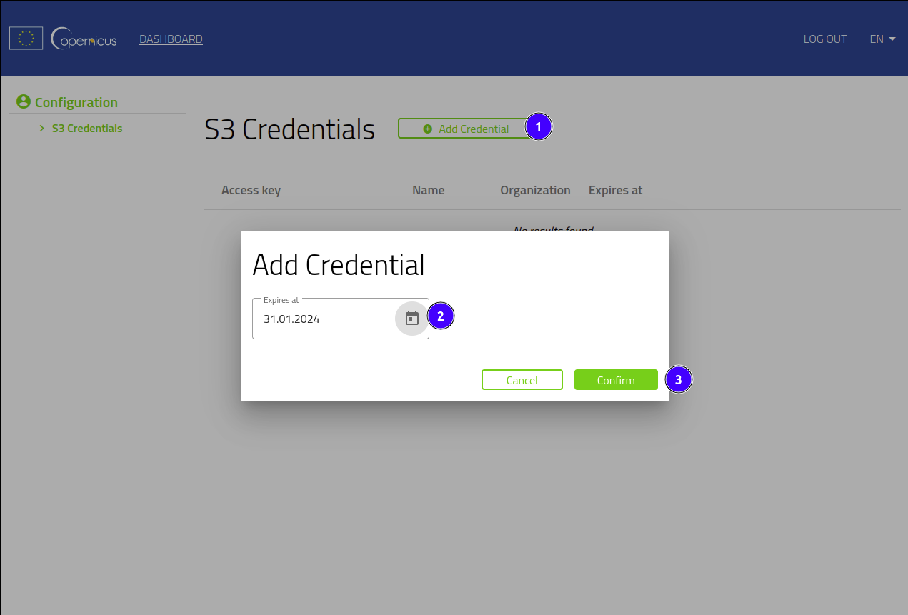
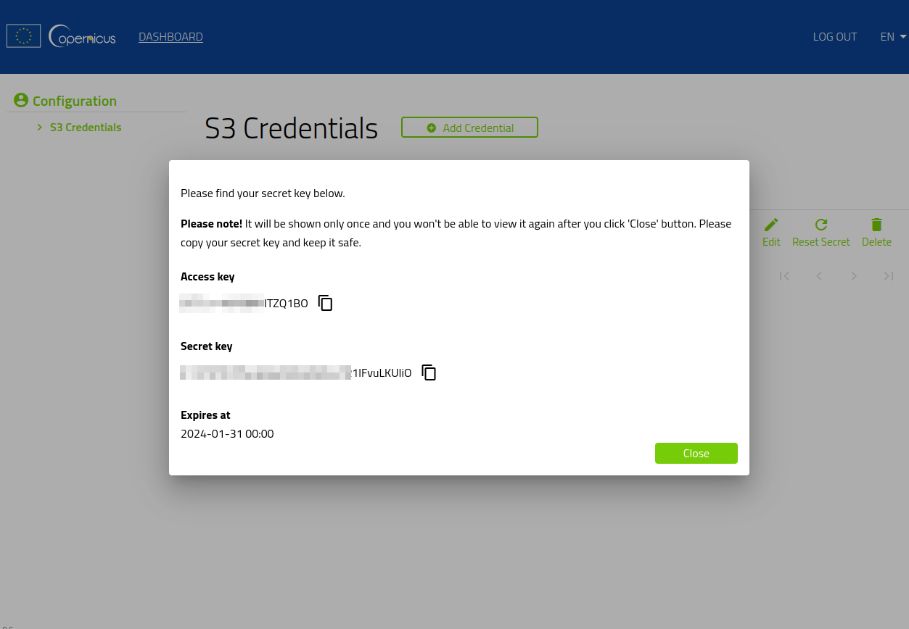

# Access to EO data via S3

## Object Storage

Access to EO data hosted on object storage is using API compatible with S3. 

S3 is an object storage service with which you can retrieve data over HTTP using REST API.

## Registration

To generate the necessary credentials you must have a registered account on dataspace.copernicus.eu. If you don't have an account, you can register [here](https://identity.dataspace.copernicus.eu/auth/realms/CDSE/protocol/openid-connect/auth?client_id=cdse-public&response_type=code&scope=openid&redirect_uri=https%3A//dataspace.copernicus.eu/account/confirmed/1).

## Generate secrets

In order to obtain secrets,<a href="https://eodata-s3keysmanager.dataspace.copernicus.eu/">Visit page</a> and log in with Copernicus Data Space Ecosystem account for which the keys are to be generated. After successfully logging in, indicate the expiration date of the secrets using the "Add Credentials" button and click "Confirm".





Note that the Secret Key will be displayed only once and you will not be able to view it again after clicking the Close button. Copy your secret key and keep it in a safe place.


## Example access using s3cmd

Below example assumes the use of a Linux environment.

Having the access and secret key together with the endpoint `eodata.dataspace.copernicus.eu`, you can use any tool to handle access via S3. Below is an example of how to access EO Data using the s3cmd.

First, we recommend to create a configuration file. You can create it with tools like vi/vim or nano:
```
vi .s3cfg
vim .s3cfg
nano .s3cfg
```
Copy the following content to your configuration file, with your access and secret key:
```
[default]
access_key = <access_key>
host_base = eodata.dataspace.copernicus.eu
host_bucket = eodata.dataspace.copernicus.eu
human_readable_sizes = False
secret_key = <secret_key>
use_https = true
check_ssl_certificate = true
```
Then you can run any s3cmd command pointing to the previously created configuration file with option `-c`:
```
s3cmd -c ~/.s3cfg ls
```
Below is an example of downloading a product from the EO data repository using s3cmd:
```
s3cmd -c ~/.s3cfg get s3://eodata/Sentinel-1/SAR/SLC/2016/12/28/S1A_IW_SLC__1SDV_20161228T044442_20161228T044509_014575_017AE8_4C26.SAFE/measurement/s1a-iw2-slc-vv-20161228t044442-20161228t044508-014575-017ae8-005.tiff
```
If the objects in the repository are archives, for example, such as `S1B_IW_SLC__1SDV_20191013T155948_20191013T160015_018459_022C6B_13A2.SAFE` use the resursive option `––recursive` or `-r` to download whole product.

Example with the recursive option:
```
s3cmd -c ~/.s3cfg -r get s3://eodata/Sentinel-1/SAR/SLC/2019/10/13/S1B_IW_SLC__1SDV_20191013T155948_20191013T160015_018459_022C6B_13A2.SAFE/
```
