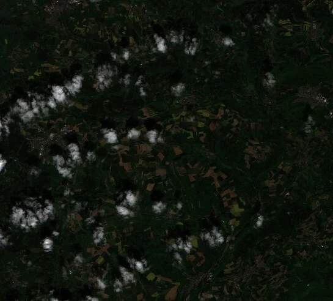
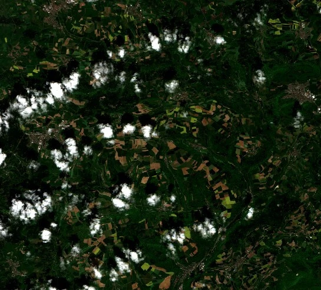
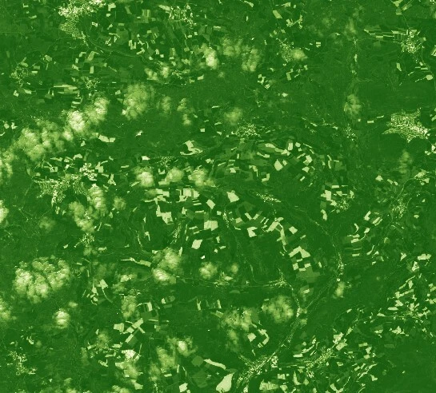
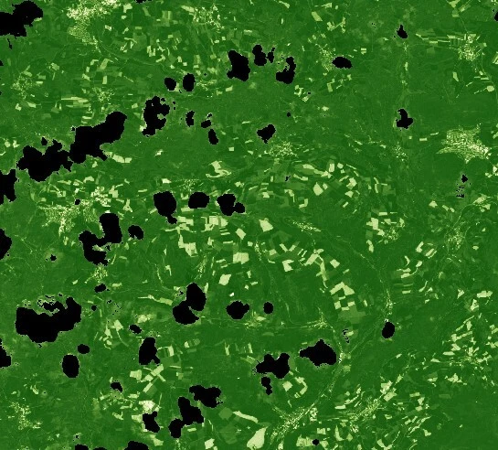

On this page, there are example evalscripts that will help with understanding the basics of writing evalscripts. There are additional examples for getting started on the [custom scripts repository](https://custom-scripts.sentinel-hub.com/).

:::{.callout-note}
All the scripts utilize the [Sentinel-2 L2A](https://documentation.dataspace.copernicus.eu/APIs/SentinelHub/Data/S2L2A.html) data collection.
:::

## Returning a True Color Image

- Code Version 3 must be specified in the custom script header using `//VERSION=3`.
- The `setup()` is a mandatory function used to specify the input bands used, the output shape, and the format of your response. In this example, there are three bands in the input; the return also contains three bands.
- The `evaluatePixel()` is a mandatory function that performs the required operations per pixel.
- Note that the returned object's shape (3 elements) matches the specified shape in the output defined in the `setup()` function.

```js
//VERSION=3

function setup() {
  return {
    input: ['B02', 'B03', 'B04'],
    output: {
      bands: 3,
      sampleType: 'AUTO',
    },
  };
}

function evaluatePixel(sample) {
  return [sample.B04, sample.B03, sample.B02];
}
```

The output of the above script results in the following image:



### True Color with Color Correction

Basic color correction can be performed in the return function, like in the example below, which brightens and increases the contrast of the image returned.

```js
return [
  2.5 * sample.B04 - 0.07,
  2.5 * sample.B03 - 0.07,
  2.5 * sample.B02 - 0.07,
];
```

**Output**:



## Calculating Raw NDVI Values

Spectral indices can be generated within an evalscript.

- Note that this script only uses the two bands required to calculate NDVI in its input.
- In addition, the index is only a 1-band image, so the output is defined as one band.
- Note that the `sampleType` in the output definition has changed from `AUTO` to `FLOAT32`, meaning the output can contain float values (decimals).
- Within the `evaluatePixel()` function the `index()` function is applied to these 2 bands to return NDVI values.

```js
//VERSION=3
function setup() {
  return {
    input: ['B04', 'B08'],
    output: {
      bands: 1,
      sampleType: 'FLOAT32',
    },
  };
}

function evaluatePixel(samples) {
  return [index(samples.B08, samples.B04)];
}
```

## Calculating NDVI and Returning an Interpolated Colormap

To visualize output, calculate the spectral index and return interpolated colormaps instead of the raw NDVI values.

- Compared to the previous example, the output is now three bands rather than 1.
- The index function is now defined as a variable using `let NDVI`.
- The return is now defined by the `valueInterpolate()` function. This requires three inputs: the input values (in this case, NDVI), the intervals, an array of numbers in ascending order defining intervals, and the output interval for the given value/interval of the intervals array.
- In this example, five intervals and five arrays are defined with the RGB values to create the colormap.

```js
//VERSION=3
function setup() {
  return {
    input: ['B04', 'B08'],
    output: {
      bands: 3,
      sampleType: 'FLOAT32',
    },
  };
}

function evaluatePixel(samples) {
  let NDVI = index(samples.B08, samples.B04);
  return valueInterpolate(
    NDVI,
    [-1, 0, 0.2, 0.5, 1],
    [
      [0, 0, 0],
      [1, 1, 0.88],
      [0.57, 0.75, 0.32],
      [0.31, 0.54, 0.18],
      [0.06, 0.33, 0.04],
    ],
  );
}
```

**Output**:



## Masking Out Cloudy Pixels

Data masks may be used, for example, to exclude cloudy pixels from visualizations.

- If visualizing Sentinel-2 L2A data, use the `SCL` band to perform the masking.
- In the following example, if the `SCL` band has one of the following values: 8, 9, or 10, those pixels will be black.

```js
//VERSION=3

function setup() {
  return {
    input: ['B04', 'B08', 'SCL'],
    output: {
      bands: 3,
      sampleType: 'AUTO',
    },
  };
}

function evaluatePixel(samples) {
  let NDVI = index(samples.B08, samples.B04);
  if ([8, 9, 10].includes(samples.SCL)) {
    return [0, 0, 0];
  } else {
    return valueInterpolate(
      NDVI,
      [-1, 0, 0.2, 0.5, 1],
      [
        [0, 0, 0],
        [1, 1, 0.88],
        [0.57, 0.75, 0.32],
        [0.31, 0.54, 0.18],
        [0.06, 0.33, 0.04],
      ],
    );
  }
}
```

**Output**:



## Calculating the Mean NDVI Value During a Given Time Period

Multi-temporal analysis can also be performed and will output aggregated products using evalscripts. This example explains how to calculate the mean NDVI value over a given time period.

- By default, evalscripts use `SIMPLE` mosaicking, meaning only one satellite scene will be used. Note that mosaicking is explicitly set to `ORBIT` in this example so that you can use multiple scenes.
- The calculation of NDVI is defined within a function named `calcNDVI()`.
- The evalscript then loops through the scenes in the evalscript, performing this function on each of the scenes.
- Lastly, the mean is calculated using the sum (number of scenes) and the cumulative count of NDVI values across those scenes.

```js
//VERSION=3
function setup() {
  return {
    input: [{ bands: ['B04', 'B08', 'dataMask'] }],
    output: {
      bands: 1,
    },
    mosaicking: 'ORBIT',
  };
}

function calcNDVI(sample) {
  var NDVI = (sample.B08 - sample.B04) / (sample.B08 + sample.B04);
  return NDVI;
}

function evaluatePixel(samples) {
  var sum = 0;
  var count = 0;
  for (var i = 0; i < samples.length; i++) {
    if (samples[i].dataMask != 0) {
      var ndvi = calcNDVI(samples[i]);
      sum = sum + ndvi;
      count++;
    }
  }
  var average = sum / count;

  return [average];
}
```

## Selecting Scenes Only from Given Dates to Perform Change Detection

It is also possible to select only certain scenes in the evalscript, which is useful when performing change detection, for example. To do this, use the `preProcessScenes` function.

- Define your `allowedDates` as a list, filtering scenes to only these dates.
- Then calculate NDVI for the two dates that are allowed. The samples array will have two elements.
- To calculate the difference between the two, subtract the first element `samples[0]` from the second element `samples[1]`.

```js
//VERSION=3
function setup() {
  return {
    input: [{ bands: ['B04', 'B08'] }],
    output: { bands: 1 },
    mosaicking: 'ORBIT',
  };
}

function preProcessScenes(collections) {
  var allowedDates = ['2023-03-10', '2023-06-13'];
  collections.scenes.orbits = collections.scenes.orbits.filter(
    function (orbit) {
      var orbitDateFrom = orbit.dateFrom.split('T')[0];
      return allowedDates.includes(orbitDateFrom);
    },
  );
  return collections;
}

function calcNDVI(sample) {
  var NDVI = (sample.B08 - sample.B04) / (sample.B08 + sample.B04);
  return NDVI;
}

function evaluatePixel(samples) {
  var ndvi_diff = calcNDVI(samples[1]) - calcNDVI(samples[0]);
  return [ndvi_diff];
}
```