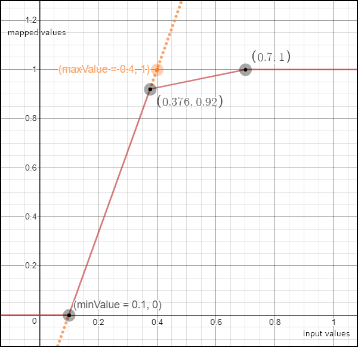

:::{.callout-note}
Parameters and responses in this documentation include descriptions of their formats. Documentation for these JavaScript types can be found here: [`Object`](https://developer.mozilla.org/en-US/docs/Web/JavaScript/Reference/Global_Objects/Object), [`Array`](https://developer.mozilla.org/en-US/docs/Web/JavaScript/Reference/Global_Objects/Array), [`Number`](https://developer.mozilla.org/en-US/docs/Web/JavaScript/Reference/Global_Objects/Number).
:::

## Visualizers

Visualizers are JavaScript classes with a method process which evaluates the representation value for a pixel from pixel’s band values.

### `ColorMapVisualizer`

Sets the color from a discrete color map.

#### Parameters

- `valColPairs` **Array\<[number, number]>**

#### Examples

```js
const map = [
  [200, 0xff0000],
  [300, 0x0000ff],
];

const visualizer = new ColorMapVisualizer(map);
visualizer.process(199); // returns [ 1, 0, 0 ]
visualizer.process(200); // returns [ 1, 0, 0 ]
visualizer.process(250); // returns [ 1, 0, 0 ]
visualizer.process(299); // returns [ 1, 0, 0 ]
visualizer.process(300); // returns [ 0, 0, 1 ]
```

#### `process`

Returns interpolated color for value.

##### Parameters

- `val` **[number]**;

Returns **[[number], [number], [number]]** normalized RGB triplet.

#### `createDefaultColorMap`

Creates `ColorMapVisualizer` with following `valColPairs`

```js
[
  [-1.0, 0x000000],
  [-0.2, 0xff0000],
  [-0.1, 0x9a0000],
  [0.0, 0x660000],
  [0.1, 0xffff33],
  [0.2, 0xcccc33],
  [0.3, 0x666600],
  [0.4, 0x33ffff],
  [0.5, 0x33cccc],
  [0.6, 0x006666],
  [0.7, 0x33ff33],
  [0.8, 0x33cc33],
  [0.9, 0x006600],
];
```

### `ColorRampVisualizer`

Provides a way to map values to colors. This is done by defining a number of values and colors, with values
between the defined input values mapping to their interpolated colors, respectively. Colors may be defined as
hex color codes or a normalized (between 0 and 1) array representing RGB.

#### Parameters

- `ramps` ;
- `minVal` **[number]** Optional override of the minimum value in `ramps`. Other values will be adjusted linearly.
- `maxVal` **[number]** Optional override of the maximum value in `ramps`. Other values will be adjusted linearly.

#### Examples

```js
const ramps = [
  [200, 0xff0000],
  [300, 0x0000ff],
];
or;
const ramps = [
  [200, [1, 0, 0]],
  [300, [0, 0, 1]],
];

const visualizer = new ColorRampVisualizer(ramps);
visualizer.process(199); // [ 1, 0, 0 ]
visualizer.process(200); // [ 1, 0, 0 ]
visualizer.process(250); // [ 0.5019607843137255, 0, 0.5019607843137255 ]
visualizer.process(299); // [ 0.011764705882352941, 0, 0.9882352941176471 ]
visualizer.process(300); // [ 0, 1, 0 ]
```

#### `inverse`

Returns a new `ColorRampVisualizer` which is the inverse of the current one.
This means the color scale goes in the opposite direction.

#### `process`

Returns interpolated color for value.

##### Parameters

- `value` **[number]**;

Returns **[[number], [number], [number]]** normalized RGB triplet.

#### `createRedTemperature`

Creates `ColorRampVisualizer` with `valColPairs` [`redTemperature`](#redtemperature)

##### Parameters

- `minVal` **[number]** min value of interval
- `maxVal` **[number]** max value of interval

##### Examples

```js
const visualizer = ColorRampVisualizer.createRedTemperature(0.0, 1.0);
visualizer.process(0.0); // returns [ 0, 0, 0 ]
visualizer.process(0.3); // returns [ 0.43137254901960786, 0, 0 ]
visualizer.process(0.5); // returns [ 0.7176470588235294, 0.047058823529411764, 0 ]
visualizer.process(0.8); // returns [ 1, 0.6196078431372549, 0.2 ]
visualizer.process(1.0); // returns [ 1, 1, 1 ]
```

Returns **[`ColorRampVisualizer`](#colorrampvisualizer)**

#### `createWhiteGreen`

Creates `ColorRampVisualizer` with `valColPairs` [`greenWhite`](#greenwhite)

##### Parameters

- `minVal` **[number]** min value of interval
- `maxVal` **[number]** max value of interval

##### Examples

```js
const visualizer = ColorRampVisualizer.createWhiteGreen(0.0, 1.0);
visualizer.process(0.0); // returns [ 0, 0, 0 ]
visualizer.process(0.3); // returns [ 0, 0.2980392156862745, 0 ]
visualizer.process(0.5); // returns [ 0.16862745098039217, 0.5019607843137255, 0 ]
visualizer.process(0.8); // returns [ 0.6666666666666666, 0.8, 0.3333333333333333 ]
visualizer.process(1.0); // returns [ 1, 1, 1 ]
```

Returns **[`ColorRampVisualizer`](#colorrampvisualizer)**

#### `createBlueRed`

Creates `ColorRampVisualizer` with `valColPairs` [`blueRed`](#bluered)

##### Parameters

- `minVal` **[number]** min value of interval
- `maxVal` **[number]** max value of interval

##### Examples

```js
const visualizer = ColorRampVisualizer.createBlueRed(0.0, 1.0);
visualizer.process(0.0); // returns [ 0, 0, 0.5019607843137255 ]
visualizer.process(0.3); // returns [ 0, 0.7019607843137254, 1 ]
visualizer.process(0.5); // returns [ 0.5019607843137255, 1, 0.5019607843137255 ]
visualizer.process(0.8); // returns [ 1, 0.2980392156862745, 0 ]
visualizer.process(1.0); // returns [ 0.5019607843137255, 0, 0 ]
```

Returns **[`ColorRampVisualizer`](#colorrampvisualizer)**

#### `createOceanColor`

Creates `ColorRampVisualizer` with `valColPairs` [`oceanColor`](#oceancolor)

##### Parameters

- `minVal` **[number]** min value of interval
- `maxVal` **[number]** max value of interval

Returns **[`ColorRampVisualizer`](#colorrampvisualizer)**;

### `HighlightCompressVisualizer`

This is a piecewise linear function which compresses highlights.
The `minValue` and `maxValue` will be mapped inside the interval [ 0, 1 ].
However, if `maxValue` lies in (0, 1) a second function which increases much more slowly will be used
to further map the values which are mapped to 0.92 and above (see the figure below).
This increases the visualized dynamic range while
keeping most of the interval of interest linear.
Useful, for example, for true color, with a `maxValue` of 0.4 to still keep some detail in clouds.



#### Parameters

- `minValue` **[number]** the value which will be mapped to 0. All values smaller than `minValue` will also be mapped to 0. (optional, default `0.0`)
- `maxValue` **[number]** the value which controls the position of the boundary point between both linear functions. It will be mapped to approx. 0.9259, while values greater than or equal to (2\*maxValue - minValue) will be mapped to 1 (see the figure above). (optional, default `1.0`)
- `gain` (optional, default `1.0`)
- `offset` (optional, default `0.0`)
- `gamma` (optional, default `1.0`)

#### Examples

```js
const visualizer = new HighlightCompressVisualizer(0.1, 0.4);

visualizer.process(0); // will return 0
visualizer.process(0.1); // will return 0
visualizer.process(0.25); // will return 0.5
visualizer.process(0.376); // will return 0.92. Note: 0.376 = minValue + 0.92*(maxValue - minValue)
visualizer.process(0.4); // will return 0.9259
visualizer.process(0.7); // will return 1 Note: 0.7 is the smallest value mapped to 1.
visualizer.process(1.1); // will return 1
```

#### `process`

Returns mapped value.

##### Parameters

- `val` **[number]** the input value to be mapped.
- `i` **[number]** the index of val. This is specific to usage in the Browser.

Returns **\[[number]]** mapped value.

## Helper functions

Helper functions that can be used in custom scripts.

### `int2rgb`

Transforms a color as integer into RGB triplet.

#### Parameters

- `color` **[number]** as integer

#### Examples

```js
int2rgb(255); // returns [ 0, 0, 255 ]
int2rgb(256); // returns [ 0, 1, 0 ]
int2rgb(65537); // returns [ 1, 0, 1 ]
```

Returns **[[number], [number], [number]]**;

### `rgb2int`

Inverse of the [`int2rgb`](#int2rgb) function. Transforms a RGB triplet into integer.

#### Parameters

- `color` **[[number], [number], [number]]** as RGB triplet

#### Examples

```javascript
rgb2int([0, 0, 255]); // returns 255
rgb2int([0, 1, 0]); // returns 256
rgb2int([1, 0, 1]); // returns 65537
```

Returns **[number]**;

### `normalizeRGB`

Returns a new, normalized array without modifying the input array. It does this by dividing by 255.
The input range is expected between 0 and 255 giving an output between 0 and 1.

#### Parameters

- `rgb255Array` ;

#### Examples

### `combine`

Combines two colors.

#### Parameters

- `color1` **[number]** The first color defined as an array of values.
- `color2` **[number]** The second color defined as an array of values.
- `alpha` **[number]** A share of the first color defined as a floating point between 0 and 1.

#### Examples

```js
combine([100, 0, 0], [0, 100, 0], 1); // returns [ 100, 0, 0 ]
combine([100, 0, 0], [0, 100, 0], 0); // returns [ 0, 100, 0 ]
combine([100, 0, 0], [0, 100, 0], 0.5); // returns [ 50, 50, 0 ]
```

Returns **[number]** The combined color defined as an array of values.

### `index`

Calculate difference divided by sum.

#### Parameters

- `x` **[number]** first value
- `y` **[number]** second value

#### Examples

```js
index(0.6, 0.4); // returns 0.2
index(0.5, -0.5); //returns 0.0
```

Returns **[number]** `(x - y) / (x + y)`, if sum is 0 returns 0

### `inverse`

Calculate inverse value

#### Parameters

- `x` **[number]** value

#### Examples

```js
inverse(2.0); // returns 0.5
inverse(5.0); // returns 0.2
inverse(0); // returns 1.7976931348623157E308
```

Returns **[number]** inverse of value of x (`1 / x`), if x is 0 returns [JAVA_DOUBLE_MAX_VAL](#java_double_max_val)

### `valueMap`

Maps a value to another value bound by an interval (from,to).

    intervals = [-10, -5, 0, 5, 10], values = [-100,-50, 0, 50, 100]
    defines the following mapping:
    (-inf, -10)  => -100
    (-10, -5) => -50
    (-5,0) => 0
    (0, 5) => 50
    (5, +inf) => 100

#### Parameters

- `value` **[number]** input value
- `intervals` **\[[number]]** array of numbers in ascending order defining intervals
- `values` **\[[number]]** output value for the given interval

#### Examples

```js
valueMap(5, [1, 3, 5, 7, 10], [100, 300, 500, 700, 900]); // returns 500
valueMap(1, [1, 3, 5, 7, 10], [100, 300, 500, 700, 900]); // returns 100
valueMap(2, [1, 3, 5, 7, 10], [100, 300, 500, 700, 900]); // returns 300
valueMap(12, [1, 3, 5, 7, 10], [100, 300, 500, 700, 900]); // returns 900
valueMap(50); // returns 50
```

Returns **[number]**;

## Constants

### JAVA_DOUBLE_MAX_VAL

```js
const JAVA_DOUBLE_MAX_VAL = 1.7976931348623157e308;
```

Type: [number]

### `blueRed`

```js
const blueRed = [
  [1.0, 0x000080],
  [0.875, 0x0000ff],
  [0.625, 0x00ffff],
  [0.375, 0xffff00],
  [0.125, 0xff0000],
  [0.0, 0x800000],
];
```

Type: [Array]\<[[number], [number]]>

### `redTemperature`

```js
const redTemperature = [
  [1.0, 0x000000],
  [0.525, 0xae0000],
  [0.3, 0xff6e00],
  [0.25, 0xff8600],
  [0.0, 0xffffff],
];
```

Type: [Array]\<[[number], [number]]>

### `greenWhite`

```js
const greenWhite = [
  [1.0, 0x000000],
  [0.6, 0x006600],
  [0.3, 0x80b300],
  [0.0, 0xffffff],
];
```

Type: [Array]\<[[number], [number]]>

### `oceanColor`

```js
const oceanColor = [
  [0.0, normalizeRGB([147, 0, 108])],
  [0.0471, normalizeRGB([111, 0, 144])],
  [0.098, normalizeRGB([72, 0, 183])],
  [0.149, normalizeRGB([33, 0, 222])],
  [0.2, normalizeRGB([0, 10, 255])],
  [0.2471, normalizeRGB([0, 74, 255])],
  [0.298, normalizeRGB([0, 144, 255])],
  [0.349, normalizeRGB([0, 213, 255])],
  [0.4, normalizeRGB([0, 255, 215])],
  [0.4471, normalizeRGB([0, 255, 119])],
  [0.498, normalizeRGB([0, 255, 15])],
  [0.549, normalizeRGB([96, 255, 0])],
  [0.6, normalizeRGB([200, 255, 0])],
  [0.6471, normalizeRGB([255, 235, 0])],
  [0.698, normalizeRGB([255, 183, 0])],
  [0.749, normalizeRGB([255, 131, 0])],
  [0.8, normalizeRGB([255, 79, 0])],
  [0.8471, normalizeRGB([255, 31, 0])],
  [0.898, normalizeRGB([230, 0, 0])],
  [0.949, normalizeRGB([165, 0, 0])],
  [1.0, normalizeRGB([105, 0, 0])],
];
```

Type: [Array]\<[[number], [number]]>

## QA Band Functions

### `Landsat8C2QaBandConditions`

Cloud confidence, cloud shadow confidence, snow ice confidence and cirrus confidence represent levels of confidence that a condition exists:

- 0 = “Not Determined”
- 1 = “Low” = Low confidence.
- 2 = “Medium / Reserved” = Medium only for cloud confidence.
- 3 = “High” = High confidence.

Type: [Object]

#### Properties

- `fill` **[number]** 0 for image data, 1 for fill data
- `dilatedCloud` **[number]** 0 for cloud is not dilated or no cloud, 1 for cloud dilation
- `cirrus` **[number]** 0 for no confidence level or low confidence, 1 for high confidence cirrus
- `cloud` **[number]** 0 for cloud confidence is not high, 1 for high confidence cloud
- `cloudShadow` **[number]** 0 for cloud shadow confidence is not high, 1 for high confidence cloud shadow
- `snow` **[number]** 0 for snow/ice confidence is not high, 1 for high confidence snow cover
- `clear` **[number]** 0 if cloud or dilated cloud, or else 1
- `water` **[number]** 0 for land or cloud, 1 for water
- `cloudConfidence` **[number]**;
- `cloudShadowConfidence` **[number]**;
- `snowIceConfidence` **[number]**;
- `cirrusConfidence` **[number]**;

### `decodeL8C2Qa`

Decodes Landsat 8 Collection 2 Quality Assessment band conditions.

#### Parameters

- `value` **integer** band pixel (16-bit value)

#### Examples

```js
decodeL8C2Qa(55052);
// returns {
//   cirrus: 1, cirrusConfidence: 3,
//   clear: 0,
//   cloud: 1,
//   cloudConfidence: 3,
//   cloudShadow: 0,
//   cloudShadowConfidence: 1,
//   dilatedCloud: 0,
//   fill: 0,
//   snow: 0,
//   snowIceConfidence: 1,
//   water: 0
// }
```

Returns **[`Landsat8C2QaBandConditions`](#landsat8c2qabandconditions)**;

### `decodeS3OLCIQualityFlags`

Unpacks bit-packed Sentinel 3 OLCI Quality Flags values.

#### Parameters

- `value` **integer** QUALITY_FLAGS band DN value (32-bit value)

Returns **object** An object containing the following keys with either 0 or 1 values:
`land`, `coastline`, `fresh_inland_water`, `tidal_region`, `bright`, `straylight_risk`, `invalid`, `cosmetic`, `duplicated`, `sun_glint_risk`, `dubious`, `saturatedBxy` (where xy is the band number, e.g. saturatedB01).

