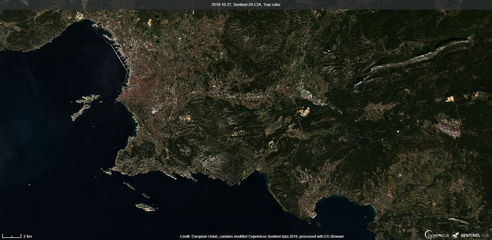

## Additional Request Parameters

WMS/WMTS/WFS/WCS services support many custom parameters which affect
the generation of the service responses. In the following table, all the
available custom parameters are listed. All these parameters are optional.

For the examples on how to use them, see this
[documentation](/APIs/SentinelHub/OGC/Examples.qmd).

Note that atmospheric correction is not a parameter anymore, as we now
only support L2A atmospheric correction. Read more about it
[here](#atmospheric-correction).

  Custom parameter   Info                                                                                                                                                                                                                                                                                                      Default value   Valid value range                                                                                                                                                                                                                                         Available for
  ------------------ --------------------------------------------------------------------------------------------------------------------------------------------------------------------------------------------------------------------------------------------------------------------------------------------------------- --------------- --------------------------------------------------------------------------------------------------------------------------------------------------------------------------------------------------------------------------------------------------------- ------------------------------------------------------------------------------------------------------------------------------------
  MAXCC              The maximum allowable cloud coverage in percent. Cloud coverage is a product average and not viewport accurate hence images may have more cloud cover than specified here.                                                                                                                                100.0           0.0 - 100.0                                                                                                                                                                                                                                               **WMS/WMTS/WFS/WCS** (when REQUEST = \"GetMap\", \"GetTile\", \"GetCoverage\", \"GetFeature\", \"GetFeatureInfo\" or \"GetIndex\")
  PRIORITY           The priority by which to select and sort the overlapping valid tiles from which the output result is made. For example, using mostRecent will place newer tiles over older ones therefore showing the latest image possible. Using leastCC will place the least cloudy tiles available on top.            mostRecent      mostRecent, leastRecent, leastCC, leastTimeDifference, maximumViewingElevation                                                                                                                                                                            **WMS/WMTS/WFS/WCS** (when REQUEST = \"GetMap\", \"GetTile\", \"GetCoverage\", \"GetFeature\", \"GetFeatureInfo\" or \"GetIndex\")
  EVALSCRIPT         This parameter allows for a custom evaluation script or formula specifying how the output image will be generated from the input bands. See Custom evaluation script usage for details. ` `{=html} ` `{=html} EVALSCRIPT parameter has to be BASE64 encoded before it is passed to the service.                                                                                                                                                                                                                                                                             **WMS/WMTS/WCS** (when REQUEST = \"GetMap\", \"GetTile\" or \"GetCoverage\")
  EVALSCRIPTURL      This parameter allows for a custom evaluation script or formula to be passed as an URL parameter, where the script itself is located (it should be on HTTPS).                                                                                                                                                                                                                                                                                                                                                                                                                       **WMS/WMTS/WCS** (when REQUEST = \"GetMap\", \"GetTile\" or \"GetCoverage\")
  GEOMETRY           Outputs imagery only within the given geometry and cropped to the geometry\'s minimum bounding box.                                                                                                                                                                                                                       one WKT string, one WKB hex string, or a list of coordinate pairs representing a polygon (pairs separated by semicolons, components by comma, i.e. 1 1, 2 2;\...) Coordinates should be specified using the CRS of the request (i.e. same CRS as BBOX).   **WMS/WMTS/WCS** (when REQUEST = \"GetMap\", \"GetTile\" or \"GetCoverage\")
  QUALITY            Used only when requesting JPEGs.                                                                                                                                                                                                                                                                          90              0 - 100; where 0 is the lowest and 100 the highest quality                                                                                                                                                                                                **WMS/WMTS/WCS** (when REQUEST = \"GetMap\", \"GetTile\" or \"GetCoverage\")
  UPSAMPLING         Sets the image upsampling method. Used when the requested resolution is higher than the source resolution.                                                                                                                                                                                                NEAREST         NEAREST, BILINEAR, BICUBIC                                                                                                                                                                                                                                **WMS/WMTS/WCS** (when REQUEST = \"GetMap\", \"GetTile\" or \"GetCoverage\")
  DOWNSAMPLING       Sets the image downsampling method. Used when the requested resolution is lower than the source resolution.                                                                                                                                                                                               NEAREST         NEAREST, BILINEAR, BICUBIC, BOX                                                                                                                                                                                                                           **WMS/WMTS/WCS** (when REQUEST = \"GetMap\", \"GetTile\" or \"GetCoverage\")
  WARNINGS           Enables or disables the display of in-image warnings, like \"No data available for the specified area\".                                                                                                                                                                                                  YES             YES, NO                                                                                                                                                                                                                                                   **WMS/WMTS/WCS** (when REQUEST = \"GetMap\", \"GetTile\" or \"GetCoverage\")

### Atmospheric correction

Satellite images sometimes seem washed out or foggy, as atmosphere
absorbs and scatters light on its way to the ground. We can correct for
this to get clearer images using atmospheric correction. ESA provides a
[Sen2Cor](http://step.esa.int/main/snap-supported-plugins/sen2cor/){target="_blank"}
processor, that applies atmospheric correction to the input Sentinel-2
L1C data with global coverage. The resulting product is called S2L2A
data. To use Atmospheric correction, use the [Sentinel-2 L2A (S2L2A)
data collection.](/APIs/SentinelHub/Data/S2L2A.qmd)

Below, you can see the difference atmospheric correction makes. The
first image of Marseille was made in EO Browser using S2L1C data, and
the lower image was made using S2L2A atmospheric correction.

