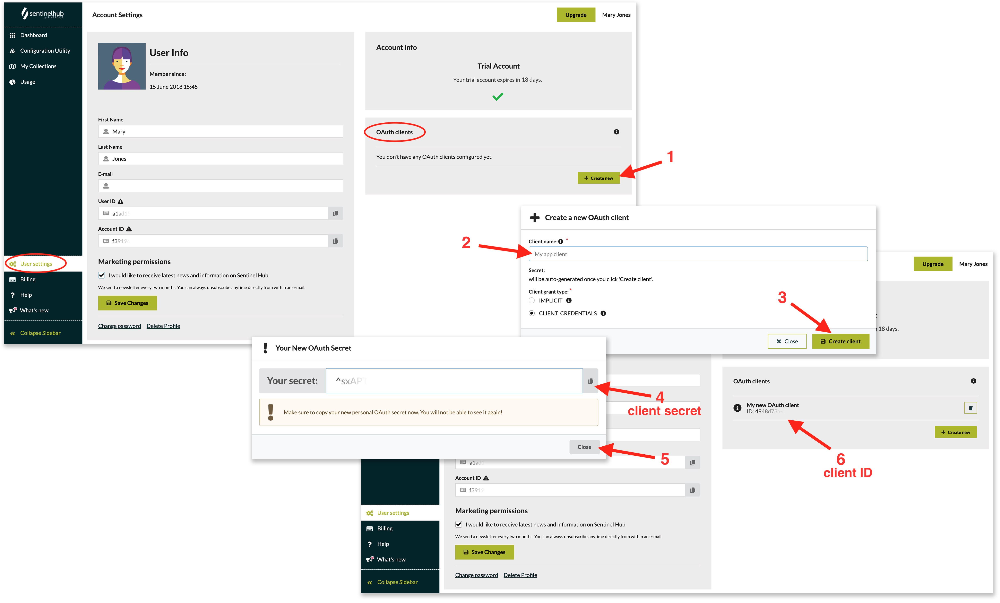

The Sentinel Hub API uses OAuth2 Authentication and requires that you
have an access token. In essence, this is a piece of information you add
to your requests so the server knows it\'s you. These tokens do not last
forever for a multitude of reasons, but you can get new ones and when
they expire from the Sentinel-Hub OAuth2 server at the token endpoint
listed below. But first, if you do not have one already, you need to
register an OAuth Client in your [account
settings](https://apps.sentinel-hub.com/dashboard/#/account/settings){target="_blank"}.
This is so the server can expect you to make such token requests. If you
do not have a Sentinel-Hub account, you can sign up for a [free trial
account](https://www.sentinel-hub.com/create_account){target="_blank"}.

#### How to use tokens

Once you have a token, do use it for authenticating all your requests
within its validity period. While tokens do not last forever, they do
last a reasonable amount of time, and sufficiently long that they can be
reused. The information of how long each token lasts is embedded in the
token itself in the `exp` claim, and can be read from there.

Do not fetch a new token for each API request you make. Token requests
are rate limited, so if you are getting an HTTP 429 error, that means
you are requesting too many tokens.

Tokens are JSON Web Tokens (JWT), more information about them
[here](https://en.wikipedia.org/wiki/JSON_Web_Token){target="_blank"} or
[here](https://datatracker.ietf.org/doc/html/rfc7519){target="_blank"}.

### Registering OAuth client

To register an OAuth client, open the \"User Settings\" tab in your
dashboard, then click the `Create new` button (1) in the \"OAuth
client\" section. Give your OAuth client a name (2), set the
`Client grant type` to `Client Credentials`, and click the
`Create client` button (3). Your client secret will be displayed. Copy
the `secret` value (4) and paste it locally, as it will not be visible
after the pop-up window closes! When you are finished, click `Close`
(5). You should now see the newly created OAuth client name and ID (6)
in the list of your OAuth clients. With client ID and client secret, you
are now ready to request tokens.



To request tokens the easiest way is to have some software which
understands OAuth2 and can make the proper request. For example, REST
clients like [Postman](https://www.getpostman.com/){target="_blank"} and
[Insomnia](https://insomnia.rest/){target="_blank"} have support for OAuth2 Client
credentials already included. See the Token Request Examples section
below.

### OAuth2 Endpoints

Token Endpoint - for requesting tokens

``` default
https://sh.dataspace.copernicus.eu/oauth/token
```

Token info endpoint

``` default
https://sh.dataspace.copernicus.eu/oauth/tokeninfo
```

### Token Request Examples

#### cURL

The following cURL request will return an access token, just make sure
to replace `<your client id>` with your client ID and
`<your client secret>` with your client secret:

``` bash
curl --request POST --url https://sh.dataspace.copernicus.eu/oauth/token --header "content-type: application/x-www-form-urlencoded" --data "grant_type=client_credentials&client_id=<your client id>" --data-urlencode "client_secret=<your client secret>"
```

#### Postman

In the Postman request `Authorization` tab set the `Type` to `OAuth 2.0`
and `Add the authorization data` to `Request Headers`. Then click the
`Get New Access Token` button. Set the `Grant Type` to
`Client Credentials`, the access token URL to the token endpoint, then
set the `Client ID` and `Client Secret` to the values of your OAuth
Client. `Scope` can be blank. Keep `Client Authentication` as
`Send As Basic Auth Header`. Click `Request Token`. You should get a new
one immediately. To use this token to authorize your request, click
`Use Token`. For more information see the Postman [authorization
documentation](https://learning.getpostman.com/docs/postman/sending_api_requests/authorization/#oauth-20){target="_blank"}

#### Python

In python the
[requests-oauthlib](https://github.com/requests/requests-oauthlib){target="_blank"}
library can handle the retrieval of access tokens using your OAuth
Client configuration.

``` python
from oauthlib.oauth2 import BackendApplicationClient
from requests_oauthlib import OAuth2Session

# Your client credentials
client_id = '<client_id>'
client_secret = '<secret>'

# Create a session
client = BackendApplicationClient(client_id=client_id)
oauth = OAuth2Session(client=client)

# Get token for the session
token = oauth.fetch_token(token_url='https://sh.dataspace.copernicus.eu/oauth/token',
                          client_secret=client_secret)

# All requests using this session will have an access token automatically added
resp = oauth.get("https://sh.dataspace.copernicus.eu/oauth/tokeninfo")
print(resp.content)
```

`requests-oauthlib` doesn\'t check for status before checking if the
response is ok. In case there\'s a server error, the user can receive an
incorrect error, which falsely makes it seem as if the issue is on
client side. Library\'s compliance hooks will prevent the invalid status
response from being ignored, returning the correct error. To use them,
add the following code:

``` python
def sentinelhub_compliance_hook(response):
    response.raise_for_status()
    return response

oauth.register_compliance_hook("access_token_response", sentinelhub_compliance_hook)
```

#### Javascript

Example using [axios](https://github.com/axios/axios){target="_blank"}.

``` javascript
import axios from "axios"
import qs from "qs"

const client_id = "<client_id>"
const client_secret = "<secret>"

const instance = axios.create({
  baseURL: "https://sh.dataspace.copernicus.eu"
})

const config = {
  headers: {
    'Content-Type': 'application/x-www-form-urlencoded;charset=utf-8'
  }
}

const body = qs.stringify({
  client_id,
  client_secret,
  grant_type: "client_credentials"
})


// All requests using this instance will have an access token automatically added
instance.post("/oauth/token", body, config).then(resp => {
  Object.assign(instance.defaults, {headers: {authorization: `Bearer ${resp.data.access_token}`}})
})
```
