## Introduction

Sentinel Hub is a cloud based service that is part of CDSE, providing easy access to Sentinel data. Our services include a range of APIs that allow users to search, process, analyse, visualise, and download satellite data, as well as integrate it into their own applications. We have prepared elaborate examples for each API in our documentation for users to get started. In addition, a series of [YouTube videos](https://www.youtube.com/watch?v=DxtYBM-ZqXE&list=PLj4KwRQTBlPL3CVwpaBXl3VrO0_V3VX_Q) providing thorough step-by-step instructions on how to use our services is recommended for all beginners. Make sure to also see some [useful links](#useful-links) in the last chapter of this guide.

In this tutorial you will learn how to get started with our services, by learning to run a simple API request. You will be using our Processing API to request satellite images, and Catalog API to find the list of the available images corresponding to your settings.

The guide will present 3 different approaches for you to choose from:

* [Requests Builder](#requests-builder) - Our user interface application for sending API requests - The easiest way to work with Sentinel Hub API  
* [Command line CURL](#curl) - Running requests in your command line interface  
* [Python](#python) - A popular framework that makes it possible to use various Python libraries for EO analysis

We strongly recommend you to first go through the Request Builder chapter in detail, and then choose which of the other frameworks you're interested in.

In each section, you will be sending requests from documentation, as well as request a Sentinel-2 image of Lighthouse Reef:

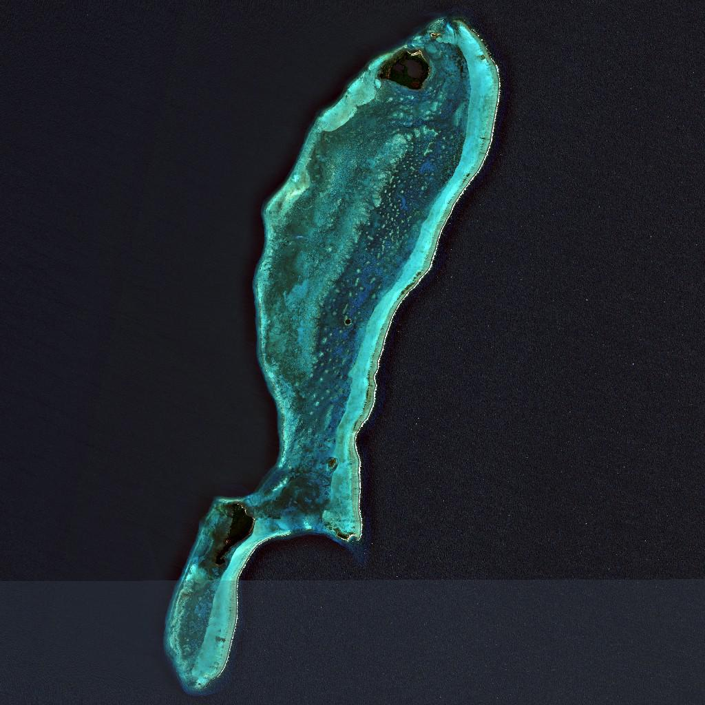

**Note**:  Think of these examples as templates. You can easily adapt them by modifying key elements like the bounding box, time range, or data collection to match your specific area of interest, timeframe, or sensor type.

## Requests Builder

[Requests Builder](https://shapps.dataspace.copernicus.eu/requests-builder/) is a user-friendly graphical interface designed for easy access to satellite imagery without handling commands, scripting language, and OAuth clients. It is a powerful tool for making API requests and the fastest way to get an image from Sentinel Hub. 

Before we begin, open [Requests Builder](https://shapps.dataspace.copernicus.eu/requests-builder/) and make sure you are logged into your Sentinel Hub account, by clicking the `Login` button on the top right.

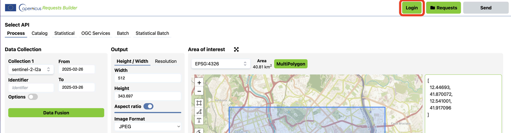

### Run the Example Request From Documentation

1. Copy the Sentinel-2 true color example request in CURL format below (you can also check our [documentation here](https://documentation.dataspace.copernicus.eu/APIs/SentinelHub/Process/Examples/S2L2A.html#true-color)):

```bash
curl -X POST https://sh.dataspace.copernicus.eu/api/v1/process \
 -H 'Content-Type: application/json' \
 -H 'Authorization: Bearer <your access token>' \ 
 -d '{
  "input": {
    "bounds": {
      "bbox": [
        13.822174072265625,
        45.85080395917834,
        14.55963134765625,
        46.29191774991382
      ]
    },
    "data": [
      {
        "dataFilter": {
          "timeRange": {
            "from": "2022-10-01T00:00:00Z",
            "to": "2022-10-31T00:00:00Z"
          }
        },
        "type": "sentinel-2-l2a"
      }
    ]
  },
  "output": {
    "width": 512,
    "height": 512,
    "responses": [
      {
        "identifier": "default",
        "format": {
          "type": "image/jpeg"
        }
      }
    ]
  },
  "evalscript": "//VERSION=3\n\nfunction setup() {\n  return {\n    input: [\"B02\", \"B03\", \"B04\"],\n    output: {\n      bands: 3,\n      sampleType: \"AUTO\" // default value - scales the output values from [0,1] to [0,255].\n    }\n  }\n}\n\nfunction evaluatePixel(sample) {\n  return [2.5 * sample.B04, 2.5 * sample.B03, 2.5 * sample.B02]\n}"
}'
```

2. Paste the CURL requests to the **Request Preview** window in [Requests Builder](https://shapps.dataspace.copernicus.eu/requests-builder/) (you can find the section on bottom right).

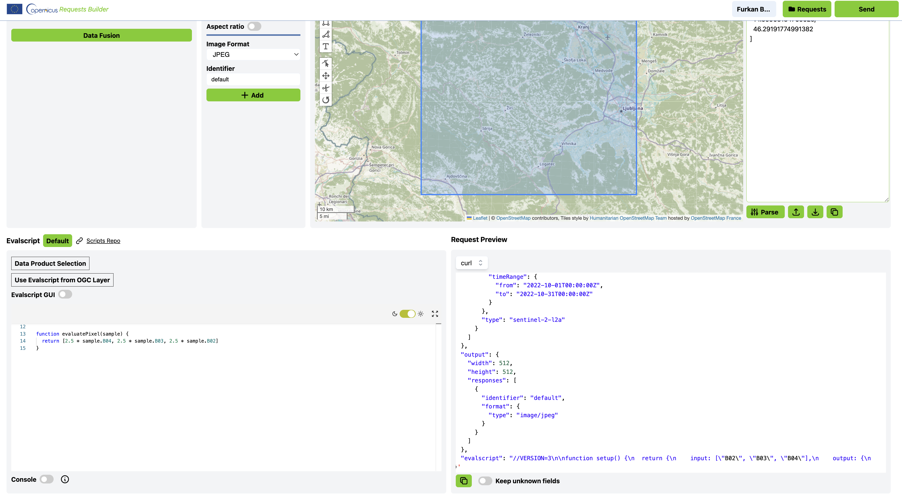

3. Whenever changes are made in the **Request Preview** window, make sure to click the **Parse** button to apply the changes. This will update the user interface with the selected parameters.

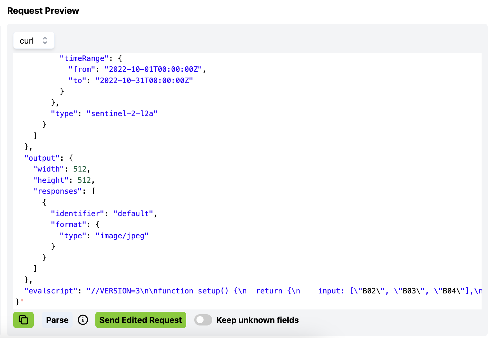

4. Click the **Send** button next to the **Login** button in the top right. Once the request is processed, a preview thumbnail of the satellite image will appear in the response window. To download the image, simply click the **Download** button below it.

As you will see, the true color example request from documentation is of landscape in western Slovenia.

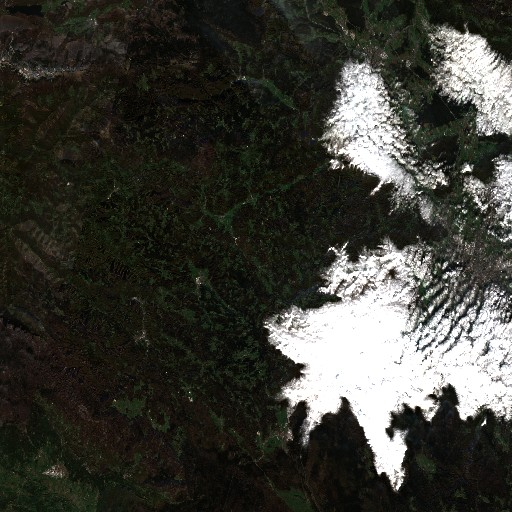

This way, you can send any processing Sentinel Hub request in CURL format.

### Build Your Own Custom Request

It is easy to build a custom request with our [Requests Builder](https://shapps.dataspace.copernicus.eu/requests-builder/) by selecting parameters in the graphical user interface. Each time you make a change, the API request will update automatically. The general parts of the Request Builder are the following:

* API: Several APIs are available in the Requests Builder, each with its own parameter. To get satellite imagery from Sentinel Hub, use the Processing API (preselected by default).
  
  Sentinel Hub offers the following APIs, all accessible through this interface:
- [Processing API](https://documentation.dataspace.copernicus.eu/APIs/SentinelHub/Process.html) – Returns satellite images and metadata  

- [Batch Processing V2 API](https://documentation.dataspace.copernicus.eu/APIs/SentinelHub/BatchV2.html) – Handles large-scale or long time-period requests (e.g., all Sentinel-2 data over Europe for one year)  

- [Bring Your Own Cog API](https://documentation.dataspace.copernicus.eu/APIs/SentinelHub/Byoc.html) – Allows you to bring and use external data collections  

- [Catalog API](https://documentation.dataspace.copernicus.eu/APIs/SentinelHub/Catalog.html) – Enables searching of available data based on various parameters  

- [Statistical API](https://documentation.dataspace.copernicus.eu/APIs/SentinelHub/Statistical.html) – Provides statistical analysis over selected areas  

- [OGC API](https://documentation.dataspace.copernicus.eu/APIs/SentinelHub/OGC.html) – Integrates EO data into applications via standard URL-based protocols  
* Data Collection: You can request data from up to 5 data collections with Sentinel Hub. The Bring Your Own COG option allows you to request data from your own data collection that you pre-ingested into Sentinel Hub.   

* Advanced options: The parameters in this window are specific to each collection. They allow you to control maximum cloud coverage, the mosaicking order, the method of interpolation and more. Additional information can be found in our documentation, under e.g., Sentinel-2 L2A [maxCloudCoverage](https://documentation.dataspace.copernicus.eu/APIs/SentinelHub/Data/S2L2A.html#maxcloudcoverage), [mosaickingOrder](https://documentation.dataspace.copernicus.eu/APIs/SentinelHub/Data/S2L2A.html#mosaickingorder), and [processing options](https://documentation.dataspace.copernicus.eu/APIs/SentinelHub/Data/S2L2A.html#processing-options).  

* Time Range: Select a specific acquisition date, or a time-range.  

* Area of Interest: Select a desired coordinate reference system from the droplist and draw a polygon or a rectangle over the map to set your area of interest. Alternatively, import a KML/GEOJSON file or paste in the coordinates. Click **Parse**.  

* Output: Specify the output format (TIFF, PNG, JPEG or APP/JSON) and width/height in pixels or x/y resolution in metres.  

* Evalscript: Define the way to process satellite data with Sentinel Hub. Check out the [Evalscript (custom script)](https://documentation.dataspace.copernicus.eu/APIs/SentinelHub/Evalscript.html) page for more information.  

* Request Preview: The Request Preview window allows you to directly edit the request body/payload or convert your request between CURL and Python script. The complete parameters of the request body are listed in our [API reference](https://documentation.dataspace.copernicus.eu/APIs/SentinelHub/ApiReference.html).

In the image below, check which options were selected in the Requests Builder to return an image of the easternmost part of the Belize Barrier Reef in the Caribbean Sea. The image is mosaicked with tiles from Sentinel-2 L2A within a time period between 1 June 2020 and 31 August 2020.

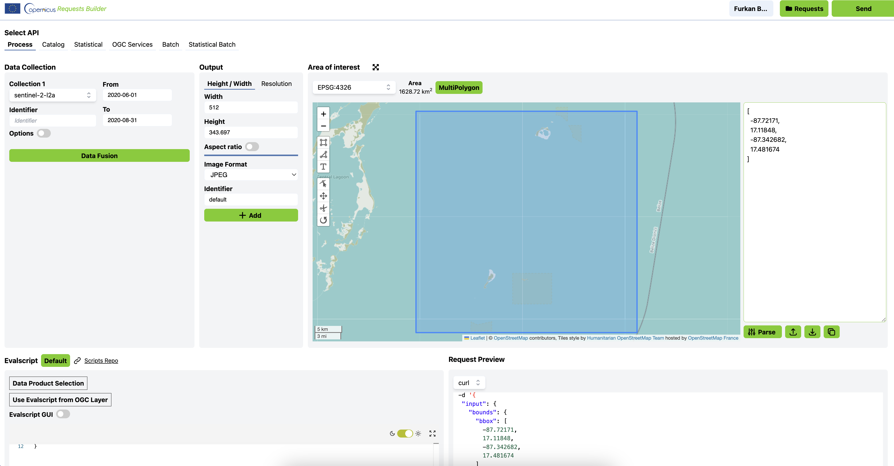

The following CURL request is the result of the user interface changes above - it's what you can read from the **Request Preview** window.

```bash
curl -X POST https://sh.dataspace.copernicus.eu/api/v1/process \
 -H 'Content-Type: application/json' \
 -H 'Authorization: Bearer <your access token>' \
 -d '{
  "input": {
    "bounds": {
      "bbox": [
        -87.72171,
        17.11848,
        -87.342682,
        17.481674
      ],
      "properties": {
        "crs": "http://www.opengis.net/def/crs/EPSG/0/4326"
      }
    },
    "data": [
      {
        "type": "S2L2A",
        "dataFilter": {
          "timeRange": {
            "from": "2020-06-01T00:00:00Z",
            "to": "2020-08-31T23:59:59Z"
          },
          "maxCloudCoverage": "1"
        }
      }
    ]
  },
  "output": {
    "width": 512,
    "height": 343.697,
    "responses": [
      {
        "identifier": "default",
        "format": {
          "type": "image/jpeg"
        }
      }
    ]
  },
  "evalscript": "//VERSION=3\n\nfunction setup() {\n  return {\n    input: [\"B02\", \"B03\", \"B04\"],\n    output: { bands: 3 }\n  };\n}\n\nfunction evaluatePixel(sample) {\n  return [2.5 * sample.B04, 2.5 * sample.B03, 2.5 * sample.B02];\n}"
}'
```

### Search For Data With Catalog API

To find out which data is available for a given collection, [Catalog API](https://documentation.dataspace.copernicus.eu/APIs/SentinelHub/Catalog.html) can be used. A common use-case is getting a list of acquisition dates in a given time-range, but Catalog can be used for more complex queries as well. The result of a search request with Catalog API is the metadata of all imagery in the library that matches the search query in a JSON format. By searching the data availability before requesting the data, users can avoid having empty data responses and make sure an empty data response is coming from other settings in the request. In this example, we will simply focus on getting a list of acquisitions for Sentinel-2 L1C in a time-range between June 1 and August 31, 2020\.

1. **Select API:** select CATALOG API.  
2. In the **Collections** panel, select a collection under the **Data Collection** dropdown menu. By selecting a data collection, Requests Builder will automatically fetch the data for you. To see the full list of available collections, please refer to the [documentation](https://documentation.dataspace.copernicus.eu/APIs/SentinelHub/Data.html).  
3. Time Range: set your preferred time-range.  
4. Area of Interest: set your area of interest. Requests Builder allows you to insert a bounding box, upload KML/GeoJSON, or directly draw on the map to set the area of interest.  
5. Request Options - > Limit: **Limit** is used to specify the number of results shown in one page. The default value is 10\. After all the settings are set, click the **Fetch** button to search for data and see the result in the *Catalog Results* window.  
6. In the Catalog Results window, search results will appear. By expanding one of them, we can inspect additional information about the acquisition.

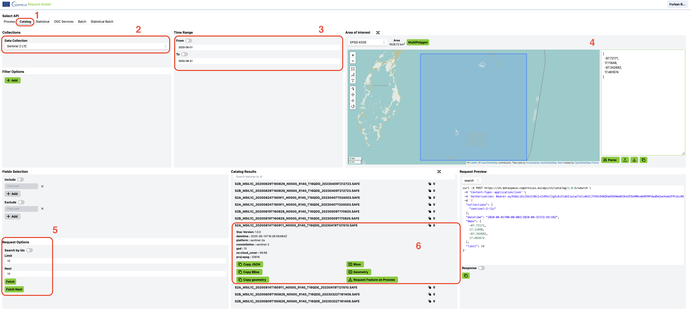

In the **Request Preview** window, you can see how the Catalog request is constructed based on your chosen parameters. As before, you can copy the request into the window and click **parse**.

```bash
curl -X POST https://sh.dataspace.copernicus.eu/api/v1/catalog/1.0.0/search \
 -H 'Content-Type: application/json' \
 -H 'Authorization: Bearer <your access token>' \
 -d '{
  "collections": [
    "sentinel-2-l1c"
  ],
  "datetime": "2020-06-01T00:00:00Z/2020-08-31T23:59:59Z",
  "bbox": [
    -87.72171,
    17.11848,
    -87.342682,
    17.481674
  ],
  "limit": 10
}'
```

## CURL CLI and Python

### Get Your Client ID and Client Secret

When making Sentinel Hub requests in CMD CURL or Python, you will need to authenticate so the system can recognize you. The reason this wasn't needed for Requests Builder is because the credentials were read from the user being logged into the Copernicus account directly.

Requests are authenticated using an access token, generated from an OAuth client. To get an access token, your Sentinel Hub Client ID and Client Secret (strings of randomly generated characters) need to be specified.

Before we start, [sign in](https://dataspace.copernicus.eu/) to your Copernicus account. Then, hover over the profile icon and click on “[Sentinel Hub](https://shapps.dataspace.copernicus.eu/dashboard/#/)” to access your Sentinel Hub dashboard.

To get your Client ID and Client Secret, follow the steps in the [Registering OAuth client guide](https://documentation.dataspace.copernicus.eu/APIs/SentinelHub/Overview/Authentication.html#registering-oauth-client).

You will use the Client ID and Client Secret to access the Sentinel Hub APIs later.

***Note:** Access tokens expire after an hour. To fix this, just request a new access token.*

### CURL

CURL is a tool which sends requests through the command line interface (CLI). If you are using Windows 10, macOS, or Linux you probably already have it pre-installed. Otherwise you can install it [here](https://curl.se/download.html).

#### Open Your CLI

The command line interface, also called a CLI, is a program which makes it possible to send instructions to your computer via text commands. Which command line interface you will be using for this tutorial depends on your operating system:

* Windows: [Git Bash](https://gitforwindows.org/)  
* Mac: Terminal, comes pre-installed  
* Linux: Bash, comes pre-installed

#### Authorization With Access Token

You can now get started with running CURL requests through your command line interface. The first thing you will do is use your Client ID and Client Secret to get an access token. The access token will be the way you identify yourself when making requests.

1. Copy the CURL command below to a text editor:

```bash
curl -X POST --url https://identity.dataspace.copernicus.eu/auth/realms/CDSE/protocol/openid-connect/token --header "content-type: application/x-www-form-urlencoded" --data "grant_type=client_credentials&client_id=<your client id>" --data-urlencode "client_secret=<your client secret>"
```

2. Replace `<your client id>` and `<your client secret>` with your own Client ID and Client Secret generated from the Sentinel Hub Dashboard.  
3. Paste the entire command set with your own Client ID and Client Secret to your command line interface and press enter. The response you get is the **access_token** which is a long string containing letters, numbers, and special characters as shown below. Make sure to save the `access_token` to a text editor for later.

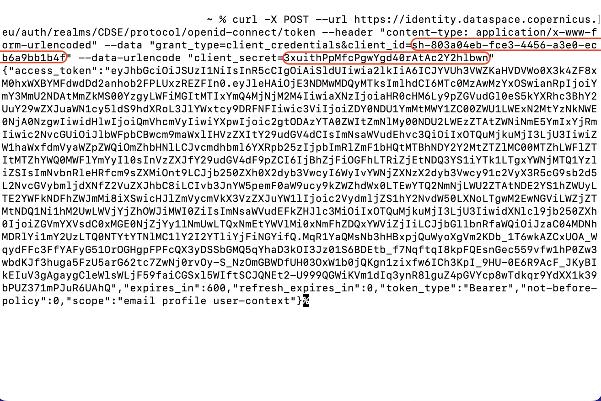

To make the above more clear, Client Secret and Client ID in the example above were `3xuithPpMfcPgwYgd40rAtAc2Y2hlbwn` and `sh-803a04eb-fce3-4456-a3e0-ecb6a9bb1b4f`, respectively. The access token is the long string between the two `"` signs. The resulting access token from the request above is:

```
eyJhbGciOiJSUzI1NiIsInR5cCIgOiAiSldUIiwia2lkIiA6ICJYVUh3VWZKaHVDVWo0X3k4ZF8xM0hxWXBYMFdwdDd2anhob2FPLUxzREZFIn0.eyJleHAiOjE3NDMwMDQyMTksImlhdCI6MTc0MzAwMzYxOSwianRpIjoiYmY3MmU2NDAtMmZkMS00YzgyLWFiMGItMTIxYmQ4MjNjM2M4IiwiaXNzIjoiaHR0cHM6Ly9pZGVudGl0eS5kYXRhc3BhY2UuY29wZXJuaWN1cy5ldS9hdXRoL3JlYWxtcy9DRFNFIiwic3ViIjoiZDY0NDU1YmMtMWY1ZC00ZWU1LWExN2MtYzNkNWE0NjA0NzgwIiwidHlwIjoiQmVhcmVyIiwiYXpwIjoic2gtODAzYTA0ZWItZmNlMy00NDU2LWEzZTAtZWNiNmE5YmIxYjRmIiwic2NvcGUiOiJlbWFpbCBwcm9maWxlIHVzZXItY29udGV4dCIsImNsaWVudEhvc3QiOiIxOTQuMjkuMjI3LjU3IiwiZW1haWxfdmVyaWZpZWQiOmZhbHNlLCJvcmdhbml6YXRpb25zIjpbImRlZmF1bHQtMTBhNDY2Y2MtZTZlMC00MTZhLWFlZTItMTZhYWQ0MWFlYmYyIl0sInVzZXJfY29udGV4dF9pZCI6IjBhZjFiOGFhLTRiZjEtNDQ3YS1iYTk1LTgxYWNjMTQ1YzliZSIsImNvbnRleHRfcm9sZXMiOnt9LCJjb250ZXh0X2dyb3VwcyI6WyIvYWNjZXNzX2dyb3Vwcy91c2VyX3R5cG9sb2d5L2NvcGVybmljdXNfZ2VuZXJhbC8iLCIvb3JnYW5pemF0aW9ucy9kZWZhdWx0LTEwYTQ2NmNjLWU2ZTAtNDE2YS1hZWUyLTE2YWFkNDFhZWJmMi8iXSwicHJlZmVycmVkX3VzZXJuYW1lIjoic2VydmljZS1hY2NvdW50LXNoLTgwM2EwNGViLWZjZTMtNDQ1Ni1hM2UwLWVjYjZhOWJiMWI0ZiIsImNsaWVudEFkZHJlc3MiOiIxOTQuMjkuMjI3LjU3IiwidXNlcl9jb250ZXh0IjoiZGVmYXVsdC0xMGE0NjZjYy1lNmUwLTQxNmEtYWVlMi0xNmFhZDQxYWViZjIiLCJjbGllbnRfaWQiOiJzaC04MDNhMDRlYi1mY2UzLTQ0NTYtYTNlMC1lY2I2YTliYjFiNGYifQ.MqR1YaQMsNb3hHBxpjQuWyoXgVm2KDb_1T6wkAZCxUOA_WqydFFc3FfYAFyG51OrOGHgpFPFcQX3yDSSbGMQ5qYhaD3kOI3Jz01S6BDEtb_f7NqftqI8kpFQEsnGec559vfw1hP0Zw3wbdKJf3huga5FzU5arG62tc7ZwNj0rvOy-S_NzOmGBWDfUH03OxW1b0jQKgn1zixfw6ICh3KpI_9HU-0E6R9AcF_JKyBIkEIuV3gAgaygCleWlsWLjF59faiCGSxl5WIftSCJQNEt2-U999QGWiKVm1dIq3ynR8lguZ4pGVYcp8wTdkqr9YdXX1k39bPUZ371mPJuR6UAhQ
```

*Note: Access tokens expire after an hour. To fix this, just request a new access token and replace it in your requests.*

#### Request an Image

1. Copy any CURL request,  for example the [S2L2A true color image request example](#run-the-example-request-from-documentation) to a text editor.  
2. Replace `<your access token>` on top with `access_token` you got from the previous request. When doing so, be careful not to add or delete any `"` and `'` signs.

The below CURL example is of Lighthouse Reef, with a code for image download added, but without the inserted access token.

```bash
curl -X POST https://sh.dataspace.copernicus.eu/api/v1/process \
 -H 'Content-Type: application/json' \
 -H 'Authorization: Bearer <your_access_token>' \
 -d '{
  "input": {
    "bounds": {
      "bbox": [
        13.822174072265625,
        45.85080395917834,
        14.55963134765625,
        46.29191774991382
      ]
    },
    "data": [
      {
        "dataFilter": {
          "timeRange": {
            "from": "2022-10-01T00:00:00Z",
            "to": "2022-10-31T00:00:00Z"
          }
        },
        "type": "sentinel-2-l2a"
      }
    ]
  },
  "output": {
    "width": 512,
    "height": 512,
    "responses": [
      {
        "identifier": "default",
        "format": {
          "type": "image/jpeg"
        }
      }
    ]
  },
  "evalscript": "//VERSION=3\n\nfunction setup() {\n  return {\n    input: [\"B02\", \"B03\", \"B04\"],\n    output: {\n      bands: 3,\n      sampleType: \"AUTO\"\n    }\n  }\n}\n\nfunction evaluatePixel(sample) {\n  return [2.5 * sample.B04, 2.5 * sample.B03, 2.5 * sample.B02]\n}"
}' \
--output output.jpg
```

3. After your access token is added to the request, paste the entire request to your command line interface and press enter.

The response will look similar to the one shown below, and your actual satellite image will be saved in the current working directory, where your command line interface is open. If you are not sure which directory that is, you can type **pwd** into your command line interface and it will show you the output folder.

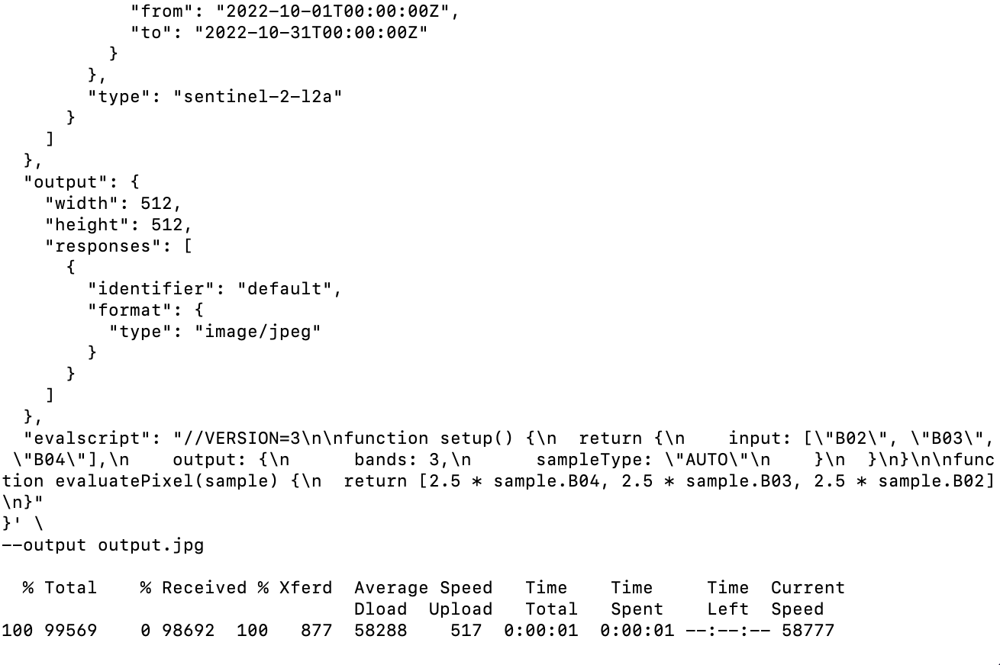

#### Search For Data With Catalog API

The following request will return 1 search result for Sentinel-2 L2A in a given AOI, within the time period 1.6.2020 - 31.8.2020.

1. Copy the request example below and make sure to replace **\<your access token\>** with **access\_token** you got from the authentication request. Instead of the following request, you can use any request from our [Catalog examples](https://documentation.dataspace.copernicus.eu/APIs/SentinelHub/Catalog/Examples.html).

```bash
curl -X POST https://sh.dataspace.copernicus.eu/api/v1/catalog/1.0.0/search \
 -H 'Content-Type: application/json' \
 -H 'Authorization: Bearer <your access token>' \
 -d '{
  "collections": ["sentinel-2-l2a"],
  "datetime": "2020-06-01T00:00:00Z/2020-08-31T23:59:59Z",
  "bbox": [-87.72171,17.11848,-87.342682,17.481674],
  "limit": 1
}'
```

2. Paste the request with the inserted access token to your CLI and press enter.

The result of the request should look something like this:

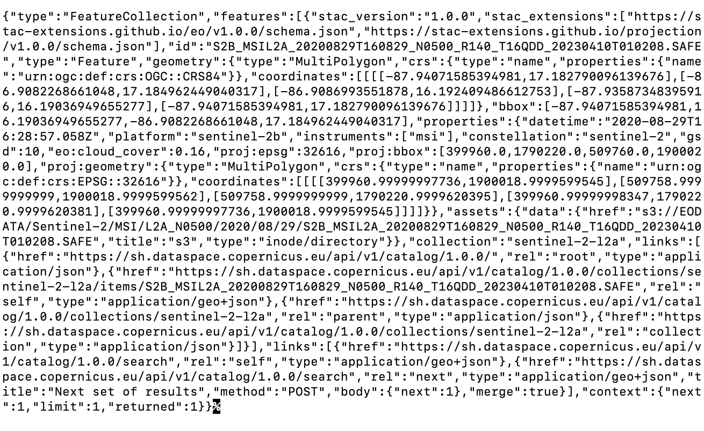

Adding **\> catalog-request.json** at the end of the code above will download the response into a JSON file. To make it more readable, you might want to copy the response into an [online JSON formatter](https://jsonformatter.curiousconcept.com/#).

### Python

Follow the steps below to set up Python and run Sentinel Hub requests using the [Copernicus Data Space Ecosystem](https://dataspace.copernicus.eu/). To explore real use cases and example scripts, visit our GitHub repository for [Sentinel Hub notebooks](https://github.com/eu-cdse/notebook-samples/tree/main/sentinelhub). You’ll also find a variety of tutorials and example workflows demonstrating how to interact with available APIs and process EO data using Python.

Python 3.6 or newer is required to run the examples. The Copernicus platform offers a built-in [JupyterLab launcher](https://dataspace.copernicus.eu/analyse/jupyterlab) directly within the website, making it easy to run scripts without local setup.

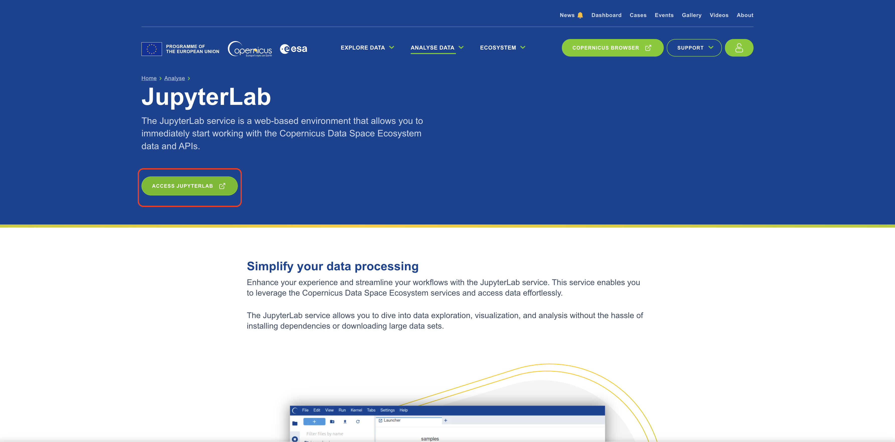

If you're not familiar with Jupyter Notebook, see [this beginner tutorial](https://www.dataquest.io/blog/jupyter-notebook-tutorial/) to learn how to use it. Most importantly: the cells are run with CTRL+Enter. Note that you need to run each cell separately in top to bottom order.

#### Make a Request

The steps below were collected in a [Jupyter Notebook](https://drive.google.com/file/d/1GQoyFOnANb7t5DQB4ov9bgti3TIc_pqY/view?usp=drive_link), that you can import into your Jupyter Notebook by clicking **Upload**. Each step, as well as how to construct a Python body request, is explained below.

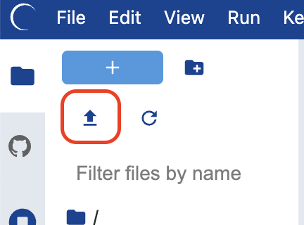

After uploading, make sure to change the kernel to **Sentinel Hub** from the top right corner. This ensures that all required libraries are available and preconfigured.

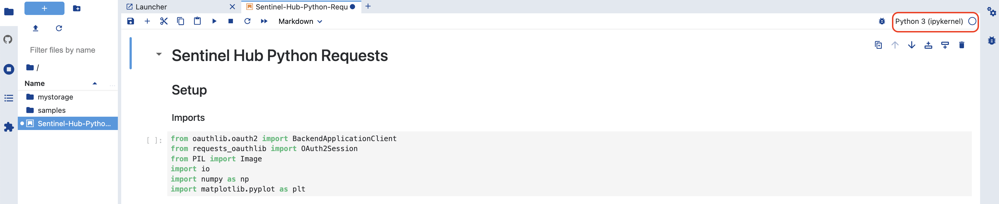

1. Import requisite packages

Copy these imports to your Jupyter Notebook to import all the needed libraries.

```
from oauthlib.oauth2 import BackendApplicationClient
from requests_oauthlib import OAuth2Session
from PIL import Image
import io
import numpy as np
import matplotlib.pyplot as plt
```

2. Authentication

Add this code to your notebook next, and replace **\<your client id\>** and **\<your client secret\>** inside the quotation marks with your client id and client secret:

```
CLIENT_ID = "<your client id>"
CLIENT_SECRET = "<your client secret>"
```

For example:

```
CLIENT_ID = "ed05a0e6-9aec-4d5a-aaf8-af07333760b8"
CLIENT_SECRET = "}m%>Zt/9E5+EPsT_zY-y^2(vi-,c*G>L-)p)dj75"
```

The following code will set up credentials for use with our APIs and get an authentication token (no need to change anything here, just copy this code to your Notebook next).

```
# set up credentials
client = BackendApplicationClient(client_id=CLIENT_ID)
oauth = OAuth2Session(client=client)

# get an authentication token
token = oauth.fetch_token(
    token_url='https://identity.dataspace.copernicus.eu/auth/realms/CDSE/protocol/openid-connect/token',
    client_secret=CLIENT_SECRET,
    include_client_id=True
)
```

3. Set the parameters for the image request

The variable parameters are set here and referenced in the request below. This way, it's easy for you to edit the BBOX, time-range or collection type.

* **bbox**: Find the bounding box of your AOI via our [Requests Builder](https://shapps.dataspace.copernicus.eu/requests-builder/)  
* **start\_date** and **end\_date**: these are your time interval start and end dates. Fill them in using this format: **'YYYY-MM-DD'**  
* **collection\_id**: Choose a [data collection](https://documentation.dataspace.copernicus.eu/APIs/SentinelHub/Data.html) and look up its collection identifier at the bottom of the page; for example, for [Sentinel-2 L2A](https://documentation.dataspace.copernicus.eu/APIs/SentinelHub/Data/S2L2A.html), the identifier is **sentinel-2-l2a**.

```
bbox = [-87.72171, 17.11848, -87.342682, 17.481674]
start_date = "2020-06-01"
end_date = "2020-08-31"
collection_id = "sentinel-2-l2a"
```

4. Create an evalscript and request body/payload

It's easy to get an evalscript and request body payload for Python from any CURL request. The best way to do it is to parse the request in Requests Builder, then grab the relevant parts and copy them into Python code.

* First, check the chapter of Requests builder called [Run the example request from documentation](#run-the-example-request-from-documentation) to see how to grab any example from our documentation and parse it.  
* When the request is parsed, copy the evalscript from Requests Builder (Image below - 1\) and paste it into the following code, replacing the **\<copied evalscript\>** part. Note that the evalscript goes between two triple quotes `"""`, which signify a multiline comment in Python.

```
evalscript = """
<copied evalscript>
"""
```

Let's use a simple true color composite visualization from [this example](#run-the-example-request-from-documentation). After adding it, the Python code should look like this:

```
evalscript = """
//VERSION=3
function setup() {
  return {
    input: ["B02", "B03", "B04"],
    output: {
      bands: 3,
      sampleType: "AUTO" // default value - scales the output values from [0,1] to [0,255].
    }
  }
}

function evaluatePixel(sample) {
  return [2.5 * sample.B04, 2.5 * sample.B03, 2.5 * sample.B02]
}
"""
```

* In Requests Builder ***Request Preview***, select body from the dropdown menu.  
* Copy the code from ***Request Preview***, but only up to a comma before **evalscript**, so the **"evalscript"** is excluded, and a comma included, as demonstrated in orange on the image below.

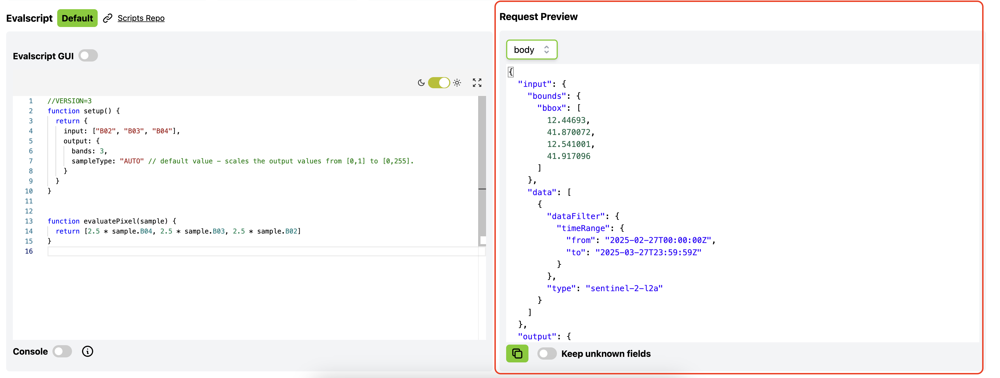

* Use the copied request to replace the **\<copied payload\>** in the following Python code:

```
json_request = <copied payload>
"evalscript": evalscript
}
```

Using the CURL request body for Lighthouse Reef, the result would look like this:

```
json_request = {
  "input": {
    "bounds": {
      "bbox": [
        -87.72171,
        17.11848,
        -87.342682,
        17.481674
      ]
    },
    "data": [
      {
        "dataFilter": {
          "timeRange": {
            "from": "2020-06-01T00:00:00Z",
            "to": "2020-08-31T23:59:59Z"
          },
          "maxCloudCoverage": "1"
        },
        "type": "sentinel-2-l2a"
      }
    ]
  },
  "output": {
    "width": 1024,
    "height": 1026.707,
    "responses": [
      {
        "identifier": "default",
        "format": {
          "type": "image/jpeg"
        }
      }
    ]
  },
"evalscript": evalscript
}
```

Putting both, evalscript and request body together, the final Python request would look like this:

```
# evalscript
evalscript = """
//VERSION=3

function setup() {
  return {
    input: ["B02", "B03", "B04"],
    output: { id: 'default',
              bands: 3 }
  };
}

function evaluatePixel(sample) {
  return [2.5 * sample.B04, 2.5 * sample.B03, 2.5 * sample.B02];
}
"""

# request body/payload
json_request = {
    'input': {
        'bounds': {
            'bbox': bbox,
            'properties': {
                'crs': 'http://www.opengis.net/def/crs/OGC/1.3/CRS84'
            }
        },
        'data': [
            {
                'type': 'S2L2A',
                'dataFilter': {
                    'timeRange': {
                        'from': f'{start_date}T00:00:00Z',
                        'to': f'{end_date}T23:59:59Z'
                    },
                    'mosaickingOrder': 'leastCC',
                },
            }
        ]
    },
    'output': {
        'width': 1024,
        'height': 1024,
        'responses': [
            {
                'identifier': 'default',
                'format': {
                    'type': 'image/jpeg',
                }
            }
        ]
    },
    'evalscript': evalscript
}
```

5. Set the request url and headers for the Processing API and send the request

The following code will specify the Processing API endpoint, set up headers and send the request. In this step, the request will be executed, but the results won't yet be displayed.

```
# Set the request URL and headers
url_request = "https://sh.dataspace.copernicus.eu/api/v1/process"
headers_request = {
    "Authorization": f"Bearer {token['access_token']}"
}

# Send the request
response = oauth.post(url_request, headers=headers_request, json=json_request)
```

#### Display the Requested Image

- Get the image array and plot the image

When the request above is successful, this piece of code will display a requested image (in this case, the image of Lighthouse Reef). You may paste this code in as is, and you can edit the image size by changing the **figsize** numbers.

```
# read the image as numpy array
image_arr = np.array(Image.open(io.BytesIO(response.content)))

# plot the image for visualization
plt.figure(figsize=(16,16))
plt.axis('off')
plt.tight_layout()
plt.imshow(image_arr)
```

#### Search for Available Data With Catalog API

1. Import requisite packages, authenticate, and set parameters

Follow the steps 1, 2 and 3 of the [Make a request](#make-a-request) section for Python. If your Notebook already includes these from requesting an image, there's no need to add them again.

2. Create the request body/payload

The Catalog request below will return all the available acquisitions that match the specified parameters - time-range, collection, **bbox** and the number of results. These parameters were already defined above, in [Make a Request](#make-a-request) - point 3, and are being referenced here again. Defining the parameters separately makes it easy to quickly change them (e.g. change the **bbox**) without the need to edit every request. You could of course specify them again.

```
json_search = {
    'bbox': bbox,
    'datetime': f'{start_date}T00:00:00Z/{end_date}T23:59:59Z',
    'collections': [collection_id],
    'limit': 1
}
```

Instead of this request, we could easily use any Catalog request from documentation, such as for example [this one](https://documentation.dataspace.copernicus.eu/APIs/SentinelHub/Catalog/Examples.html#simple-post-search). As Catalog examples are written in Python, they can be copied as they are.

3. Set the endpoint and send the request

The following code will specify the endpoint for Catalog API, set up headers and send the request. Note that the endpoints differ for each API - for example, Catalog API has **/catalog/search** in URL, while Processing API has **/process**. This is how the system knows which API you are using. In this step, the request will be executed, but the results won't yet be displayed.

```
# Set the correct Catalog API URL and headers
url_search = 'https://sh.dataspace.copernicus.eu/api/v1/catalog/1.0.0/search'
headers_search = {
    'Authorization': f"Bearer {token['access_token']}",
    'Content-Type': 'application/json'
}

# Send the request
response_search = oauth.post(url_search, headers=headers_search, json=json_search)
```

4. Print the search result

The following code will print the result of the Catalog search in JSON format.

```
response_search.json()
```

The JSON result will look something like this. As the search was limited to only 1 result, you can see how the Catalog response looks like for a single acquisition.

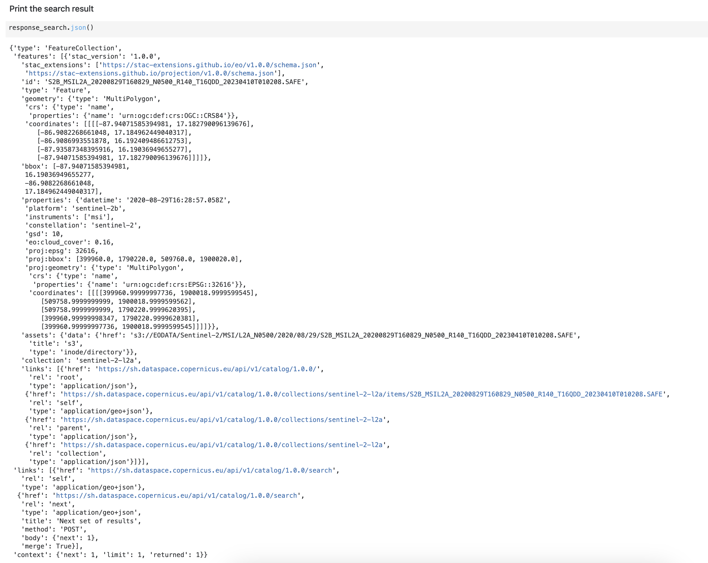

## Useful Links

* [Sentinel Hub Documentation](https://documentation.dataspace.copernicus.eu/APIs/SentinelHub.html) - Technical API documentation.  
* [Sentinel Hub QGIS Plugin](https://github.com/sentinel-hub/sentinelhub-qgis-plugin) - Access and visualise the data directly in QGIS.  
* [Custom scripts](https://documentation.dataspace.copernicus.eu/APIs/SentinelHub/Evalscript.html) - How to control satellite visualization and values (including data fusion and multi-temporal scripting).  
* [Custom Script Repository](https://custom-scripts.sentinel-hub.com/) - A public repository of satellite visualizations  
* [Copernicus Browser](https://browser.dataspace.copernicus.eu/) - A web application to search, view, analyse, and download Sentinel and other Earth observation data.  
* [Requests Builder](https://shapps.dataspace.copernicus.eu/requests-builder/) - A web application with intuitive user interface for easy API request sending and construction.  
* [Sentinel Hub API Overview](https://documentation.dataspace.copernicus.eu/APIs/SentinelHub/Overview.html) - Information on API authentication, rate limiting, processing units and error handling.  
* [API Reference](https://documentation.dataspace.copernicus.eu/APIs/SentinelHub/ApiReference.html) - Detailed overview of the available parameters and their structure for each API.  
* [Integration of Sentinel Hub with GIS applications](https://documentation.dataspace.copernicus.eu/APIs/SentinelHub/OGC.html) - Integrate satellite imagery into ArcGIS, QGIS, with Python and more.
