SpatioTemporal Asset Catalogue (STAC) of the Copernicus Data Space Ecosystem (CDSE) has been implemented to foster discoverability and management of Earth Observation (EO) data. Its goal is to standardize metadata model to increase interoperability and applicability of the spatio-temporal datasets. The catalogue implements the new [`STAC specification of version 1.1.0`](https://github.com/radiantearth/stac-spec){target="_blank"}. It is important to note that the STAC catalogue does not replace the existing CDSE Open Data Protocol (Odata) catalogue but serves as a complementary resource, expanding data discovery and accessibility options. It includes a limited set of data collections but more will be included in the upcoming months and further optimizations of its performance and stability will be performed.

## Endpoint URL

Copernicus Data Space Ecosystem STAC Catalog can be accessed using the following URL:

::: {.panel-tabset}

# HTTPS Request

[`https://stac.dataspace.copernicus.eu/v1/`](https://stac.dataspace.copernicus.eu/v1/){target="_blank"}

:::

## CDSE STAC Browser

CDSE STAC Browser serves as a Graphical User Interface (GUI) to explore, filter, and preview EO products along with their comprehensive set of attributes. It uses standardized JSON API responses to offer an intuitive interface, allowing users to easily navigate and interact with the STAC catalogue. The source code of the CDSE STAC Browser in available on the [`GitHub`](https://github.com/eu-cdse/stac-browser-cdse){target="_blank"}. 

The latest Copernicus Data Space Ecosystem STAC API Browser can be accessed using the following URL:

::: {.panel-tabset}

# HTTPS Request

[`https://browser.stac.dataspace.copernicus.eu`](https://browser.stac.dataspace.copernicus.eu){target="_blank"}

:::

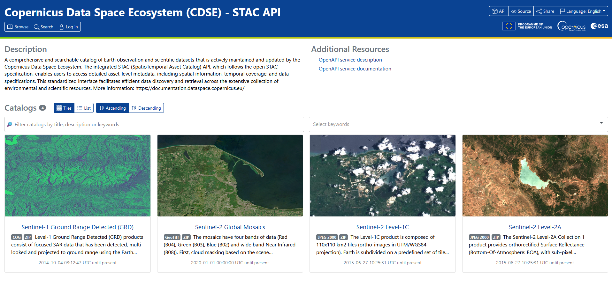

The STAC Browser window is divided into two main parts:

1. Copernicus Data Space Ecosystem (CDSE) - STAC API Header: With an interactive navigation bar
2. Main Page: Organized into sections that include a platform description, additional resource links, and a catalog section for browsing datasets.

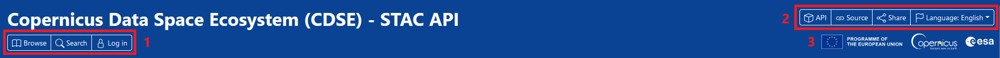

The navigation bar includes several options that facilitate easy exploration and interaction with the STAC Browser:

1. Interactive features:

* Browse: To navigate through available collections
* Search: Redirects to the `/search` endpoint, allowing users to search within the data catalog
* Log in: Redirects to the CDSE login page, allowing users to authenticate or register a new account

2. Links and Information:

* API
* Source
* Share
* Language Selection

3. Logos: Redirects to the [Copernicus Data Space Ecosystem](https://dataspace.copernicus.eu/).

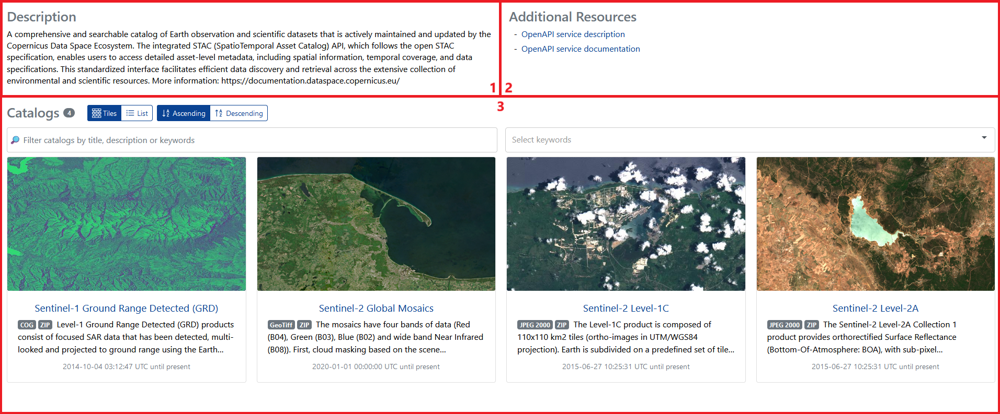


The main page is divided into three sections:

1. Description
2. Additional Resources: Links to the OPEN API service documentation and description
3. Catalogs

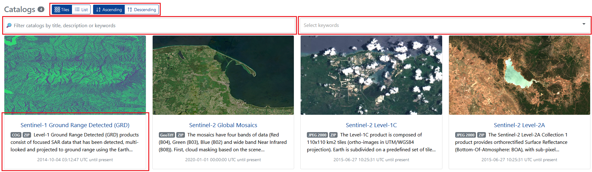

This section presents the available catalogs (with the number displayed next to the section title), offering options to view them as tiles or a list. Users can sort them in ascending or descending order by collection name. Two sidebars are available: one allows filtering catalogs by title, description, or keywords, and the other provides a list of pre-defined keywords to select from.

After selecting a desired collection, users are redirected to its dedicated STAC Browser page, for example [Sentinel-1 Ground Range Detected (GRD)](https://browser.stac.dataspace.copernicus.eu/collections/sentinel-1-grd?)

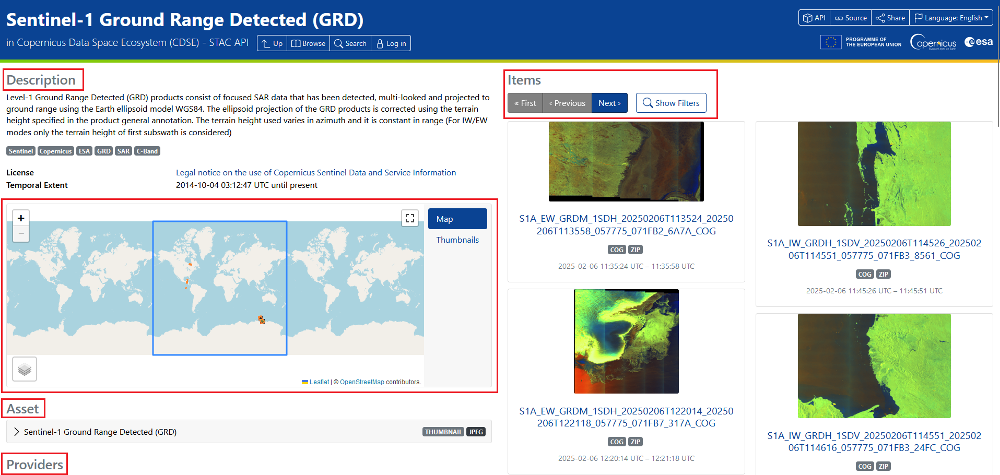

The page is divided into two main sections below the header.

On the left side, there is a collection description along with keywords, license information, and temporal extent. Below this, an interactive map displays the geographical location of the items currently shown on the page, as well as the collection's spatial extent. Further down, additional information is presented in the following order: Assets, Providers, and Metadata, which is divided into more detailed sections such as general, SAR, cloud storage, processing, product, satellite, etc. These sections may vary depending on the collection.

On the right side, there is an Items section displaying the currently filtered products. By clicking on a selected product, users can navigate to its dedicated endpoint. Next to the pagination bar, which allows users to browse through product pages, there is a toolbar that enables the display of available filtering options.

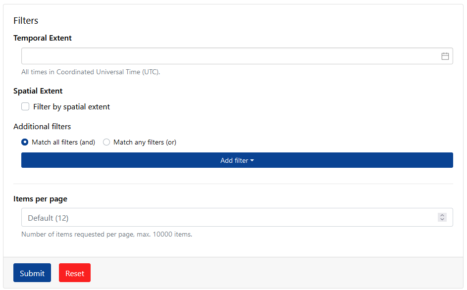

After clicking the **Show Filters** button, a panel expands, allowing the user to define the desired filters.

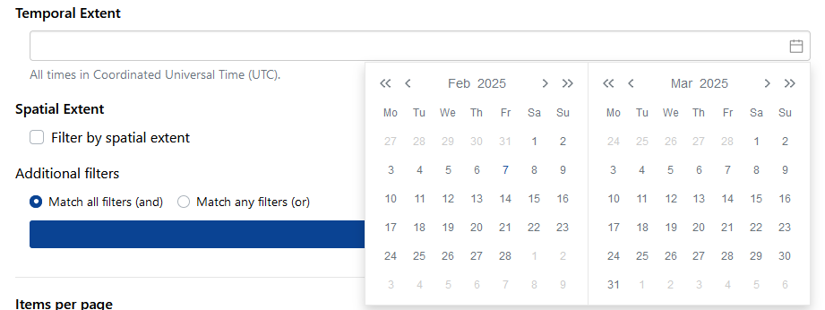

The user can define the desired time range

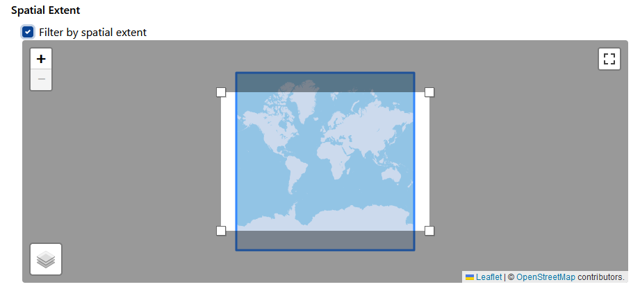

The user can use the interactive map to specify the spatial extent.

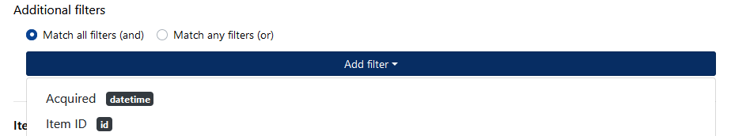

The user can select the filtering type (`AND` or `OR`) and then add the desired filters, which vary depending on the collection. Filters available for another collection - Sentinel-2 Level-2A:

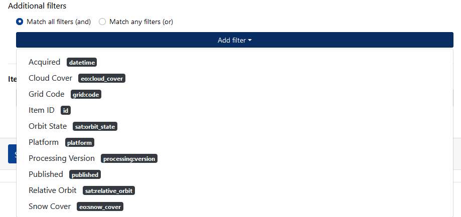

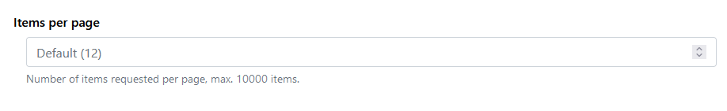

In the final step, the user can set the limit of displayed items per page, with a default value of 12.

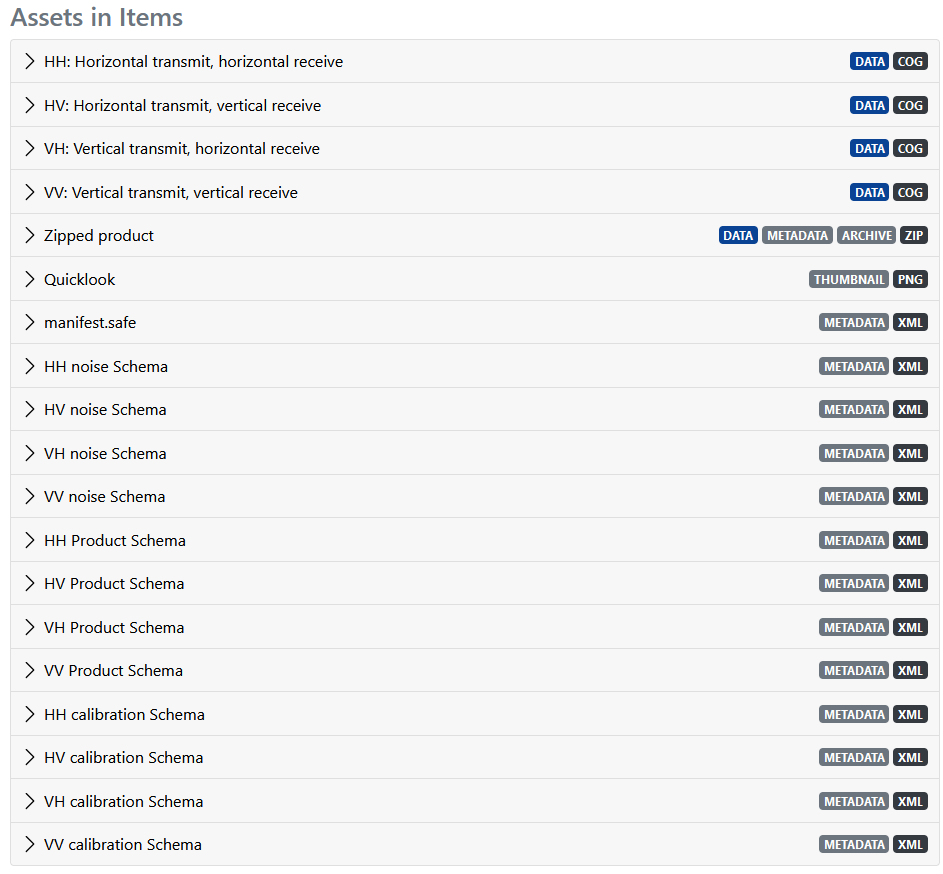

Below the section displaying the Items, there is a section containing information about the Assets in Items.

In the following example, we will apply filtering within the Sentinel-2 Level-2A collection, using a time filter, a spatial filter, and an additional filter. We will select products within the date range from July 1st to August 31st, 2024, define the geospatial extent on the map, and set the cloud cover filter to less than or equal to 10%:

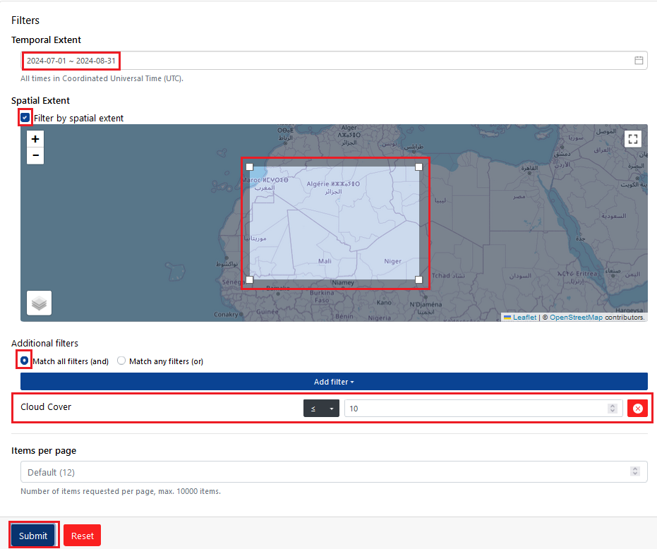

After clicking the "Submit" button, a list of products matching the selected filters is returned. As mentioned earlier, by clicking on a selected product, the user will be redirected to its dedicated page.

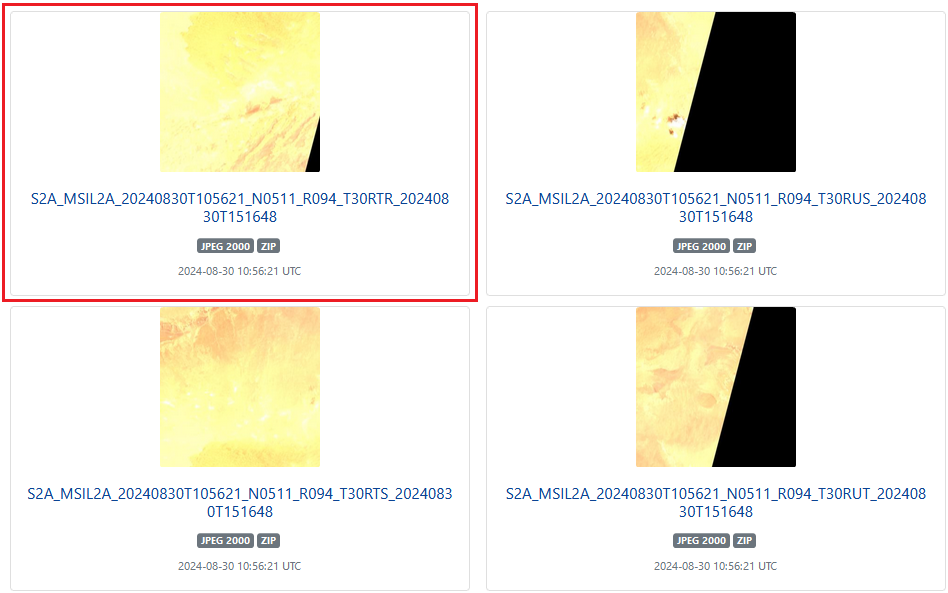

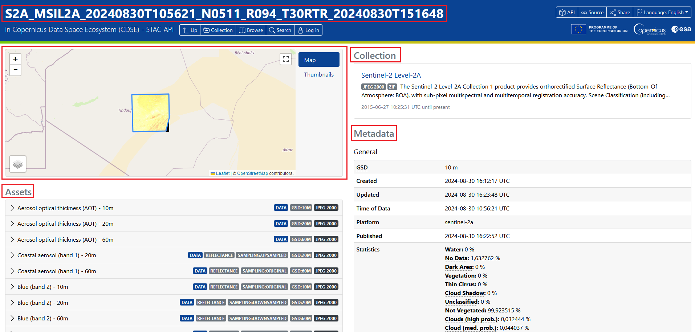

The layout of the selected product page is structured in a similar way. On the left side, an interactive map is displayed, showing its geospatial location, with Asset information below it. On the right side, the collection description is provided, including a link that redirects to the Collection. Below that, the dedicated Item metadata is displayed in a separate section.

## Available Collections

The following collections are currently available via CDSE STAC API:

### Copernicus Sentinel Mission

Sentinel-1:

* Sentinel-1 Global Mosaics
* Sentinel-1 Ground Range Detected (GRD)
* Sentinel-1 Single Look Complex: IW, EW, SM
* Sentinel-1 Single Look Complex: WV

Sentinel-2:

* Sentinel-2 GRI L1C
* Sentinel-2 GRI L1C GCP
* Sentinel-2 Global Mosaics
* Sentinel-2 Level-1C
* Sentinel-2 Level-2A

Sentinel-3:

* Sentinel-3 Land Surface Reflectance and Aerosol (NTC)
* Sentinel-3 Land Surface Reflectance and Aerosol (STC)
* Sentinel-3 OLCI Earth Observation Full Resolution (NRT)
* Sentinel-3 OLCI Earth Observation Full Resolution (NTC)
* Sentinel-3 OLCI Earth Observation Reduced Resolution (NRT)
* Sentinel-3 OLCI Earth Observation Reduced Resolution (NTC)
* Sentinel-3 OLCI Land Full Resolution (NRT)
* Sentinel-3 OLCI Land Full Resolution (NTC)
* Sentinel-3 OLCI Land Reduced Resolution (NRT)
* Sentinel-3 OLCI Land Reduced Resolution (NTC)
* Sentinel-3 OLCI Water Full Resolution (NRT)
* Sentinel-3 OLCI Water Full Resolution (NTC)
* Sentinel-3 OLCI Water Reduced Resolution (NRT)
* Sentinel-3 OLCI Water Reduced Resolution (NTC)
* Sentinel-3 SLSTR Aerosol Optical Depth (NRT)
* Sentinel-3 SLSTR Fire Radiative Power (NRT)
* Sentinel-3 SLSTR Fire Radiative Power (NTC)
* Sentinel-3 SLSTR Land Surface Temperature (NRT)
* Sentinel-3 SLSTR Land Surface Temperature (NTC)
* Sentinel-3 SLSTR Radiance and Brightness Temperature (NRT)
* Sentinel-3 SLSTR Radiance and Brightness Temperature (NTC)
* Sentinel-3 SLSTR Water Surface Temperature (NRT)
* Sentinel-3 SLSTR Water Surface Temperature (NTC)
* Sentinel-3 SRAL Land Radar Altimetry (NRT)
* Sentinel-3 SRAL Land Radar Altimetry (NTC)
* Sentinel-3 SRAL Land Radar Altimetry (STC)
* Sentinel-3 SRAL Land Radar Altimetry - Hydrology (NRT)
* Sentinel-3 SRAL Land Radar Altimetry - Hydrology (NTC)
* Sentinel-3 SRAL Land Radar Altimetry - Hydrology (STC)
* Sentinel-3 SRAL Land Radar Altimetry - Land Ice (NRT)
* Sentinel-3 SRAL Land Radar Altimetry - Land Ice (NTC)
* Sentinel-3 SRAL Land Radar Altimetry - Land Ice (STC)
* Sentinel-3 SRAL Land Radar Altimetry - Sea Ice (NRT)
* Sentinel-3 SRAL Land Radar Altimetry - Sea Ice (NTC)
* Sentinel-3 SRAL Land Radar Altimetry - Sea Ice (STC)
* Sentinel-3 SRAL Ocean Radar Altimetry (NRT)
* Sentinel-3 SRAL Ocean Radar Altimetry (NTC)
* Sentinel-3 SRAL Ocean Radar Altimetry (STC)
* Sentinel-3 SRAL Radar Altimetry L-1A (NRT)
* Sentinel-3 SRAL Radar Altimetry L-1A (NTC)
* Sentinel-3 SRAL Radar Altimetry L-1A (STC)
* Sentinel-3 SRAL Radar Altimetry L-1B (NRT)
* Sentinel-3 SRAL Radar Altimetry L-1B (NTC)
* Sentinel-3 SRAL Radar Altimetry L-1B (STC)
* Sentinel-3 SYNERGY 1-Day Surface Reflectance and NDVI (NTC)
* Sentinel-3 SYNERGY 1-Day Surface Reflectance and NDVI (STC)
* Sentinel-3 SYNERGY 10-Day Surface Reflectance and NDVI (NTC)
* Sentinel-3 SYNERGY 10-Day Surface Reflectance and NDVI (STC)
* Sentinel-3 SYNERGY Aerosol Optical Depth (NTC)
* Sentinel-3 SYNERGY Top of Atmosphere Reflectance (NTC)
* Sentinel-3 SYNERGY Top of Atmosphere Reflectance (STC)

Sentinel-5P:

* Sentinel-5P Level 1 Radiance Band 1 (NRTI)
* Sentinel-5P Level 1 Radiance Band 1 (OFFL)
* Sentinel-5P Level 1 Radiance Band 1 (RPRO)
* Sentinel-5P Level 1 Radiance Band 2 (NRTI)
* Sentinel-5P Level 1 Radiance Band 2 (OFFL)
* Sentinel-5P Level 1 Radiance Band 2 (RPRO)
* Sentinel-5P Level 1 Radiance Band 3 (NRTI)
* Sentinel-5P Level 1 Radiance Band 3 (OFFL)
* Sentinel-5P Level 1 Radiance Band 3 (RPRO)
* Sentinel-5P Level 1 Radiance Band 4 (NRTI)
* Sentinel-5P Level 1 Radiance Band 4 (OFFL)
* Sentinel-5P Level 1 Radiance Band 4 (RPRO)
* Sentinel-5P Level 1 Radiance Band 5 (NRTI)
* Sentinel-5P Level 1 Radiance Band 5 (OFFL)
* Sentinel-5P Level 1 Radiance Band 5 (RPRO)
* Sentinel-5P Level 1 Radiance Band 6 (NRTI)
* Sentinel-5P Level 1 Radiance Band 6 (OFFL)
* Sentinel-5P Level 1 Radiance Band 6 (RPRO)
* Sentinel-5P Level 1 Radiance Band 7 (NRTI)
* Sentinel-5P Level 1 Radiance Band 7 (OFFL)
* Sentinel-5P Level 1 Radiance Band 7 (RPRO)
* Sentinel-5P Level 1 Radiance Band 8 (NRTI)
* Sentinel-5P Level 1 Radiance Band 8 (OFFL)
* Sentinel-5P Level 1 Radiance Band 8 (RPRO)
* Sentinel-5P Level 2 Aerosol Layer Height (NRTI)
* Sentinel-5P Level 2 Aerosol Layer Height (OFFL)
* Sentinel-5P Level 2 Aerosol Layer Height (RPRO)
* Sentinel-5P Level 2 Carbon Monoxide (NRTI)
* Sentinel-5P Level 2 Carbon Monoxide (OFFL)
* Sentinel-5P Level 2 Carbon Monoxide (RPRO)
* Sentinel-5P Level 2 Cloud (NRTI)
* Sentinel-5P Level 2 Cloud (OFFL)
* Sentinel-5P Level 2 Cloud (RPRO)
* Sentinel-5P Level 2 Formaldehyde (NRTI)
* Sentinel-5P Level 2 Formaldehyde (OFFL)
* Sentinel-5P Level 2 Formaldehyde (RPRO)
* Sentinel-5P Level 2 Methane (OFFL)
* Sentinel-5P Level 2 Methane (RPRO)
* Sentinel-5P Level 2 NPP Cloud (band 3) (OFFL)
* Sentinel-5P Level 2 NPP Cloud (band 3) (RPRO)
* Sentinel-5P Level 2 NPP Cloud (band 6) (OFFL)
* Sentinel-5P Level 2 NPP Cloud (band 6) (RPRO)
* Sentinel-5P Level 2 NPP Cloud (band 7) (OFFL)
* Sentinel-5P Level 2 NPP Cloud (band 7) (RPRO)
* Sentinel-5P Level 2 Nitrogen Dioxide (NRTI)
* Sentinel-5P Level 2 Nitrogen Dioxide (OFFL)
* Sentinel-5P Level 2 Nitrogen Dioxide (RPRO)
* Sentinel-5P Level 2 Ozone (NRTI)
* Sentinel-5P Level 2 Ozone (OFFL)
* Sentinel-5P Level 2 Ozone (RPRO)
* Sentinel-5P Level 2 Ozone Profile (NRTI)
* Sentinel-5P Level 2 Ozone Profile (OFFL)
* Sentinel-5P Level 2 Ozone Profile (RPRO)
* Sentinel-5P Level 2 Sulphur Dioxide (NRTI)
* Sentinel-5P Level 2 Sulphur Dioxide (OFFL)
* Sentinel-5P Level 2 Sulphur Dioxide (RPRO)
* Sentinel-5P Level 2 Tropospheric Ozone (NRTI)
* Sentinel-5P Level 2 Tropospheric Ozone (OFFL)
* Sentinel-5P Level 2 Tropospheric Ozone (RPRO)
* Sentinel-5P Level 2 Ultraviolet Aerosol Index (NRTI)
* Sentinel-5P Level 2 Ultraviolet Aerosol Index (OFFL)
* Sentinel-5P Level 2 Ultraviolet Aerosol Index (RPRO)

Sentinel-6:

* Sentinel-6 AMR-C Near Real-Time (NRT)
* Sentinel-6 AMR-C Non Time Critical (NTC)
* Sentinel-6 AMR-C Short Time Critical (STC)
* Sentinel-6 P4 Level 1B Near Real-Time (NRT)
* Sentinel-6 P4 Level 1B Non Time Critical (NTC)
* Sentinel-6 P4 Level 1B Short Time Critical (STC)
* Sentinel-6 P4 Level 2 Near Real-Time (NRT)
* Sentinel-6 P4 Level 2 Non Time Critical (NTC)
* Sentinel-6 P4 Level 2 Short Time Critical (STC)

### Complementary data

Copernicus DEM (COP-DEM):

* CopDEM COG (30 m)
* CopDEM COG (90 m) 

Copernicus Contributing Missions (CCM):

* Copernicus Contributing Missions DEM
* Copernicus Contributing Missions Optical
* Copernicus Contributing Missions SAR

Landsat:

* Landsat mosaic (bi-monthly, v1.0.1)

  
## STAC Collections Search

STAC Collections endpoint lets users get information about collections available in the CDSE catalogue. 

To access the information about all STAC API Collections:

::: {.panel-tabset}

# HTTPS Request

[`https://stac.dataspace.copernicus.eu/v1/collections`](https://stac.dataspace.copernicus.eu/v1/collections){target="_blank"}

:::


To access the information about a specified STAC API Collection (e.g. SENTINEL-2 Level-2A):

::: {.panel-tabset}

# HTTPS Request

[`https://stac.dataspace.copernicus.eu/v1/collections/sentinel-2-l2a`](https://stac.dataspace.copernicus.eu/v1/collections/sentinel-2-l2a){target="_blank"}

:::

## STAC API Extensions

The STAC API extensions adds additional functionalities to the STAC core API. Currently CDSE STAC API support the following extensions:

* `filter`
* `query`
* `fields`
* `sort`
* `free-text search` for the `/Collection` endpoint only

### Filter Extension

The Filter Extension provides an expressive mechanism for searching based on Item's attributes. It offers more flexibility compared to the [link query extension] and utilizes the standardized CQL2 query language. Users can apply various operators such as spatial, temporal, and attribute comparisons. The extension enhances search capabilities by allowing complex queries through GET and POST methods, using both text and JSON formats.

The implementation supports these conformance classes:

* Queryables mechanism along with filter parameters: `filter-lang`, `filter-crs` and `filter`
* BASIC CQL2 which includes logical operators (`AND`, `OR`, `NOT`), comparison operators (`=`, `<>`, `<`, `<=`, `>`, `>=`), and `isNull`. The comparison operators are allowed for string, numeric, boolean, date, and datetime types.
* Item Search Filter applied to the Item Search endpoint `/search`
* Basic spatial operators (`S_INTERSECTS`).

Two CQL2 formats supported by Item Search can be used in the filter parameter:

* CQL2 Text - recommended for GET requests (note that filter-lang defaults to cql2-text in this case)
* CQL2 JSON - recommended and supported for POST requests (note that filter-lang defaults to cql2-json in this case).

#### Queryables

Queryables are terms that can be used in filter expressions to search through a catalog or collection. They are defined globally for the entire catalog and individually for each collection.

Following endpoints have been added to allow users to check for available parameters when writing filter expressions.

To access queryable attributes for STAC API Item Search filter across the entire catalogue:

::: {.panel-tabset}

# HTTPS Request

[`https://stac.dataspace.copernicus.eu/v1/queryables`](https://stac.dataspace.copernicus.eu/v1/queryables){target="_blank"}

:::

To check available queryable attributes for collections:

::: {.panel-tabset}

# Sentinel-1 Ground Range Detected (GRD)

[`https://stac.dataspace.copernicus.eu/v1/collections/sentinel-1-grd/queryables`](https://stac.dataspace.copernicus.eu/v1/collections/sentinel-1-grd/queryables){target="_blank"}

# Sentinel-2 Global Mosaics

[`https://stac.dataspace.copernicus.eu/v1/collections/sentinel-2-global-mosaics/queryables`](https://stac.dataspace.copernicus.eu/v1/collections/sentinel-2-global-mosaics/queryables){target="_blank"}

# Sentinel-2 Level-1C

[`https://stac.dataspace.copernicus.eu/v1/collections/sentinel-2-l1c/queryables`](https://stac.dataspace.copernicus.eu/v1/collections/sentinel-2-l1c/queryables){target="_blank"}

# Senitnel-2 Level-2A

[`https://stac.dataspace.copernicus.eu/v1/collections/sentinel-2-l2a/queryables`](https://stac.dataspace.copernicus.eu/v1/collections/sentinel-2-l2a/queryables){target="_blank"}
:::

#### Examples

For POST method requests, the query should be included in the request body and sent to the following endpoint:

[`https://stac.dataspace.copernicus.eu/v1/search`](https://stac.dataspace.copernicus.eu/v1/search){target="_blank"}

::: {.panel-tabset}

To search for items from the Sentinel-2 Level-2A collection with cloud cover of 10 or less, a specified datetime, and that intersect with a given polygon geometry, use a filter query with these conditions.

# GET

[`https://stac.dataspace.copernicus.eu/v1/search?collections=sentinel-2-l2a&filter=eo:cloud_cover <= 10&datetime >= TIMESTAMP('2021-04-08T04:39:23Z')&S_INTERSECTS(geometry, POLYGON((43.5845 -79.5442, 43.6079 -79.4893, 43.5677 -79.4632, 43.6129 -79.3925, 43.6223 -79.3238, 43.6576 -79.3163, 43.7945 -79.1178, 43.8144 -79.1542, 43.8555 -79.1714, 43.7509 -79.6390, 43.5845 -79.5442)))`](https://stac.dataspace.copernicus.eu/v1/search?collections=sentinel-2-l2a&filter=eo:cloud_cover <= 10&datetime >= TIMESTAMP('2021-04-08T04:39:23Z')&S_INTERSECTS(geometry, POLYGON((43.5845 -79.5442, 43.6079 -79.4893, 43.5677 -79.4632, 43.6129 -79.3925, 43.6223 -79.3238, 43.6576 -79.3163, 43.7945 -79.1178, 43.8144 -79.1542, 43.8555 -79.1714, 43.7509 -79.6390, 43.5845 -79.5442))))

# POST

```{json}
{
    "filter": {
        "op": "and",
        "args": [
            {
                "op": "=",
                "args": [
                    {
                        "property": "collection"
                    },
                    "sentinel-2-l2a"
                ]
            },
            {
                "op": "<=",
                "args": [
                    {
                        "property": "eo:cloud_cover"
                    },
                    10
                ]
            },
            {
                "op": ">=",
                "args": [
                    {
                        "property": "datetime"
                    },
                    {
                        "timestamp": "2021-04-08T04:39:23Z"
                    }
                ]
            },
            {
                "op": "s_intersects",
                "args": [
                    {
                        "property": "geometry"
                    },
                    {
                        "type": "Polygon",
                        "coordinates": [
                            [
                                [
                                    43.5845,
                                    -79.5442
                                ],
                                [
                                    43.6079,
                                    -79.4893
                                ],
                                [
                                    43.5677,
                                    -79.4632
                                ],
                                [
                                    43.6129,
                                    -79.3925
                                ],
                                [
                                    43.6223,
                                    -79.3238
                                ],
                                [
                                    43.6576,
                                    -79.3163
                                ],
                                [
                                    43.7945,
                                    -79.1178
                                ],
                                [
                                    43.8144,
                                    -79.1542
                                ],
                                [
                                    43.8555,
                                    -79.1714
                                ],
                                [
                                    43.7509,
                                    -79.6390
                                ],
                                [
                                    43.5845,
                                    -79.5442
                                ]
                            ]
                        ]
                    }
                ]
            }
        ]
    }
}
```

:::

### Query Extension

The Query Extension introduces a query parameter that enables additional filtering based on the properties of Item objects. 

The supported operators include: `eq` (Equal to), `neq` (Not equal to), `lt` (Less than), `lte` (Less than or equal to), `gt` (Greater than), `gte` (Greater than or equal to).

For example, to search for Sentinel-2 Level-2A Items with cloud cover less than 15%, users can use either a GET or a POST request, as shown in the examples below.

For POST method requests, the query should be included in the request body and sent to the following endpoint:

[`https://stac.dataspace.copernicus.eu/v1/search`](https://stac.dataspace.copernicus.eu/v1/search){target="_blank"}

::: {.panel-tabset}

# GET

[`https://stac.dataspace.copernicus.eu/v1/collections/sentinel-2-l2a/items?filter-lang=cql2-text&filter=eo:cloud_cover<15`](https://stac.dataspace.copernicus.eu/v1/collections/sentinel-2-l2a/items?filter-lang=cql2-text&filter=eo:cloud_cover<15)

# POST

```{json}
{
    "collections": [
        "sentinel-2-l2a"
    ],
    "query": {
        "eo:cloud_cover": {
            "lt": 15
        }
    }
}
```

:::

### Fields Extension

The Fields Extension allows users to request specific set of attributes to be included or excluded from the search responses. This allows optimizing query performance by reducing unnecessary data, especially when dealing with large or complex Item objects. It can be used in both GET and POST requests, with the fields parameter enabling the specification of fields to include or exclude. In GET requests, you can specify fields to exclude by prefixing them with a hyphen (e.g., -geometry). 

For POST method requests, the query should be included in the request body and sent to the following endpoint:

[`https://stac.dataspace.copernicus.eu/v1/search`](https://stac.dataspace.copernicus.eu/v1/search){target="_blank"}

::: {.panel-tabset}

# GET

[`https://stac.dataspace.copernicus.eu/v1/search?collections=sentinel-2-l2a&filter=eo:cloud_cover<15&fields=-geometry`](https://stac.dataspace.copernicus.eu/v1/search?collections=sentinel-2-l2a&filter=eo:cloud_cover<15&fields=-geometry)

# POST

```{json}
{
    "collections": [
        "sentinel-2-l2a"
    ],
    "filter": {
        "op": "lt",
        "args": [
            {
                "property": "eo:cloud_cover"
            },
            15
        ]
    },
    "fields": {
        "exclude": [
            "geometry"
        ]
    }
}
```

:::

### Sort Extension

The Sort Extension allows users to define sorting criteria for search results using the `sortby` parameter. Sorting can be applied to string, numeric, and datetime fields from an Item or its properties. Fields can be sorted in ascending or descending order and are specified as a comma-separated list in GET requests or as an array in POST requests. In GET requests, sorting prefixes may be applied to specify the order of results: `+` denotes ascending order (default), while `-` indicates descending order.

For POST method requests, the query should be included in the request body and sent to the following endpoint:

[`https://stac.dataspace.copernicus.eu/v1/search`](https://stac.dataspace.copernicus.eu/v1/search){target="_blank"}

::: {.panel-tabset}

# GET

[`https://stac.dataspace.copernicus.eu/v1/collections/sentinel-2-l2a/items?filter=eo:cloud_cover<15&datetime=2025-01-25T00:00:00.000Z&sortby=+properties.eo:snow_cover`](https://stac.dataspace.copernicus.eu/v1/collections/sentinel-2-l2a/items?filter=eo:cloud_cover<15&sortby=+properties.eo:snow_cover)

# POST

```{json}
{
    "collections": [
        "sentinel-2-l2a"
    ],
    "filter": {
        "op": "and",
        "args": [
            {
                "op": "<",
                "args": [
                    {
                        "property": "eo:cloud_cover"
                    },
                    15
                ]
            },
            {
                "op": "eq",
                "args": [
                    {
                        "property": "datetime"
                    },
                    "2025-01-25T00:00:00.000Z"
                ]
            }
        ]
    },
    "sortby": [
        {
            "field": "properties.eo:snow_cover",
            "direction": "asc"
        }
    ]
}
```

:::

### Free-text Search Extension

The Free-text Search Extension enables users to conduct keyword-based searches on Item properties by utilizing the `q` parameter. This facilitates efficient searching across text fields, including titles, descriptions, and keywords on the /collections endpoint only. The extension is not supported for the Item search.

::: {.panel-tabset}

# GET

[`https://stac.dataspace.copernicus.eu/v1/collections?q=grd`](https://stac.dataspace.copernicus.eu/v1/collections?q=grd)

:::

## Jupyter Notebook Examples

In order to support the CDSE users with utilization of the new CDSE STAC API, a set of Jupyter Notebooks is available on [GitHub](https://github.com/eu-cdse/notebook-samples/tree/main/stac){target="_blank"}.

