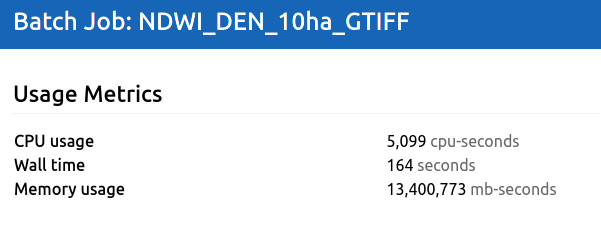

# Credit Usage
To access openEO functionalities, users are required to have a subscription. 
Initially, users are provided with a set of free credits, enabling them to explore the capabilities of openEO. 
Additional information on locating your credits or requesting more can be found on the [openEO Algorithm Plaza](../../Applications/AlgorithmPlaza.qmd) page.

Currently, credits can be deducted based on:

* CPU usage (cores/second)
* Memory usage (GB/second)
* Storage (GB/day)
* Data access to specific layers (e.g. Sentinel Hub or commercial)
* Usage of services contributed by third parties, through an 'added value' cost (e.g. per hectare)

For example, let's say we compute a Sentinel-2 based NDWI for an area of 10 hectares to a series of GeoTiffs (one per observation). 
When running this example, the batch job reports the usage, which can be seen in the [OpenEO Web Editor](https://openeo.dataspace.copernicus.eu/) by clicking the  button for an individual batch job:

Usage metrics shown in the OpenEO Web Editor for an example batch job:

* 13,400,773 mb-seconds corresponds to 3.64 GB hours or 3.64 credits 
* 5099 CPU seconds corresponds to 1.4 CPU hour which translates to 2.12 credits
  
Summing this up, we arrive at 5.76 credits. In the current free tier, you receive 4000 credits, which amounts to quite a few of jobs like this! 
It is important to note however that resource consumption (CPU and memory in this case) is not fixed over time because the performance characteristics of a particular cloud tends to fluctuate depending on overall load. 
Cloud providers do try to avoid this, but in general only manage to do so within the limits of a given SLA.

## Estimating resource usage
Often you want to know up front what kind of costs you will incur by using opeEO, especially when generating larger results or running the same job at fixed times. 
This is not trivial to do without actually running your job, because the resource consumption heavily depends on the exact combination of processes that you are using.

Hence, the way to estimate job usage is to start small. 
For instance, for a query on 10m resolution, you may want to start with a 10ha area, and simply run that job. 
As shown above, this will usually incur a cost of only a few cents. 
In the worst case, you might discover that this already costs a few euros, but then you would also notice that your job is taking multiple hours to run.

In any case, once you've established an initial cost for a small area, you can extrapolate to a larger area. 
If simple linear extrapolation shows that a larger job is affordable, then run the job on larger areas, like 50ha or up to 100x100km. 
This will show you how your job scales, and what kind of costs you will be incurring! 
If at any point the cost appears unreasonable, don't hesitate reaching out on our [forum](https://forum.dataspace.copernicus.eu/) or [helpdesk](https://helpcenter.dataspace.copernicus.eu/hc/en-gb)!

For more comprehensive guidelines on large-scale processing, please refer to our documentation [here](./large_scale_processing.qmd).