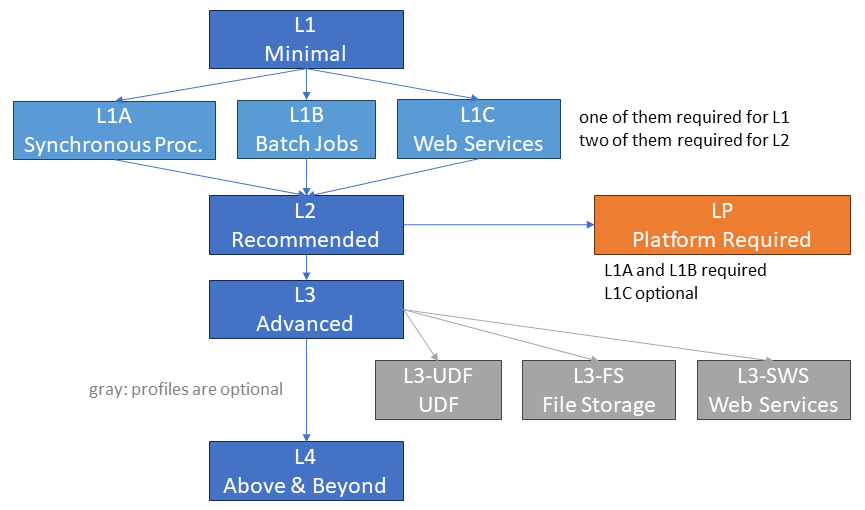

# Federation API

The general contract is the [openEO API](https://api.openeo.org) in the latest stable version of the 1.x branch.

The aggregator that proxies the back-ends in the federation also implements the same API, but it also implements the "Federation Extension" (currently in draft state).

## Profiles

In addition to the general openEO API specification and their [API Profiles](https://openeo.org/documentation/1.0/developers/profiles/api.html),
openEO Platform requires to implement an additional API profile:
*LP: Required for openEO Platform*, which requires the openEO profile *L2: Recommended*.
The requirement to implement two of *L1A*, *L1B*, and *L1C* has been restricted for openEO Platform to always require *L1A: Synchronous Processing* and *L1B: Batch Jobs* (see req. no. 703). This means that *L1C: Secondary Web Services* is optional.

<figure>
    
    <figcaption>An overview of the openEO and openEO Platform API profiles.</figcaption>
</figure>

### LP: Required for openEO Platform

The profile only lists requirements that are not covered by the openEO profile *L2: Recommended* yet.

#### API fundamentals

| # | Functionality | Description |
| -- | -- | -- |
| 14 | All > Billing | Supports the openEO Platform credit system |

#### File Formats

| # | Functionality | Description |
| -- | -- | -- |
| 45 | `GET /file_formats` | File format names and parameters aligned with openEO Platform as defined for the pre-defined [file formats](./fileformats.md) |

#### Other

| # | Functionality | Description |
| -- | -- | -- |
| 90 | `GET /health` | Returns 2XX or 5XX http status code (without authentication) |

#### Auth

| # | Functionality | Description |
| -- | -- | -- |
| 113 | `GET /credentials/oidc` | Supports EGI as identity provider (including tokens) |
| 118 | `GET /credentials/oidc` | Supports the required entitlements of the vo.openeo.cloud virtual organization, especially the claim eduperson_entitlement |

For more details about [Authentication and Authorization](#authentication-and-authorization), please see the corresponding chapters below.

#### Pre-defined Processes

| # | Functionality | Description |
| -- | -- | -- |
| 205 | `GET /processes` > processes | All processes are valid according to the specification (id, description, parameters, returns are required) |
| 208 | `GET /processes` > processes | Processes are marked as experimental or deprecated if applicable |

#### Collections

| # | Functionality | Description |
| -- | -- | -- |
| 311 | `GET /collections` > collections | Collections are marked as experimental or deprecated if applicable |
| 324 | `GET /collections/{id}` > id | IDs follow the openEO Platform naming convention |
| 327 | `GET /collections/{id}` > providers | Each collection needs to expose the backend offering the data |

#### Data Processing

| # | Functionality | Description |
| -- | -- | -- |
| 703 |  | Batch jobs and synchronous processing are implemented (secondary web services are optional) |
| 704 |  | Time after which batch job results get automatically deleted: 90 days or later |
| 705 |  | Time after which batch job metadata gets automatically deleted: 1 year or later |

#### Batch Jobs > Results

| # | Functionality | Description |
| -- | -- | -- |
| 873 | `GET /jobs/{id}/results` > public access link | Default expiry time of the signed URLs for results: 7 days |

#### Synchronous Processing

| # | Functionality | Description |
| -- | -- | -- |
| 920 | `POST /result` > timeout | The timeout for synchronous calls is: 5 minutes |

## Authentication and authorization

Authentication is performed via the CDSE OIDC provider.

### Credits

The second criterium for authorization is based on credits that are available to a user. Credits allow the platform to limit the volume of data access and processing operations that a user can perform during a given time frame. The amount of available credits depends on the subscription.
When the credit balance of a user goes below zero, processing operations can be blocked.

### Aggregator rules

Based on the subscription and available credits, the aggregator can implement these rules:

1. Credit checks to block starting of batch jobs, synchronous requests to /result and viewing services.
2. Rate limiting (TBD)

### Backend rules

Some authorization rules will need to be enforced by the backends themselves:

1. Basic access and access to user specific resources based on subscription role.
2. Number of concurrent batch jobs
3. Available processing resources, batch job priorities
4. Batch job result data volume
5. Access to restricted collections
