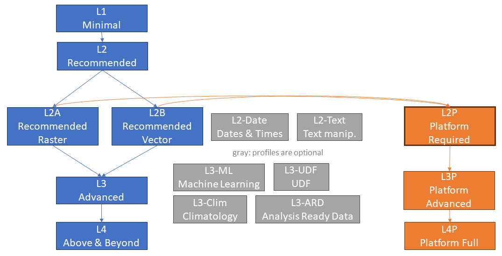

# Processes

The openEO project defines a large number of processes, which can be found at <https://processes.openeo.org>.
Due to the number of processes, we need to define a profile (i.e. a subset of processes) that must be implemented on each back-end so that a certain level of interoperability can be achieved.

In addition to the general openEO Processes specification and their [Processes Profiles](https://openeo.org/documentation/1.0/developers/profiles/processes.html),
the CDSE openEO federation requires to implement an additional Process profile:
*L2P: Required - openEO*, which requires one of the openEO profiles *L2A: Recommended (Raster)* or *L2B: Recommended (Vector)*.
There are two additional openEO Platform specific profiles with additional requirements: *L3P: Advanced - openEO * and *L4P: Complete - openEO Platform*.

<figure>
    
    <figcaption>An overview of the openEO and CDSE openEO Federation Processes profiles.</figcaption>
</figure>

### Requirements per Profile

The profiles below only lists requirements that are not covered by the corresponding openEO profiles yet.

Although in the openEO Profiles experimental processes shall only lead to a "warning", experimental processes in profiles that *L2P* depends on are required to be available (which currently are `inspect` and `nan`).

## L2P: Required - openEO federation

Requires [openEO Profile L2: Recommended](https://openeo.org/documentation/1.0/developers/profiles/processes.html#l2-recommended) and additionally:

- **`add_dimension`**
  - has been tested on > 100x100km at 10m resolution (or equivalent)
- **`aggregate_spatial`**
  - has been tested on > 100x100km at 10m resolution (or equivalent)
- **`aggregate_temporal`**
  - has been tested on > 100x100km at 10m resolution (or equivalent)
- **`aggregate_temporal_period`**
  - has been tested on > 100x100km at 10m resolution (or equivalent)
- **`apply`**
  - has been tested on > 100x100km at 10m resolution (or equivalent)
- **`apply_dimension`**
  - has been tested on > 100x100km at 10m resolution (or equivalent)
- **`apply_kernel`**
  - has been tested on > 100x100km at 10m resolution (or equivalent)
- **`array_contains`**
- **`dimension_labels`**
  - has been tested on > 100x100km at 10m resolution (or equivalent)
- **`drop_dimension`**
  - has been tested on > 100x100km at 10m resolution (or equivalent)
- **`filter_bands`**
  - has been tested on > 100x100km at 10m resolution (or equivalent)
- **`filter_bbox`**
  - has been tested on > 100x100km at 10m resolution (or equivalent)
- **`filter_spatial`**
  - has been tested on > 100x100km at 10m resolution (or equivalent)
- **`filter_temporal`**
  - has been tested on > 100x100km at 10m resolution (or equivalent)
- **`load_collection`**
  - has been tested on > 100x100km at 10m resolution (or equivalent)
- **`mask`**
  - has been tested on > 100x100km at 10m resolution (or equivalent)
- **`mask_polygon`**
  - has been tested on > 100x100km at 10m resolution (or equivalent)
- **`merge_cubes`**
  - has been tested on > 100x100km at 10m resolution (or equivalent)
- **`ndvi`**
  - has been tested on > 100x100km at 10m resolution (or equivalent)
- **`reduce_dimension`**
  - has been tested on > 100x100km at 10m resolution (or equivalent)
- **`rename_dimension`**
  - has been tested on > 100x100km at 10m resolution (or equivalent)
- **`rename_labels`**
  - has been tested on > 100x100km at 10m resolution (or equivalent)
- **`resample_cube_spatial`**
  - has been tested on > 100x100km at 10m resolution (or equivalent)
- **`resample_spatial`**
  - has been tested on > 100x100km at 10m resolution (or equivalent)
- **`save_result`**
  - has been tested on > 100x100km at 10m resolution (or equivalent)

## L3P: Advanced - openEO Federation

Requires [openEO Profile L3: Advanced](https://openeo.org/documentation/1.0/developers/profiles/processes.html#l3-advanced) and additionally:

- **`apply_neighborhood`**
  - has been tested on > 100x100km at 10m resolution (or equivalent)
- **`ard_surface_reflectance`** (experimental)
  - has been tested on > 100x100km at 10m resolution (or equivalent)
- **`filter_labels`** (experimental)
  - has been tested on > 100x100km at 10m resolution (or equivalent)
- **`load_stac (load_result)`** (experimental)
  - has been tested on > 100x100km at 10m resolution (or equivalent)
- **`reduce_spatial`** (experimental)
  - has been tested on > 100x100km at 10m resolution (or equivalent)
- **`resample_cube_temporal`**
  - has been tested on > 100x100km at 10m resolution (or equivalent)
- **`run_udf`**
  - has been tested on > 100x100km at 10m resolution (or equivalent)

## L4P: Complete - openEO Federation

Requires [openEO Profile L4: Above and Beyond](https://openeo.org/documentation/1.0/developers/profiles/processes.html#l4-above-and-beyond) and additionally:

- **`atmospheric_correction`** (experimental)
  - has been tested on > 100x100km at 10m resolution (or equivalent)
- **`load_uploaded_files`** (experimental)
  - has been tested on > 100x100km at 10m resolution (or equivalent)
- **`load_url`** (experimental)
  - has been tested on > 100x100km at 10m resolution (or equivalent)
- **`sar_backscatter`** (experimental)
  - has been tested on > 100x100km at 10m resolution (or equivalent)