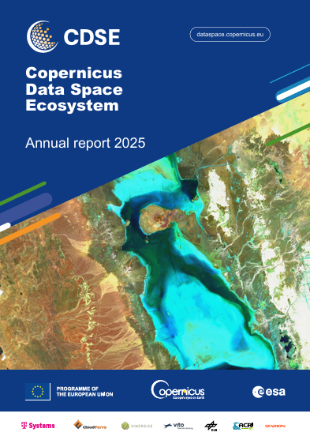

The Copernicus Data Space Ecosystem (CDSE) proudly presents its Annual Reports, showcasing the ecosystem’s growth, key achievements, and impact each year.

::: {layout-ncol="3"}

:::

## Past Data Access Annual Reports

Sentinel Data Access Annual Reports have been published yearly since the start of Copernicus operations in October 2014 and are listed below with links to the documents.

| Year | Document ID | Title | Format | Link |
|--|------------------|------------------------------------|--|--|
| 2023 | COPE-SRCO-RP-2400521  | Sentinel Data Access Annual Report 2023 | PDF | [View](https://sentiwiki.copernicus.eu/__attachments/a_d215d6fb6f71481265881301f081ae18c51ecd1225c824e85147598be786b8fa/COPE-SRCO-RP-2400521%20-%20Sentinel%20Data%20Access%20Annual%20Report%202023%20-%201.1.pdf){target="_blank"} |
| 2022 | COPE-SERCO-RP-23-1493 | Sentinel Data Access Annual Report 2022 | PDF | [View](https://sentiwiki.copernicus.eu/__attachments/a_8a85fd5c1880e3bee614cde9e526a0190d6720dbbfe1a5fe8633a3a9d2f5a8e2/COPE-SERCO-RP-23-1493%20-%20Sentinel%20Data%20Access%20Annual%20Report%202022%20-%201.0.pdf){target="_blank"}  |
| 2021 | COPE-SERCO-RP-22-1312 | Sentinel Data Access Annual Report 2021 | PDF | [View](https://sentiwiki.copernicus.eu/__attachments/a_c37e33e6f29ddc0db2b80d2e769368ad3ddb220fa3e3392a29f9c37f8bcc5d01/COPE-SERCO-RP-22-1312%20-%20Sentinel%20Data%20Access%20Annual%20Report%202021%20-%201.1.pdf){target="_blank"}  |
| 2020 | COPE-SERCO-RP-21-1141 | Sentinel Data Access Annual Report 2020 | PDF | [View](https://sentiwiki.copernicus.eu/__attachments/a_545cd0dee4a29d13be262762dfd01e4f96c7a6d08b19854e9bcbc2f0d13eb8f9/COPE-SERCO-RP-21-1141%20-%20Sentinel%20Data%20Access%20Annual%20Report%202020%20-%202.3.pdf){target="_blank"}  |
| 2019 | COPE-SERCO-RP-20-0570 | Sentinel Data Access Annual Report 2019 | PDF | [View](https://sentiwiki.copernicus.eu/__attachments/a_e37b21eca4da7db1109f54e9ad7ab4dfe8e73032db3235bcbe0b07ece9007890/COPE-SERCO-RP-20-0570%20-%20Sentinel%20Data%20Access%20Annual%20Report%202019%20-%201.0.pdf){target="_blank"}  |
| 2018 | COPE-SERCO-RP-19-0389 | Sentinel Data Access Annual Report 2018 | PDF | [View](https://sentiwiki.copernicus.eu/__attachments/a_0a624ef4fcb8f4c8360730ade6658cace43eb51299569599ec974d50eb86106a/COPE-SERCO-RP-19-0389%20-%20Sentinel%20Data%20Access%20Annual%20Report%202018%20-%201.0.pdf){target="_blank"}  |
| 2017 | COPE-SERCO-RP-17-0186 | Sentinel Data Access Annual Report 2017 | PDF | [View](https://sentiwiki.copernicus.eu/__attachments/a_3f0bb822ec3a81932aea612cdd7bea42acf03080b5fd653911ed2e6cdd93520b/COPE-SERCO-RP-17-0186%20-%20Sentinel%20Data%20Access%20Annual%20Report%202017%20-%201.4.pdf){target="_blank"}  |
| 2016 |COPE-SERCO-RP-17-0071  | Sentinel Data Access Annual Report 2016 | PDF | [View](https://sentiwiki.copernicus.eu/__attachments/a_5c3f0938c06a7fc79ec80f184a5f53764b8308b3f099a4c3d118519c30e80ba9/COPE-SERCO-RP-17-0071%20-%20Sentinel%20Data%20Access%20Annual%20Report%202016%20-%201.1.pdf){target="_blank"}  |
| 2015 | SPA-COPE-ENG-RP-066   | Sentinel Data Access Annual Report 2015 | PDF | [View](https://sentiwiki.copernicus.eu/__attachments/a_ecd27f15406e5c94eb72c3d19a8a9350dca3f212a7cbfc7241689b2dcafcea23/SPA-COPE-ENG-RP-066%20-%20Sentinels%20Data%20Access%20Annual%20Report%202015%20-%201.1.pdf){target="_blank"}  |

