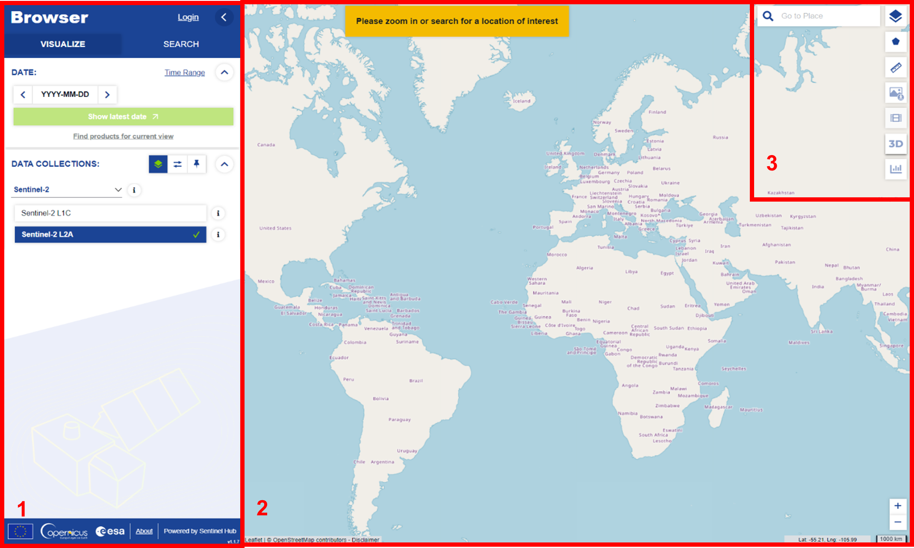
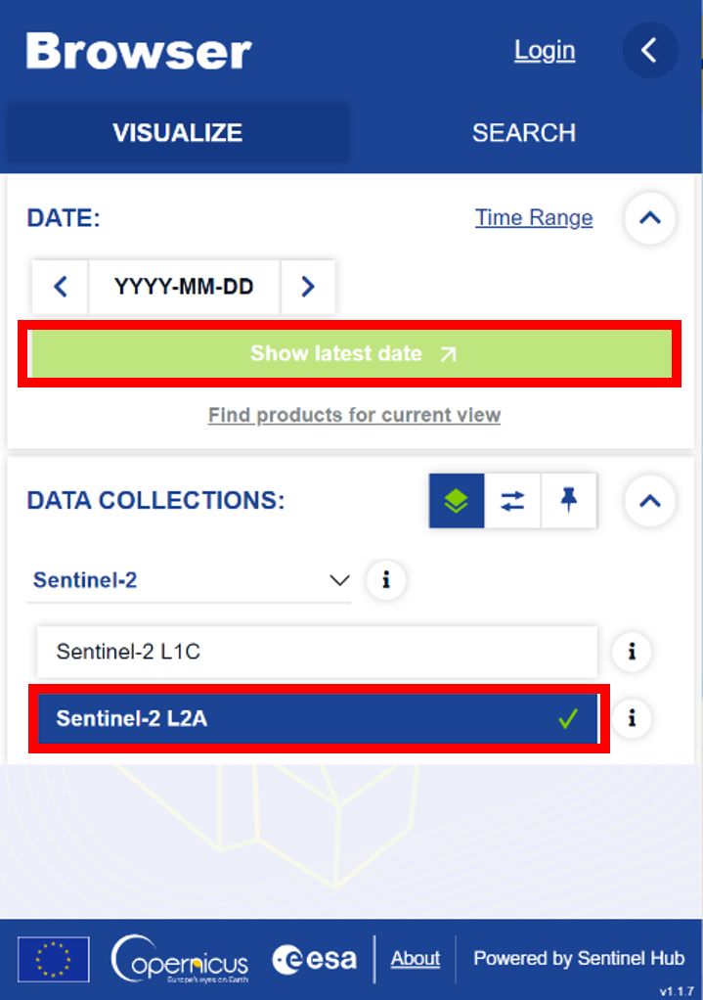
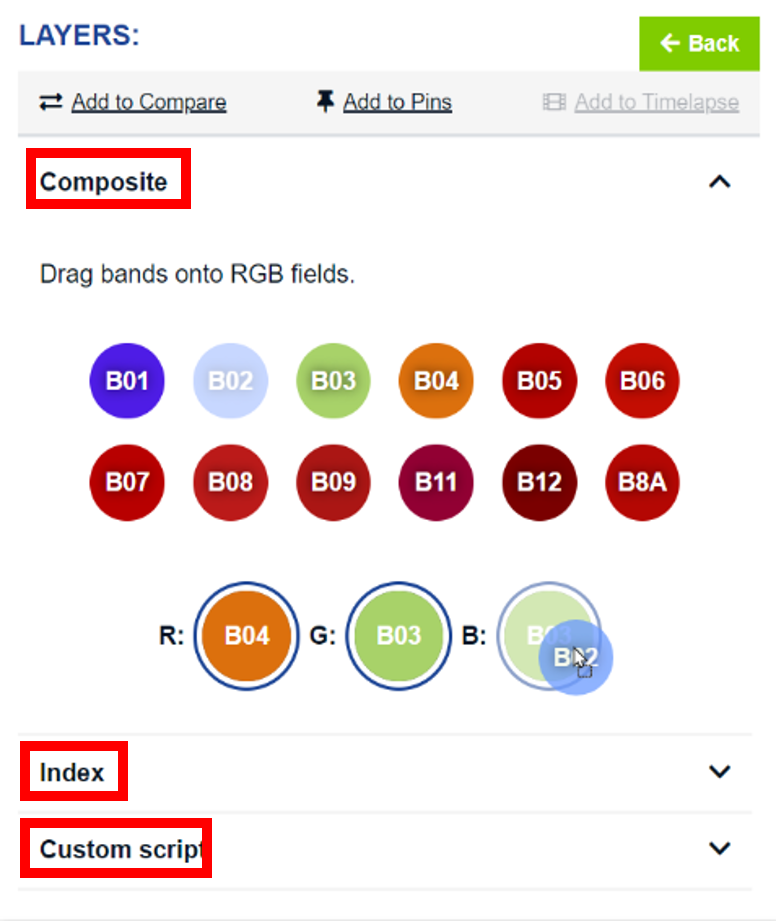
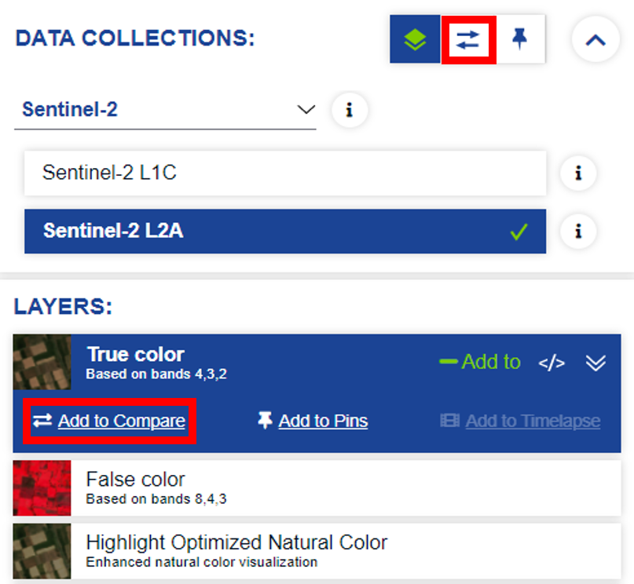
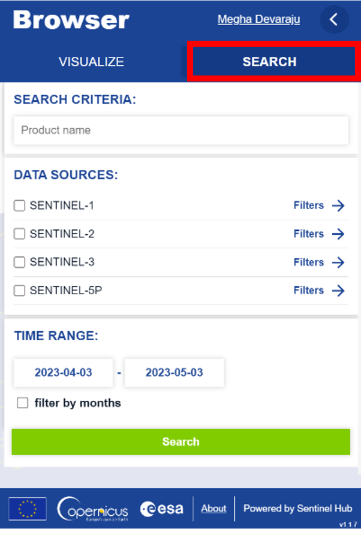
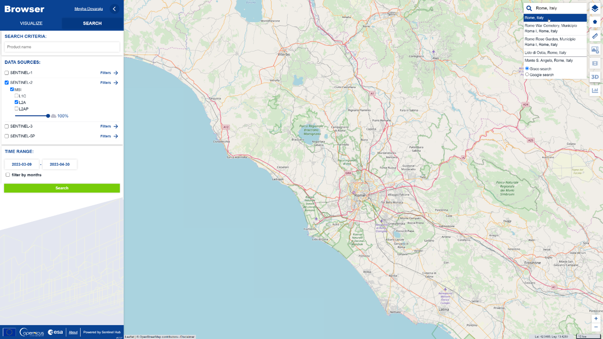

## About the Browser

The Browser is a web browser application that allows you to easily search, visualize, modify and download imagery from the Sentinel satellites. You can access the Browser at:

[https://dataspace.copernicus.eu/browser/](https://dataspace.copernicus.eu/browser/)

Currently you need a free account to use the Browser. To register for a free account, click [here](https://identity.cloudferro.com/auth/realms/CDSE/protocol/openid-connect/auth?client_id=sh-5f8b630b-b083-49ed-b340-b8f01ecb81c4&redirect_uri=https%3A%2F%2Fdataspace.copernicus.eu%2Fbrowser%2FoauthCallback.html&response_type=token&state=) to the browser. A new window will open where you can click on **New user? Click [here](https://identity.cloudferro.com/auth/realms/CDSE/login-actions/registration?client_id=sh-5f8b630b-b083-49ed-b340-b8f01ecb81c4&tab_id=kuySlol9oac) to create an account and access the data**. Once you have created the account, you will automatically be logged in to the Browser. Remember to save your login credentials for the next time you want to log in to the Browser.

{#fig-startscreen}

The Browser window is divided into three parts:

 1. The sidebar on the left side of the screen. Here you can set the parameters to search for, visualize and download data.
 2. The map in the middle of the screen. Here you can zoom in and out and move around to find the place you are interest in. In this area you will see visualized satellite imagery or geometries of the products, that are the result of your search.
 3. The toolbar on the right side of the screen. Here you find various tools (e.g., for measuring or downloading images) with which you can work with the data displayed on the map.
   

## Visualizing data

You can find the *VISUALIZE* tab in the upper left corner of the sidebar (selected by default). The *VISUALIZE* tab will allow you to easily visualize satellite imagery on the map. Change or modify your visualization with just a few clicks.

### Visualizing data
In order to visualize data on the map, you need to zoom in to your area of interest. You can do this either with the mouse wheel or with the location search in the upper right corner.

Let's try to visualize the latest Sentinel-2 L2A imagery over Italy.

1. Either zoom to Italy with the mouse wheel or type *Italy* in the search box in the upper right corner.
2. In the sidebar, a maximum cloud coverage of 30% and the product type Sentinel-2 L2A are already preselected. To visualize the latest available data with cloud coverage below 30% click on the *Show latest date* button.
<!--  -->

    {#fig-2 width=350}

    Fig 2: VISUALIZE tab with *show latest date button* and *Sentinel-2 L2A* collection highlighted

You can now see the latest data over Italy on the map. Depending on the latest data available you will see data from one or more orbits (stripes of images on the map).

#### Modifying and Changing a Visualization

If you want to improve how the data is displayed on the map, you can modify the visualization by clicking on *Show effects and advanced options* at the bottom of the sidebar. Change the *Gain/Gamma* values, the values of the *R/G/B* colour channels, specify which sampling method is used for the visualization *(Layer default, Bilinear, Bicubic, Nearest)* or click on _Reset_ to reset all changes made. To return to the visualization layers overview, click on *Show visualizations*.

To visualize different Sentinel-2 band combinations, either use one of the prepared options from the list of layers (e.g., NDVI for the Normalized Difference Vegetation Index using the Sentinel bands B4 and B8) or click *Custom* at the bottom of the layers list.

Fig 3: *Custom* Layers option with *Composite Index and Custom* script highlighted

Here you can create a custom *R/G/B* composite or _Index_ (band ratio, normalized difference index) by dragging and dropping the Sentinel-2 bands into the appropriate circles or use the _Custom script_ functionality to insert a piece of JavaScript code.

#### Comparing Visualizations

To compare two (or more) visualizations you must add them to the compare panel. You can add a visualization to the compare panel by clicking on the *Add to compare* button in each visualization layer *(see Fig. 4)*. When you have added all the layers you want to compare to the compare panel, you can switch to it by clicking on the compare icon (  ). In the compare panel you can choose between a *Split* and an *Opacity* mode. With the *Split* mode you can compare two images side by side. With the *Opacity* mode you can compare two (or more) visualizations on top of each other.

Fig 4: *Add to compare* and compare icon

### Product Search for Current Visualization

When you are visualizing data (chapter Visualizing data), you can easily find the products associated with the data you see on the map. The product allows you to inspect the full metadata and easily download the raw data. To find connected products, just click the *Find products for current view* button in the sidebar (under the *Show latest date* button).

Fig 5: *Add to compare* and compare icon

## Product Search

With the product search you can find products from four Sentinel missions (Sentinel-1, Sentinel-2, Sentinel-3, Sentinel-5p) and the sensors on board these satellites (C-SAR, MSI, OLCI, SRAL, SLSTR, SYNERGY). You can explore the metadata for each of those products, download the raw data or visualize the data on the map (currently only Sentinel-2 L1C and L2A are supported, but more data sources will be supported here in the future).

The *SEARCH* tab is located in the sidebar next to the *VISUALIZE* tab (see Fig. 6).

Fig 6: *SEARCH* tab with different *Data Sources, Time range and Search* button

### How to find a Product

To find products you can either use the keyword search (text input) or select one or more data sources using the checkboxes. To find products for a specific time range only, set the from/to date in the date input boxes. For example, let us find the latest Sentinel-2 L2A image over Italy for the beginning of 2023.

   1. Zoom in on Italy on the map with the scroll wheel of your mouse.
   2. Select Sentinel-2 \> MSI (selected by default) \> L2A.
   3. Set the Time Range to reflect two weeks (e.g., 2023-01-02, 2023-01-16)

Fig. 7: *SEARCH* tab with L2A collection selected and map centred on Rome (Italy)

   4. Press the _Search_ button

You will now see the first 50 search results for your search settings (Sentinel L2A data over Italy for a time range of 2 weeks) in the sidebar and on the map. To load the next 50 results, click on the _Load more_ button at the end of the list in the sidebar. You can view the metadata of a product in the sidebar or by selecting a product on the map. In both cases you can:

* Directly view the basic metadata (preview image (available for most Sentinel-2 L1C, L2A, Sentinel-3 SLSTR and Sentinel-3 OLCI products), name, mission, instrument, acquisition time)
* View the full metadata by clicking on the product info button ( ) in the results (full metadata)

### How to download a Product

When you have found a product (see How to find a Product) that you would like to download, you can do so by clicking click on the download icon (  ) for the desired product in the results (in the sidebar or in the results panel on the map after selecting a product). After you click the button, a progress bar will appear below the product to indicate the status of your download. If you have started a download by mistake, you can cancel it by clicking on the "x" below the download button.

You can continue to use the app as normal while a product is being downloaded.

Fig. 8: Product download (in progress) with Download product and cancel button highlighted

## Tools

The Browser has several tools to help you better understand the data on the map and prepare it for sharing with others. These tools can be found in the upper right corner of the Browser. They can help you select the Area of Interest, measure, download the image, create a timelapse if you want to observe the area over a longer period of time, or analyse the statistics of an index (e.g., the NDVI).

### Area/Point of Interest

Use the **Area of Interest (AOI)** tool to draw a rectangular or polygonal area of interest by clicking on the  icon in the upper right corner of the browser. You can also upload a KML/KMZ, GPX, WKT (in EPSG:4326) or GEOJSON/JSON file to create an area of interest.

Use the  icon to mark a location and re-centre to the **Point of Interest(PoI)**

### Measure

You can use the **Measure** tool by clicking on the  icon to get the distance and area measurements. To measure the distance between two points, simply click on the start and end points on the map, to measure the area, draw a polygon (areas can also be measured using the AOI drawing, as described in Area/Point of Interest).

### Image Download

There are three different download options. You can switch between the options using the tabs at the top of the pop-up window. Each option contains a preview of the data at the bottom. When you are satisfied with your download settings, you will find the  button below the preview:

* **Basic**
  - You can use the *Show Captions* toggle switch to add data source, date, zoom scale and branding information to the exported images.
  - You can also use the *Add Map Overlays* toggle switch to add place labels, streets and political boundaries to the image or the *Show Legend* toggle switch to add the legend data.
  - You can use the *Crop to AOI* toggle switch to crop the image to the bounds of area of interest, if drawn previously.
  - If you want to download the entire image but highlight the AOI, it can be done by enabling the *Draw AOI Geometry*.
  - Use the textbox to add a short description to the exported image.
  - Choose between two image formats (JPG, PNG).
  - A preview of the image that will be downloaded is displayed under *Preview*. Previews are available only when you zoom in enough.
* **Analytical**
  - After preparing the data for download, click the  button to download the image in JPG, PNG, KMZ or GeoTIFF format.
  - Choose between different image formats, resolutions and coordinate systems before downloading the image. You can also attach a logo.
  - In the Analytical panel, you can select multiple layers (Visualized/Raw) and download them all in a single ZIP file.
- **High-res print**
  - Prepare the selected visual for high-resolution printing by manually selecting a format, size and DPI. Add captions, legends and descriptions as needed.

### Timelapse

- You can create a **Timelapse Animation** by clicking the  icon.
- Select the Area of Interest by zooming in or out. When you are satisfied with the scene, click on the play button in the middle of the screen for more options.
- Select the time span in the upper left corner of the pop-up window. Alternatively, you can select only certain months in a year using the *filter by months* option. You can also select the interval between images. Click on *Search* to see all the results.
- You can filter the images by two methods: Minimum tile coverage and Maximum Cloud coverage. You can select the percentage of cover for each of those filters by adjusting the slider.
- You can either select all the images or choose the images manually. Once you have the list of images you want to display in the timelapse, select the speed, and transition to prepare your timelapse.
- Download the video by clicking on the *Download* button.

#### Histogram

With the **Histogram** tool you can display statistical data (the distribution of values) for specific layers by clicking on the  icon. The histogram is calculated for the data within your AOI, if defined or otherwise for the whole screen. This tool currently only works for index layers (e.g., the NDVI).
