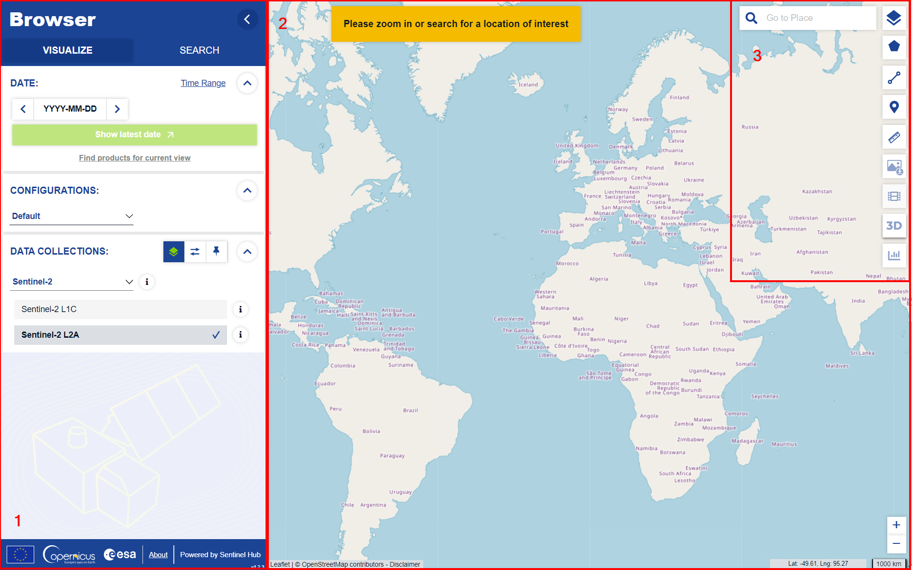
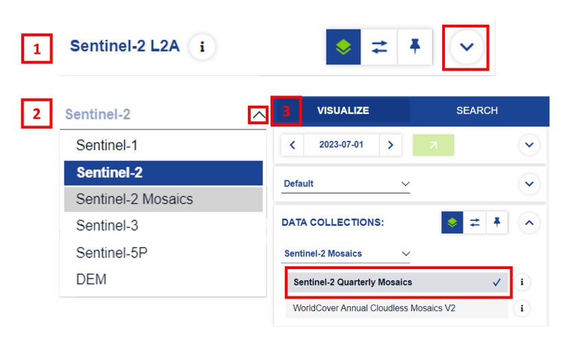
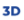
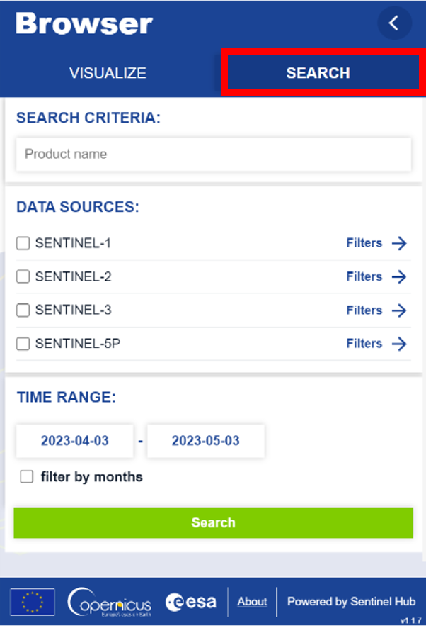
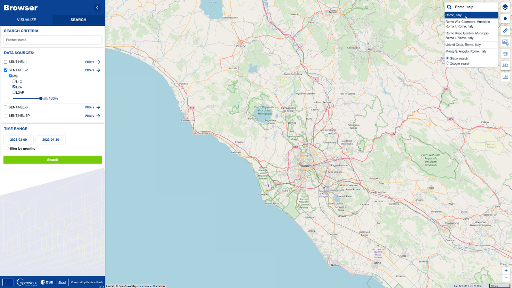
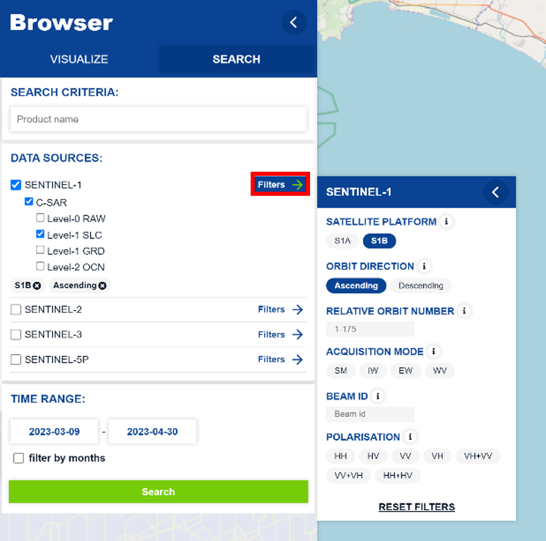
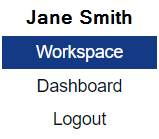
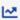
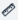

## About the Browser

The Browser is a web browser application that allows you to easily search, visualize, modify and download imagery from the Sentinel satellites. You can access the Browser at:

[https://dataspace.copernicus.eu/browser/](https://dataspace.copernicus.eu/browser/){target="_blank"}

Currently you need a free account to use the Browser. To register for a free account, click [here](https://identity.cloudferro.com/auth/realms/CDSE/protocol/openid-connect/auth?client_id=sh-5f8b630b-b083-49ed-b340-b8f01ecb81c4&redirect_uri=https%3A%2F%2Fdataspace.copernicus.eu%2Fbrowser%2FoauthCallback.html&response_type=token&state=) to the browser. A new window will open where you can click on **New user? Click [here](https://identity.cloudferro.com/auth/realms/CDSE/login-actions/registration?client_id=sh-5f8b630b-b083-49ed-b340-b8f01ecb81c4&tab_id=kuySlol9oac){target="_blank"} to create an account and access the data**. Once you have created the account, you will automatically be logged in to the Browser. Remember to save your login credentials for the next time you want to log in to the Browser. The Copernicus Browser is also available in multiple languages. 

Fig 1: Browser start screen

The Browser window is divided into three parts:

 1. The sidebar on the left side of the screen. Here you can set the parameters to search for, visualize and download data.
 2. The map in the middle of the screen. Here you can zoom in and out and move around to find the place you are interest in. In this area you will see visualized satellite imagery or geometries of the products, that are the result of your search.
 3. The toolbar on the right side of the screen. Here you find various tools (e.g., for measuring or downloading images) with which you can work with the data displayed on the map.
   

## Visualization

You can find the *VISUALIZE* tab in the upper left corner of the sidebar (selected by default). The *VISUALIZE* tab will allow you to easily visualize satellite imagery on the map. Change or modify your visualization with just a few clicks.

### Visualizing data
In order to visualize data on the map, you need to zoom in to your area of interest. You can do this either with the mouse wheel or with the location search in the upper right corner.

Let's try to visualize the latest Sentinel-2 L2A imagery over Italy.

1. Either zoom to Italy with the mouse wheel or type *Italy* in the search box in the upper right corner.
2. In the sidebar, a maximum cloud coverage of 30% and the product type Sentinel-2 L2A are already preselected. To visualize the latest available data with cloud coverage below 30% click on the *Show latest date* button.

Fig 2: VISUALIZE tab with *show latest date button* and *Sentinel-2 L2A* collection highlighted

You can now see the latest data over Italy on the map. Depending on the latest data available you will see data from one or more orbits (stripes of images on the map).

#### Modifying and Changing a Visualization

If you want to improve how the data is displayed on the map, you can modify the visualization by clicking on *Show effects and advanced options* at the bottom of the sidebar. Change the *Gain/Gamma* values, the values of the *R/G/B* colour channels, specify which sampling method is used for the visualization *(Layer default, Bilinear, Bicubic, Nearest)* or click on _Reset_ to reset all changes made. To return to the visualization layers overview, click on *Show visualizations*.

To visualize different Sentinel-2 band combinations, either use one of the prepared options from the list of layers (e.g., NDVI for the Normalized Difference Vegetation Index using the Sentinel bands B4 and B8) or click *Custom* at the bottom of the layers list.

Fig 3: *Custom* Layers option with *Composite Index and Custom* script highlighted

Here you can create a custom *R/G/B* composite or _Index_ (band ratio, normalized difference index) by dragging and dropping the Sentinel-2 bands into the appropriate circles or use the _Custom script_ functionality to insert a piece of JavaScript code.

#### Changing Configurations

You can change the configuration to create your own layers and visualizations. A configuration instance acts as a separate WMS/WMTS/WFS/WCS service and each can be configured to provide a certain set of layers with different settings. It is therefore possible to create multiple configuration instances, each providing a different set of layers for different needs. The configuration instances can contain any number of layers that can be configured with the settings defined above, e.g., cloud coverage, time range, etc. Each visualizations is based on a predefined visualization option or a custom script. The configuration instance itself also has some global settings for default values on all layers, suach as image quality. 

You can create your own configuration by accessing the Dashboard via the drop-down menu under your username or directly [here](https://shapps.dataspace.copernicus.eu/dashboard/). In the panel on the left you will find "Configuration Utility" where you can create, modify and delete your instances. Once you have created a configuration, you can open it in the Copernicus Browser. Alternatively, you can change the configurations directly in the Copernicus Browser by selecting your configuration from the drop-down menu as shown in the figure.

Fig 4: Changing the Configuration in Copernicus Browser

#### Changing the Data Collection

You can switch visualizing between different data collections by clicking on the arrow next to the Data Collections section in the Visualization tab. Once you click on the arrow as seen in Fig. 4, you will be able to see a drop-down menu with a list of the satellite data that is available. Let us try to visualize Sentinel-2 Quarterly Mosaics data of the same location and date as that of the Sentinel-2 data in Visualizing data section.

1. Click on the drop-down arrow on the right next to Pins icon. 
2. Click on the drop-down arrow next to Sentinel-2 and select Sentinel-2 Mosaics. You will get two options to choose from because there are Quarterly and Annual Mosaics available. Choose `Sentinel-2 Quarterly Mosaics`. 
3. You will get two options to choose from because there are Quarterly and Annual Mosaics available. Choose `Sentinel-2 Quarterly Mosaics` to visualise the Sentinel-2 cloudless mosaics created for each quarter of 2023.

You can now see the latest Sentinel-2 Quarterly Mosaic.

At the moment, the Data Collections available for visualization are Sentinel-1 (SW, IW and EW mode), Sentinel-2 (L1C and L2A), Sentinel-2 Mosaics (Quarterly Mosaics for 2023 and WorldCover Annual Cloudless Mosaics for 2020 and 2021), Sentinel-3 (OLCI Level-1 EFT, SLSTR Level-1 RBT), Sentinel-5P and two Digital Elevation Models (Copernicus 30, Copernicus 90).

Fig 5: Changing *Data Collection* from *Visualization* tab directly

#### Comparing Visualizations

To compare two (or more) visualizations you must add them to the compare panel. You can add a visualization to the compare panel by clicking on the *Add to compare* button in each visualization layer *(see Fig. 4)*. When you have added all the layers you want to compare to the compare panel, you can switch to it by clicking on the compare icon (  ). In the compare panel you can choose between a *Split* and an *Opacity* mode. With the *Split* mode you can compare two images side by side. With the *Opacity* mode you can compare two (or more) visualizations on top of each other.

Fig 6: *Add to compare* and compare icon

#### Saving Pins

To save a visualization for future viewing, you can save it as a pin by clicking on ( ) next to the Layer name and clicking on *Add to Pins*. You can find the saved pins by clicking on the ( ) icon. If you wish to compare saved pins, you can add them to the compare panel as explained in the previous section. If you have multiple pins saved and want to compare them altogether, you can directly go to the compare panel and add all the pins to compare by clicking on ( ). Another feature of the Browser is that you can export pins as a JSON file and import previously exported pins as well.

Fig 7: *Add to pins* and Pins icon

### Product Search for Current Visualization

When you are visualizing data (chapter Visualizing data), you can easily find the products associated with the data you see on the map. The product allows you to inspect the full metadata and easily download the raw data. To find connected products, just click the *Find products for current view* button in the sidebar (under the *Show latest date* button).

Fig 8: *Find products for current view* button position in the sidebar.

### 3D Visualization

With the 3D visualization tool, users can also visualize the terrain. To obtain a 3D visualization, you need to first select a layer to view and then click on the  icon. You can move forward, backward, left, or right by right clicking on the pan console (labelled 1 in the red box in Fig. 8) and rotate around a point by right clicking on the camera console (labelled 2 in the red box in Fig. 8). The viewing angle can be adjusted by scaling vertically and panning in all directions. You can further explore the area by adjusting the sun projected shadows and the shading parameters of the scene in the settings (labelled as box 3 and 4 respectively in Fig. 8). This 3D view can also be downloaded as a PNG or JPEG file.
Let us try visualizing Mont Blanc, the highest peak in the Alps.

1. Follow the steps mentioned in Visualizing data chapter to visualize Mont Blanc and select the “True Color” visualization.
2. Click on the  icon placed at the right of the screen.
3. You can navigate around the visualization either with your mouse, keyboard or directly on the map by following the instructions mentioned in the “Help” section (click on the ( ) icon).
4. Click on the Settings icon ( ). Set the Vertical terrain scaling to 150% by moving the slider. 
5. To adjust shadows, click on the Parameters next to Sun projected shadows toggle switch. 
6. To adjust Shading parameters, click on Edit and modify the Ambient factor, Diffuse factor, Specular factor, and Specular power.
7. You can Reset values at any point to return to the default settings. 

Fig 9: 3D visualization in the Browser with pop-up Settings windows on the right

## Product Search

With the product search you can find products from Sentinel missions (Sentinel-1, Sentinel-2, Sentinel-3, Sentinel-5p) and the sensors on board these satellites (C-SAR, MSI, OLCI, SRAL, SLSTR, SYNERGY). You can also find the engineering and Auxiliary data for Sentinel-6 along with all the missions mentioned before. You can explore the metadata for each of those products, download the raw data or visualize the data on the map (at present, Sentinel-1 GRD, Sentinel-2 L1C and L2A, Sentinel-3 OLCI L1B and SLSTR L1B, Sentinel-5P L2 and DEM data can be visualized).

The *SEARCH* tab is located in the sidebar next to the *VISUALIZE* tab (see Fig. 9).

Fig 10: *SEARCH* tab with different *Data Sources, Time range and Search* button

### How to find a Product

To find products you can either use the keyword search (text input) or select one or more data sources using the checkboxes. To find products for a specific time range only, set the from/to date in the date input boxes. For example, let us find the latest Sentinel-2 L2A image over Italy for the beginning of 2023.

   1. Zoom in on Italy on the map with the scroll wheel of your mouse.
   2. Select Sentinel-2 \> MSI (selected by default) \> L2A.
   3. Set the Time Range to reflect two weeks (e.g., 2023-01-02, 2023-01-16)
   4. Press the _Search_ button

Fig 11: *SEARCH* tab with L2A collection selected and map centred on Rome (Italy)

You will now see the first 50 search results for your search settings (Sentinel L2A data over Italy for a time range of 2 weeks) in the sidebar and on the map. To load the next 50 results, click on the _Load more_ button at the end of the list in the sidebar. You can view the metadata of a product in the sidebar or by selecting a product on the map. In both cases you can:

* Directly view the basic metadata (preview image (available for most Sentinel-2 L1C, L2A, Sentinel-3 SLSTR and Sentinel-3 OLCI products), name, mission, instrument, acquisition time)
* View the full metadata by clicking on the product info button ( ) in the results (full metadata)

#### Additional Filters

To get more suitable results, you can also select or choose additional filters as shown in Figure 11. 
1.	Select the Data Source and the appropriate instrument/ processing level.
2.	Click on the Filter button and set the filtering parameters.
3.	Press the Search button. 
Here, you can choose various parameters depending on the chosen Data Source. For example, you can see the filter parameters for Sentinel-1 in figure below, letting you filter the results based on satellite platform, orbit direction, relative orbit number, acquisition mode, Beam ID and polarization.

Fig 12: Data filters and parameters

#### Visualize the search result

Once you have found a product, you can visualize the results in two ways: either by directly selecting the viszualize button (  ) in the sidebar or by selecting the visualize button in the results panel on the map. You can open the results panel by clicking on one of the displayed tile footprints on the map.

Fig 13: Product metadata and visualize button

### How to download a Product

When you have found a product (see How to find a Product) that you would like to download, you can do so by clicking click on the download icon (  ) for the desired product in the results (in the sidebar or in the results panel on the map after selecting a product). After you click the button, a progress bar will appear below the product to indicate the status of your download. If you have started a download by mistake, you can cancel it by clicking on the "x" below the download button.

You can continue to use the app as normal while a product is being downloaded.

Fig 14: Product download (in progress) with Download product and cancel button highlighted

#### Download single files

A "product" refers to a directory containing a collection of information such as metadata, product information, the satellite image and quality data, auxiliary data and more. If downloading all of this data is not of your interest, you can opt to download single files within this directory but clicking on the single file download icon (). Depending on the product you are trying to download, you will get a list of files within the directory and the   icon next to them to download each file individually.

### Add Product to Workspace

To avoid downloading all the products, you can add the product to your workspace and give as input to your workflow on the Copernicus Dataspace Ecosystem directly. The main objective of the workspace is to:

- Further process single products (with various options to select the algorithm/processing required for your application).
- Keep track of the processed products (status, finished/queued products)

To do this, click on the Add to Workspace icon () appearing in your search result.  The workspace can be accessed by clicking on the dropdown menu under your username or directly [here](https://dataspace.copernicus.eu/workspace/).

Fig 15: User dropdown menu to access Workspace.

## Tools

The Browser has several tools to help you better understand the data on the map and prepare it for sharing with others. These tools can be found in the upper right corner of the Browser. They can help you select the Area of Interest, measure, download the image, create a timelapse if you want to observe the area over a longer period of time, or analyse the statistics of an index (e.g., the NDVI).

### Area/Point of Interest

Use the **Area of Interest (AOI)** tool to draw a rectangular or polygonal area of interest by clicking on the  icon in the upper right corner of the browser. You can also upload a KML/KMZ, GPX, WKT (in EPSG:4326) or GEOJSON/JSON file to create an AOI.

Use the  icon to mark a location and re-centre to the **Point of Interest(POI)**

Once you have selected the AOI, depending on the type of data you are looking at, you can view the spectral signature of the region using the **Spectral Explorer**() or, in case of indices, look at the change in value over time using the **Statistical Info** () feature.

### Measure

You can use the **Measure** tool by clicking on the  icon to get the distance and area measurements. To measure the distance between two points, simply click on the start and end points on the map, to measure the area, draw a polygon (areas can also be measured using the AOI drawing, as described in Area/Point of Interest).

### Image Download

There are three different download options. You can switch between the options using the tabs at the top of the pop-up window. Each option contains a preview of the data at the bottom. When you are satisfied with your download settings, you will find the  button below the preview:

* **Basic**
  - You can use the *Show Captions* toggle switch to add data source, date, zoom scale and branding information to the exported images.
  - You can also use the *Add Map Overlays* toggle switch to add place labels, streets and political boundaries to the image or the *Show Legend* toggle switch to add the legend data.
  - You can use the *Crop to AOI* toggle switch to crop the image to the bounds of area of interest, if drawn previously.
  - If you want to download the entire image but highlight the AOI, it can be done by enabling the *Draw AOI Geometry*.
  - Use the textbox to add a short description to the exported image.
  - Choose between two image formats (JPG, PNG).
  - A preview of the image that will be downloaded is displayed under *Preview*. Previews are available only when you zoom in enough.
* **Analytical**
  - After preparing the data for download, click the  button to download the image in JPG, PNG, KMZ or GeoTIFF format.
  - Choose between different image formats, resolutions and coordinate systems before downloading the image. You can also attach a logo.
  - In the Analytical panel, you can select multiple layers (Visualized/Raw) and download them all in a single ZIP file.
- **High-res print**
  - Prepare the selected visual for high-resolution printing by manually selecting a format, size and DPI. Add captions, legends and descriptions as needed.

### Timelapse

**Timelapses** are a very popular and useful tool to show how a certain location on Earth changed through time. Using the timelapse tool you can create your own visualization of changes through time and export it as .GIF or .MPEG4 to share it with others online. 
Let’s create a timelapse of the deforestation in the Brazil from 2018 – 2022.

1. Go to: https://sentinelshare.page.link/osH4 
2. Click on the timelapse icon (  ) and click on the play button in the middle of the screen. This opens a pop-up window to create a timelapse.
3. Change the settings on the left side to:
    1. Dates 2018-01-01 – 2022-12-31
    2. Select 1 image per: month
Alternatively, you can select only certain months in a year using the filter by months option. Click on Search to see all the results.
4. In the Visualizations set the Min. tile coverage to 100% and the Max. cloud coverage to 2% and manually deselect the images from the 2022-05-30 (slightly cloudy) and the 2022-09-07 (blurry).
5. Once you have the list of images you want to display in the timelapse, select the speed, and transition to prepare your timelapse.
6. Click on the play button to check the result and download the animation as a GIF-file using the Download button for further use online/offline.

Fig 16: Browser timelapse tool with settings highlighted

### Statistical Ananlysis

There are quite a lot of statistical analyses that can be done in the Browser itself. Depending on the type of data you are looking at, you can look at the distribution of the pixel values, view the spectral signature of the region using the **Spectral Explorer**() or, in case of indices, look at its change over time using the **Statistical Info** () feature. 
#### Histogram

With the **Histogram** tool you can display statistical data (the distribution of values) for specific layers by clicking on the  icon. The histogram is calculated for the data within your AOI, if defined or otherwise for the whole screen. This tool currently only works for index layers (e.g., the NDVI).

Fig. 17: Example of a distribution plot of NDVI values

#### Spectral Explorer

The **Spectral Explorer** analyses the various bands of the multi-spectral imagery to extract the spectral signature and helps to identify the scene in the region of interest. You can follow these steps to see a simple example of this feature. Note that this feature is only available for Sentinel-2 imagery at the moment.

1. Go to the [location](https://sentinelshare.page.link/C7g8) and draw a bounding box in the open water like shown in the figure.
2. Click on the **Spectral Explorer** icon () within the AOI tool.

Fig. 18: Screenshot of steps to follow to see an example of spectral signature of open water.

By doing this, you can see a graph pop up with the spectral signature (associated with specific chemical composition) averaged over all the pixels within this box. This helps to compare the spectral signature of the scene (in light green) with other known signatures.

Fig. 19: Example of spectral signatures plotted in comparison to other known signatures labelled in the bottom of the graph.

#### Time Series

With the **Statistical Info** () feature within the AOI tool, you can see how the value of an index has changed in time. To see this, it is necessary to choose a visualisation which give an index as output, (e.g., NDVI) or any single band. You can follow these steps to see an example Time Series of the NDVI of a single agricultural field. 
 
 1. Select the Normalized Difference Vegetation Index (NDVI) layer to visualise the [scene](https://sentinelshare.page.link/vPgD).
 2. Outline an agriculutral field with the AOI tool to select the area you want to analyse the changes in.

Fig. 20: Screenshot of steps to follow to see an example of time series of NDVI over an agricultural field.
    
 3. Select the **Statistical Info** () chart icon within the AOI tools.
 4. You can choose the time over which you want to see the changes at the top of the graph that pops up. Due to the clouds being in the way and distorting the NDVI considerably (cloud NDVI values are low), the growth curve isn't as orderly as one would have hoped. So you can also adjust the cloud cover to visualise the changes without distortion.

Fig. 21: Example of Time Series plotted for an agricultural field over a period of 1 year with 0% cloud cover.
  
