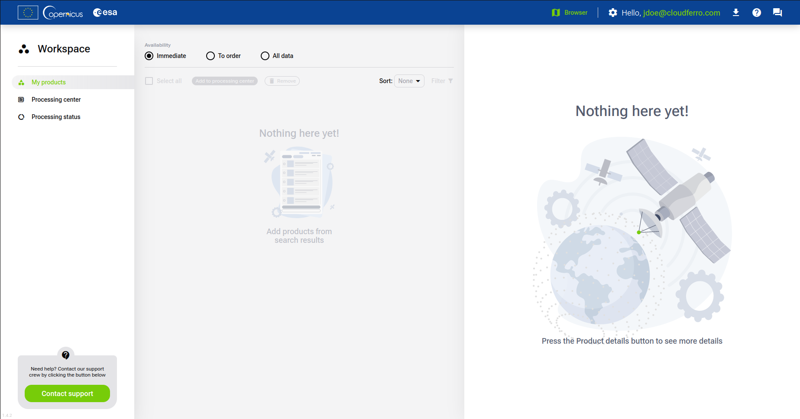
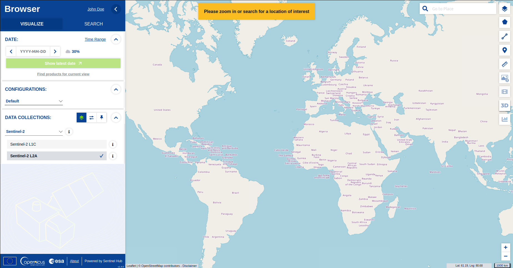
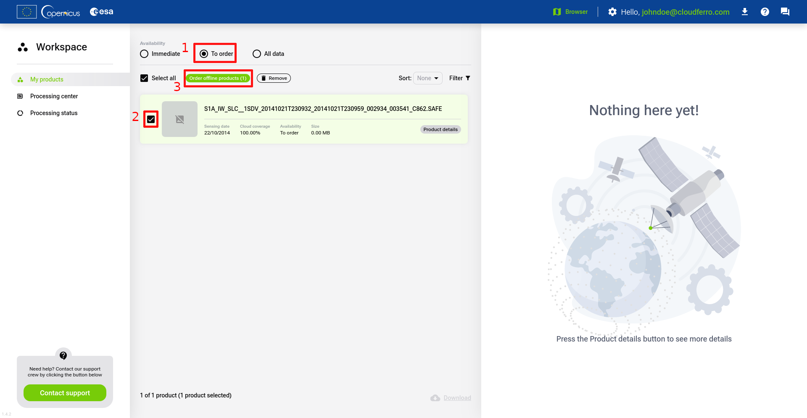
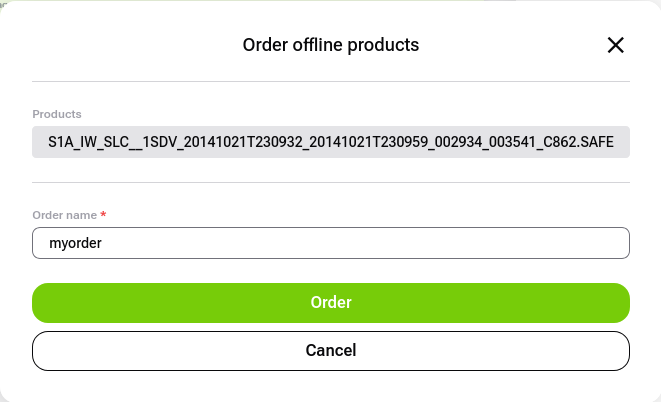
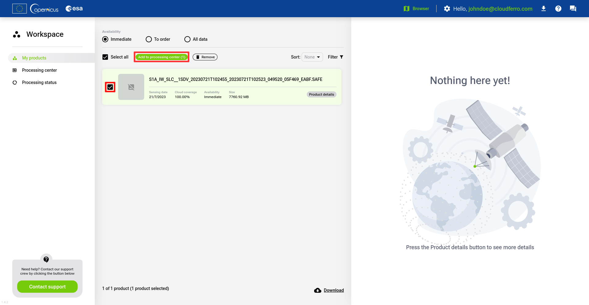
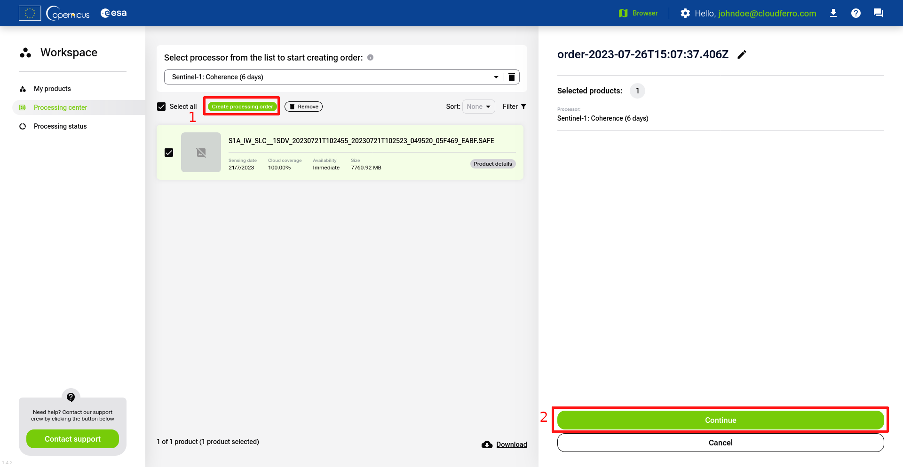
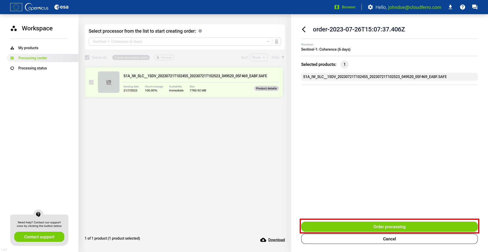
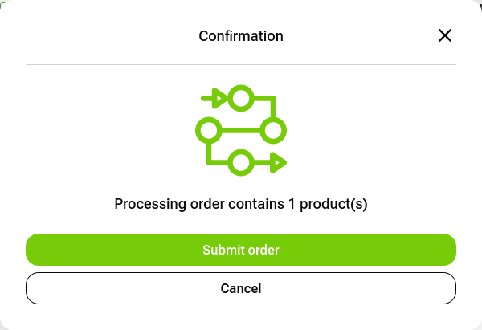
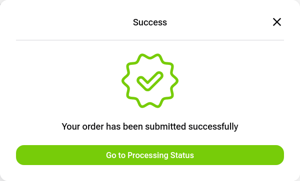

# About Data Workspace

The Data Workspace is a valuable tool for managing and reviewing Earth observation-related products. This platform enables you to aggregate and review products, which can then be further processed or downloaded for various purposes.

The Data Workspace enables management and ordering of satellite products. Offline products can be ordered and their retrieval progress can be monitored in the ‘Order Status’ section. Online products can be selected for processing with higher-level processors or downloaded.

When the products are selected for processing, you are provided with a list of processors that are capable of processing relevant data types. The processors can be further parameterized to fine-tune the results.

Once the order for processing is submitted, the progress can be monitored similarly to orders for product retrieval. The status dashboards also include all orders submitted through the ordering API. The status of the orders can be monitored on the status page, and the orders can be updated while being executed, providing the flexibility to cancel unnecessary tasks.

You can familiarise yourself with workspace and access it at [https://dataspace.copernicus.eu/workspace/](https://dataspace.copernicus.eu/workspace/){target="_blank"}

# How to use Data Workspace

To use Data Workspace, you need to be a registered CDSE user.

After registration, you can switch to the Data Workspace service.

## Adding products to workspace

You can add products by using CDSE [Browser](https://dataspace.copernicus.eu/browser/).

Browser allows you to search for products using various properties, like time, location and source.

After you find product you are interested in, you can add it to workspace by using icon visible under its size.

Then it will be visible under **My Products** tab in workspace:

When you have products listed, you can download them from here or process in processing center.

## Downloading products from Workspace

In order to download products from Workspace panel, you need to select them from the list from "My products" tab and then click "Download" button at the bottom.

A widnow displaying downloading process will appear. When status bar will reach 100%, it will switch its state to "completed" and your product will be saved on your device.

## Ordering products

Some products are not avaliable immediately and appear as offline products. These products need to be ordered first.

To order a product simply find the product with "To order" avaliability and then click "Order offline products" button.

Name your order and click "Order" button.

You will get a confirmation of your order. You can check its status under the "Processing status" tab.

## Processing products

Products processing allows user to transform them in a way they could become useful for certain cases. The method of processing and its outcome is defined for each avaliable processor used for the process.

To process the product its avaliability needs to be in "Immediate" status first. Now you can add your product to the processing center tab.

Check the boxes next to the product of your interest and click "Create processing order" button. You can select multiple products.

Click "Confirm" button.

Click "Go to Processing center".

Select the product and pick a processor from the list used for its procesing.

Click "Create processing order" and the "Continue".

Click "Order processing".

Click "Submit order".

Click "Go to Processing status".

You will be redirected to processing status tab.

From here you can check ongoing processing orders. Once they will be finished, they shall be transfered to the list of orders under "Finished" tab.
