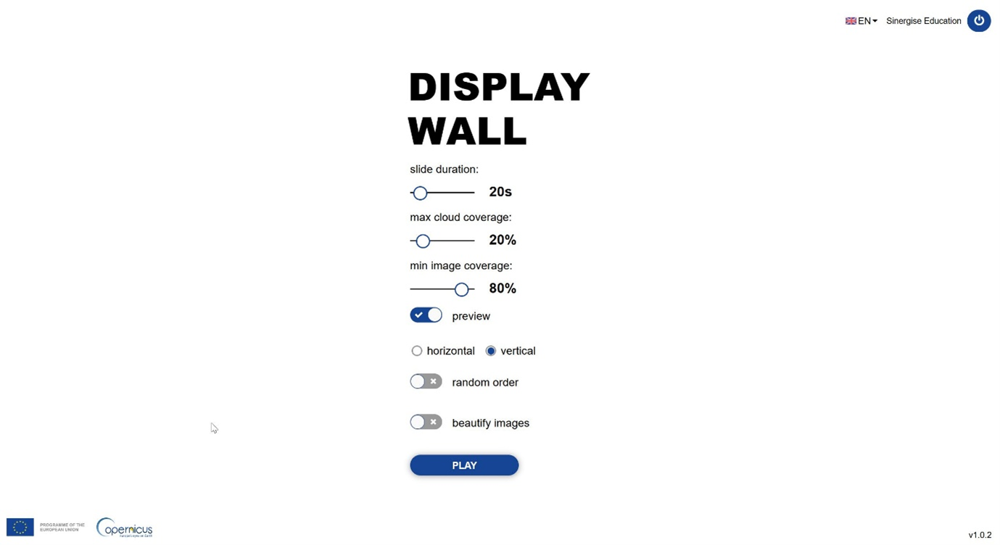
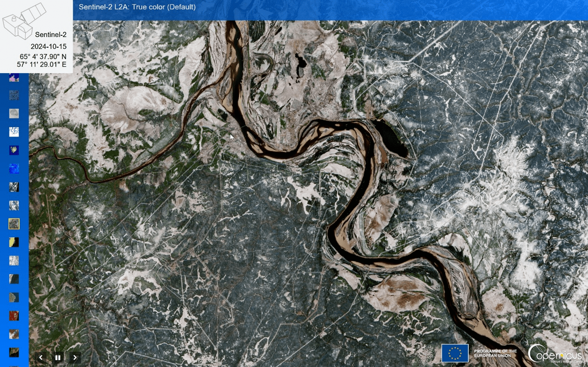
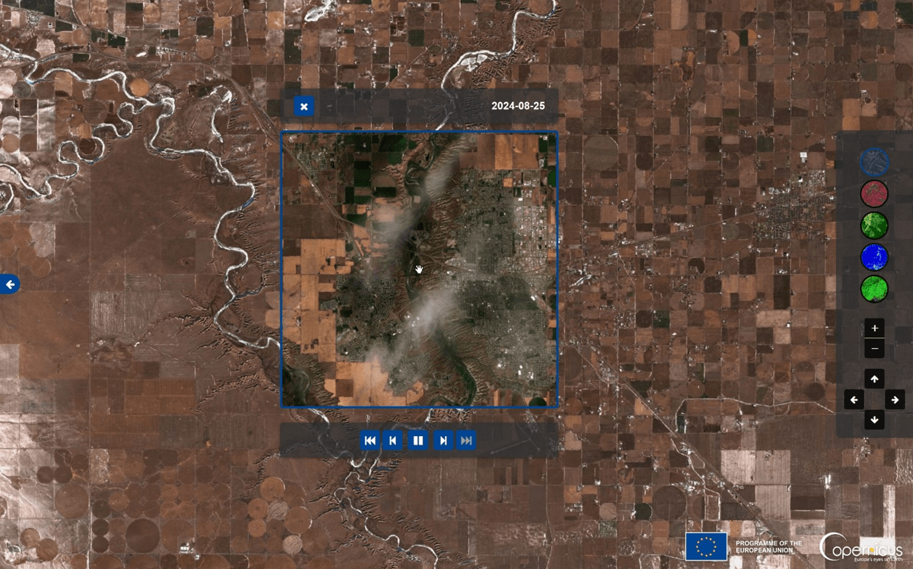

The Display Wall shows a full-screen slideshow of satellite imagery you select and provides an additional light interactive Browser with 
timelapse functionality. The typical use case is showing satellite imagery on a screen of a conference booth, but it can be used for many 
other scenarios on screens small and large. Like Copernicus Browser, the only requirement is a web browser. If you are not familiar 
with [Copernicus Browser](https://browser.dataspace.copernicus.eu/), please explore it first. It is an interactive tool for viewing and 
analysing satellite imagery, and also allows you to mark locations of interest to create a collection of 
[pins](https://documentation.dataspace.copernicus.eu/Applications/Browser.html#saving-pins). 
You need to be registered in Copernicus Data Space Ecosystem to use the Display Wall - register [here](https://dataspace.copernicus.eu/) 
(click on the green person button and then on register) to get started.

You can access the CDSE Display Wall at [https://display-wall.dataspace.copernicus.eu/](https://display-wall.dataspace.copernicus.eu/).

The Display Wall application has three views:

* Setup, where you set the parameters of your slideshow,
* Slideshow, where your images are displayed,
* and Interactive, which is a lightweight satellite image browser.

### Before you start – creating pins in Copernicus Browser

The Display Wall works with pins – individual combinations of a location, a time and a visualization that are created in Copernicus Browser and 
saved to your user account. Pins can be created by clicking the “Add to” icon on the layer and selecting “Add to Pins”. If you then change to view 
your list of pins, you can edit the label and description of your pins. If you add “-STATIC” to the label text of a pin, you create a static pin 
with a fixed date – otherwise the pin will show the most recent image.

### Setup View
Once you log in, you start with the Setup view. Here, you can choose your preferred language, the duration of slide display, the maximum cloud 
coverage of images you display, and the minimum coverage of satellite imagery over the area of your pins. Note that these settings work differently 
to Copernicus Browser: the pins will not automatically show the latest cloud-free image that has sufficient coverage of your area of interest. 
The latest image will be displayed if it meets the requirements, and the pin will not be shown if it does not. If you receive the error message 
"No suitable image", your pins are probably not static and all of them are cloudy on the most recent image. In this case, 
increase the cloud coverage threshold or make your pins static. Additionally, you can choose to display on a horizontal or vertical screen - this 
will influence where the preview images are shown. You can select the images to be displayed in random order (default is the order they were created in) 
and choose to beautify the images by contrast stretching (this option is currently disabled). Start the slideshow by clicking Play.

### Slideshow View
A slideshow of your selected pins is shown together with the title of the pin. 
Additionally, if "preview" has been activated, a graphic of the corresponding satellite, a label with the image coordinates, time and date, 
and a list of thumbnails of all your pins will be shown. You can pause the slideshow and switch to the previous or the next slide with the 
controls in the bottom left corner. The Esc or F11 button, or right-click and "exit full screen" will take you back to the setup view.

Interactive View
If you click on the right edge of the screen in Slideshow or Setup view, a search window opens. You can search for a location by name or by 
coordinates (format Lat/Long in decimal degrees, e.g. 68.450, -30.0). Click on the keyboard icon to activate a virtual keyboard that you can 
also use from a touchscreen. After you enter the location, a list of the most recent available Sentinel-1 and Sentinel-2 images will be displayed 
with date and cloud cover. Additionally, it is possible to open your selected location in a new tab in Copernicus Browser. Once you select an image, 
it will be shown in a lightweight interactive browser. You can select a visualization from the icons on the right. (true color, near-infrared false 
color, NDVI, moisture index and SWIR composite for Sentinel-2, linear and decibel gamma0 for VV and VH respectively for Sentinel-1). 
You can pan and zoom with your mouse or navigate using the zoom buttons and pan arrows in the control panel. If you click anywhere on the screen, 
a timelapse of the latest 6 months will automatically start. You can pause this or switch to the previous and next, first and last image using the 
arrow controls. Click the arrow on the left to return to the location search, and once more to return to setup view.
