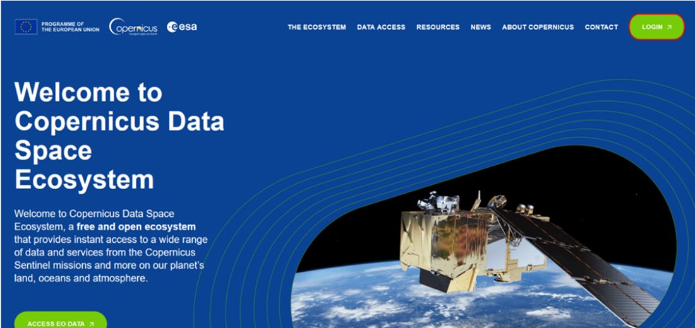
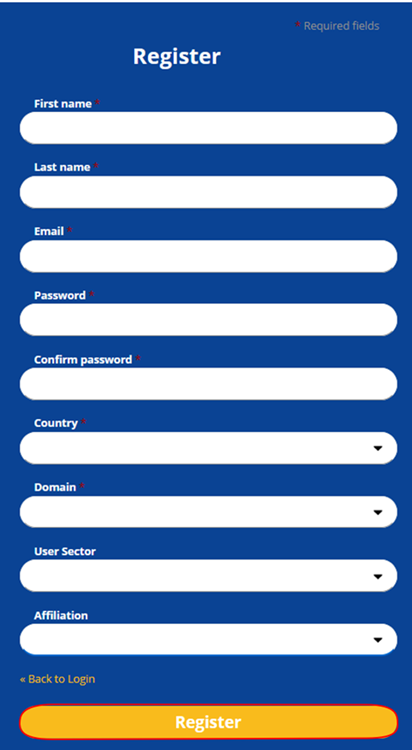
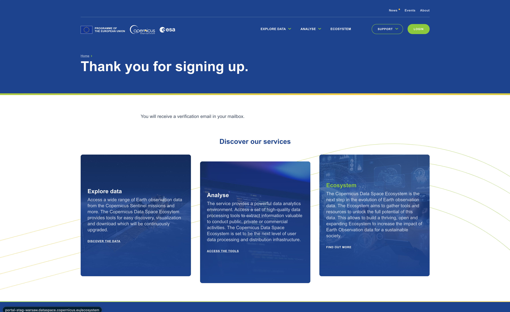

# User registration and authentication

This section provides information on how to register and authenticate on the Copernicus Data Space Ecosystem.

## Step 1: Registration

Go to [website](https://dataspace.copernicus.eu/) and click "login" in the top right corner.

<!--  -->

You will now get the Copernicus Data Space Ecosystems login form. Click "here" in the bottom.

<!--  -->

You will now get the Copernicus Data Space Ecosystems registration form. Fill in all required fields (all except Thematic activity and Purpose of use), you can fill in optional fields, next you have to accept terms and conditions and you can accept other consents (they are optional) and then click "Register".

<!--  -->

## Step 2: E-mail verification

When you register, you will be asked to verify your email address. You should receive a verification email. If you don't have it click "Click here" in the bottom.

<!--  -->

When you open an email you need to click "Verify email address".

Now you can log in with your credentials (providing Email and Password).

If you have an issue with registering or you want to deregister, please [contact us](mailto://help-cdse-login@cloudferro.com?Subject=Subject%20Text&Body=Your%20comments) directly.