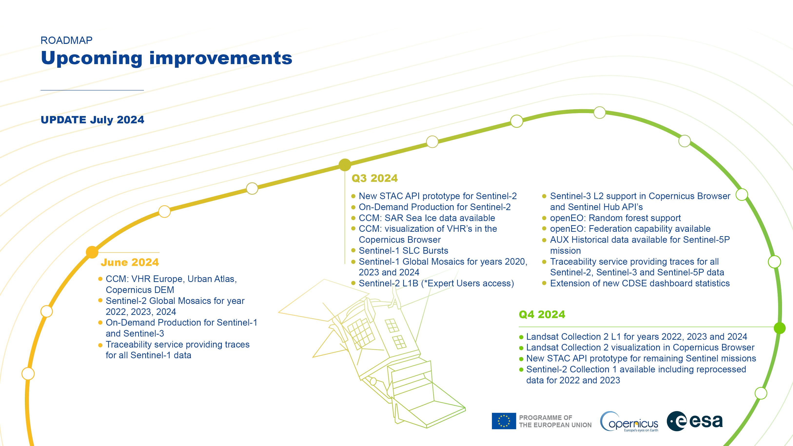

# Roadmap  

The Copernicus Data Space Ecosystem is continually advancing, with its roadmap frequently revised to incorporate new improvements.
Explore additional data offerings and upcoming services in the near future here.

## Upcoming improvements
<!-- |Timeline| Jan-23 | Apr-23 | Jul-23| Nov-23 
|---|---|---|---|----|
|1. | New Data Access portal  | Catalogue API: STAC, S3  | Full archive of Sentinel missions | Sentinel engineering and auxiliary data|
|2. |Start of user registration| Processing API: Sentinel Hub and OGC for supported collections  | Complementary open datasets | Copernicus Contributing Missions |
|3.| Initial Sentinel data offering| Traceability API | Access to commercial data| Streamlined data access of federated data sets  |
|4. |Browser| On-demand production API  | Processing API: extended Sentinel Hub APIs, OpenEO  |   |
| 5.|Catalogue APIs: OData and OpenSearch |   | Jupyter Lab    |      |
|6.|  |  | Marketplace | -->

## Details*

*Under revision

More detailed information on the timelines for Copernicus Data Space Ecosystem data, APIs and Application updates can be found in:

* [Data timeline overview](/Roadmap/DataTable.qmd)

* [APIs timeline overview](/Roadmap/APITable.qmd)

* [Applications timeline overview](/Roadmap/AppTable.qmd)

