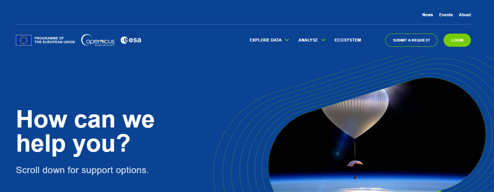
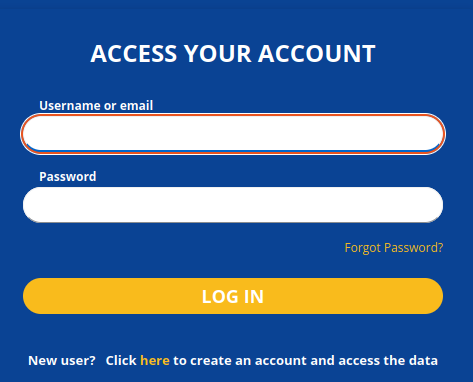
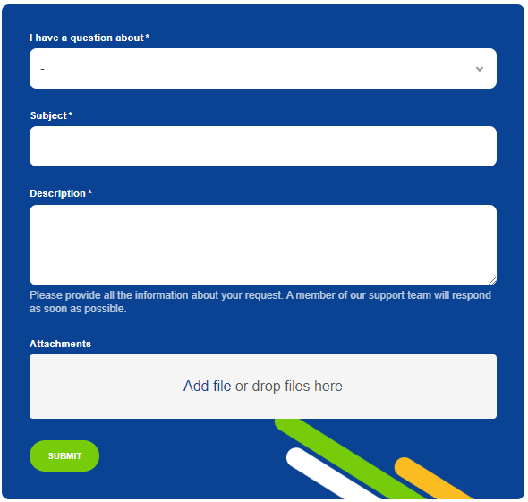
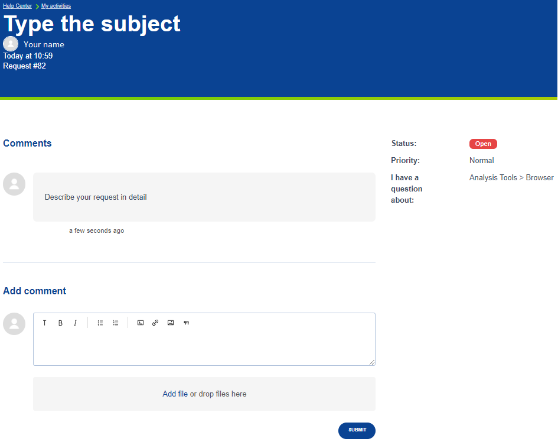
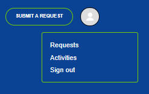
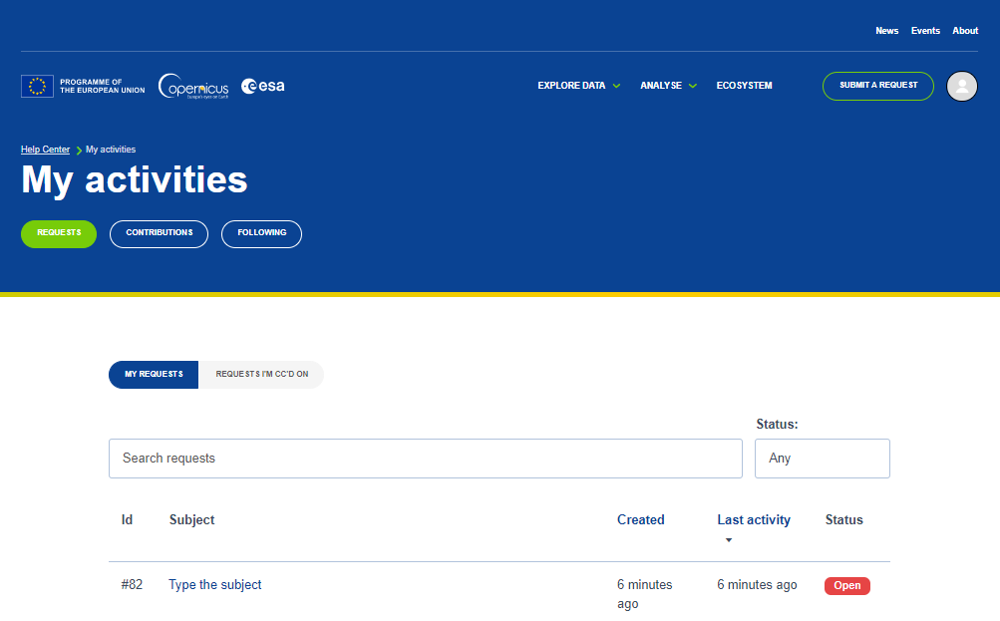

# Support

If you cannot find an answer to your question in our documentation portal, or if you encounter a malfunction, this page explains how to contact our support team.
Before reaching out, we strongly recommend visiting our [community forum](https://forum.dataspace.copernicus.eu/), where subject-matter experts actively monitor discussions. In many cases, second-line operational teams prefer to address and resolve issues directly through the forum.

## Prerequisites

Only users with a Copernicus Data Space Ecosystem account can contact the support team. 
If you don't have one yet, easily register [here](https://identity.dataspace.copernicus.eu/auth/realms/CDSE/protocol/openid-connect/auth?client_id=cdse-public&redirect_uri=https%3A%2F%2Fdataspace.copernicus.eu&response_type=code&scope=openid). If you have an issue with registering or you want to deregister, please [contact us](mailto://help-login@dataspace.copernicus.eu?Subject=Subject%20Text&Body=Your%20comments) directly (only for registration issues).

## Step 1: Navigate to our Home Page

On our [Home Page](https://dataspace.copernicus.eu/) click on (go over) SUPPORT on the top right section of the page.  

A menu will appear with the option 'Submit a request', click on that.

In case you’re not logged in, click on ‘login’ to do so. 

In case you're not registered yet, click on ‘register’ to do so.

## Step 2: Submit your request for the support team

The form to create a ticket should now appear.

From the dropdown select what the question is about (best guess).

Enter your subject and describe your problem in the field Description.

Upload attachments such as screenshots in the Attachments section.

Once done, click SUBMIT. Your ticket should now be submitted.

## Step 3: follow up on your ticket(s)

Go to [My Submitted Requests](https://helpcenter.dataspace.copernicus.eu/hc/en-gb/requests) to view your ticket(s) status and overview.

If you can’t see your request here, make sure that Status "Any" is selected from the drop-down.

<!--
# Support

If you don't find answer to your questions in the documentation portal, this page describes how to ask for support. 

## Prerequisites

Important to know is that only users with a Copernicus Data Space Ecosystem account can ask for support. 
If you don't have one yet, you can register [here](https://identity.dataspace.copernicus.eu/auth/realms/CDSE/protocol/openid-connect/auth?client_id=cdse-public&redirect_uri=https%3A%2F%2Fdataspace.copernicus.eu&response_type=code&scope=openid){target="_blank"}.
If you have an issue with registering or you want to deregister, please [contact us](mailto://help-login@dataspace.copernicus.eu?Subject=Subject%20Text&Body=Your%20comments) directly.

## Step 1: Navigate to the Help center

Navigate to the following [website](https://helpcenter.dataspace.copernicus.eu/hc/en-gb).

In case you're not logged in, click on LOGIN.

You will now get the Copernicus Data Space Ecosystems login form.

Enter your credentials and click LOG IN.

## Step 2: Submit a request

Once you have logged in you should see this window, click SUBMIT A REQUEST.

The form used to create tickets should now appear.

From the dropdown select what the question is about.

Enter the subject.

Describe your problem in detail in the field Description.

You can also upload attachments such as screenshots in the Attachments section.

Once you’ve finished, click SUBMIT.

Your ticket should now be submitted.

You can see its status here. You can also post additional comments and attachments.

## Accessing your submitted requests

After logging in (as described in Step 1), you can see the status of your requests under your account. Select Requests from the drop-down.

You will now see all your requests.

If you can’t see your request here, make sure that Status "Any" is selected from the drop-down.

You should now see your request.
-->