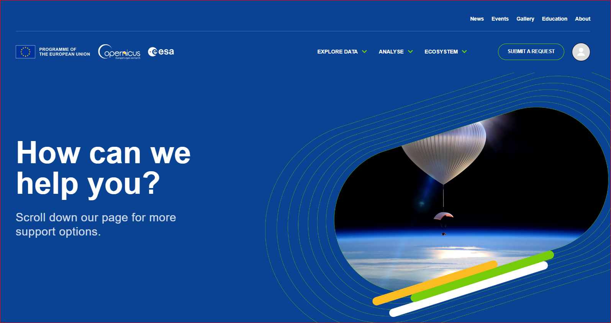
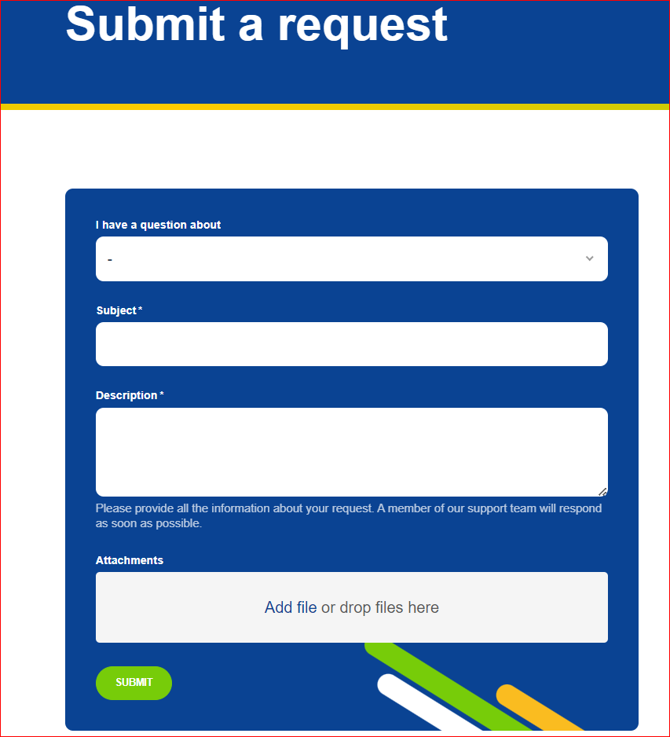

# Support

If you don't find answer to your questions in the documentation portal, this page describes how to ask for support. 

## Prerequisites

Important to know is that only users with a Copernicus Data Space Ecosystem account can ask for support. 
If you don't have one yet, you can register [here](https://identity.dataspace.copernicus.eu/auth/realms/CDSE/protocol/openid-connect/auth?client_id=cdse-public&redirect_uri=https%3A%2F%2Fdataspace.copernicus.eu&response_type=code&scope=openid){target="_blank"}.
If you have an issue with registering or you want to deregister, please [contact us](mailto://help-login@dataspace.copernicus.eu?Subject=Subject%20Text&Body=Your%20comments) directly.

## Step 1: Navigate to the Help center

Navigate to the following [website](https://helpcenter.dataspace.copernicus.eu/hc/en-gb).

In case you're not logged in, click on LOGIN.

You will now get the Copernicus Data Space Ecosystems login form.

Enter your credentials and click LOG IN.

## Step 2: Submit a request

Once you have logged in you should see this window, click SUBMIT A REQUEST.

The form used to create tickets should now appear.

From the dropdown select what the question is about.

Enter the subject.

Describe your problem in detail in the field Description.

You can also upload attachments such as screenshots in the Attachments section.

Once you’ve finished, click SUBMIT.

Your ticket should now be submitted.

You can see its status here. You can also post additional comments and attachments.

## Accessing your submitted requests

After logging in (as described in Step 1), you can see the status of your requests under your account. Select Requests from the drop-down.

You will now see all your requests.

If you can’t see your request here, make sure that Status "Any" is selected from the drop-down.

You should now see your request.

