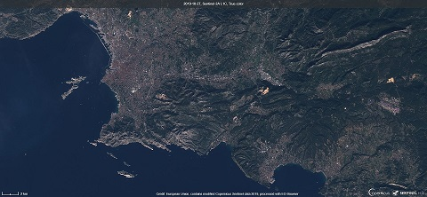

# Additional Request Parameters

## Additional Request Parameters

WMS/WMTS/WFS/WCS services support many custom parameters which affect the generation of the service responses. In the following table, all the available custom parameters are listed. All these parameters are optional.

For the examples on how to use them, see this [documentation](../../../APIs/SentinelHub/OGC/Examples.llms.md).

Note that atmospheric correction is not a parameter anymore, as we now only support L2A atmospheric correction. Read more about it [here](#atmospheric-correction).

[TABLE]

### Atmospheric correction

Satellite images sometimes seem washed out or foggy, as atmosphere absorbs and scatters light on its way to the ground. We can correct for this to get clearer images using atmospheric correction. ESA provides a [Sen2Cor](http://step.esa.int/main/snap-supported-plugins/sen2cor/) processor, that applies atmospheric correction to the input Sentinel-2 L1C data with global coverage. The resulting product is called S2L2A data. To use Atmospheric correction, use the [Sentinel-2 L2A (S2L2A) data collection.](../../../APIs/SentinelHub/Data/S2L2A.llms.md)

Below, you can see the difference atmospheric correction makes. The first image of Marseille was made in EO Browser using S2L1C data, and the lower image was made using S2L2A atmospheric correction.

