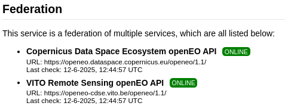

# Advanced use of federated processing

Federations of openEO backends allow to interact with multiple backends in a transparent manner. It can however help to understand a bit more about the federated nature of the backend to effectively work with a federation.

Note that the capabilities shown here may depend on the [federation extension](https://github.com/Open-EO/openeo-api/tree/master/extensions/federation) of the openEO API. The open source [openEO Aggregator](https://open-eo.github.io/openeo-aggregator/) component provides the federated endpoint.

### Visual hints in openEO editor

For starters, you may want to know the current members of the federation. The web editor shows this as part of the server info:



backend listing

and you can get the same information when working in Python or Jupyter notebooks by requesting capabilities:

``` python
import openeo
openeo.connect('openeofed.dataspace.copernicus.eu').capabilities()
```

For processes, you can similarly find out which backends support a given process. This is important, because it determines whether your process graph will work on more than one backend:

``` python
connection = openeo.connect('openeofed.dataspace.copernicus.eu')
```

``` python
connection.describe_process("add")
```

For collections, the federation uses the ‘summaries’ to indicate which backends host a certain collection:


image.png

``` python
for collection_id in connection.list_collection_ids():
    collection_metadata = connection.describe_collection(collection_id)
    federation_backends = collection_metadata["summaries"]["federation:backends"]
    print(f"Provided by {repr(federation_backends):16s}: {collection_id} ")
```

    Provided by ['cdse']        : SENTINEL3_OLCI_L1B 
    Provided by ['cdse']        : SENTINEL3_SLSTR 
    Provided by ['cdse']        : SENTINEL_5P_L2 
    Provided by ['cdse']        : COPERNICUS_VEGETATION_PHENOLOGY_PRODUCTIVITY_10M_SEASON1 
    Provided by ['cdse']        : COPERNICUS_VEGETATION_PHENOLOGY_PRODUCTIVITY_10M_SEASON2 
    Provided by ['cdse']        : ESA_WORLDCOVER_10M_2021_V2 
    Provided by ['cdse']        : COPERNICUS_VEGETATION_INDICES 
    Provided by ['cdse']        : SENTINEL2_L1C 
    Provided by ['cdse']        : SENTINEL2_L2A 
    Provided by ['cdse']        : SENTINEL1_GRD 
    Provided by ['cdse']        : COPERNICUS_30 
    Provided by ['cdse']        : LANDSAT8_L2 
    Provided by ['cdse']        : SENTINEL3_SYN_L2_SYN 
    Provided by ['cdse']        : SENTINEL3_SLSTR_L2_LST 
    Provided by ['cdse']        : SENTINEL1_GLOBAL_MOSAICS 
    Provided by ['cdse']        : SENTINEL3_OLCI_L2_LAND 
    Provided by ['cdse']        : SENTINEL3_OLCI_L2_WATER 
    Provided by ['cdse']        : SENTINEL3_SYN_L2_AOD 
    Provided by ['terrascope']  : ESA_WORLDCEREAL_ACTIVECROPLAND 
    Provided by ['terrascope']  : ESA_WORLDCEREAL_IRRIGATION 
    Provided by ['terrascope']  : ESA_WORLDCEREAL_TEMPORARYCROPS 
    Provided by ['terrascope']  : ESA_WORLDCEREAL_WINTERCEREALS 
    Provided by ['terrascope']  : ESA_WORLDCEREAL_MAIZE 
    Provided by ['terrascope']  : ESA_WORLDCEREAL_SPRINGCEREALS 
    Provided by ['terrascope']  : CGLS_GDMP300_V1_GLOBAL 
    Provided by ['terrascope']  : CGLS_GDMP_V2_GLOBAL 
    Provided by ['terrascope']  : CGLS_LAI300_V1_GLOBAL 
    Provided by ['terrascope']  : CGLS_FCOVER300_V1_GLOBAL 
    Provided by ['terrascope']  : CGLS_FAPAR300_V1_GLOBAL 
    Provided by ['terrascope']  : CGLS_NDVI300_V2_GLOBAL 
    Provided by ['terrascope']  : SENTINEL3_SYNERGY_VG1 
    Provided by ['terrascope']  : SENTINEL3_SYNERGY_VG10 
    Provided by ['terrascope']  : TERRASCOPE_S2_FAPAR_V2 
    Provided by ['terrascope']  : TERRASCOPE_S2_NDVI_V2 
    Provided by ['terrascope']  : TERRASCOPE_S2_LAI_V2 
    Provided by ['terrascope']  : PROBAV_L3_S10_TOC_333M 
    Provided by ['terrascope']  : PROBAV_L3_S5_TOC_100M 
    Provided by ['terrascope']  : PROBAV_L3_S1_TOC_100M 
    Provided by ['terrascope']  : PROBAV_L3_S1_TOC_333M 
    Provided by ['terrascope']  : TERRASCOPE_S5P_L3_NO2_TD 
    Provided by ['terrascope']  : TERRASCOPE_S5P_L3_NO2_TM 
    Provided by ['terrascope']  : TERRASCOPE_S5P_L3_NO2_TY 
    Provided by ['terrascope']  : TERRASCOPE_S5P_L3_CO_TD 
    Provided by ['terrascope']  : TERRASCOPE_S5P_L3_CO_TM 
    Provided by ['terrascope']  : TERRASCOPE_S5P_L3_CO_TY 
    Provided by ['terrascope']  : TERRASCOPE_S5P_L3_HCHO_TD 
    Provided by ['terrascope']  : TERRASCOPE_S5P_L3_HCHO_TM 
    Provided by ['terrascope']  : TERRASCOPE_S5P_L3_HCHO_TY 
    Provided by ['terrascope']  : TERRASCOPE_S5P_L3_CH4_TD 
    Provided by ['terrascope']  : TERRASCOPE_S5P_L3_CH4_TM 
    Provided by ['terrascope']  : TERRASCOPE_S5P_L3_CH4_TY 
    Provided by ['terrascope']  : TERRASCOPE_S5P_L3_NO2_CAMS_TD 
    Provided by ['terrascope']  : TERRASCOPE_S5P_L3_NO2_CAMS_TM 
    Provided by ['terrascope']  : TERRASCOPE_S5P_L3_NO2_CAMS_TY 
    Provided by ['terrascope']  : TERRASCOPE_S5P_L3_NO2_SURFACE_TD 
    Provided by ['terrascope']  : TERRASCOPE_S5P_L3_NO2_SURFACE_TM 
    Provided by ['terrascope']  : TERRASCOPE_S5P_L3_NO2_SURFACE_TY 
    Provided by ['terrascope']  : TERRASCOPE_S5P_L3_SO2CBR_TD 
    Provided by ['terrascope']  : TERRASCOPE_S5P_L3_SO2CBR_TM 
    Provided by ['terrascope']  : TERRASCOPE_S5P_L3_SO2CBR_TY 
    Provided by ['terrascope']  : ESA_WORLDCOVER_10M_2020_V1 
    Provided by ['terrascope']  : CGLS_NDVI_LTS_V2_GLOBAL 
    Provided by ['terrascope']  : CGLS_NDVI_LTS_V3_GLOBAL 
    Provided by ['terrascope']  : CGLS_SSM_V1_EUROPE 
    Provided by ['terrascope']  : CGLS_FAPAR_V2_GLOBAL 
    Provided by ['terrascope']  : CGLS_LAI_V2_GLOBAL 
    Provided by ['terrascope']  : CGLS_FCOVER_V2_GLOBAL 
    Provided by ['terrascope']  : CGLS_NDVI300_V1_GLOBAL 
    Provided by ['terrascope']  : CGLS_NDVI_V3_GLOBAL 
    Provided by ['terrascope']  : CGLS_NDVI_V2_GLOBAL 
    Provided by ['terrascope']  : CGLS_SWI_V1_EUROPE 
    Provided by ['terrascope']  : AGERA5 

``` python
temporal_extent = "2024-08"
spatial_extent = {"west": 5.07, "south": 51.21, "east": 5.10, "north": 51.23}
```

### Indicating use of a specific backend

As collections can be offered on multiple backends, your batch job can end up on multiple backends based on a logic that is internal to the specific federation configuration.

This can have a few drawbacks:

- Job results might differ slightly between backends
- Cost and performance might differ

To avoid this, you can be explicit about which backend to use for a given ‘load_collection’ call, by using the property filtering mechanism:

``` python
connection = connection.authenticate_oidc()
```

    Authenticated using refresh token.

``` python
from openeo import collection_property

terrascope_job = (
    connection.load_collection(
        "ESA_WORLDCEREAL_ACTIVECROPLAND",                
        properties=[collection_property("federation:backends")=="terrascope"]
    )
    .filter_temporal(extent=temporal_extent)
    .filter_bbox(spatial_extent)
).create_job()
```

``` python
terrascope_job
```

### Federated processing

Federated processing happens when a single job requires work on multiple backends. The most common trigger for federated processing is when datasets are not available on the same backend.

Thanks to federated processing, you do not need to worry about setting up scripts to move datasets between processing centers. Do know that the data still needs to be moved, which does come at a cost. For larger scale processing, it may still be less costly to perform a bulk transfer of intermediate datasets in an optimized manner.

To keep the demo simple but not too trivial, we’re going to build the following process graph:

        (at CDSE)            (at Terrascope)
      SENTINEL2_L2A       TERRASCOPE_S2_NDVI_V2
            |                      |
      filter_temporal        filter_temporal
            |                      |
      filter_spatial         filter_spatial
            |                      |
      reduce_dimension      reduce_dimension
       (temporal mean)      (temporal mean)
                  \           /
                   merge_cubes
                        |
                    save_result

- two `load_collection` nodes, each one targetting a different backend
- basic processing on each collection: spatio-temporal filtering and doing the temporal mean
- merge that together in a single cube

Load and process the `SENTINEL2_L2A` data (targeting the CDSE backend):

``` python
cube1 = (
    connection.load_collection(
        "SENTINEL2_L2A",
        bands=["B02"],
        max_cloud_cover=50,
    )
    .filter_temporal(extent=temporal_extent)
    .filter_bbox(spatial_extent)
)
cube1 = cube1.reduce_temporal("mean")
```

Load and process the `TERRASCOPE_S2_NDVI_V2` data (targeting Terrascope):

``` python
cube2 = (
    connection.load_collection(
        "TERRASCOPE_S2_NDVI_V2",
        bands=["NDVI_10M"]
    )
    .filter_temporal(extent=temporal_extent)
    .filter_bbox(spatial_extent)
)
cube2 = cube2.reduce_temporal("mean")
```

Merge both cubes:

``` python
merged = cube1.merge_cubes(cube2)
```

We want the final result in netCDF format:

``` python
saved = merged.save_result(format="netCDF")
```

``` python
job = saved.create_job(
    title="Deep graph splitting demo",
    job_options={
        "split_strategy": {
            "crossbackend": {
                "method": "deep"
            },
        },
    },
    validate=False,
)
job.job_id
```

    'agg-pj-20250619-184509'

``` python
job.start()
```

As this batch job is federated, it requires doing work on 2 different backends. This involves creating partial jobs, which will also be visible in your job listing:

``` python
connection.list_jobs(limit=3)
```

``` python
job
```

When the job is finished, you can just get results like with any other job!

``` python
job
```
