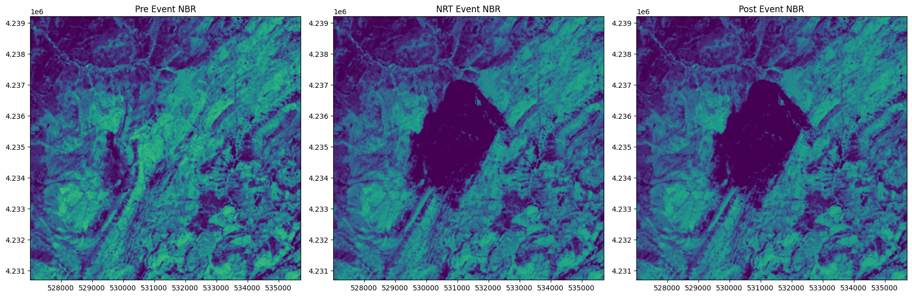
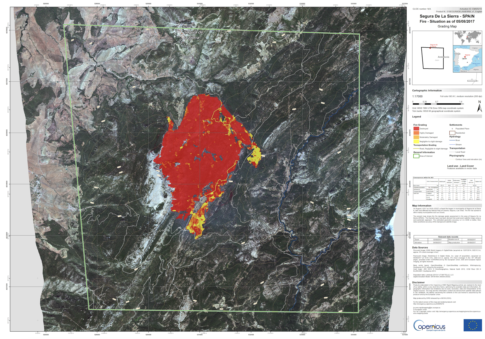

# Forest Fire Analysis: Saving Multiple Results in One Job

Wildfires have a significant impact on ecosystems, making it crucial to detect and analyze affected areas efficiently. In this notebook, we demonstrate how to use Sentinel-2 collections offered in the Copernicus Data Space Ecosystem (CDSE) to map wildfire, following the approach outlined in [Nolde et al. (2020)](https://www.mdpi.com/2072-4292/12/13/2162#).

Here, we want to replicate only a part of the workflow. It involves calculating cloud-free NBR for pre, near-real-time(nrt) and post-fire data and comparing them.

Beyond showcasing this use case, we highlight the power of openEO’s [`MultiResult`](https://open-eo.github.io/openeo-python-client/api.html#module-openeo.rest.multiresult) functionality, which allows multiple results to be retrieved within a single process call. This improves efficiency by enabling seamless access to both intermediate and final outputs in a structured manner.

``` python
import scipy
import numpy as np

import openeo
from openeo import MultiResult
from openeo.extra.spectral_indices import compute_indices

import matplotlib.pyplot as plt
import matplotlib
import matplotlib.patches as mpatches
import rasterio
from rasterio.plot import show
```

``` python
connection = openeo.connect("openeo.dataspace.copernicus.eu").authenticate_oidc()
```

    Authenticated using refresh token.

To begin, we established a connection to CDSE backend in the previous step. The next step is to identify and define the area of interest (AOI) where we want to detect the wildfire and the temporal range for which we want to analyze the data.

For this usecase we select an area in Jaen/Spain where fire was noted on 2017/08/03 *(source: https://emergency.copernicus.eu/mapping/list-of-components/EMSR219)*.

``` python
extent = {"west": -2.6910, "south": 38.2239, "east": -2.5921, "north": 38.3002}
```

Since the objective is to analyze the differences between pre-, nrt- and post-forestfire, we will define separate time ranges for each as shown below:

``` python
pre_temporal_extent = ["2017-05-03", "2017-08-03"]
nrt_temporal_extent = ["2017-08-03", "2017-08-08"]
post_temporal_extent = ["2017-08-03", "2017-11-03"]
```

Wildfire regions often have cloud cover, making it difficult to assess the severity of affected areas accurately. This is especially problematic when comparing data from just before or after the forestfire event. To address this, we preprocess the NBR data using the following method, which selects cloud-free pixels right before or after the fire event. The function uses a combination of cloud masking, smoothing, and morphological operations to filter out unreliable data. By doing this, the resulting data becomes more reliable and can better reflect the actual conditions of the land before and after the forestfire.

``` python
# define a function to identify cloud-free pixels in the available data-cube


def get_cloud_free_pixels(scl, data, reducer="first"):
    mask = (scl == 3) | (scl == 8) | (scl == 9) | (scl == 10)

    # mask is a bit noisy, so we apply smoothening
    # 2D gaussian kernel
    g = scipy.signal.windows.gaussian(11, std=1.6)
    kernel = np.outer(g, g)
    kernel = kernel / kernel.sum()

    # Morphological dilation of mask: convolution + threshold
    mask = mask.apply_kernel(kernel)
    mask = mask > 0.1

    data_masked = data.mask(mask)

    # now select Pixel with the requested reducer
    return data_masked.reduce_dimension(reducer=reducer, dimension="t")
```

## Calculate NBR

Though, NDVI is a good indicator of vegetation health, the Normalized Burn Ratio (NBR) index could be a better choice, which is more sensitive to burnt areas as suggested by Nolde et al.(2020).

*Quoted: “Optionally, the system can utilize the Normalized Burn Ratio (NBR) index (\[40\], see Equations (3) and (4)) instead of the NDVI. This index features superior capabilities for burnt area discrimination compared to the NDVI”*

Therefore, we define a reusable function to streamline the process of computing NBR for different time periods. This function loads the Sentinel-2 L2A collection, calculates NBR, and applies the `get_cloud_free_pixels` method. By adjusting the time range and reducer, we can use the same function for pre-fire, near-real-time, and post-fire NBR calculations.

To analyze the vegetation state before the wildfire, we load the Sentinel-2 L2A collection with few bands and calculate the NBR. Similarly, we calculate the NBR for the near-real-time and post-fire period with different time ranges and reducers passed to the method.

For NBR computation, we rely on the [`compute_indices`](https://open-eo.github.io/openeo-python-client/cookbook/spectral_indices.html#openeo.extra.spectral_indices.compute_indices) process of openEO. It simplifies the generation of vegetation indices by internally performing band math. It supports a wide range of indices and ensures consistency and readability in remote sensing workflows, reducing the need to manually implement index formulas. The list of supported indices can be found in this [documentation](https://awesome-ee-spectral-indices.readthedocs.io/en/latest/).

``` python
def cal_nbr(temporal_extent, reducer):
    s2_cube = connection.load_collection(
        "SENTINEL2_L2A",
        temporal_extent=temporal_extent,
        spatial_extent=extent,
        bands=["B08", "B12"],
        max_cloud_cover=90,
    )

    scl = connection.load_collection(
        "SENTINEL2_L2A",
        temporal_extent=temporal_extent,
        spatial_extent=extent,
        bands=["SCL"],
        max_cloud_cover=90,
    )

    # compute NBR
    nbr = compute_indices(s2_cube, indices=["NBR"])
    
    # get cloud free pixel
    nbr_cloud_free = get_cloud_free_pixels(scl, nbr, reducer=reducer)

    return nbr_cloud_free
```

To analyze wildfire impact, we compute NBR for three key phases, each requiring a different temporal range and reducer to handle cloud cover effectively: 1. Pre-event NBR – We use the “last” reducer to select the most recent cloud-free pixel before the fire, ensuring an accurate baseline for comparison. 2. Near-Real-Time (NRT) NBR – Since immediate detection is crucial, we use the “first” reducer to select the earliest available image after the fire, even if some cloud cover remains. 3. Post-event NBR – Similar to pre-event processing, we use the “first” reducer to capture the earliest cloud-free pixel after the fire, ensuring reliable post-fire assessment.

``` python
nbr_pre = cal_nbr(pre_temporal_extent, "last")
nbr_nrt = cal_nbr(nrt_temporal_extent, "first")
nbr_post = cal_nbr(post_temporal_extent, "first")
```

At this stage, we have only defined the workflow but have not executed it yet. Rather than running separate jobs for each temporal stage (pre-fire, near-real-time, and post-fire), we save it these results so that we can combine them into a single openEO job in later stage.

``` python
# first result
nbr_pre_result = nbr_pre.save_result(format="GTiff", options={"filename_prefix": "NBR"})

# save NBR for NRT mode for comparison as second result
nbr_nrt_result = nbr_nrt.save_result(format="GTiff", options={"filename_prefix": "NRT_NBR"})

# save NBR for post-event mode for comparison
nbr_post_result = nbr_post.save_result(format="GTiff", options={"filename_prefix": "Post_NBR"})
```

``` python
# a quick view on the process graph
nbr_post_result
```

As mentioned above, let us make the use of openEO’s [`MultiResult`](https://open-eo.github.io/openeo-python-client/api.html#module-openeo.rest.multiresult) feature, which allows us to save multiple results from different steps in a single job.

Using [`MultiResult`](https://open-eo.github.io/openeo-python-client/api.html#module-openeo.rest.multiresult) is beneficial because it enables efficient execution by reducing redundant result-saving steps. Instead of running individual computations for each NBR dataset, we bundle them together and execute them in one go. This approach optimizes resource usage and minimizes processing overhead.

Handling multiple outputs in a single job ensures consistency in the results and makes tracking and organising different NBR datasets easier. This is particularly useful when dealing with complex workflows that involve multiple processing steps.

To implement this, we combine different NBR results into a MultiResult object and create a job to execute.

``` python
multi_result_nbr = MultiResult([nbr_pre_result,nbr_nrt_result,nbr_post_result])
nbr_job = multi_result_nbr.create_job(title="Multiple save result NBR")
nbr_job.start_and_wait()
```

    0:00:00 Job 'j-250406173152426fa668ccda730a76ad': send 'start'
    0:00:23 Job 'j-250406173152426fa668ccda730a76ad': created (progress 0%)
    0:00:28 Job 'j-250406173152426fa668ccda730a76ad': created (progress 0%)
    0:00:34 Job 'j-250406173152426fa668ccda730a76ad': created (progress 0%)
    0:00:42 Job 'j-250406173152426fa668ccda730a76ad': created (progress 0%)
    0:00:52 Job 'j-250406173152426fa668ccda730a76ad': created (progress 0%)
    0:01:05 Job 'j-250406173152426fa668ccda730a76ad': created (progress 0%)
    0:01:20 Job 'j-250406173152426fa668ccda730a76ad': running (progress N/A)
    0:01:39 Job 'j-250406173152426fa668ccda730a76ad': running (progress N/A)
    0:02:03 Job 'j-250406173152426fa668ccda730a76ad': running (progress N/A)
    0:02:33 Job 'j-250406173152426fa668ccda730a76ad': running (progress N/A)
    0:03:11 Job 'j-250406173152426fa668ccda730a76ad': running (progress N/A)
    0:03:58 Job 'j-250406173152426fa668ccda730a76ad': running (progress N/A)
    0:04:56 Job 'j-250406173152426fa668ccda730a76ad': finished (progress 100%)

``` python
results = nbr_job.get_results()
results.download_files("data/out")
```

    [WindowsPath('data/out/NBR.tif'),
     WindowsPath('data/out/NRT_NBR.tif'),
     WindowsPath('data/out/Post_NBR.tif'),
     WindowsPath('data/out/job-results.json')]

### Plot the NBR

Now we have the NBR and its difference which can be treated as a proxy of forest fire. Let’s visualize them, first the NBR alone and then the mapped forest fire from it.

``` python
nbr = rasterio.open("data/out/NBR.tif")
nbr_nrt = rasterio.open("data/out/NRT_NBR.tif")
nbr_mosiac = rasterio.open("data/out/Post_NBR.tif")

f, axarr = plt.subplots(1, 3, dpi=100, figsize=(18, 6))
im = show(nbr.read(1), vmin=0, vmax=1, transform=nbr.transform, ax=axarr[0])
axarr[0].set_title("Pre Event NBR")

im = show(nbr_nrt.read(1), vmin=0, vmax=1, transform=nbr_nrt.transform, ax=axarr[1])
axarr[1].set_title("NRT Event NBR")

im = show(
    nbr_mosiac.read(1), vmin=0, vmax=1, transform=nbr_mosiac.transform, ax=axarr[2]
)
axarr[2].set_title("Post Event NBR")
plt.tight_layout()
```



As we can see, the location of the forest fire is quite prominent in the post-event NBR images compared to that of the pre-event NBR images. This shows that the approach with NBR has better visibility of forest fire signals than the NDVI-based approach. Now, let’s see how the final output of the forest fire area looks with the NBR difference image.

## Ground Truth

As a validation of this workflow, we have a map provided by Copernicus Emergency Management Service (CEMS) is shown below:


