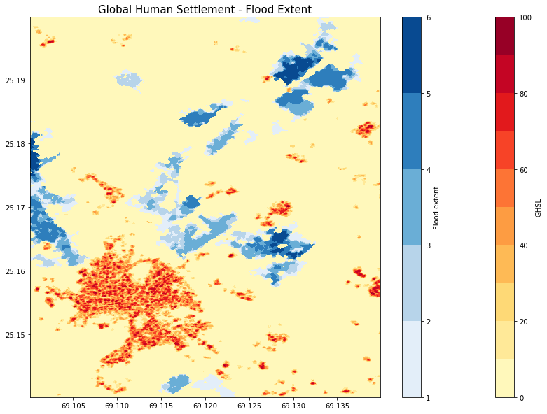
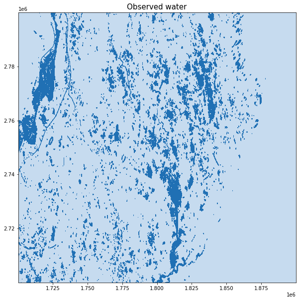

# openEO Flood Monitoring - Pakistan flooding of 2022

The flooding in Pakistan in 2022 was a devastating natural disaster that affected millions of people across the country. Heavy monsoon rains led to overflowing rivers, flash floods, and widespread destruction of homes, infrastructure, and agricultural land. It is referred to as the worst flooding in the history of Pakistan. The disaster highlighted the vulnerability of Pakistan’s population to extreme weather events and underscored the need for improved disaster preparedness and climate resilience strategies in the country.

Satellite data plays a crucial role in monitoring and understanding the impact of flooding events. It can be used to create accurate maps showing the extent of flooded areas. This information is essential for identifying affected regions, assessing the scale of the disaster, and planning rescue and relief operations.

In this notebook, we explore the Global Flood Mornitoring product to get a first overview of the flooding in the area around Digri Tehsil. We combine the flood extent data with the Global Human Settlement Built-up layer to get an estimate of the affected population in the region.

## GFM

The Global Flood Monitoring (GFM) product is a component of the EU’s Copernicus Emergency Management Service (CEMS) that provides continuous monitoring of floods worldwide, by processing and analysing in near real-time all incoming Sentinel-1 SAR acquisitions over land.

The operational implementation the GFM product includes the following key elements: - Downloading of worldwide Sentinel-1 SAR acquisitions (Level-1 IW GRDH) - Pre-processing of the downloaded Sentinel-1 data to backscatter data (SIG0) - Operational application of three fully automated flood mapping algorithms. - An ensemble-based approach is then used to combine the three flood extent outputs of the individual flood algorithms. - Generation of the required GFM output layers, including Observed flood extent, Reference water mask, Exclusion Mask and Likelihood Values - Web service-based access and dissemination of the GFM product output layers

### Output layers used in this notebook

- Observed flood extent (ENSEMBLE of all three individual flood outputs)
- Reference water mask (permament and seasonal water bodies)

### Links

https://extwiki.eodc.eu/GFM

### Connect and authenticate to openEO

``` python
import openeo
from openeo.processes import *

conn = openeo.connect("openeofed.dataspace.copernicus.eu").authenticate_oidc()
```

    Authenticated using refresh token.

### Describe the GFM collection

``` python
conn.describe_collection("GFM")
```

### Temporal sum of flooded pixels

In this example, we have a closer look at an area in Pakistan, which was revaged by the unprecedented floods of 2022. We compute the sum of flooded pixels over time.

``` python
spatial_extent  = {'west': 67.5, 'east': 70, 'south': 24.5, 'north': 26}
temporal_extent = ["2022-09-01", "2022-10-01"] 
collection      = 'GFM'

gfm_data = conn.load_collection(
    collection, 
    spatial_extent=spatial_extent, 
    temporal_extent=temporal_extent, 
    bands = ["ensemble_flood_extent"]
)
gfm_sum = gfm_data.reduce_dimension(dimension="t", reducer=sum)

gfm_sum_tiff = gfm_sum.save_result(format="GTiff", options={"tile_grid": "wgs84-1degree"})
```

``` python
job = gfm_sum_tiff.create_job(title = "UC11").start_job()
```

``` python
job.status()
```

    'finished'

``` python
job.get_results().download_files("./gfm/flood_extent_wgs/")
```

    [PosixPath('gfm/flood_extent_wgs/WGS84_E67N23_20220901T010907.tif'),
     PosixPath('gfm/flood_extent_wgs/WGS84_E67N24_20220901T010907.tif'),
     PosixPath('gfm/flood_extent_wgs/WGS84_E67N25_20220901T010907.tif'),
     PosixPath('gfm/flood_extent_wgs/WGS84_E67N26_20220901T010907.tif'),
     PosixPath('gfm/flood_extent_wgs/WGS84_E68N23_20220901T010907.tif'),
     PosixPath('gfm/flood_extent_wgs/WGS84_E68N24_20220901T010907.tif'),
     PosixPath('gfm/flood_extent_wgs/WGS84_E68N25_20220901T010907.tif'),
     PosixPath('gfm/flood_extent_wgs/WGS84_E68N26_20220901T010907.tif'),
     PosixPath('gfm/flood_extent_wgs/WGS84_E69N23_20220901T010907.tif'),
     PosixPath('gfm/flood_extent_wgs/WGS84_E69N24_20220901T010907.tif'),
     PosixPath('gfm/flood_extent_wgs/WGS84_E69N25_20220901T010907.tif'),
     PosixPath('gfm/flood_extent_wgs/WGS84_E69N26_20220901T010907.tif'),
     PosixPath('gfm/flood_extent_wgs/WGS84_E70N23_20220901T010907.tif'),
     PosixPath('gfm/flood_extent_wgs/WGS84_E70N24_20220901T010907.tif'),
     PosixPath('gfm/flood_extent_wgs/WGS84_E70N25_20220901T010907.tif'),
     PosixPath('gfm/flood_extent_wgs/WGS84_E70N26_20220901T010907.tif'),
     PosixPath('gfm/flood_extent_wgs/job-results.json')]

### Load the downloaded result files

``` python
import os
import numpy as np
import matplotlib.pyplot as plt
import xarray as xr
```

``` python
path = "./gfm/flood_extent_wgs/WGS84_E69N25_20220901T010907.tif"
flood_extent = xr.open_dataset(path).band_data
```

### Explore how the flood extent relates to the Global Human Settlement Built-up layer

We display the flood extent next to the Global Human Settlement Built-up layer.

The Global Human Settlement Layer (GHSL) project produces global spatial information about the human presence on the planet over time in the form of built-up maps, population density maps and settlement maps.

Here, the GHS-BUILT-S spatial raster dataset at 10m resolution is used which depicts the distribution of built-up surfaces, expressed as number of square metres.

Values are between 0 and 100 and represent the amount of square metres of built-up surface in the cell.

The data was downloaded from: https://ghsl.jrc.ec.europa.eu/about.php

``` python
ghsl = xr.open_dataarray("ghsl.nc")
display(ghsl)
```

![](data:image/svg+xml;base64,PHN2ZyBzdHlsZT0icG9zaXRpb246IGFic29sdXRlOyB3aWR0aDogMDsgaGVpZ2h0OiAwOyBvdmVyZmxvdzogaGlkZGVuIj4KPGRlZnM+CjxzeW1ib2wgaWQ9Imljb24tZGF0YWJhc2UiIHZpZXdib3g9IjAgMCAzMiAzMiI+CjxwYXRoIGQ9Ik0xNiAwYy04LjgzNyAwLTE2IDIuMjM5LTE2IDV2NGMwIDIuNzYxIDcuMTYzIDUgMTYgNXMxNi0yLjIzOSAxNi01di00YzAtMi43NjEtNy4xNjMtNS0xNi01eiIgLz4KPHBhdGggZD0iTTE2IDE3Yy04LjgzNyAwLTE2LTIuMjM5LTE2LTV2NmMwIDIuNzYxIDcuMTYzIDUgMTYgNXMxNi0yLjIzOSAxNi01di02YzAgMi43NjEtNy4xNjMgNS0xNiA1eiIgLz4KPHBhdGggZD0iTTE2IDI2Yy04LjgzNyAwLTE2LTIuMjM5LTE2LTV2NmMwIDIuNzYxIDcuMTYzIDUgMTYgNXMxNi0yLjIzOSAxNi01di02YzAgMi43NjEtNy4xNjMgNS0xNiA1eiIgLz4KPC9zeW1ib2w+CjxzeW1ib2wgaWQ9Imljb24tZmlsZS10ZXh0MiIgdmlld2JveD0iMCAwIDMyIDMyIj4KPHBhdGggZD0iTTI4LjY4MSA3LjE1OWMtMC42OTQtMC45NDctMS42NjItMi4wNTMtMi43MjQtMy4xMTZzLTIuMTY5LTIuMDMwLTMuMTE2LTIuNzI0Yy0xLjYxMi0xLjE4Mi0yLjM5My0xLjMxOS0yLjg0MS0xLjMxOWgtMTUuNWMtMS4zNzggMC0yLjUgMS4xMjEtMi41IDIuNXYyN2MwIDEuMzc4IDEuMTIyIDIuNSAyLjUgMi41aDIzYzEuMzc4IDAgMi41LTEuMTIyIDIuNS0yLjV2LTE5LjVjMC0wLjQ0OC0wLjEzNy0xLjIzLTEuMzE5LTIuODQxek0yNC41NDMgNS40NTdjMC45NTkgMC45NTkgMS43MTIgMS44MjUgMi4yNjggMi41NDNoLTQuODExdi00LjgxMWMwLjcxOCAwLjU1NiAxLjU4NCAxLjMwOSAyLjU0MyAyLjI2OHpNMjggMjkuNWMwIDAuMjcxLTAuMjI5IDAuNS0wLjUgMC41aC0yM2MtMC4yNzEgMC0wLjUtMC4yMjktMC41LTAuNXYtMjdjMC0wLjI3MSAwLjIyOS0wLjUgMC41LTAuNSAwIDAgMTUuNDk5LTAgMTUuNSAwdjdjMCAwLjU1MiAwLjQ0OCAxIDEgMWg3djE5LjV6IiAvPgo8cGF0aCBkPSJNMjMgMjZoLTE0Yy0wLjU1MiAwLTEtMC40NDgtMS0xczAuNDQ4LTEgMS0xaDE0YzAuNTUyIDAgMSAwLjQ0OCAxIDFzLTAuNDQ4IDEtMSAxeiIgLz4KPHBhdGggZD0iTTIzIDIyaC0xNGMtMC41NTIgMC0xLTAuNDQ4LTEtMXMwLjQ0OC0xIDEtMWgxNGMwLjU1MiAwIDEgMC40NDggMSAxcy0wLjQ0OCAxLTEgMXoiIC8+CjxwYXRoIGQ9Ik0yMyAxOGgtMTRjLTAuNTUyIDAtMS0wLjQ0OC0xLTFzMC40NDgtMSAxLTFoMTRjMC41NTIgMCAxIDAuNDQ4IDEgMXMtMC40NDggMS0xIDF6IiAvPgo8L3N5bWJvbD4KPC9kZWZzPgo8L3N2Zz4=)

``` xr-text-repr-fallback
<xarray.DataArray 'built' (y: 750, x: 500)>
[375000 values with dtype=int8]
Coordinates:
    band     int64 ...
  * x        (x) float64 69.1 69.1 69.1 69.1 69.1 ... 69.14 69.14 69.14 69.14
  * y        (y) float64 25.2 25.2 25.2 25.2 25.2 ... 25.14 25.14 25.14 25.14
Attributes:
    AREA_OR_POINT:  Area
    grid_mapping:   spatial_ref
```

xarray.DataArray

'built'

- y: 750
- x: 500


...

    [375000 values with dtype=int8]

Coordinates: (3)

band

()

int64

...


    [1 values with dtype=int64]

x

\(x\)

float64

69.1 69.1 69.1 ... 69.14 69.14


axis :  
X

long_name :  
longitude

standard_name :  
longitude

units :  
degrees_east

    array([69.100027, 69.100107, 69.100187, ..., 69.139774, 69.139854, 69.139934])

y

\(y\)

float64

25.2 25.2 25.2 ... 25.14 25.14


axis :  
Y

long_name :  
latitude

standard_name :  
latitude

units :  
degrees_north

    array([25.199972, 25.199892, 25.199812, ..., 25.140232, 25.140152, 25.140072])

Indexes: (2)

x

PandasIndex


    PandasIndex(Index([69.10002710430724, 69.10010707836112,   69.100187052415,
           69.10026702646887, 69.10034700052275, 69.10042697457662,
           69.10050694863048, 69.10058692268436, 69.10066689673823,
           69.10074687079211,
           ...
           69.13921439070573,  69.1392943647596, 69.13937433881348,
           69.13945431286736, 69.13953428692123, 69.13961426097511,
           69.13969423502897, 69.13977420908284, 69.13985418313672,
            69.1399341571906],
          dtype='float64', name='x', length=500))

y

PandasIndex


    PandasIndex(Index([25.199972280901584,  25.19989230684771, 25.199812332793833,
           25.199732358739958, 25.199652384686082,  25.19957241063221,
           25.199492436578335,  25.19941246252446, 25.199332488470585,
           25.199252514416713,
           ...
           25.140791481034476, 25.140711506980605,  25.14063153292673,
           25.140551558872854, 25.140471584818982, 25.140391610765107,
           25.140311636711232, 25.140231662657357,  25.14015168860348,
           25.140071714549606],
          dtype='float64', name='y', length=750))

Attributes: (2)

AREA_OR_POINT :  
Area

grid_mapping :  
spatial_ref

``` python
min_lat, max_lat = np.min(ghsl.y.values), np.max(ghsl.y.values)
min_lon, max_lon = np.min(ghsl.x.values), np.max(ghsl.x.values)

flood_extent = flood_extent.sel(x=slice(min_lon, max_lon), y=slice(max_lat, min_lat), band = 1)
flood_extent = xr.where(flood_extent == 0, np.nan, flood_extent)
flood_extent
```

![](data:image/svg+xml;base64,PHN2ZyBzdHlsZT0icG9zaXRpb246IGFic29sdXRlOyB3aWR0aDogMDsgaGVpZ2h0OiAwOyBvdmVyZmxvdzogaGlkZGVuIj4KPGRlZnM+CjxzeW1ib2wgaWQ9Imljb24tZGF0YWJhc2UiIHZpZXdib3g9IjAgMCAzMiAzMiI+CjxwYXRoIGQ9Ik0xNiAwYy04LjgzNyAwLTE2IDIuMjM5LTE2IDV2NGMwIDIuNzYxIDcuMTYzIDUgMTYgNXMxNi0yLjIzOSAxNi01di00YzAtMi43NjEtNy4xNjMtNS0xNi01eiIgLz4KPHBhdGggZD0iTTE2IDE3Yy04LjgzNyAwLTE2LTIuMjM5LTE2LTV2NmMwIDIuNzYxIDcuMTYzIDUgMTYgNXMxNi0yLjIzOSAxNi01di02YzAgMi43NjEtNy4xNjMgNS0xNiA1eiIgLz4KPHBhdGggZD0iTTE2IDI2Yy04LjgzNyAwLTE2LTIuMjM5LTE2LTV2NmMwIDIuNzYxIDcuMTYzIDUgMTYgNXMxNi0yLjIzOSAxNi01di02YzAgMi43NjEtNy4xNjMgNS0xNiA1eiIgLz4KPC9zeW1ib2w+CjxzeW1ib2wgaWQ9Imljb24tZmlsZS10ZXh0MiIgdmlld2JveD0iMCAwIDMyIDMyIj4KPHBhdGggZD0iTTI4LjY4MSA3LjE1OWMtMC42OTQtMC45NDctMS42NjItMi4wNTMtMi43MjQtMy4xMTZzLTIuMTY5LTIuMDMwLTMuMTE2LTIuNzI0Yy0xLjYxMi0xLjE4Mi0yLjM5My0xLjMxOS0yLjg0MS0xLjMxOWgtMTUuNWMtMS4zNzggMC0yLjUgMS4xMjEtMi41IDIuNXYyN2MwIDEuMzc4IDEuMTIyIDIuNSAyLjUgMi41aDIzYzEuMzc4IDAgMi41LTEuMTIyIDIuNS0yLjV2LTE5LjVjMC0wLjQ0OC0wLjEzNy0xLjIzLTEuMzE5LTIuODQxek0yNC41NDMgNS40NTdjMC45NTkgMC45NTkgMS43MTIgMS44MjUgMi4yNjggMi41NDNoLTQuODExdi00LjgxMWMwLjcxOCAwLjU1NiAxLjU4NCAxLjMwOSAyLjU0MyAyLjI2OHpNMjggMjkuNWMwIDAuMjcxLTAuMjI5IDAuNS0wLjUgMC41aC0yM2MtMC4yNzEgMC0wLjUtMC4yMjktMC41LTAuNXYtMjdjMC0wLjI3MSAwLjIyOS0wLjUgMC41LTAuNSAwIDAgMTUuNDk5LTAgMTUuNSAwdjdjMCAwLjU1MiAwLjQ0OCAxIDEgMWg3djE5LjV6IiAvPgo8cGF0aCBkPSJNMjMgMjZoLTE0Yy0wLjU1MiAwLTEtMC40NDgtMS0xczAuNDQ4LTEgMS0xaDE0YzAuNTUyIDAgMSAwLjQ0OCAxIDFzLTAuNDQ4IDEtMSAxeiIgLz4KPHBhdGggZD0iTTIzIDIyaC0xNGMtMC41NTIgMC0xLTAuNDQ4LTEtMXMwLjQ0OC0xIDEtMWgxNGMwLjU1MiAwIDEgMC40NDggMSAxcy0wLjQ0OCAxLTEgMXoiIC8+CjxwYXRoIGQ9Ik0yMyAxOGgtMTRjLTAuNTUyIDAtMS0wLjQ0OC0xLTFzMC40NDgtMSAxLTFoMTRjMC41NTIgMCAxIDAuNDQ4IDEgMXMtMC40NDggMS0xIDF6IiAvPgo8L3N5bWJvbD4KPC9kZWZzPgo8L3N2Zz4=)

``` xr-text-repr-fallback
<xarray.DataArray 'band_data' (y: 333, x: 222)>
array([[nan, nan, nan, ..., nan, nan, nan],
       [nan, nan, nan, ..., nan, nan, nan],
       [nan, nan, nan, ..., nan, nan, nan],
       ...,
       [nan, nan, nan, ..., nan, nan, nan],
       [nan, nan, nan, ..., nan, nan, nan],
       [nan, nan, nan, ..., nan, nan, nan]], dtype=float32)
Coordinates:
    band         int64 1
  * x            (x) float64 69.1 69.1 69.1 69.1 ... 69.14 69.14 69.14 69.14
  * y            (y) float64 25.2 25.2 25.2 25.2 ... 25.14 25.14 25.14 25.14
    spatial_ref  int64 0
```

xarray.DataArray

'band_data'

- y: 333
- x: 222


nan nan nan nan nan nan nan nan ... nan nan nan nan nan nan nan nan

    array([[nan, nan, nan, ..., nan, nan, nan],
           [nan, nan, nan, ..., nan, nan, nan],
           [nan, nan, nan, ..., nan, nan, nan],
           ...,
           [nan, nan, nan, ..., nan, nan, nan],
           [nan, nan, nan, ..., nan, nan, nan],
           [nan, nan, nan, ..., nan, nan, nan]], dtype=float32)

Coordinates: (4)

band

()

int64

1


    array(1)

x

\(x\)

float64

69.1 69.1 69.1 ... 69.14 69.14


    array([69.10011, 69.10029, 69.10047, ..., 69.13953, 69.13971, 69.13989])

y

\(y\)

float64

25.2 25.2 25.2 ... 25.14 25.14


    array([25.19991, 25.19973, 25.19955, ..., 25.14051, 25.14033, 25.14015])

spatial_ref

()

int64

0


    array(0)

Indexes: (2)

x

PandasIndex


    PandasIndex(Index([         69.10011,          69.10029,          69.10047,
                    69.10065,          69.10083,          69.10101,
                    69.10119,          69.10137,          69.10155,
                    69.10173,
           ...
           69.13826999999999, 69.13844999999999, 69.13862999999999,
           69.13880999999999, 69.13898999999999,          69.13917,
                    69.13935,          69.13953,          69.13971,
                    69.13989],
          dtype='float64', name='x', length=222))

y

PandasIndex


    PandasIndex(Index([25.199910000000003, 25.199730000000002, 25.199550000000002,
           25.199370000000002,           25.19919,           25.19901,
           25.198830000000005, 25.198650000000004, 25.198470000000004,
           25.198290000000004,
           ...
           25.141770000000005, 25.141590000000004, 25.141410000000004,
           25.141230000000004, 25.141050000000003, 25.140870000000003,
           25.140690000000003, 25.140510000000003, 25.140330000000002,
           25.140150000000002],
          dtype='float64', name='y', length=333))

Attributes: (0)

``` python
plt.figure(figsize=(14,10))
plt.title("Global Human Settlement - Flood Extent", fontsize=15)
X, Y = np.meshgrid(ghsl.x.values, ghsl.y.values)
g = plt.contourf(X, Y, ghsl,cmap='YlOrRd', levels=10)
plt.colorbar(label="GHSL")
X, Y = np.meshgrid(flood_extent.x.values, flood_extent.y.values)
f = plt.contourf(X, Y, flood_extent,cmap='Blues', levels=5)
plt.colorbar(label="Flood extent")
```



Estimate of how the built-up surface was effected by the flood in Pakistan in September 2022. Some of the highest values of the GHSL can be found around 25.16 N 69.11 E, which marks Digri Tehsil, the second largest town of Mirpurkhas District, Pakistan. The sum over the temporal extent shows the areas that were affected the most.

### Observed water (flood_extent + refwater)

The observed water combines both flood extent and the reference water mask. The reference water mask represents permanent or seasonal water bodies, which are clearly distinct from flood events.

``` python
spatial_extent  = {'west': 67.5, 'east': 70, 'south': 24.5, 'north': 26}
temporal_extent = ["2022-09-01", "2022-10-01"] 
collection      = 'GFM'

gfm_data = conn.load_collection(
    collection, 
    spatial_extent=spatial_extent, 
    temporal_extent=temporal_extent, 
    bands = ["ensemble_flood_extent", "reference_water_mask"]
)

# retrieve all pixels which have been detected as water during the given period
# -> observed water
observed_water = gfm_data.reduce_dimension(dimension="bands", reducer=any).reduce_dimension(dimension="t", reducer=any)

# Save the result in Equi7Grid and as GeoTiff
observed_water_tif = observed_water.save_result(format="NetCDF", options={"tile_grid": "equi7"})
```

openEO allows us to choose a tile grid, which matches the coordinate reference system. The original crs of the dataset is the Equi7, so we store our results accordingly.

``` python
job = observed_water_tif.create_job(title = "UC11").start_job()
```

``` python
job.status()
```

    'finished'

``` python
job.get_results().download_files("./gfm/observed_water/")
```

    [PosixPath('gfm/observed_water/AS020M_E015N024T3_20220901T010907.nc'),
     PosixPath('gfm/observed_water/AS020M_E015N027T3_20220901T010907.nc'),
     PosixPath('gfm/observed_water/AS020M_E018N024T3_20220901T010907.nc'),
     PosixPath('gfm/observed_water/AS020M_E018N027T3_20220901T010907.nc'),
     PosixPath('gfm/observed_water/job-results.json')]

``` python
path = "./gfm/observed_water/"
files = [path + file for file in os.listdir(path) if file.startswith("AS")]
# we expect only 0 and 1 -> bool
data = xr.open_mfdataset(files).name.astype("bool")
display(data)
```

![](data:image/svg+xml;base64,PHN2ZyBzdHlsZT0icG9zaXRpb246IGFic29sdXRlOyB3aWR0aDogMDsgaGVpZ2h0OiAwOyBvdmVyZmxvdzogaGlkZGVuIj4KPGRlZnM+CjxzeW1ib2wgaWQ9Imljb24tZGF0YWJhc2UiIHZpZXdib3g9IjAgMCAzMiAzMiI+CjxwYXRoIGQ9Ik0xNiAwYy04LjgzNyAwLTE2IDIuMjM5LTE2IDV2NGMwIDIuNzYxIDcuMTYzIDUgMTYgNXMxNi0yLjIzOSAxNi01di00YzAtMi43NjEtNy4xNjMtNS0xNi01eiIgLz4KPHBhdGggZD0iTTE2IDE3Yy04LjgzNyAwLTE2LTIuMjM5LTE2LTV2NmMwIDIuNzYxIDcuMTYzIDUgMTYgNXMxNi0yLjIzOSAxNi01di02YzAgMi43NjEtNy4xNjMgNS0xNiA1eiIgLz4KPHBhdGggZD0iTTE2IDI2Yy04LjgzNyAwLTE2LTIuMjM5LTE2LTV2NmMwIDIuNzYxIDcuMTYzIDUgMTYgNXMxNi0yLjIzOSAxNi01di02YzAgMi43NjEtNy4xNjMgNS0xNiA1eiIgLz4KPC9zeW1ib2w+CjxzeW1ib2wgaWQ9Imljb24tZmlsZS10ZXh0MiIgdmlld2JveD0iMCAwIDMyIDMyIj4KPHBhdGggZD0iTTI4LjY4MSA3LjE1OWMtMC42OTQtMC45NDctMS42NjItMi4wNTMtMi43MjQtMy4xMTZzLTIuMTY5LTIuMDMwLTMuMTE2LTIuNzI0Yy0xLjYxMi0xLjE4Mi0yLjM5My0xLjMxOS0yLjg0MS0xLjMxOWgtMTUuNWMtMS4zNzggMC0yLjUgMS4xMjEtMi41IDIuNXYyN2MwIDEuMzc4IDEuMTIyIDIuNSAyLjUgMi41aDIzYzEuMzc4IDAgMi41LTEuMTIyIDIuNS0yLjV2LTE5LjVjMC0wLjQ0OC0wLjEzNy0xLjIzLTEuMzE5LTIuODQxek0yNC41NDMgNS40NTdjMC45NTkgMC45NTkgMS43MTIgMS44MjUgMi4yNjggMi41NDNoLTQuODExdi00LjgxMWMwLjcxOCAwLjU1NiAxLjU4NCAxLjMwOSAyLjU0MyAyLjI2OHpNMjggMjkuNWMwIDAuMjcxLTAuMjI5IDAuNS0wLjUgMC41aC0yM2MtMC4yNzEgMC0wLjUtMC4yMjktMC41LTAuNXYtMjdjMC0wLjI3MSAwLjIyOS0wLjUgMC41LTAuNSAwIDAgMTUuNDk5LTAgMTUuNSAwdjdjMCAwLjU1MiAwLjQ0OCAxIDEgMWg3djE5LjV6IiAvPgo8cGF0aCBkPSJNMjMgMjZoLTE0Yy0wLjU1MiAwLTEtMC40NDgtMS0xczAuNDQ4LTEgMS0xaDE0YzAuNTUyIDAgMSAwLjQ0OCAxIDFzLTAuNDQ4IDEtMSAxeiIgLz4KPHBhdGggZD0iTTIzIDIyaC0xNGMtMC41NTIgMC0xLTAuNDQ4LTEtMXMwLjQ0OC0xIDEtMWgxNGMwLjU1MiAwIDEgMC40NDggMSAxcy0wLjQ0OCAxLTEgMXoiIC8+CjxwYXRoIGQ9Ik0yMyAxOGgtMTRjLTAuNTUyIDAtMS0wLjQ0OC0xLTFzMC40NDgtMSAxLTFoMTRjMC41NTIgMCAxIDAuNDQ4IDEgMXMtMC40NDggMS0xIDF6IiAvPgo8L3N5bWJvbD4KPC9kZWZzPgo8L3N2Zz4=)

``` xr-text-repr-fallback
<xarray.DataArray 'name' (y: 11879, x: 14489)>
dask.array<astype, shape=(11879, 14489), dtype=bool, chunksize=(9506, 8967), chunktype=numpy.ndarray>
Coordinates:
  * y            (y) float64 2.89e+06 2.89e+06 2.89e+06 ... 2.653e+06 2.653e+06
  * x            (x) float64 1.621e+06 1.621e+06 1.621e+06 ... 1.91e+06 1.91e+06
    t            datetime64[ns] 2022-09-01T01:09:07
    spatial_ref  int64 0
Attributes:
    nodata:                        -9999
    filepaths:                     []
    snapshot_STAC_collection_URL:  https://stac.eodc.eu/api/v1/collections/GFM
    gfm:                           https://extwiki.eodc.eu/GFM
    crs:                           PROJCS["Azimuthal_Equidistant",GEOGCS["WGS...
```

xarray.DataArray

'name'

- y: 11879
- x: 14489


dask.array\<chunksize=(9506, 8967), meta=np.ndarray\>

[TABLE]

Coordinates: (4)

y

\(y\)

float64

2.89e+06 2.89e+06 ... 2.653e+06


units :  
metre

resolution :  
-20.0

crs :  
PROJCS\["Azimuthal_Equidistant",GEOGCS\["WGS 84",DATUM\["WGS_1984",SPHEROID\["WGS 84",6378137,298.257223563,AUTHORITY\["EPSG","7030"\]\],AUTHORITY\["EPSG","6326"\]\],PRIMEM\["Greenwich",0\],UNIT\["degree",0.0174532925199433\],AUTHORITY\["EPSG","4326"\]\],PROJECTION\["Azimuthal_Equidistant"\],PARAMETER\["false_easting",4340913.84808\],PARAMETER\["false_northing",4812712.92347\],PARAMETER\["longitude_of_center",94.0\],PARAMETER\["latitude_of_center",47.0\],UNIT\["metre",1,AUTHORITY\["EPSG","9001"\]\]\]

    array([2890110., 2890090., 2890070., ..., 2652590., 2652570., 2652550.])

x

\(x\)

float64

1.621e+06 1.621e+06 ... 1.91e+06


units :  
metre

resolution :  
20.0

crs :  
PROJCS\["Azimuthal_Equidistant",GEOGCS\["WGS 84",DATUM\["WGS_1984",SPHEROID\["WGS 84",6378137,298.257223563,AUTHORITY\["EPSG","7030"\]\],AUTHORITY\["EPSG","6326"\]\],PRIMEM\["Greenwich",0\],UNIT\["degree",0.0174532925199433\],AUTHORITY\["EPSG","4326"\]\],PROJECTION\["Azimuthal_Equidistant"\],PARAMETER\["false_easting",4340913.84808\],PARAMETER\["false_northing",4812712.92347\],PARAMETER\["longitude_of_center",94.0\],PARAMETER\["latitude_of_center",47.0\],UNIT\["metre",1,AUTHORITY\["EPSG","9001"\]\]\]

    array([1620670., 1620690., 1620710., ..., 1910390., 1910410., 1910430.])

t

()

datetime64\[ns\]

2022-09-01T01:09:07


    array('2022-09-01T01:09:07.000000000', dtype='datetime64[ns]')

spatial_ref

()

int64

0


inverse_flattening :  
298.257223563

reference_ellipsoid_name :  
WGS 84

false_easting :  
4340913.84808

projected_crs_name :  
Azimuthal_Equidistant

horizontal_datum_name :  
World Geodetic System 1984

false_northing :  
4812712.92347

semi_major_axis :  
6378137.0

latitude_of_projection_origin :  
47.0

prime_meridian_name :  
Greenwich

longitude_of_projection_origin :  
94.0

GeoTransform :  
1500000.0 20.0 0.0 3000000.0 0.0 -20.0

semi_minor_axis :  
6356752.314245179

longitude_of_prime_meridian :  
0.0

geographic_crs_name :  
WGS 84

spatial_ref :  
PROJCS\["Azimuthal_Equidistant",GEOGCS\["WGS 84",DATUM\["WGS_1984",SPHEROID\["WGS 84",6378137,298.257223563\]\],PRIMEM\["Greenwich",0\],UNIT\["degree",0.0174532925199433,AUTHORITY\["EPSG","9122"\]\],AUTHORITY\["EPSG","4326"\]\],PROJECTION\["Azimuthal_Equidistant"\],PARAMETER\["false_easting",4340913.84808\],PARAMETER\["false_northing",4812712.92347\],PARAMETER\["longitude_of_center",94\],PARAMETER\["latitude_of_center",47\],UNIT\["metre",1,AUTHORITY\["EPSG","9001"\]\],AXIS\["Easting",EAST\],AXIS\["Northing",NORTH\]\]

grid_mapping_name :  
azimuthal_equidistant

crs_wkt :  
PROJCS\["Azimuthal_Equidistant",GEOGCS\["WGS 84",DATUM\["WGS_1984",SPHEROID\["WGS 84",6378137,298.257223563\]\],PRIMEM\["Greenwich",0\],UNIT\["degree",0.0174532925199433,AUTHORITY\["EPSG","9122"\]\],AUTHORITY\["EPSG","4326"\]\],PROJECTION\["Azimuthal_Equidistant"\],PARAMETER\["false_easting",4340913.84808\],PARAMETER\["false_northing",4812712.92347\],PARAMETER\["longitude_of_center",94\],PARAMETER\["latitude_of_center",47\],UNIT\["metre",1,AUTHORITY\["EPSG","9001"\]\],AXIS\["Easting",EAST\],AXIS\["Northing",NORTH\]\]

    array(0)

Indexes: (2)

y

PandasIndex


    PandasIndex(Index([2890110.0, 2890090.0, 2890070.0, 2890050.0, 2890030.0, 2890010.0,
           2889990.0, 2889970.0, 2889950.0, 2889930.0,
           ...
           2652730.0, 2652710.0, 2652690.0, 2652670.0, 2652650.0, 2652630.0,
           2652610.0, 2652590.0, 2652570.0, 2652550.0],
          dtype='float64', name='y', length=11879))

x

PandasIndex


    PandasIndex(Index([1620670.0, 1620690.0, 1620710.0, 1620730.0, 1620750.0, 1620770.0,
           1620790.0, 1620810.0, 1620830.0, 1620850.0,
           ...
           1910250.0, 1910270.0, 1910290.0, 1910310.0, 1910330.0, 1910350.0,
           1910370.0, 1910390.0, 1910410.0, 1910430.0],
          dtype='float64', name='x', length=14489))

Attributes: (5)

nodata :  
-9999

filepaths :  
\[\]

snapshot_STAC_collection_URL :  
https://stac.eodc.eu/api/v1/collections/GFM

gfm :  
https://extwiki.eodc.eu/GFM

crs :  
PROJCS\["Azimuthal_Equidistant",GEOGCS\["WGS 84",DATUM\["WGS_1984",SPHEROID\["WGS 84",6378137,298.257223563\]\],PRIMEM\["Greenwich",0\],UNIT\["degree",0.0174532925199433,AUTHORITY\["EPSG","9122"\]\],AUTHORITY\["EPSG","4326"\]\],PROJECTION\["Azimuthal_Equidistant"\],PARAMETER\["false_easting",4340913.84808\],PARAMETER\["false_northing",4812712.92347\],PARAMETER\["longitude_of_center",94\],PARAMETER\["latitude_of_center",47\],UNIT\["metre",1,AUTHORITY\["EPSG","9001"\]\],AXIS\["Easting",EAST\],AXIS\["Northing",NORTH\]\]

``` python
data.x.values, data.y.values
```

    (array([1620670., 1620690., 1620710., ..., 1910390., 1910410., 1910430.]),
     array([2890110., 2890090., 2890070., ..., 2652590., 2652570., 2652550.]))

``` python
plt.figure(figsize=(10,10))
plt.title("Observed water", fontsize=15)
d_small = data.sel(x=slice(1700000,1900000), y=slice(2800000,2700000))
X, Y = np.meshgrid(d_small.x.values, d_small.y.values)
plt.contourf(X, Y, d_small, cmap='Blues')
```



The notebook gives an example of how to use the GFM dataset in openEO to explore the flooded areas of Pakistan in 2022. Based on the notebook, further processing can be done by adapting or expanding the spatio-temporal requests.
