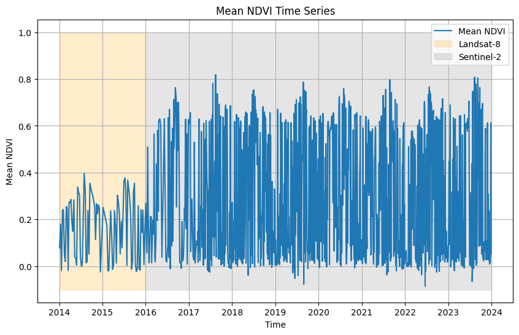

# Using `load_stac` in openEO for accessing external datasets (Landsat 8 example)

Accessing and analyzing diverse, ever-growing datasets is a significant challenge in remote sensing. These datasets are often scattered across various sources, making them difficult to integrate. To address this issue, the openEO team introduced a new feature called [`load_stac`](https://open-eo.github.io/openeo-python-client/api-processes.html#openeo.processes.load_stac).

A recent [openEO notebook](https://github.com/Open-EO/openeo-community-examples/tree/main/python/LoadStac) demonstrates how to use the `load_stac` feature by creating an STAC item to integrate personal files. Using that notebook as a reference, here we explain how to retrieve similarly created external collections and combine them with existing datasets in the openEO ecosystem for basic analysis.

#### Establishing a connection to openEO

As the first step in using openEO, we will establish a connection to the Copernicus Data Space Ecosystem (CDSE) openEO Federation endpoint and authenticate the session via OpenID Connect.

``` python
import openeo

connection = openeo.connect("openeofed.dataspace.copernicus.eu").authenticate_oidc()
```

    Authenticated using refresh token.

This step sets up the required connection to the CDSE backend.

#### Loading Collections

In this example we will calculate the NDVI over a 10 year period. Since Sentinel-2 data has only been available from 2015 onward, we chose to use Landsat-8 for the NDVI calculation. Although a subset of Landsat-8 data is already available in CDSE, we fetch it from the Microsoft Planetary Computer STAC to demonstrate how to work with external datasets.

To load the landsat data for the targeted spatial-temporal period, we make used of the `load_stac` feature to access data from an external STAC source. Be sure to specify the bands and filter for Landsat-8 data accordingly.

Please note that `load_stac` reads data from external providers and writes it to the CDSE backend before processing. For large areas, this can lead to slower execution times and potentially higher costs. Therefore, it is advisable to use this feature cautiously by filtering for specific bands and limiting the spatial extent to avoid processing vast areas.

Also visit the [Microsoft Planetary Computer STAC documentation](https://planetarycomputer.microsoft.com/docs/reference/stac/) for more information.

``` python
landsat = (
    "https://planetarycomputer.microsoft.com/api/stac/v1/collections/landsat-c2-l2"
)
landsat_cube = connection.load_stac(
    landsat,
    spatial_extent={"west": 5.0, "south": 51.21, "east": 5.05, "north": 51.25},
    temporal_extent=["2014-01-01", "2015-12-31"],
    bands=["OLI_B4", "OLI_B5"],
    properties={"platform": lambda x: x == "landsat-8"},
)
```

Using `load_stac`, we could fetch data from an external provider (Microsoft Planetary Computer in this case) and filter it according to our requirements. Similarly, publicly available data stored in STAC collections or items can be accessed using this openEO feature for further analysis. For the NDVI calculation, we use the Red (OLI_B4) and NIR (OLI_B5) bands from the Landsat-8 collection.

*Please note that in this example when using Landsat-8 from the Microsoft Planetary Computer, the STAC metadata is not fully aligned with the standard in the naming of variable, so you might see a RecursionError. You can ignore this error as it does not affect the analysis.*

For the same spatial extent but with a different temporal range, we then load the Sentinel-2 collection directly from the CDSE. We select specific bands for NDVI calculation: Red (B04) and NIR (B08).

``` python
s2_cube = connection.load_collection(
    "SENTINEL2_L2A",
    temporal_extent=["2016-01-01", "2023-12-31"],
    spatial_extent={"west": 5.0, "south": 51.21, "east": 5.05, "north": 51.25},
    bands=["B04", "B08"],
)
```

This code snippet uses the `load_collection` function to access Sentinel-2 data for the specified spatial and temporal extents, focusing on the bands required for NDVI analysis.

#### Compute NDVI for both datasets

Next, we compute the NDVI (Normalized Difference Vegetation Index) for both Sentinel-2 and Landsat-8 datasets.

``` python
# Compute NDVI for Landsat-8
landsat_cube = landsat_cube.ndvi(nir="OLI_B5", red="OLI_B4")
```

``` python
# Compute NDVI for Sentinel-2
s2_cube = s2_cube.ndvi()
```

The `.ndvi()` process in openEO is used here to compute the NDVI. While this process automatically identifies the NIR and Red bands for Sentinel-2, it is advisable to specify them explicitly. Additionally, users can also perform custom band math using simple mathematical operations.

#### Merge the collections

Once both NDVI datasets are prepared, we can merge them and aggregate the results over a specific period, such as daily, weekly, monthly, or seasonally, depending on your interest.

``` python
merged_cube = s2_cube.merge_cubes(landsat_cube)
```

#### Execute Batch Job and Save Output

Finally, we execute the batch job and save the output to a file. For more information about batch jobs, visit [this link](https://open-eo.github.io/openeo-python-client/batch_jobs.html).

``` python
job = merged_cube.execute_batch(title="Landsat8_Sen2_NDVI", outputfile="Merged_NDVI.nc")
```

    0:00:00 Job 'j-240916db44c3476abb78b2712d685a03': send 'start'
    0:00:15 Job 'j-240916db44c3476abb78b2712d685a03': created (progress 0%)
    0:00:21 Job 'j-240916db44c3476abb78b2712d685a03': created (progress 0%)
    0:00:27 Job 'j-240916db44c3476abb78b2712d685a03': created (progress 0%)
    0:00:35 Job 'j-240916db44c3476abb78b2712d685a03': running (progress N/A)
    0:00:45 Job 'j-240916db44c3476abb78b2712d685a03': running (progress N/A)
    0:00:58 Job 'j-240916db44c3476abb78b2712d685a03': running (progress N/A)
    0:01:13 Job 'j-240916db44c3476abb78b2712d685a03': running (progress N/A)
    0:01:32 Job 'j-240916db44c3476abb78b2712d685a03': running (progress N/A)
    0:01:57 Job 'j-240916db44c3476abb78b2712d685a03': running (progress N/A)
    0:02:27 Job 'j-240916db44c3476abb78b2712d685a03': running (progress N/A)
    0:03:04 Job 'j-240916db44c3476abb78b2712d685a03': running (progress N/A)
    0:03:51 Job 'j-240916db44c3476abb78b2712d685a03': running (progress N/A)
    0:04:50 Job 'j-240916db44c3476abb78b2712d685a03': running (progress N/A)
    0:05:53 Job 'j-240916db44c3476abb78b2712d685a03': running (progress N/A)
    0:06:53 Job 'j-240916db44c3476abb78b2712d685a03': running (progress N/A)
    0:07:53 Job 'j-240916db44c3476abb78b2712d685a03': running (progress N/A)
    0:08:54 Job 'j-240916db44c3476abb78b2712d685a03': running (progress N/A)
    0:09:54 Job 'j-240916db44c3476abb78b2712d685a03': running (progress N/A)
    0:10:54 Job 'j-240916db44c3476abb78b2712d685a03': running (progress N/A)
    0:11:55 Job 'j-240916db44c3476abb78b2712d685a03': running (progress N/A)
    0:12:55 Job 'j-240916db44c3476abb78b2712d685a03': running (progress N/A)
    0:13:55 Job 'j-240916db44c3476abb78b2712d685a03': running (progress N/A)
    0:14:55 Job 'j-240916db44c3476abb78b2712d685a03': running (progress N/A)
    0:15:55 Job 'j-240916db44c3476abb78b2712d685a03': running (progress N/A)
    0:16:56 Job 'j-240916db44c3476abb78b2712d685a03': running (progress N/A)
    0:17:56 Job 'j-240916db44c3476abb78b2712d685a03': running (progress N/A)
    0:18:57 Job 'j-240916db44c3476abb78b2712d685a03': running (progress N/A)
    0:19:57 Job 'j-240916db44c3476abb78b2712d685a03': running (progress N/A)
    0:20:57 Job 'j-240916db44c3476abb78b2712d685a03': running (progress N/A)
    0:21:58 Job 'j-240916db44c3476abb78b2712d685a03': running (progress N/A)
    0:22:58 Job 'j-240916db44c3476abb78b2712d685a03': running (progress N/A)
    0:23:58 Job 'j-240916db44c3476abb78b2712d685a03': running (progress N/A)
    0:25:09 Job 'j-240916db44c3476abb78b2712d685a03': running (progress N/A)
    0:26:09 Job 'j-240916db44c3476abb78b2712d685a03': running (progress N/A)
    0:27:10 Job 'j-240916db44c3476abb78b2712d685a03': finished (progress 100%)

The execute_batch function runs the entire process and saves the resulting data to a file (`Merged_Landsat8Sen2.nc`) in NetCDF format, which can be used for further analysis or visualization.

``` python
import xarray as xr
import matplotlib.pyplot as plt
import numpy as np

ndvi = xr.load_dataset("Merged_NDVI.nc")
ndvi
```

![](data:image/svg+xml;base64,PHN2ZyBzdHlsZT0icG9zaXRpb246IGFic29sdXRlOyB3aWR0aDogMDsgaGVpZ2h0OiAwOyBvdmVyZmxvdzogaGlkZGVuIj4KPGRlZnM+CjxzeW1ib2wgaWQ9Imljb24tZGF0YWJhc2UiIHZpZXdib3g9IjAgMCAzMiAzMiI+CjxwYXRoIGQ9Ik0xNiAwYy04LjgzNyAwLTE2IDIuMjM5LTE2IDV2NGMwIDIuNzYxIDcuMTYzIDUgMTYgNXMxNi0yLjIzOSAxNi01di00YzAtMi43NjEtNy4xNjMtNS0xNi01eiIgLz4KPHBhdGggZD0iTTE2IDE3Yy04LjgzNyAwLTE2LTIuMjM5LTE2LTV2NmMwIDIuNzYxIDcuMTYzIDUgMTYgNXMxNi0yLjIzOSAxNi01di02YzAgMi43NjEtNy4xNjMgNS0xNiA1eiIgLz4KPHBhdGggZD0iTTE2IDI2Yy04LjgzNyAwLTE2LTIuMjM5LTE2LTV2NmMwIDIuNzYxIDcuMTYzIDUgMTYgNXMxNi0yLjIzOSAxNi01di02YzAgMi43NjEtNy4xNjMgNS0xNiA1eiIgLz4KPC9zeW1ib2w+CjxzeW1ib2wgaWQ9Imljb24tZmlsZS10ZXh0MiIgdmlld2JveD0iMCAwIDMyIDMyIj4KPHBhdGggZD0iTTI4LjY4MSA3LjE1OWMtMC42OTQtMC45NDctMS42NjItMi4wNTMtMi43MjQtMy4xMTZzLTIuMTY5LTIuMDMwLTMuMTE2LTIuNzI0Yy0xLjYxMi0xLjE4Mi0yLjM5My0xLjMxOS0yLjg0MS0xLjMxOWgtMTUuNWMtMS4zNzggMC0yLjUgMS4xMjEtMi41IDIuNXYyN2MwIDEuMzc4IDEuMTIyIDIuNSAyLjUgMi41aDIzYzEuMzc4IDAgMi41LTEuMTIyIDIuNS0yLjV2LTE5LjVjMC0wLjQ0OC0wLjEzNy0xLjIzLTEuMzE5LTIuODQxek0yNC41NDMgNS40NTdjMC45NTkgMC45NTkgMS43MTIgMS44MjUgMi4yNjggMi41NDNoLTQuODExdi00LjgxMWMwLjcxOCAwLjU1NiAxLjU4NCAxLjMwOSAyLjU0MyAyLjI2OHpNMjggMjkuNWMwIDAuMjcxLTAuMjI5IDAuNS0wLjUgMC41aC0yM2MtMC4yNzEgMC0wLjUtMC4yMjktMC41LTAuNXYtMjdjMC0wLjI3MSAwLjIyOS0wLjUgMC41LTAuNSAwIDAgMTUuNDk5LTAgMTUuNSAwdjdjMCAwLjU1MiAwLjQ0OCAxIDEgMWg3djE5LjV6IiAvPgo8cGF0aCBkPSJNMjMgMjZoLTE0Yy0wLjU1MiAwLTEtMC40NDgtMS0xczAuNDQ4LTEgMS0xaDE0YzAuNTUyIDAgMSAwLjQ0OCAxIDFzLTAuNDQ4IDEtMSAxeiIgLz4KPHBhdGggZD0iTTIzIDIyaC0xNGMtMC41NTIgMC0xLTAuNDQ4LTEtMXMwLjQ0OC0xIDEtMWgxNGMwLjU1MiAwIDEgMC40NDggMSAxcy0wLjQ0OCAxLTEgMXoiIC8+CjxwYXRoIGQ9Ik0yMyAxOGgtMTRjLTAuNTUyIDAtMS0wLjQ0OC0xLTFzMC40NDgtMSAxLTFoMTRjMC41NTIgMCAxIDAuNDQ4IDEgMXMtMC40NDggMS0xIDF6IiAvPgo8L3N5bWJvbD4KPC9kZWZzPgo8L3N2Zz4=)

``` xr-text-repr-fallback
<xarray.Dataset> Size: 2GB
Dimensions:        (t: 1141, x: 363, y: 456)
Coordinates:
  * t              (t) datetime64[ns] 9kB 2014-01-04 2014-01-13 ... 2023-12-28
  * x              (x) float64 3kB 6.396e+05 6.396e+05 ... 6.432e+05 6.432e+05
  * y              (y) float64 4kB 5.68e+06 5.68e+06 ... 5.675e+06 5.675e+06
Data variables:
    crs            |S1 1B b''
    var            (t, y, x) float32 755MB nan nan nan ... 0.004835 0.00841
    unkown_band_1  (t, y, x) float32 755MB 0.05641 0.05791 0.05791 ... nan nan
Attributes:
    Conventions:  CF-1.9
    institution:  openEO platform - Geotrellis backend: 0.40.1a1
    description:  
    title:        
```

xarray.Dataset

Dimensions:

- t: 1141
- x: 363
- y: 456

Coordinates: (3)

t

\(t\)

datetime64\[ns\]

2014-01-04 ... 2023-12-28


standard_name :  
t

long_name :  
t

axis :  
T

    array(['2014-01-04T00:00:00.000000000', '2014-01-13T00:00:00.000000000',
           '2014-01-20T00:00:00.000000000', ..., '2023-12-23T00:00:00.000000000',
           '2023-12-26T00:00:00.000000000', '2023-12-28T00:00:00.000000000'],
          dtype='datetime64[ns]')

x

\(x\)

float64

6.396e+05 6.396e+05 ... 6.432e+05


standard_name :  
projection_x_coordinate

long_name :  
x coordinate of projection

units :  
m

    array([639575., 639585., 639595., ..., 643175., 643185., 643195.])

y

\(y\)

float64

5.68e+06 5.68e+06 ... 5.675e+06


standard_name :  
projection_y_coordinate

long_name :  
y coordinate of projection

units :  
m

    array([5679625., 5679615., 5679605., ..., 5675095., 5675085., 5675075.])

Data variables: (3)

crs

()

\|S1

b''


crs_wkt :  
PROJCS\["WGS 84 / UTM zone 31N", GEOGCS\["WGS 84", DATUM\["World Geodetic System 1984", SPHEROID\["WGS 84", 6378137.0, 298.257223563, AUTHORITY\["EPSG","7030"\]\], AUTHORITY\["EPSG","6326"\]\], PRIMEM\["Greenwich", 0.0, AUTHORITY\["EPSG","8901"\]\], UNIT\["degree", 0.017453292519943295\], AXIS\["Geodetic longitude", EAST\], AXIS\["Geodetic latitude", NORTH\], AUTHORITY\["EPSG","4326"\]\], PROJECTION\["Transverse_Mercator", AUTHORITY\["EPSG","9807"\]\], PARAMETER\["central_meridian", 3.0\], PARAMETER\["latitude_of_origin", 0.0\], PARAMETER\["scale_factor", 0.9996\], PARAMETER\["false_easting", 500000.0\], PARAMETER\["false_northing", 0.0\], UNIT\["m", 1.0\], AXIS\["Easting", EAST\], AXIS\["Northing", NORTH\], AUTHORITY\["EPSG","32631"\]\]

spatial_ref :  
PROJCS\["WGS 84 / UTM zone 31N", GEOGCS\["WGS 84", DATUM\["World Geodetic System 1984", SPHEROID\["WGS 84", 6378137.0, 298.257223563, AUTHORITY\["EPSG","7030"\]\], AUTHORITY\["EPSG","6326"\]\], PRIMEM\["Greenwich", 0.0, AUTHORITY\["EPSG","8901"\]\], UNIT\["degree", 0.017453292519943295\], AXIS\["Geodetic longitude", EAST\], AXIS\["Geodetic latitude", NORTH\], AUTHORITY\["EPSG","4326"\]\], PROJECTION\["Transverse_Mercator", AUTHORITY\["EPSG","9807"\]\], PARAMETER\["central_meridian", 3.0\], PARAMETER\["latitude_of_origin", 0.0\], PARAMETER\["scale_factor", 0.9996\], PARAMETER\["false_easting", 500000.0\], PARAMETER\["false_northing", 0.0\], UNIT\["m", 1.0\], AXIS\["Easting", EAST\], AXIS\["Northing", NORTH\], AUTHORITY\["EPSG","32631"\]\]

    array(b'', dtype='|S1')

var

(t, y, x)

float32

nan nan nan ... 0.004835 0.00841


long_name :  
var

units :  

grid_mapping :  
crs

    array([[[        nan,         nan,         nan, ...,         nan,
                     nan,         nan],
            [        nan,         nan,         nan, ...,         nan,
                     nan,         nan],
            [        nan,         nan,         nan, ...,         nan,
                     nan,         nan],
            ...,
            [        nan,         nan,         nan, ...,         nan,
                     nan,         nan],
            [        nan,         nan,         nan, ...,         nan,
                     nan,         nan],
            [        nan,         nan,         nan, ...,         nan,
                     nan,         nan]],

           [[        nan,         nan,         nan, ...,         nan,
                     nan,         nan],
            [        nan,         nan,         nan, ...,         nan,
                     nan,         nan],
            [        nan,         nan,         nan, ...,         nan,
                     nan,         nan],
    ...
            [ 0.8487792 ,  0.8501411 ,  0.84743124, ...,  0.8032527 ,
              0.8411107 ,  0.78111446],
            [ 0.8568019 ,  0.8728504 ,  0.8679803 , ...,  0.7521079 ,
              0.7665904 ,  0.753616  ],
            [ 0.86858314,  0.875502  ,  0.8881389 , ...,  0.7536424 ,
              0.76668674,  0.74184597]],

           [[ 0.03780291,  0.0323604 ,  0.04238329, ...,  0.02962085,
              0.03181427,  0.04063205],
            [ 0.04886618,  0.04515727,  0.03821461, ...,  0.0285881 ,
              0.03309759,  0.04700253],
            [ 0.0455408 ,  0.04326329,  0.04134212, ...,  0.03007519,
              0.03360632,  0.05097156],
            ...,
            [ 0.06256983,  0.083878  ,  0.08319559, ...,  0.00130378,
             -0.00798655, -0.00764588],
            [ 0.05696559,  0.08111051,  0.06889128, ...,  0.00670541,
              0.00431034,  0.00122699],
            [ 0.05561735,  0.06462213,  0.05920345, ..., -0.00557103,
              0.00483516,  0.00841043]]], dtype=float32)

unkown_band_1

(t, y, x)

float32

0.05641 0.05791 0.05791 ... nan nan


long_name :  
unkown_band_1

units :  

grid_mapping :  
crs

    array([[[ 0.05641224,  0.05790974,  0.05790974, ...,  0.08906379,
              0.091269  ,  0.091269  ],
            [ 0.05275498,  0.0571252 ,  0.0571252 , ...,  0.08891698,
              0.08666292,  0.08666292],
            [ 0.05275498,  0.0571252 ,  0.0571252 , ...,  0.08891698,
              0.08666292,  0.08666292],
            ...,
            [ 0.06982369,  0.06697137,  0.06697137, ...,  0.10303383,
              0.10529513,  0.10529513],
            [ 0.07025082,  0.06798296,  0.06798296, ...,  0.09932761,
              0.10055169,  0.10055169],
            [ 0.07025082,  0.06798296,  0.06798296, ...,  0.09932761,
              0.10055169,  0.10055169]],

           [[        nan,         nan,         nan, ...,  0.18235442,
              0.18235442,  0.18235442],
            [        nan,         nan,         nan, ...,  0.18235442,
              0.18235442,  0.18235442],
            [        nan,         nan,         nan, ...,  0.16755846,
              0.16755846,  0.16755846],
    ...
            [        nan,         nan,         nan, ...,         nan,
                     nan,         nan],
            [        nan,         nan,         nan, ...,         nan,
                     nan,         nan],
            [        nan,         nan,         nan, ...,         nan,
                     nan,         nan]],

           [[        nan,         nan,         nan, ...,         nan,
                     nan,         nan],
            [        nan,         nan,         nan, ...,         nan,
                     nan,         nan],
            [        nan,         nan,         nan, ...,         nan,
                     nan,         nan],
            ...,
            [        nan,         nan,         nan, ...,         nan,
                     nan,         nan],
            [        nan,         nan,         nan, ...,         nan,
                     nan,         nan],
            [        nan,         nan,         nan, ...,         nan,
                     nan,         nan]]], dtype=float32)

Indexes: (3)

t

PandasIndex


    PandasIndex(DatetimeIndex(['2014-01-04', '2014-01-13', '2014-01-20', '2014-01-29',
                   '2014-02-05', '2014-02-14', '2014-02-21', '2014-03-02',
                   '2014-03-09', '2014-03-18',
                   ...
                   '2023-12-06', '2023-12-08', '2023-12-11', '2023-12-13',
                   '2023-12-16', '2023-12-18', '2023-12-21', '2023-12-23',
                   '2023-12-26', '2023-12-28'],
                  dtype='datetime64[ns]', name='t', length=1141, freq=None))

x

PandasIndex


    PandasIndex(Index([639575.0, 639585.0, 639595.0, 639605.0, 639615.0, 639625.0, 639635.0,
           639645.0, 639655.0, 639665.0,
           ...
           643105.0, 643115.0, 643125.0, 643135.0, 643145.0, 643155.0, 643165.0,
           643175.0, 643185.0, 643195.0],
          dtype='float64', name='x', length=363))

y

PandasIndex


    PandasIndex(Index([5679625.0, 5679615.0, 5679605.0, 5679595.0, 5679585.0, 5679575.0,
           5679565.0, 5679555.0, 5679545.0, 5679535.0,
           ...
           5675165.0, 5675155.0, 5675145.0, 5675135.0, 5675125.0, 5675115.0,
           5675105.0, 5675095.0, 5675085.0, 5675075.0],
          dtype='float64', name='y', length=456))

Attributes: (4)

Conventions :  
CF-1.9

institution :  
openEO platform - Geotrellis backend: 0.40.1a1

description :  

title :  

``` python
# we downloaded them as separate bands, so now lets merge them for a single plot

def nanmedian_two_bands(b1, b2):
    return np.nanmedian(np.array([b1, b2]), axis=0)

# Use apply_ufunc to apply np.nanmedian element-wise
nanmedian_band = xr.apply_ufunc(
    nanmedian_two_bands,
    ndvi["var"],
    ndvi["unkown_band_1"],
    dask="parallelized",  # Enables parallel computation if using Dask-backed data
    output_dtypes=[ndvi["var"].dtype],  # Ensures output type matches input band type
)

# Optionally add the nanmedian result to the Dataset
ndvi["NDVI"] = nanmedian_band
```

``` python
ndvi_var = ndvi["NDVI"]

# Compute the mean NDVI over the spatial dimensions (x and y)
mean_ndvi = ndvi_var.mean(dim=["x", "y"])

# Plot the mean NDVI time series
plt.figure(figsize=(10, 6))
mean_ndvi.plot()
plt.title("Mean NDVI Time Series")
plt.xlabel("Time")
plt.ylabel("Mean NDVI")
plt.fill_betweenx(
    [-0.1, 1],
    np.datetime64("2014-01-01"),
    np.datetime64("2015-12-31"),
    color="orange",
    alpha=0.2,
)
plt.fill_betweenx(
    [-0.1, 1],
    np.datetime64("2016-01-01"),
    np.datetime64("2023-12-31"),
    color="grey",
    alpha=0.2,
)
plt.legend(["Mean NDVI", "Landsat-8", "Sentinel-2"])
plt.grid(True)
plt.show()
```



Please note that the example provided here is a basic demonstration of how to use the `load_stac` feature in openEO.

Users can also chose to use the Landsat-8 data available in CDSE directly, or access other external datasets using the `load_stac` feature for further analysis. In addition, the [Harmonized Landsat Sentinel-2 (HLS)](https://planetarycomputer.microsoft.com/dataset/storage/hls)(is it possible to perform this type of processing with openeo processes instead?) dataset could be directly used instead of above usecase, when available as a STAC collection.
