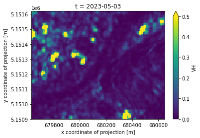
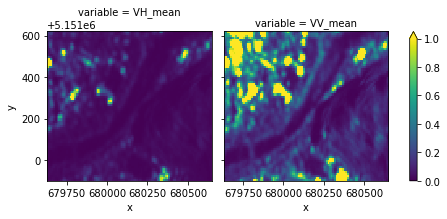
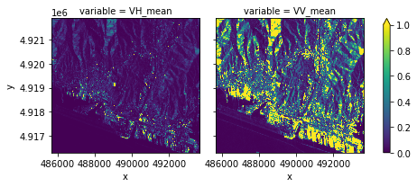
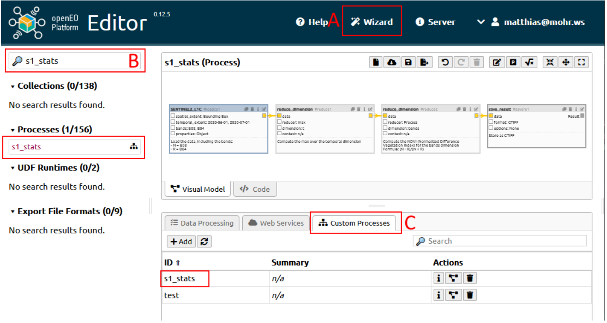

# Publishing an openEO workflow as a User-Defined-Process (UDP)

In this notebook, we want to show how to create an openEO User Defined Process(UDP). Here, we make use of an apply_dimension process that applies a process to all values along a dimension of a data cube.

The notebook involves a section on creating a concrete datacube, inspecting netCDF downloads, and developing a parameterized version stored as a UDP.

``` python
import json
import openeo
import xarray
import matplotlib.pyplot as plt
from utils import *

from openeo.processes import array_create, array_concat, ProcessBuilder
from openeo.api.process import Parameter
```

If you have a local JupyterLab instance running, you need to install the following libraries first: openeo, xarray, ipyleaflet, shapely and matplotlib:

`pip install openeo xarray shapely ipyleaflet matplotlib`

Make sure to restart the kernel and refresh the webpage.

``` python
# Set some defaults for plots
plt.rcParams["figure.figsize"] = [5.0, 3.0]
plt.rcParams["figure.dpi"] = 75
```

Connect to the openEO Platform backend (at [openeo.cloud](https://openeo.cloud/)) and authenticate with OIDC.

``` python
connection = openeo.connect("openeofed.dataspace.copernicus.eu").authenticate_oidc()
```

    Authenticated using refresh token.

## Inspect raw data

Load initial data cube with raw `S1_GRD_SIGMA0_ASCENDING` data for a certain spatio-temporal extent.

``` python
center = [46.49, 11.35]
zoom = 15

eoMap = openeoMap(center, zoom)
eoMap.map
```

``` python
bbox = eoMap.getBbox()
print("west", bbox[0], "\neast", bbox[2], "\nsouth", bbox[1], "\nnorth", bbox[3])
```

    west 11.3409 
    east 11.353779 
    south 46.48772 
    north 46.493924

``` python
spatial_extent = {
    "west": bbox[0],
    "east": bbox[2],
    "south": bbox[1],
    "north": bbox[3],
    "crs": 4326,
}
temporal_extent = ["2023-05-01", "2023-07-01"]
```

``` python
s1_raw = connection.load_collection(
    collection_id="SENTINEL1_GRD_SIGMA0",
    temporal_extent=temporal_extent,
    spatial_extent=spatial_extent,
    bands=["VH", "VV"],
)
```

Let’s download this data cube synchronously as a netCDF file.

This download command triggers the actual processing on the back-end: it sends the process graph to the back-end and waits for the result. It is a synchronous operation (the download() call blocks until the result is fully downloaded) and because we work on a small spatio-temporal extent, this should only take a couple of seconds.

``` python
%%time
s1_raw.download("s1sar-raw.nc")
```

    CPU times: user 36 ms, sys: 12 ms, total: 48 ms
    Wall time: 1min 3s

However, [batch job-based execution](https://open-eo.github.io/openeo-python-client/batch_jobs.html) is preferred when it is relatively larger spatial/temporal extent and the process may take some time to process.

``` python
ds = xarray.load_dataset("s1sar-raw.nc")
ds
```

![](data:image/svg+xml;base64,PHN2ZyBzdHlsZT0icG9zaXRpb246IGFic29sdXRlOyB3aWR0aDogMDsgaGVpZ2h0OiAwOyBvdmVyZmxvdzogaGlkZGVuIj4KPGRlZnM+CjxzeW1ib2wgaWQ9Imljb24tZGF0YWJhc2UiIHZpZXdib3g9IjAgMCAzMiAzMiI+CjxwYXRoIGQ9Ik0xNiAwYy04LjgzNyAwLTE2IDIuMjM5LTE2IDV2NGMwIDIuNzYxIDcuMTYzIDUgMTYgNXMxNi0yLjIzOSAxNi01di00YzAtMi43NjEtNy4xNjMtNS0xNi01eiIgLz4KPHBhdGggZD0iTTE2IDE3Yy04LjgzNyAwLTE2LTIuMjM5LTE2LTV2NmMwIDIuNzYxIDcuMTYzIDUgMTYgNXMxNi0yLjIzOSAxNi01di02YzAgMi43NjEtNy4xNjMgNS0xNiA1eiIgLz4KPHBhdGggZD0iTTE2IDI2Yy04LjgzNyAwLTE2LTIuMjM5LTE2LTV2NmMwIDIuNzYxIDcuMTYzIDUgMTYgNXMxNi0yLjIzOSAxNi01di02YzAgMi43NjEtNy4xNjMgNS0xNiA1eiIgLz4KPC9zeW1ib2w+CjxzeW1ib2wgaWQ9Imljb24tZmlsZS10ZXh0MiIgdmlld2JveD0iMCAwIDMyIDMyIj4KPHBhdGggZD0iTTI4LjY4MSA3LjE1OWMtMC42OTQtMC45NDctMS42NjItMi4wNTMtMi43MjQtMy4xMTZzLTIuMTY5LTIuMDMwLTMuMTE2LTIuNzI0Yy0xLjYxMi0xLjE4Mi0yLjM5My0xLjMxOS0yLjg0MS0xLjMxOWgtMTUuNWMtMS4zNzggMC0yLjUgMS4xMjEtMi41IDIuNXYyN2MwIDEuMzc4IDEuMTIyIDIuNSAyLjUgMi41aDIzYzEuMzc4IDAgMi41LTEuMTIyIDIuNS0yLjV2LTE5LjVjMC0wLjQ0OC0wLjEzNy0xLjIzLTEuMzE5LTIuODQxek0yNC41NDMgNS40NTdjMC45NTkgMC45NTkgMS43MTIgMS44MjUgMi4yNjggMi41NDNoLTQuODExdi00LjgxMWMwLjcxOCAwLjU1NiAxLjU4NCAxLjMwOSAyLjU0MyAyLjI2OHpNMjggMjkuNWMwIDAuMjcxLTAuMjI5IDAuNS0wLjUgMC41aC0yM2MtMC4yNzEgMC0wLjUtMC4yMjktMC41LTAuNXYtMjdjMC0wLjI3MSAwLjIyOS0wLjUgMC41LTAuNSAwIDAgMTUuNDk5LTAgMTUuNSAwdjdjMCAwLjU1MiAwLjQ0OCAxIDEgMWg3djE5LjV6IiAvPgo8cGF0aCBkPSJNMjMgMjZoLTE0Yy0wLjU1MiAwLTEtMC40NDgtMS0xczAuNDQ4LTEgMS0xaDE0YzAuNTUyIDAgMSAwLjQ0OCAxIDFzLTAuNDQ4IDEtMSAxeiIgLz4KPHBhdGggZD0iTTIzIDIyaC0xNGMtMC41NTIgMC0xLTAuNDQ4LTEtMXMwLjQ0OC0xIDEtMWgxNGMwLjU1MiAwIDEgMC40NDggMSAxcy0wLjQ0OCAxLTEgMXoiIC8+CjxwYXRoIGQ9Ik0yMyAxOGgtMTRjLTAuNTUyIDAtMS0wLjQ0OC0xLTFzMC40NDgtMSAxLTFoMTRjMC41NTIgMCAxIDAuNDQ4IDEgMXMtMC40NDggMS0xIDF6IiAvPgo8L3N5bWJvbD4KPC9kZWZzPgo8L3N2Zz4=)

``` xr-text-repr-fallback
<xarray.Dataset>
Dimensions:  (t: 10, x: 102, y: 72)
Coordinates:
  * t        (t) datetime64[ns] 2023-05-03 2023-05-10 ... 2023-06-20 2023-06-27
  * x        (x) float64 6.796e+05 6.796e+05 6.797e+05 ... 6.806e+05 6.806e+05
  * y        (y) float64 5.152e+06 5.152e+06 5.152e+06 ... 5.151e+06 5.151e+06
Data variables:
    crs      |S1 b''
    VH       (t, y, x) float32 0.3498 0.2405 0.2339 ... 0.003244 0.003791
    VV       (t, y, x) float32 0.356 0.356 0.809 ... 0.08211 0.01796 0.02538
Attributes:
    Conventions:  CF-1.9
    institution:  openEO platform
```

xarray.Dataset

Dimensions:

- t: 10
- x: 102
- y: 72

Coordinates: (3)

t

\(t\)

datetime64\[ns\]

2023-05-03 ... 2023-06-27


standard_name :  
t

long_name :  
t

axis :  
T

    array(['2023-05-03T00:00:00.000000000', '2023-05-10T00:00:00.000000000',
           '2023-05-15T00:00:00.000000000', '2023-05-22T00:00:00.000000000',
           '2023-05-27T00:00:00.000000000', '2023-06-03T00:00:00.000000000',
           '2023-06-08T00:00:00.000000000', '2023-06-15T00:00:00.000000000',
           '2023-06-20T00:00:00.000000000', '2023-06-27T00:00:00.000000000'],
          dtype='datetime64[ns]')

x

\(x\)

float64

6.796e+05 6.796e+05 ... 6.806e+05


standard_name :  
projection_x_coordinate

long_name :  
x coordinate of projection

units :  
m

    array([679635., 679645., 679655., 679665., 679675., 679685., 679695., 679705.,
           679715., 679725., 679735., 679745., 679755., 679765., 679775., 679785.,
           679795., 679805., 679815., 679825., 679835., 679845., 679855., 679865.,
           679875., 679885., 679895., 679905., 679915., 679925., 679935., 679945.,
           679955., 679965., 679975., 679985., 679995., 680005., 680015., 680025.,
           680035., 680045., 680055., 680065., 680075., 680085., 680095., 680105.,
           680115., 680125., 680135., 680145., 680155., 680165., 680175., 680185.,
           680195., 680205., 680215., 680225., 680235., 680245., 680255., 680265.,
           680275., 680285., 680295., 680305., 680315., 680325., 680335., 680345.,
           680355., 680365., 680375., 680385., 680395., 680405., 680415., 680425.,
           680435., 680445., 680455., 680465., 680475., 680485., 680495., 680505.,
           680515., 680525., 680535., 680545., 680555., 680565., 680575., 680585.,
           680595., 680605., 680615., 680625., 680635., 680645.])

y

\(y\)

float64

5.152e+06 5.152e+06 ... 5.151e+06


standard_name :  
projection_y_coordinate

long_name :  
y coordinate of projection

units :  
m

    array([5151615., 5151605., 5151595., 5151585., 5151575., 5151565., 5151555.,
           5151545., 5151535., 5151525., 5151515., 5151505., 5151495., 5151485.,
           5151475., 5151465., 5151455., 5151445., 5151435., 5151425., 5151415.,
           5151405., 5151395., 5151385., 5151375., 5151365., 5151355., 5151345.,
           5151335., 5151325., 5151315., 5151305., 5151295., 5151285., 5151275.,
           5151265., 5151255., 5151245., 5151235., 5151225., 5151215., 5151205.,
           5151195., 5151185., 5151175., 5151165., 5151155., 5151145., 5151135.,
           5151125., 5151115., 5151105., 5151095., 5151085., 5151075., 5151065.,
           5151055., 5151045., 5151035., 5151025., 5151015., 5151005., 5150995.,
           5150985., 5150975., 5150965., 5150955., 5150945., 5150935., 5150925.,
           5150915., 5150905.])

Data variables: (3)

crs

()

\|S1

b''


crs_wkt :  
PROJCS\["WGS 84 / UTM zone 32N", GEOGCS\["WGS 84", DATUM\["World Geodetic System 1984", SPHEROID\["WGS 84", 6378137.0, 298.257223563, AUTHORITY\["EPSG","7030"\]\], AUTHORITY\["EPSG","6326"\]\], PRIMEM\["Greenwich", 0.0, AUTHORITY\["EPSG","8901"\]\], UNIT\["degree", 0.017453292519943295\], AXIS\["Geodetic longitude", EAST\], AXIS\["Geodetic latitude", NORTH\], AUTHORITY\["EPSG","4326"\]\], PROJECTION\["Transverse_Mercator", AUTHORITY\["EPSG","9807"\]\], PARAMETER\["central_meridian", 9.0\], PARAMETER\["latitude_of_origin", 0.0\], PARAMETER\["scale_factor", 0.9996\], PARAMETER\["false_easting", 500000.0\], PARAMETER\["false_northing", 0.0\], UNIT\["m", 1.0\], AXIS\["Easting", EAST\], AXIS\["Northing", NORTH\], AUTHORITY\["EPSG","32632"\]\]

spatial_ref :  
PROJCS\["WGS 84 / UTM zone 32N", GEOGCS\["WGS 84", DATUM\["World Geodetic System 1984", SPHEROID\["WGS 84", 6378137.0, 298.257223563, AUTHORITY\["EPSG","7030"\]\], AUTHORITY\["EPSG","6326"\]\], PRIMEM\["Greenwich", 0.0, AUTHORITY\["EPSG","8901"\]\], UNIT\["degree", 0.017453292519943295\], AXIS\["Geodetic longitude", EAST\], AXIS\["Geodetic latitude", NORTH\], AUTHORITY\["EPSG","4326"\]\], PROJECTION\["Transverse_Mercator", AUTHORITY\["EPSG","9807"\]\], PARAMETER\["central_meridian", 9.0\], PARAMETER\["latitude_of_origin", 0.0\], PARAMETER\["scale_factor", 0.9996\], PARAMETER\["false_easting", 500000.0\], PARAMETER\["false_northing", 0.0\], UNIT\["m", 1.0\], AXIS\["Easting", EAST\], AXIS\["Northing", NORTH\], AUTHORITY\["EPSG","32632"\]\]

    array(b'', dtype='|S1')

VH

(t, y, x)

float32

0.3498 0.2405 ... 0.003244 0.003791


long_name :  
VH

units :  

grid_mapping :  
crs

    array([[[0.3497991 , 0.240497  , 0.23386185, ..., 0.00583607,
             0.01114625, 0.01180739],
            [0.21625957, 0.22582962, 0.27404746, ..., 0.01413637,
             0.01605362, 0.02861624],
            [0.21343715, 0.15391256, 0.1240928 , ..., 0.01913997,
             0.02732791, 0.06749884],
            ...,
            [0.00975169, 0.00683461, 0.00614753, ..., 0.00683165,
             0.00199292, 0.01335612],
            [0.00809784, 0.00810335, 0.0087291 , ..., 0.00491569,
             0.00386301, 0.01294566],
            [0.00524675, 0.01154147, 0.0111153 , ..., 0.0089683 ,
             0.00496414, 0.00955531]],

           [[0.05656133, 0.07117188, 0.12068269, ..., 0.03960535,
             0.02495288, 0.01579268],
            [0.09063352, 0.06542234, 0.06321717, ..., 0.074268  ,
             0.04379695, 0.02947565],
            [0.08322202, 0.05983272, 0.06086417, ..., 0.06582635,
             0.04827164, 0.05478774],
    ...
            [0.02081406, 0.01660735, 0.00927989, ..., 0.00631161,
             0.00305758, 0.01555643],
            [0.01103931, 0.01278648, 0.0059051 , ..., 0.00733566,
             0.00785622, 0.01034456],
            [0.01053969, 0.01614342, 0.01426238, ..., 0.00684131,
             0.00470488, 0.00610361]],

           [[0.11626446, 0.10056856, 0.11683535, ..., 0.02819041,
             0.01466341, 0.0131486 ],
            [0.0842052 , 0.09308649, 0.08042921, ..., 0.0202127 ,
             0.01330222, 0.02162029],
            [0.11007892, 0.10168418, 0.07600641, ..., 0.01328301,
             0.06286687, 0.09713611],
            ...,
            [0.02943419, 0.03480869, 0.03886167, ..., 0.00179048,
             0.01113027, 0.00225721],
            [0.01721563, 0.02312371, 0.05103515, ..., 0.00179926,
             0.00703626, 0.00816311],
            [0.01056776, 0.01323224, 0.01524322, ..., 0.01825097,
             0.00324418, 0.00379148]]], dtype=float32)

VV

(t, y, x)

float32

0.356 0.356 ... 0.01796 0.02538


long_name :  
VV

units :  

grid_mapping :  
crs

    array([[[0.35600373, 0.3559536 , 0.80896807, ..., 0.3317161 ,
             0.16445988, 0.04160649],
            [0.61769664, 0.5578946 , 0.5050262 , ..., 0.22054403,
             0.10073389, 0.06029705],
            [0.84790504, 0.6570914 , 0.58305556, ..., 0.16478802,
             0.05791532, 0.0579203 ],
            ...,
            [0.1073544 , 0.10243879, 0.09812227, ..., 0.02534649,
             0.00922628, 0.01754627],
            [0.05122279, 0.06052506, 0.06034074, ..., 0.02414759,
             0.01439755, 0.01660094],
            [0.04778335, 0.05747797, 0.06184885, ..., 0.02491218,
             0.02271986, 0.01123959]],

           [[0.4726906 , 0.47493017, 0.82746756, ..., 0.22725   ,
             0.10644101, 0.04749625],
            [0.39489403, 0.413578  , 0.57773596, ..., 0.22964555,
             0.12250378, 0.06308025],
            [0.4349608 , 0.4983854 , 0.8121271 , ..., 0.14484774,
             0.11491019, 0.10635231],
    ...
            [0.10983685, 0.09603946, 0.08231169, ..., 0.07407534,
             0.02241934, 0.17368278],
            [0.05511827, 0.04872738, 0.0588784 , ..., 0.10989355,
             0.01494858, 0.09516722],
            [0.03997884, 0.03643978, 0.03698706, ..., 0.09584986,
             0.01911887, 0.03895752]],

           [[0.54582274, 0.8157599 , 1.0333498 , ..., 0.10145897,
             0.07532571, 0.0363849 ],
            [0.5309309 , 0.97571516, 1.3032748 , ..., 0.1301856 ,
             0.08703941, 0.06910698],
            [0.2805328 , 0.6426719 , 0.9920144 , ..., 0.13717869,
             0.18444583, 0.2799541 ],
            ...,
            [0.07433109, 0.08866205, 0.08638017, ..., 0.01586673,
             0.04167084, 0.0467084 ],
            [0.06121723, 0.12546135, 0.15904632, ..., 0.01122087,
             0.02190844, 0.06850047],
            [0.08498283, 0.09475873, 0.06337849, ..., 0.08210503,
             0.01796073, 0.02538092]]], dtype=float32)

Indexes: (3)

t

PandasIndex


    PandasIndex(DatetimeIndex(['2023-05-03', '2023-05-10', '2023-05-15', '2023-05-22',
                   '2023-05-27', '2023-06-03', '2023-06-08', '2023-06-15',
                   '2023-06-20', '2023-06-27'],
                  dtype='datetime64[ns]', name='t', freq=None))

x

PandasIndex


    PandasIndex(Index([679635.0, 679645.0, 679655.0, 679665.0, 679675.0, 679685.0, 679695.0,
           679705.0, 679715.0, 679725.0,
           ...
           680555.0, 680565.0, 680575.0, 680585.0, 680595.0, 680605.0, 680615.0,
           680625.0, 680635.0, 680645.0],
          dtype='float64', name='x', length=102))

y

PandasIndex


    PandasIndex(Index([5151615.0, 5151605.0, 5151595.0, 5151585.0, 5151575.0, 5151565.0,
           5151555.0, 5151545.0, 5151535.0, 5151525.0, 5151515.0, 5151505.0,
           5151495.0, 5151485.0, 5151475.0, 5151465.0, 5151455.0, 5151445.0,
           5151435.0, 5151425.0, 5151415.0, 5151405.0, 5151395.0, 5151385.0,
           5151375.0, 5151365.0, 5151355.0, 5151345.0, 5151335.0, 5151325.0,
           5151315.0, 5151305.0, 5151295.0, 5151285.0, 5151275.0, 5151265.0,
           5151255.0, 5151245.0, 5151235.0, 5151225.0, 5151215.0, 5151205.0,
           5151195.0, 5151185.0, 5151175.0, 5151165.0, 5151155.0, 5151145.0,
           5151135.0, 5151125.0, 5151115.0, 5151105.0, 5151095.0, 5151085.0,
           5151075.0, 5151065.0, 5151055.0, 5151045.0, 5151035.0, 5151025.0,
           5151015.0, 5151005.0, 5150995.0, 5150985.0, 5150975.0, 5150965.0,
           5150955.0, 5150945.0, 5150935.0, 5150925.0, 5150915.0, 5150905.0],
          dtype='float64', name='y'))

Attributes: (2)

Conventions :  
CF-1.9

institution :  
openEO platform

We got these observations dates:

``` python
ds.coords["t"].values
```

    array(['2023-05-03T00:00:00.000000000', '2023-05-10T00:00:00.000000000',
           '2023-05-15T00:00:00.000000000', '2023-05-22T00:00:00.000000000',
           '2023-05-27T00:00:00.000000000', '2023-06-03T00:00:00.000000000',
           '2023-06-08T00:00:00.000000000', '2023-06-15T00:00:00.000000000',
           '2023-06-20T00:00:00.000000000', '2023-06-27T00:00:00.000000000'],
          dtype='datetime64[ns]')

A quick plot for visual inspection.

``` python
ds["VH"].isel(t=0).plot(vmin=0, vmax=0.5)
```



This section presented a straightforward example of retrieving and analyzing a `S1_GRD_SIGMA0_ASCENDING` data cube from the backend within a defined area of interest during a specified time frame.

## Collect statistics

As part of more detailed processing within the openEO platform, we’ll gather temporal statistics using the `apply_dimension` process and a collection of statistical measures (minimum, maximum, quantiles, …).

``` python
def get_stats(data: ProcessBuilder) -> ProcessBuilder:
    """
    Collect stats for `data` (to be interpreted as an array of values along the "t" dimension).
    We should return a new array with the stats.
    """
    # Put some scalar stats (`min`, `max`, ... return a scalar value) in a new array
    scalar_stats = array_create(
        [
            data.min(),
            data.max(),
            data.mean(),
            data.sd(),
        ]
    )
    # The `quantiles` process returns an array on its own
    quantile_stats = data.quantiles([0.1, 0.5, 0.9])

    # Combine everything in a single array
    return array_concat(array1=scalar_stats, array2=quantile_stats)
```

``` python
s1_stats = s1_raw.apply_dimension(
    process=get_stats,
    dimension="t",
    target_dimension="bands",
)
# Rename band labels, pairing original band names with stat names
s1_stats = s1_stats.rename_labels(
    "bands",
    [
        f"{b}_{s}"
        for b in s1_raw.metadata.band_names
        for s in ["min", "max", "mean", "sd", "q10", "q50", "q90"]
    ],
)
```

``` python
# %%time
# s1_stats.download("s1grd-stats.nc")

# let's try batch job based execution in this process

job = s1_stats.execute_batch(
    title="Sentinel1_GRD_Statistics", outputfile="S1grd-stats.nc"
)


# # Alternatively if you want to seperately save process metadata
# s1_stats = s1_stats.save_result(format="netcdf")
# job = s1_stats.execute_batch(title="Sentinel 1 Statistics")

# # fetch your results

# results = job.get_results()
# results.download_files("output/batch_job")
```

    0:00:00 Job 'vito-j-231106d381904baaae522c536de54d94': send 'start'
    0:00:20 Job 'vito-j-231106d381904baaae522c536de54d94': queued (progress N/A)
    0:00:26 Job 'vito-j-231106d381904baaae522c536de54d94': queued (progress N/A)
    0:00:33 Job 'vito-j-231106d381904baaae522c536de54d94': queued (progress N/A)
    0:00:42 Job 'vito-j-231106d381904baaae522c536de54d94': queued (progress N/A)
    0:00:52 Job 'vito-j-231106d381904baaae522c536de54d94': queued (progress N/A)
    0:01:05 Job 'vito-j-231106d381904baaae522c536de54d94': queued (progress N/A)
    0:01:21 Job 'vito-j-231106d381904baaae522c536de54d94': queued (progress N/A)
    0:01:41 Job 'vito-j-231106d381904baaae522c536de54d94': queued (progress N/A)
    0:02:05 Job 'vito-j-231106d381904baaae522c536de54d94': queued (progress N/A)
    0:02:36 Job 'vito-j-231106d381904baaae522c536de54d94': finished (progress N/A)

``` python
assets = job.get_results().get_assets()
print(assets[0].href)
```

    https://openeo.vito.be/openeo/1.1/jobs/j-231106d381904baaae522c536de54d94/results/assets/MjUyNTRjNGRiMTkzMGNhNzQwNjg0OTJmM2NhOWIyZjM0N2JhMWU3ZTI0ZTAzY2U0OTMzOTlmZWE1NmVhOTQzN0BlZ2kuZXU%3D/2b1da7b8285e21cfcb5367297761fd95/openEO.nc?expires=1699889359

``` python
ds = xarray.load_dataset("S1grd-stats.nc").drop_vars("crs")
ds
```

![](data:image/svg+xml;base64,PHN2ZyBzdHlsZT0icG9zaXRpb246IGFic29sdXRlOyB3aWR0aDogMDsgaGVpZ2h0OiAwOyBvdmVyZmxvdzogaGlkZGVuIj4KPGRlZnM+CjxzeW1ib2wgaWQ9Imljb24tZGF0YWJhc2UiIHZpZXdib3g9IjAgMCAzMiAzMiI+CjxwYXRoIGQ9Ik0xNiAwYy04LjgzNyAwLTE2IDIuMjM5LTE2IDV2NGMwIDIuNzYxIDcuMTYzIDUgMTYgNXMxNi0yLjIzOSAxNi01di00YzAtMi43NjEtNy4xNjMtNS0xNi01eiIgLz4KPHBhdGggZD0iTTE2IDE3Yy04LjgzNyAwLTE2LTIuMjM5LTE2LTV2NmMwIDIuNzYxIDcuMTYzIDUgMTYgNXMxNi0yLjIzOSAxNi01di02YzAgMi43NjEtNy4xNjMgNS0xNiA1eiIgLz4KPHBhdGggZD0iTTE2IDI2Yy04LjgzNyAwLTE2LTIuMjM5LTE2LTV2NmMwIDIuNzYxIDcuMTYzIDUgMTYgNXMxNi0yLjIzOSAxNi01di02YzAgMi43NjEtNy4xNjMgNS0xNiA1eiIgLz4KPC9zeW1ib2w+CjxzeW1ib2wgaWQ9Imljb24tZmlsZS10ZXh0MiIgdmlld2JveD0iMCAwIDMyIDMyIj4KPHBhdGggZD0iTTI4LjY4MSA3LjE1OWMtMC42OTQtMC45NDctMS42NjItMi4wNTMtMi43MjQtMy4xMTZzLTIuMTY5LTIuMDMwLTMuMTE2LTIuNzI0Yy0xLjYxMi0xLjE4Mi0yLjM5My0xLjMxOS0yLjg0MS0xLjMxOWgtMTUuNWMtMS4zNzggMC0yLjUgMS4xMjEtMi41IDIuNXYyN2MwIDEuMzc4IDEuMTIyIDIuNSAyLjUgMi41aDIzYzEuMzc4IDAgMi41LTEuMTIyIDIuNS0yLjV2LTE5LjVjMC0wLjQ0OC0wLjEzNy0xLjIzLTEuMzE5LTIuODQxek0yNC41NDMgNS40NTdjMC45NTkgMC45NTkgMS43MTIgMS44MjUgMi4yNjggMi41NDNoLTQuODExdi00LjgxMWMwLjcxOCAwLjU1NiAxLjU4NCAxLjMwOSAyLjU0MyAyLjI2OHpNMjggMjkuNWMwIDAuMjcxLTAuMjI5IDAuNS0wLjUgMC41aC0yM2MtMC4yNzEgMC0wLjUtMC4yMjktMC41LTAuNXYtMjdjMC0wLjI3MSAwLjIyOS0wLjUgMC41LTAuNSAwIDAgMTUuNDk5LTAgMTUuNSAwdjdjMCAwLjU1MiAwLjQ0OCAxIDEgMWg3djE5LjV6IiAvPgo8cGF0aCBkPSJNMjMgMjZoLTE0Yy0wLjU1MiAwLTEtMC40NDgtMS0xczAuNDQ4LTEgMS0xaDE0YzAuNTUyIDAgMSAwLjQ0OCAxIDFzLTAuNDQ4IDEtMSAxeiIgLz4KPHBhdGggZD0iTTIzIDIyaC0xNGMtMC41NTIgMC0xLTAuNDQ4LTEtMXMwLjQ0OC0xIDEtMWgxNGMwLjU1MiAwIDEgMC40NDggMSAxcy0wLjQ0OCAxLTEgMXoiIC8+CjxwYXRoIGQ9Ik0yMyAxOGgtMTRjLTAuNTUyIDAtMS0wLjQ0OC0xLTFzMC40NDgtMSAxLTFoMTRjMC41NTIgMCAxIDAuNDQ4IDEgMXMtMC40NDggMS0xIDF6IiAvPgo8L3N5bWJvbD4KPC9kZWZzPgo8L3N2Zz4=)

``` xr-text-repr-fallback
<xarray.Dataset>
Dimensions:  (x: 102, y: 72)
Coordinates:
  * x        (x) float64 6.796e+05 6.796e+05 6.797e+05 ... 6.806e+05 6.806e+05
  * y        (y) float64 5.152e+06 5.152e+06 5.152e+06 ... 5.151e+06 5.151e+06
Data variables: (12/14)
    VH_min   (y, x) float32 0.05656 0.07117 0.1168 ... 0.003244 0.003747
    VH_max   (y, x) float32 0.3573 0.2405 0.2681 ... 0.01825 0.009648 0.01772
    VH_mean  (y, x) float32 0.1938 0.1531 0.1831 ... 0.01131 0.006023 0.008333
    VH_sd    (y, x) float32 0.1234 0.05839 0.05198 ... 0.002023 0.004678
    VH_q10   (y, x) float32 0.05941 0.07411 0.1172 ... 0.003359 0.003751
    VH_q50   (y, x) float32 0.133 0.1501 0.1768 ... 0.00909 0.005713 0.006541
    ...       ...
    VV_max   (y, x) float32 1.072 0.8158 1.447 3.338 ... 0.1091 0.03152 0.07446
    VV_mean  (y, x) float32 0.5529 0.5677 0.9432 ... 0.05799 0.02198 0.0379
    VV_sd    (y, x) float32 0.2939 0.1981 0.2196 ... 0.03274 0.007118 0.0214
    VV_q10   (y, x) float32 0.2752 0.3114 0.7015 ... 0.02147 0.009028 0.01147
    VV_q50   (y, x) float32 0.4215 0.5806 0.868 1.512 ... 0.06002 0.02159 0.0371
    VV_q90   (y, x) float32 1.067 0.8109 1.411 3.236 ... 0.1078 0.03147 0.0742
Attributes:
    Conventions:  CF-1.9
    institution:  openEO platform - Geotrellis backend: 0.18.0a1
    description:  
    title:        
```

xarray.Dataset

Dimensions:

- x: 102
- y: 72

Coordinates: (2)

x

\(x\)

float64

6.796e+05 6.796e+05 ... 6.806e+05


standard_name :  
projection_x_coordinate

long_name :  
x coordinate of projection

units :  
m

    array([679635., 679645., 679655., 679665., 679675., 679685., 679695., 679705.,
           679715., 679725., 679735., 679745., 679755., 679765., 679775., 679785.,
           679795., 679805., 679815., 679825., 679835., 679845., 679855., 679865.,
           679875., 679885., 679895., 679905., 679915., 679925., 679935., 679945.,
           679955., 679965., 679975., 679985., 679995., 680005., 680015., 680025.,
           680035., 680045., 680055., 680065., 680075., 680085., 680095., 680105.,
           680115., 680125., 680135., 680145., 680155., 680165., 680175., 680185.,
           680195., 680205., 680215., 680225., 680235., 680245., 680255., 680265.,
           680275., 680285., 680295., 680305., 680315., 680325., 680335., 680345.,
           680355., 680365., 680375., 680385., 680395., 680405., 680415., 680425.,
           680435., 680445., 680455., 680465., 680475., 680485., 680495., 680505.,
           680515., 680525., 680535., 680545., 680555., 680565., 680575., 680585.,
           680595., 680605., 680615., 680625., 680635., 680645.])

y

\(y\)

float64

5.152e+06 5.152e+06 ... 5.151e+06


standard_name :  
projection_y_coordinate

long_name :  
y coordinate of projection

units :  
m

    array([5151615., 5151605., 5151595., 5151585., 5151575., 5151565., 5151555.,
           5151545., 5151535., 5151525., 5151515., 5151505., 5151495., 5151485.,
           5151475., 5151465., 5151455., 5151445., 5151435., 5151425., 5151415.,
           5151405., 5151395., 5151385., 5151375., 5151365., 5151355., 5151345.,
           5151335., 5151325., 5151315., 5151305., 5151295., 5151285., 5151275.,
           5151265., 5151255., 5151245., 5151235., 5151225., 5151215., 5151205.,
           5151195., 5151185., 5151175., 5151165., 5151155., 5151145., 5151135.,
           5151125., 5151115., 5151105., 5151095., 5151085., 5151075., 5151065.,
           5151055., 5151045., 5151035., 5151025., 5151015., 5151005., 5150995.,
           5150985., 5150975., 5150965., 5150955., 5150945., 5150935., 5150925.,
           5150915., 5150905.])

Data variables: (14)

VH_min

(y, x)

float32

0.05656 0.07117 ... 0.003747


long_name :  
VH_min

units :  

grid_mapping :  
crs

    array([[0.05656133, 0.07117188, 0.11683535, ..., 0.00583607, 0.01081081,
            0.00508684],
           [0.07500888, 0.06542234, 0.06321717, ..., 0.01094758, 0.01196851,
            0.01167572],
           [0.07982897, 0.05711685, 0.05155696, ..., 0.01328301, 0.027206  ,
            0.02724834],
           ...,
           [0.00846185, 0.00683461, 0.00614753, ..., 0.00179048, 0.00129333,
            0.00225721],
           [0.00809784, 0.00810335, 0.0053619 , ..., 0.00179926, 0.00333473,
            0.00225653],
           [0.00524675, 0.01053381, 0.01038756, ..., 0.00545653, 0.00324418,
            0.00374676]], dtype=float32)

VH_max

(y, x)

float32

0.3573 0.2405 ... 0.009648 0.01772


long_name :  
VH_max

units :  

grid_mapping :  
crs

    array([[0.35734206, 0.240497  , 0.26810205, ..., 0.03960535, 0.04652854,
            0.03217617],
           [0.27547497, 0.22582962, 0.27438593, ..., 0.074268  , 0.0501226 ,
            0.05067734],
           [0.21343715, 0.15391256, 0.20813324, ..., 0.06582635, 0.06727563,
            0.09713611],
           ...,
           [0.03269713, 0.03480869, 0.03886167, ..., 0.01295399, 0.01236935,
            0.02895651],
           [0.03411233, 0.02388769, 0.05103515, ..., 0.01585265, 0.01147545,
            0.01942277],
           [0.02799423, 0.03830879, 0.03787919, ..., 0.01825097, 0.00964783,
            0.01771976]], dtype=float32)

VH_mean

(y, x)

float32

0.1938 0.1531 ... 0.006023 0.008333


long_name :  
VH_mean

units :  

grid_mapping :  
crs

    array([[0.19379085, 0.15306295, 0.18312563, ..., 0.02910196, 0.0209428 ,
            0.01723359],
           [0.14099422, 0.14379239, 0.18332611, ..., 0.0316726 , 0.02414871,
            0.02805693],
           [0.12428942, 0.1015469 , 0.10913865, ..., 0.02867122, 0.04174799,
            0.06203262],
           ...,
           [0.02315117, 0.02049922, 0.01756792, ..., 0.00845076, 0.00658812,
            0.01444702],
           [0.01737622, 0.01484519, 0.01687199, ..., 0.00770858, 0.00725461,
            0.01071056],
           [0.01501316, 0.01779779, 0.02084686, ..., 0.01131313, 0.00602277,
            0.00833274]], dtype=float32)

VH_sd

(y, x)

float32

0.1234 0.05839 ... 0.004678


long_name :  
VH_sd

units :  

grid_mapping :  
crs

    array([[0.1234301 , 0.05839253, 0.05198416, ..., 0.01116493, 0.01174154,
            0.00802417],
           [0.07352218, 0.0530638 , 0.0823708 , ..., 0.01750424, 0.01386139,
            0.01197202],
           [0.05126064, 0.02968998, 0.04590503, ..., 0.01585866, 0.01459462,
            0.018599  ],
           ...,
           [0.00902716, 0.010062  , 0.01015026, ..., 0.00390621, 0.00422678,
            0.00737783],
           [0.00868381, 0.00717187, 0.01325622, ..., 0.00384475, 0.00265791,
            0.00501948],
           [0.00654324, 0.00838748, 0.0088279 , ..., 0.00490586, 0.0020231 ,
            0.00467761]], dtype=float32)

VH_q10

(y, x)

float32

0.05941 0.07411 ... 0.003751


long_name :  
VH_q10

units :  

grid_mapping :  
crs

    array([[0.05940933, 0.07411155, 0.11722008, ..., 0.00716483, 0.01084435,
            0.0057589 ],
           [0.07568569, 0.06818876, 0.06493837, ..., 0.01126646, 0.01207127,
            0.01214764],
           [0.08016828, 0.05738844, 0.05248768, ..., 0.01339516, 0.02721819,
            0.02920248],
           ...,
           [0.00859083, 0.00720239, 0.006311  , ..., 0.00196476, 0.00136329,
            0.00259918],
           [0.00819345, 0.00810346, 0.00541622, ..., 0.0021109 , 0.00338756,
            0.00268728],
           [0.00577605, 0.01063458, 0.01046034, ..., 0.00556804, 0.00335882,
            0.00375124]], dtype=float32)

VH_q50

(y, x)

float32

0.133 0.1501 ... 0.005713 0.006541


long_name :  
VH_q50

units :  

grid_mapping :  
crs

    array([[0.13300729, 0.15007433, 0.17675401, ..., 0.03204274, 0.01529548,
            0.01519107],
           [0.09407672, 0.13539955, 0.17731631, ..., 0.03274555, 0.0182677 ,
            0.02632112],
           [0.10193632, 0.10380882, 0.10318546, ..., 0.02546695, 0.03829441,
            0.06536277],
           ...,
           [0.02484563, 0.01899279, 0.01615147, ..., 0.00888117, 0.00703254,
            0.01407467],
           [0.01674017, 0.01109307, 0.01389441, ..., 0.00752113, 0.00739714,
            0.01085477],
           [0.01335989, 0.01628395, 0.02012532, ..., 0.00908964, 0.00571314,
            0.00654103]], dtype=float32)

VH_q90

(y, x)

float32

0.3566 0.2373 ... 0.009549 0.01733


long_name :  
VH_q90

units :  

grid_mapping :  
crs

    array([[0.35658777, 0.23734617, 0.26467803, ..., 0.03950901, 0.0454438 ,
            0.03181273],
           [0.26955342, 0.22517808, 0.27435207, ..., 0.0703794 , 0.04949003,
            0.05011839],
           [0.21303499, 0.15208827, 0.20175149, ..., 0.06331098, 0.06683476,
            0.09504365],
           ...,
           [0.03268131, 0.0345371 , 0.03776738, ..., 0.01293681, 0.01228781,
            0.02810093],
           [0.03357601, 0.02388243, 0.04815632, ..., 0.01540591, 0.01140328,
            0.01917945],
           [0.02728007, 0.0370444 , 0.03717419, ..., 0.01816397, 0.00954943,
            0.01732791]], dtype=float32)

VV_min

(y, x)

float32

0.2706 0.3071 ... 0.008148 0.01124


long_name :  
VV_min

units :  

grid_mapping :  
crs

    array([[0.27061334, 0.3071222 , 0.695984  , ..., 0.10145897, 0.06688334,
            0.02374299],
           [0.22295584, 0.20867158, 0.395954  , ..., 0.09766635, 0.06968673,
            0.05215759],
           [0.2805328 , 0.3170197 , 0.28509635, ..., 0.10177591, 0.05791532,
            0.0579203 ],
           ...,
           [0.05919972, 0.04508727, 0.04939938, ..., 0.01586673, 0.00922628,
            0.01754627],
           [0.01951935, 0.04062539, 0.0460576 , ..., 0.01122087, 0.01439755,
            0.01660094],
           [0.03997884, 0.03643978, 0.03698706, ..., 0.02123374, 0.00814751,
            0.01123959]], dtype=float32)

VV_max

(y, x)

float32

1.072 0.8158 ... 0.03152 0.07446


long_name :  
VV_max

units :  

grid_mapping :  
crs

    array([[1.0719821 , 0.8157599 , 1.4465231 , ..., 0.33690315, 0.19723721,
            0.07042488],
           [0.8385794 , 0.97571516, 1.3032748 , ..., 0.2828829 , 0.12840499,
            0.11779951],
           [0.84790504, 0.66477776, 0.9920144 , ..., 0.2696955 , 0.18787171,
            0.2799541 ],
           ...,
           [0.15173328, 0.21506543, 0.2475289 , ..., 0.07407534, 0.10700826,
            0.17368278],
           [0.12819055, 0.31527394, 0.30131364, ..., 0.10989355, 0.06801304,
            0.09516722],
           [0.22751552, 0.40916196, 0.44688013, ..., 0.10911988, 0.03151594,
            0.07445894]], dtype=float32)

VV_mean

(y, x)

float32

0.5529 0.5677 ... 0.02198 0.0379


long_name :  
VV_mean

units :  

grid_mapping :  
crs

    array([[0.5528725 , 0.5677464 , 0.943177  , ..., 0.18943602, 0.10289548,
            0.04630637],
           [0.5078519 , 0.53124654, 0.6385149 , ..., 0.16875158, 0.10148996,
            0.07470229],
           [0.55347466, 0.5266556 , 0.5807746 , ..., 0.16240971, 0.12200638,
            0.15296336],
           ...,
           [0.09600382, 0.10248156, 0.10659529, ..., 0.0411635 , 0.0423783 ,
            0.06334069],
           [0.06717557, 0.10029311, 0.11722443, ..., 0.04212674, 0.03074012,
            0.05524332],
           [0.09754252, 0.12261887, 0.12331397, ..., 0.05799466, 0.02197856,
            0.03790025]], dtype=float32)

VV_sd

(y, x)

float32

0.2939 0.1981 ... 0.007118 0.0214


long_name :  
VV_sd

units :  

grid_mapping :  
crs

    array([[0.29392862, 0.19808702, 0.21960482, ..., 0.08753916, 0.04366262,
            0.0147506 ],
           [0.20480074, 0.21877526, 0.280819  , ..., 0.06148675, 0.01930615,
            0.02179322],
           [0.20626569, 0.12942038, 0.19957876, ..., 0.05477447, 0.04675601,
            0.07778829],
           ...,
           [0.02826963, 0.04480741, 0.05676578, ..., 0.02299318, 0.03381887,
            0.04750483],
           [0.03085829, 0.07947312, 0.07652301, ..., 0.03100377, 0.01888482,
            0.02674902],
           [0.05362873, 0.10700163, 0.1192916 , ..., 0.0327389 , 0.00711785,
            0.021403  ]], dtype=float32)

VV_q10

(y, x)

float32

0.2752 0.3114 ... 0.009028 0.01147


long_name :  
VV_q10

units :  

grid_mapping :  
crs

    array([[0.2751771 , 0.31138933, 0.7014966 , ..., 0.10362278, 0.06716368,
            0.02494995],
           [0.22528493, 0.22181997, 0.39913344, ..., 0.09886947, 0.07085913,
            0.05229818],
           [0.2871844 , 0.32297683, 0.2972333 , ..., 0.10357276, 0.0590695 ,
            0.06047119],
           ...,
           [0.05939193, 0.04718   , 0.05108054, ..., 0.01605947, 0.0092452 ,
            0.0176414 ],
           [0.02235149, 0.04143558, 0.04733969, ..., 0.01158348, 0.01445265,
            0.01682445],
           [0.0407593 , 0.0385436 , 0.03947324, ..., 0.02146513, 0.00902846,
            0.01147327]], dtype=float32)

VV_q50

(y, x)

float32

0.4215 0.5806 ... 0.02159 0.0371


long_name :  
VV_q50

units :  

grid_mapping :  
crs

    array([[0.42152   , 0.5805598 , 0.86803246, ..., 0.14398697, 0.09079412,
            0.04239713],
           [0.556627  , 0.50202835, 0.5410211 , ..., 0.15162778, 0.09911549,
            0.06609362],
           [0.48160863, 0.5312781 , 0.56976897, ..., 0.14168528, 0.1205292 ,
            0.12686422],
           ...,
           [0.09715581, 0.0989629 , 0.08927221, ..., 0.03616992, 0.03204508,
            0.04744019],
           [0.05867583, 0.08330473, 0.10578761, ..., 0.03562438, 0.02128811,
            0.06257379],
           [0.08331519, 0.09137604, 0.07936722, ..., 0.06001542, 0.02159299,
            0.03710367]], dtype=float32)

VV_q90

(y, x)

float32

1.067 0.8109 ... 0.03147 0.0742


long_name :  
VV_q90

units :  

grid_mapping :  
crs

    array([[1.0667812 , 0.81092757, 1.4112619 , ..., 0.33638445, 0.19395947,
            0.07008593],
           [0.82598644, 0.95338386, 1.2640164 , ..., 0.27755916, 0.12781487,
            0.11575763],
           [0.8462007 , 0.6643335 , 0.97402567, ..., 0.26723295, 0.18752912,
            0.2781414 ],
           ...,
           [0.14797401, 0.20554605, 0.23791873, ..., 0.07333827, 0.10493214,
            0.16572711],
           [0.12596807, 0.2962927 , 0.2870869 , ..., 0.10658363, 0.06703736,
            0.09342997],
           [0.21806926, 0.3837865 , 0.41725355, ..., 0.10779288, 0.03146961,
            0.07420164]], dtype=float32)

Indexes: (2)

x

PandasIndex


    PandasIndex(Index([679635.0, 679645.0, 679655.0, 679665.0, 679675.0, 679685.0, 679695.0,
           679705.0, 679715.0, 679725.0,
           ...
           680555.0, 680565.0, 680575.0, 680585.0, 680595.0, 680605.0, 680615.0,
           680625.0, 680635.0, 680645.0],
          dtype='float64', name='x', length=102))

y

PandasIndex


    PandasIndex(Index([5151615.0, 5151605.0, 5151595.0, 5151585.0, 5151575.0, 5151565.0,
           5151555.0, 5151545.0, 5151535.0, 5151525.0, 5151515.0, 5151505.0,
           5151495.0, 5151485.0, 5151475.0, 5151465.0, 5151455.0, 5151445.0,
           5151435.0, 5151425.0, 5151415.0, 5151405.0, 5151395.0, 5151385.0,
           5151375.0, 5151365.0, 5151355.0, 5151345.0, 5151335.0, 5151325.0,
           5151315.0, 5151305.0, 5151295.0, 5151285.0, 5151275.0, 5151265.0,
           5151255.0, 5151245.0, 5151235.0, 5151225.0, 5151215.0, 5151205.0,
           5151195.0, 5151185.0, 5151175.0, 5151165.0, 5151155.0, 5151145.0,
           5151135.0, 5151125.0, 5151115.0, 5151105.0, 5151095.0, 5151085.0,
           5151075.0, 5151065.0, 5151055.0, 5151045.0, 5151035.0, 5151025.0,
           5151015.0, 5151005.0, 5150995.0, 5150985.0, 5150975.0, 5150965.0,
           5150955.0, 5150945.0, 5150935.0, 5150925.0, 5150915.0, 5150905.0],
          dtype='float64', name='y'))

Attributes: (4)

Conventions :  
CF-1.9

institution :  
openEO platform - Geotrellis backend: 0.18.0a1

description :  

title :  

``` python
ds[["VH_mean", "VV_mean"]].to_array().plot.imshow(col="variable", vmin=0, vmax=1)
```



## Build S1 SAR stats UDP

Suppose we want to save the above-described algorithm as a User-Defined-Process(UDP). Therefore, in this section, we define the input parameters, define the earlier workflow and then save it as a process.

The only limitation of this approach, is that your workflow needs to be defined as a single process graph. So workflows that require multiple openEO invocations or complex parameter preprocessing won’t work yet. However, thanks to the flexibility of openEO and the ability to include custom code as a UDF, a lot of algorithms can already be defined in a single openEO graph.

``` python
import openeo
from openeo.api.process import Parameter
from openeo.processes import array_create, array_concat
```

Let us define the UDP parameters to allow specifying the spatio-temporal extent.

To make a service available to users, we might want to replace certain fixed values in your process graph with parameters that can be set by the user of your process. This provides you with a parameterised UDP.

``` python
temporal_extent = Parameter(
    name="temporal_extent",
    description="The time window to calculate the stats for.",
    schema={"type": "array", "subtype": "temporal-interval"},
    default=["2023-05-01", "2023-07-30"],
)
spatial_extent = Parameter(
    name="spatial_extent",
    description="The spatial extent to calculate the stats for.",
    schema={"type": "object", "subtype": "bounding-box"},
    default={"west": 8.82, "south": 44.40, "east": 8.92, "north": 44.45},
)
```

``` python
s1_raw = connection.load_collection(
    collection_id="S1_GRD_SIGMA0_ASCENDING",
    temporal_extent=temporal_extent,
    spatial_extent=spatial_extent,
    bands=["VH", "VV"],
)

# Unlike above, where we defined the `apply_dimension` process
# through a regular python function, we do it here compactily with a single "lambda".
s1_stats = s1_raw.apply_dimension(
    process=lambda data: array_concat(
        array1=array_create([data.min(), data.max(), data.mean(), data.sd()]),
        array2=data.quantiles([0.1, 0.5, 0.9]),
    ),
    dimension="t",
    target_dimension="bands",
)
# Rename band labels, pairing original band names with stat names
s1_stats = s1_stats.rename_labels(
    "bands",
    [
        f"{b}_{s}"
        for b in s1_stats.metadata.band_names
        for s in ["min", "max", "mean", "sd", "q10", "q50", "q90"]
    ],
)
```

Store this parameterized data cube as a UDP

``` python
udp_sar = connection.save_user_defined_process(
    user_defined_process_id="s1_stats",
    process_graph=s1_stats,
    parameters=[temporal_extent, spatial_extent],
    summary="S1 SAR stats",
    description="Calculate S1 SAR stats (min, max, mean, sd, q10, q50, q90). This service can cost an approximate of 3-5 credits per sq km. This cost is based on resource consumpltion only and added-value cost has not been included.",
    public=True,
)
```

When saving a process, please note that saved processes are private by default, nonetheless can be used multiple times by an individual. Therefore, to share with a large audience, you will need a public URL that can be achieved once the process is saved as public.

``` python
public_url, _ = [
    l["href"] for l in udp_sar.describe()["links"] if l["rel"] == "canonical"
]
```

## Use the saved UDP in the Python Client

Now, let’s evaluate our freshly created user-defined processes “s1_stats”. We can use `datacube_from_process()` to create a DataCube from this process and only have to provide concrete temporal and spatial extents

Note: Since the `spatial_extent` and `temporal_extent` variable were re-assigned as a paramter definition, you might have lost their value, so please don’t forget to re-define your interested extent in the cell below.

``` python
sar = connection.datacube_from_process(
    "s1_stats",
    namespace=public_url,
    temporal_extent=["2023-05-01", "2023-07-30"],
    spatial_extent={"west": 8.82, "south": 44.40, "east": 8.92, "north": 44.45},
)
```

``` python
sar.download("sar_udp.nc")
```

``` python
ds = xarray.load_dataset("sar_udp.nc").drop_vars("crs")
ds
```

![](data:image/svg+xml;base64,PHN2ZyBzdHlsZT0icG9zaXRpb246IGFic29sdXRlOyB3aWR0aDogMDsgaGVpZ2h0OiAwOyBvdmVyZmxvdzogaGlkZGVuIj4KPGRlZnM+CjxzeW1ib2wgaWQ9Imljb24tZGF0YWJhc2UiIHZpZXdib3g9IjAgMCAzMiAzMiI+CjxwYXRoIGQ9Ik0xNiAwYy04LjgzNyAwLTE2IDIuMjM5LTE2IDV2NGMwIDIuNzYxIDcuMTYzIDUgMTYgNXMxNi0yLjIzOSAxNi01di00YzAtMi43NjEtNy4xNjMtNS0xNi01eiIgLz4KPHBhdGggZD0iTTE2IDE3Yy04LjgzNyAwLTE2LTIuMjM5LTE2LTV2NmMwIDIuNzYxIDcuMTYzIDUgMTYgNXMxNi0yLjIzOSAxNi01di02YzAgMi43NjEtNy4xNjMgNS0xNiA1eiIgLz4KPHBhdGggZD0iTTE2IDI2Yy04LjgzNyAwLTE2LTIuMjM5LTE2LTV2NmMwIDIuNzYxIDcuMTYzIDUgMTYgNXMxNi0yLjIzOSAxNi01di02YzAgMi43NjEtNy4xNjMgNS0xNiA1eiIgLz4KPC9zeW1ib2w+CjxzeW1ib2wgaWQ9Imljb24tZmlsZS10ZXh0MiIgdmlld2JveD0iMCAwIDMyIDMyIj4KPHBhdGggZD0iTTI4LjY4MSA3LjE1OWMtMC42OTQtMC45NDctMS42NjItMi4wNTMtMi43MjQtMy4xMTZzLTIuMTY5LTIuMDMwLTMuMTE2LTIuNzI0Yy0xLjYxMi0xLjE4Mi0yLjM5My0xLjMxOS0yLjg0MS0xLjMxOWgtMTUuNWMtMS4zNzggMC0yLjUgMS4xMjEtMi41IDIuNXYyN2MwIDEuMzc4IDEuMTIyIDIuNSAyLjUgMi41aDIzYzEuMzc4IDAgMi41LTEuMTIyIDIuNS0yLjV2LTE5LjVjMC0wLjQ0OC0wLjEzNy0xLjIzLTEuMzE5LTIuODQxek0yNC41NDMgNS40NTdjMC45NTkgMC45NTkgMS43MTIgMS44MjUgMi4yNjggMi41NDNoLTQuODExdi00LjgxMWMwLjcxOCAwLjU1NiAxLjU4NCAxLjMwOSAyLjU0MyAyLjI2OHpNMjggMjkuNWMwIDAuMjcxLTAuMjI5IDAuNS0wLjUgMC41aC0yM2MtMC4yNzEgMC0wLjUtMC4yMjktMC41LTAuNXYtMjdjMC0wLjI3MSAwLjIyOS0wLjUgMC41LTAuNSAwIDAgMTUuNDk5LTAgMTUuNSAwdjdjMCAwLjU1MiAwLjQ0OCAxIDEgMWg3djE5LjV6IiAvPgo8cGF0aCBkPSJNMjMgMjZoLTE0Yy0wLjU1MiAwLTEtMC40NDgtMS0xczAuNDQ4LTEgMS0xaDE0YzAuNTUyIDAgMSAwLjQ0OCAxIDFzLTAuNDQ4IDEtMSAxeiIgLz4KPHBhdGggZD0iTTIzIDIyaC0xNGMtMC41NTIgMC0xLTAuNDQ4LTEtMXMwLjQ0OC0xIDEtMWgxNGMwLjU1MiAwIDEgMC40NDggMSAxcy0wLjQ0OCAxLTEgMXoiIC8+CjxwYXRoIGQ9Ik0yMyAxOGgtMTRjLTAuNTUyIDAtMS0wLjQ0OC0xLTFzMC40NDgtMSAxLTFoMTRjMC41NTIgMCAxIDAuNDQ4IDEgMXMtMC40NDggMS0xIDF6IiAvPgo8L3N5bWJvbD4KPC9kZWZzPgo8L3N2Zz4=)

``` xr-text-repr-fallback
<xarray.Dataset>
Dimensions:  (x: 798, y: 558)
Coordinates:
  * x        (x) float64 4.857e+05 4.857e+05 4.857e+05 ... 4.936e+05 4.936e+05
  * y        (y) float64 4.922e+06 4.922e+06 4.922e+06 ... 4.916e+06 4.916e+06
Data variables: (12/14)
    VH_min   (y, x) float32 0.007442 0.01634 0.02477 ... 0.0002788 0.0003386
    VH_max   (y, x) float32 0.03604 0.0584 0.08822 ... 0.003115 0.006632
    VH_mean  (y, x) float32 0.01978 0.03318 0.05122 ... 0.001801 0.003237
    VH_sd    (y, x) float32 0.009419 0.01686 0.0247 ... 0.0009503 0.00193
    VH_q10   (y, x) float32 0.007442 0.01634 0.02477 ... 0.0002788 0.0003386
    VH_q50   (y, x) float32 0.01642 0.02946 0.04615 ... 0.001851 0.003168
    ...       ...
    VV_max   (y, x) float32 0.2145 0.352 0.4421 ... 0.02347 0.02271 0.04126
    VV_mean  (y, x) float32 0.09626 0.1365 0.1872 ... 0.01012 0.01103 0.01548
    VV_sd    (y, x) float32 0.05409 0.09378 0.1112 ... 0.006371 0.006519 0.01286
    VV_q10   (y, x) float32 0.03823 0.0581 0.09845 ... 0.003309 0.002925
    VV_q50   (y, x) float32 0.08684 0.1051 0.1579 ... 0.008462 0.009489 0.01156
    VV_q90   (y, x) float32 0.2145 0.352 0.4421 ... 0.02347 0.02271 0.04126
Attributes:
    Conventions:  CF-1.9
    institution:  openEO platform
```

xarray.Dataset

Dimensions:

- x: 798
- y: 558

Coordinates: (2)

x

\(x\)

float64

4.857e+05 4.857e+05 ... 4.936e+05


standard_name :  
projection_x_coordinate

long_name :  
x coordinate of projection

units :  
m

    array([485665., 485675., 485685., ..., 493615., 493625., 493635.])

y

\(y\)

float64

4.922e+06 4.922e+06 ... 4.916e+06


standard_name :  
projection_y_coordinate

long_name :  
y coordinate of projection

units :  
m

    array([4921875., 4921865., 4921855., ..., 4916325., 4916315., 4916305.])

Data variables: (14)

VH_min

(y, x)

float32

0.007442 0.01634 ... 0.0003386


long_name :  
VH_min

units :  

grid_mapping :  
crs

    array([[7.4415309e-03, 1.6343007e-02, 2.4772413e-02, ..., 5.5835072e-02,
            4.0328607e-02, 3.1856596e-02],
           [9.0845078e-03, 1.8613091e-02, 3.0874813e-02, ..., 5.9993275e-02,
            5.3687811e-02, 4.7377892e-02],
           [1.0651190e-02, 1.9190351e-02, 3.1387392e-02, ..., 8.2894199e-02,
            7.3106125e-02, 4.1296154e-02],
           ...,
           [3.2187731e-05, 4.6482327e-04, 4.1350679e-04, ..., 3.3551207e-04,
            1.4962933e-04, 7.3057665e-05],
           [1.5885655e-05, 3.9615774e-05, 1.2235668e-04, ..., 3.0250914e-04,
            7.5182226e-04, 1.5585287e-04],
           [1.5885615e-05, 4.6827008e-05, 2.3712554e-04, ..., 1.6382546e-04,
            2.7883082e-04, 3.3861815e-04]], dtype=float32)

VH_max

(y, x)

float32

0.03604 0.0584 ... 0.006632


long_name :  
VH_max

units :  

grid_mapping :  
crs

    array([[0.03604072, 0.05839535, 0.08822469, ..., 0.32693267, 0.2599725 ,
            0.16062291],
           [0.06696388, 0.10971747, 0.14447221, ..., 0.31547707, 0.19647637,
            0.10249937],
           [0.10121775, 0.13220015, 0.14859372, ..., 0.24435118, 0.16842037,
            0.11494572],
           ...,
           [0.00431482, 0.00388348, 0.00630981, ..., 0.00496825, 0.01302709,
            0.0066534 ],
           [0.00336156, 0.00744628, 0.00588296, ..., 0.00518299, 0.00960913,
            0.00696922],
           [0.00348909, 0.00444956, 0.00253593, ..., 0.00662928, 0.00311544,
            0.0066321 ]], dtype=float32)

VH_mean

(y, x)

float32

0.01978 0.03318 ... 0.003237


long_name :  
VH_mean

units :  

grid_mapping :  
crs

    array([[0.01978468, 0.03317526, 0.05122132, ..., 0.1278438 , 0.11206219,
            0.07862695],
           [0.02983127, 0.05295548, 0.07390182, ..., 0.1544519 , 0.11919038,
            0.08003806],
           [0.04661358, 0.07003686, 0.08838344, ..., 0.1496976 , 0.11252023,
            0.07457688],
           ...,
           [0.00155804, 0.00161588, 0.00264122, ..., 0.00329824, 0.00361542,
            0.00206712],
           [0.00155148, 0.00217963, 0.00238249, ..., 0.00290533, 0.00317651,
            0.00251921],
           [0.00116949, 0.00165877, 0.00139102, ..., 0.00218505, 0.00180075,
            0.00323711]], dtype=float32)

VH_sd

(y, x)

float32

0.009419 0.01686 ... 0.00193


long_name :  
VH_sd

units :  

grid_mapping :  
crs

    array([[0.00941931, 0.01685729, 0.02469561, ..., 0.08591115, 0.06487104,
            0.03994398],
           [0.01842893, 0.03180607, 0.03907879, ..., 0.07538059, 0.04117164,
            0.01954442],
           [0.03133715, 0.03918692, 0.04057009, ..., 0.05113091, 0.03679396,
            0.02576428],
           ...,
           [0.00141927, 0.00125762, 0.0018592 , ..., 0.00169285, 0.00433611,
            0.00202067],
           [0.00116786, 0.00235026, 0.0020393 , ..., 0.00185387, 0.00289492,
            0.0024544 ],
           [0.00133604, 0.0017832 , 0.00104416, ..., 0.00226273, 0.00095033,
            0.00192955]], dtype=float32)

VH_q10

(y, x)

float32

0.007442 0.01634 ... 0.0003386


long_name :  
VH_q10

units :  

grid_mapping :  
crs

    array([[7.4415309e-03, 1.6343007e-02, 2.4772413e-02, ..., 5.5835072e-02,
            4.0328607e-02, 3.1856596e-02],
           [9.0845078e-03, 1.8613091e-02, 3.0874813e-02, ..., 5.9993275e-02,
            5.3687811e-02, 4.7377892e-02],
           [1.0651190e-02, 1.9190351e-02, 3.1387392e-02, ..., 8.2894199e-02,
            7.3106125e-02, 4.1296154e-02],
           ...,
           [3.2187731e-05, 4.6482327e-04, 4.1350679e-04, ..., 3.3551207e-04,
            1.4962933e-04, 7.3057665e-05],
           [1.5885655e-05, 3.9615774e-05, 1.2235668e-04, ..., 3.0250914e-04,
            7.5182226e-04, 1.5585287e-04],
           [1.5885615e-05, 4.6827008e-05, 2.3712554e-04, ..., 1.6382546e-04,
            2.7883082e-04, 3.3861815e-04]], dtype=float32)

VH_q50

(y, x)

float32

0.01642 0.02946 ... 0.003168


long_name :  
VH_q50

units :  

grid_mapping :  
crs

    array([[0.01641532, 0.02945656, 0.04615069, ..., 0.09937736, 0.09957799,
            0.06773166],
           [0.02633959, 0.05312615, 0.07025553, ..., 0.1448748 , 0.11684266,
            0.08433955],
           [0.04026382, 0.06566416, 0.09043089, ..., 0.12782589, 0.10272062,
            0.07347739],
           ...,
           [0.0014457 , 0.0012235 , 0.00271203, ..., 0.00357926, 0.00242533,
            0.00159997],
           [0.00157032, 0.00178378, 0.00173404, ..., 0.003209  , 0.00216497,
            0.00176098],
           [0.00079205, 0.00095888, 0.00126258, ..., 0.00131919, 0.00185058,
            0.0031679 ]], dtype=float32)

VH_q90

(y, x)

float32

0.03604 0.0584 ... 0.006632


long_name :  
VH_q90

units :  

grid_mapping :  
crs

    array([[0.03604072, 0.05839535, 0.08822469, ..., 0.32693267, 0.2599725 ,
            0.16062291],
           [0.06696388, 0.10971747, 0.14447221, ..., 0.31547707, 0.19647637,
            0.10249937],
           [0.10121775, 0.13220015, 0.14859372, ..., 0.24435118, 0.16842037,
            0.11494572],
           ...,
           [0.00431482, 0.00388348, 0.00630981, ..., 0.00496825, 0.01302709,
            0.0066534 ],
           [0.00336156, 0.00744628, 0.00588296, ..., 0.00518299, 0.00960913,
            0.00696922],
           [0.00348909, 0.00444956, 0.00253593, ..., 0.00662928, 0.00311544,
            0.0066321 ]], dtype=float32)

VV_min

(y, x)

float32

0.03823 0.0581 ... 0.002925


long_name :  
VV_min

units :  

grid_mapping :  
crs

    array([[3.82329002e-02, 5.81044294e-02, 9.84530300e-02, ...,
            3.23727041e-01, 3.41812849e-01, 2.77307868e-01],
           [5.36972843e-02, 1.16618790e-01, 1.23972796e-01, ...,
            3.44944984e-01, 3.67321134e-01, 2.42612064e-01],
           [8.68130922e-02, 1.28296837e-01, 2.05426112e-01, ...,
            2.49633417e-01, 1.32964298e-01, 9.90427136e-02],
           ...,
           [4.80704126e-04, 8.40302615e-04, 8.09344347e-04, ...,
            3.48369405e-03, 5.71828044e-04, 3.22331092e-03],
           [2.80205859e-03, 2.71117990e-03, 1.38480763e-03, ...,
            4.25597979e-03, 1.65972699e-04, 4.20906581e-03],
           [2.71791941e-03, 4.16423287e-03, 2.36033788e-03, ...,
            3.97732435e-03, 3.30928364e-03, 2.92523764e-03]], dtype=float32)

VV_max

(y, x)

float32

0.2145 0.352 ... 0.02271 0.04126


long_name :  
VV_max

units :  

grid_mapping :  
crs

    array([[0.21453455, 0.35201532, 0.44206226, ..., 0.7745028 , 0.7224579 ,
            0.58535093],
           [0.19568719, 0.3464168 , 0.5093019 , ..., 0.9756379 , 0.802884  ,
            0.6578531 ],
           [0.25700998, 0.40784222, 0.5935021 , ..., 1.0759932 , 0.7719225 ,
            0.54108393],
           ...,
           [0.01855026, 0.0191953 , 0.02520283, ..., 0.04316558, 0.04142256,
            0.03178509],
           [0.01793688, 0.01629219, 0.02929817, ..., 0.02198837, 0.02662462,
            0.03337206],
           [0.02471384, 0.02900133, 0.03170837, ..., 0.02347184, 0.02271392,
            0.04125684]], dtype=float32)

VV_mean

(y, x)

float32

0.09626 0.1365 ... 0.01103 0.01548


long_name :  
VV_mean

units :  

grid_mapping :  
crs

    array([[0.09625705, 0.13647287, 0.18718082, ..., 0.5496613 , 0.51692694,
            0.4102068 ],
           [0.09961063, 0.1633609 , 0.2353696 , ..., 0.6605072 , 0.56492525,
            0.41471007],
           [0.14946699, 0.25105995, 0.3585353 , ..., 0.6142653 , 0.45950067,
            0.3498352 ],
           ...,
           [0.00574651, 0.00542928, 0.00741474, ..., 0.01460892, 0.01497063,
            0.0144419 ],
           [0.0078292 , 0.00740209, 0.00846404, ..., 0.01040112, 0.01174255,
            0.01500158],
           [0.00813532, 0.00973692, 0.00984371, ..., 0.01012099, 0.01102888,
            0.01548478]], dtype=float32)

VV_sd

(y, x)

float32

0.05409 0.09378 ... 0.01286


long_name :  
VV_sd

units :  

grid_mapping :  
crs

    array([[0.05409231, 0.09378087, 0.11117973, ..., 0.17954879, 0.14689186,
            0.10922512],
           [0.0447595 , 0.07611188, 0.11615117, ..., 0.22754364, 0.17713465,
            0.14189446],
           [0.06593374, 0.08556262, 0.11674429, ..., 0.25365794, 0.22763157,
            0.141367  ],
           ...,
           [0.00583977, 0.00600125, 0.0081784 , ..., 0.01263162, 0.01270936,
            0.01037051],
           [0.00507251, 0.00514195, 0.00953319, ..., 0.00733791, 0.0082898 ,
            0.01043584],
           [0.0070393 , 0.00821903, 0.0096691 , ..., 0.00637131, 0.00651885,
            0.01285903]], dtype=float32)

VV_q10

(y, x)

float32

0.03823 0.0581 ... 0.002925


long_name :  
VV_q10

units :  

grid_mapping :  
crs

    array([[3.82329002e-02, 5.81044294e-02, 9.84530300e-02, ...,
            3.23727041e-01, 3.41812849e-01, 2.77307868e-01],
           [5.36972843e-02, 1.16618790e-01, 1.23972796e-01, ...,
            3.44944984e-01, 3.67321134e-01, 2.42612064e-01],
           [8.68130922e-02, 1.28296837e-01, 2.05426112e-01, ...,
            2.49633417e-01, 1.32964298e-01, 9.90427136e-02],
           ...,
           [4.80704126e-04, 8.40302615e-04, 8.09344347e-04, ...,
            3.48369405e-03, 5.71828044e-04, 3.22331092e-03],
           [2.80205859e-03, 2.71117990e-03, 1.38480763e-03, ...,
            4.25597979e-03, 1.65972699e-04, 4.20906581e-03],
           [2.71791941e-03, 4.16423287e-03, 2.36033788e-03, ...,
            3.97732435e-03, 3.30928364e-03, 2.92523764e-03]], dtype=float32)

VV_q50

(y, x)

float32

0.08684 0.1051 ... 0.009489 0.01156


long_name :  
VV_q50

units :  

grid_mapping :  
crs

    array([[0.08684144, 0.10507031, 0.15785766, ..., 0.5336267 , 0.4663303 ,
            0.41561162],
           [0.08269721, 0.1327595 , 0.201277  , ..., 0.68295944, 0.514695  ,
            0.4009375 ],
           [0.12596725, 0.24027355, 0.34175518, ..., 0.5718068 , 0.4059891 ,
            0.34461385],
           ...,
           [0.00349785, 0.00344953, 0.0037301 , ..., 0.01074719, 0.01242693,
            0.01454905],
           [0.00563643, 0.00465483, 0.00359291, ..., 0.00712057, 0.01076274,
            0.01551143],
           [0.0061425 , 0.00736981, 0.00503082, ..., 0.00846156, 0.00948913,
            0.01156005]], dtype=float32)

VV_q90

(y, x)

float32

0.2145 0.352 ... 0.02271 0.04126


long_name :  
VV_q90

units :  

grid_mapping :  
crs

    array([[0.21453455, 0.35201532, 0.44206226, ..., 0.7745028 , 0.7224579 ,
            0.58535093],
           [0.19568719, 0.3464168 , 0.5093019 , ..., 0.9756379 , 0.802884  ,
            0.6578531 ],
           [0.25700998, 0.40784222, 0.5935021 , ..., 1.0759932 , 0.7719225 ,
            0.54108393],
           ...,
           [0.01855026, 0.0191953 , 0.02520283, ..., 0.04316558, 0.04142256,
            0.03178509],
           [0.01793688, 0.01629219, 0.02929817, ..., 0.02198837, 0.02662462,
            0.03337206],
           [0.02471384, 0.02900133, 0.03170837, ..., 0.02347184, 0.02271392,
            0.04125684]], dtype=float32)

Indexes: (2)

x

PandasIndex


    PandasIndex(Index([485665.0, 485675.0, 485685.0, 485695.0, 485705.0, 485715.0, 485725.0,
           485735.0, 485745.0, 485755.0,
           ...
           493545.0, 493555.0, 493565.0, 493575.0, 493585.0, 493595.0, 493605.0,
           493615.0, 493625.0, 493635.0],
          dtype='float64', name='x', length=798))

y

PandasIndex


    PandasIndex(Index([4921875.0, 4921865.0, 4921855.0, 4921845.0, 4921835.0, 4921825.0,
           4921815.0, 4921805.0, 4921795.0, 4921785.0,
           ...
           4916395.0, 4916385.0, 4916375.0, 4916365.0, 4916355.0, 4916345.0,
           4916335.0, 4916325.0, 4916315.0, 4916305.0],
          dtype='float64', name='y', length=558))

Attributes: (2)

Conventions :  
CF-1.9

institution :  
openEO platform

``` python
ds[["VH_mean", "VV_mean"]].to_array().plot.imshow(col="variable", vmin=0, vmax=1)
```



Furthermore, you can directly can open the saved process directly by visiting the link:

https://editor.openeo.cloud/?wizard=UDP&wizard~process=s1_stats&discover=0

## Use the saved UDP in the openEO Platform Editor

Alternatively, we can also switch into the openEO Platform Editor to run the newly created UDP in a graphical web interface. Open **<https://editor.openeo.cloud?discover=0>** in your web browser. It opens the editor, connects you to openEO Platform and asks you to login. Once you’ve logged in, you can explore the offerings of openEO Platform and the data associcated with your user account, including batch jobs and UDPs (“Custom Processes” in the Editor).

The easiest way to run your UDP is to use the Wizard: 1. In the menu bar at the top you’ll find the “Wizard”. Click it to open. 2. You’ll see a list of wizards, choose the “Run UDP” wizard. 3. It will show all your UDPs, choose the one you just created. 4. You’ll now be asked to fill the parameters that you defined for your UDP. 5. After providing the parameters, you can click “Next” at the right bottom. 6. It will now open a list that allows to select the processing mode of your UDP: 1. Batch Jobs 2. Synchronous Processing 3. Web Services 4. Don’t execute

Select “Synchronous Processing” (for small tasks, recommended for this tutorial) or “Batch Jobs” (for larger tasks). 7. Click “Create” and the Editor will send your processing task to the backend. Once completed the result will be shown or downloaded.



image.png

There are two other ways to interact with your UDP: 1. On the left side the UDP is listed in the “Processes” list. You can type your UDP name into the search area to find it. You could then drag and drop it in the Visual Model Builder and use it as part of other workflows. 2. In the lower part of the Editor, there’s a tab with the title “Custom Processes”. Here you can view, update and delete your UDPs.

## Publishing your service online

Once the UDP defined above is saved within the openEO platform, a user also has the option to add this service to the openEO Marketplace. To register a User Defined Process (UDP), you must have a public URL for your service. You’ll also need to provide the saved process ID, which can be located within the public URL.

A detailed documentation on the process can be followed here: <https://documentation.dataspace.copernicus.eu/Applications/PlazaDetails/ManageService.html#register-and-publish-your-service>

# Credit Usage

Every openEO user is provided with a specific amount of credits. It’s important to understand that examining data, processes, or creating process graphs like UDP doesn’t cost any credits. However, executing these operations (synchronous or batch) which requires authentication does consume credits based on:

- CPU usage (measured in cores per second)
- Memory usage (measured in gigabytes per second)
- Storage usage (measured in gigabytes per day)
- Accessing data from specific layers (e.g., Sentinel Hub or commercial sources)
- Additional costs may apply if there’s value-added content, typically provided by third-party services like ‘s1_stats.’ For this reason, when publishing such services online, it’s advisable to include information about their credit consumption in the service description.

You can estimate the credits your service might use by reviewing the job information in the web editor.

With refernce to the documentation available [here](https://docs.openeo.cloud/federation/accounting.html#platform-credit-rates), you can calculate the possible service usage per square kilometer. Suppose, in my case, for 1 square kilometer, it amounted to 2273 CPU seconds and 5,457,138 megabytes-seconds, equivalent to approximately 0.9 and 1.45 credits, respectively. Hence, the total credits consumed by this process come to approximately 2.35 credits.
