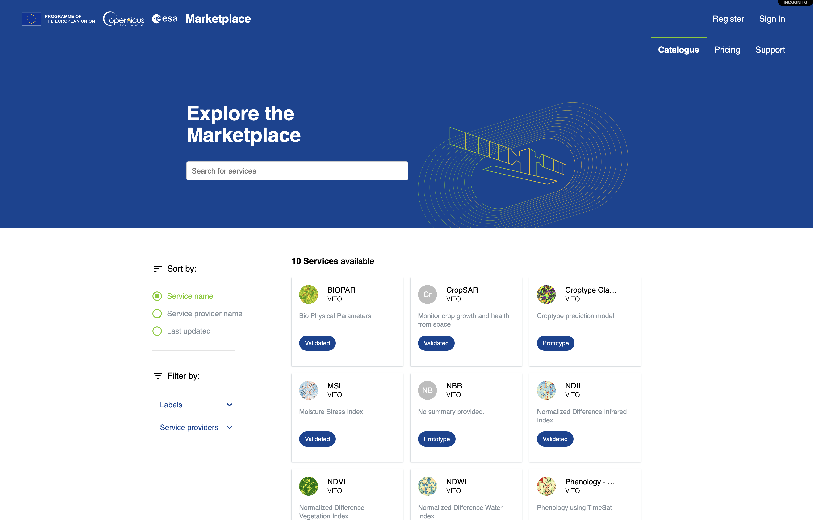
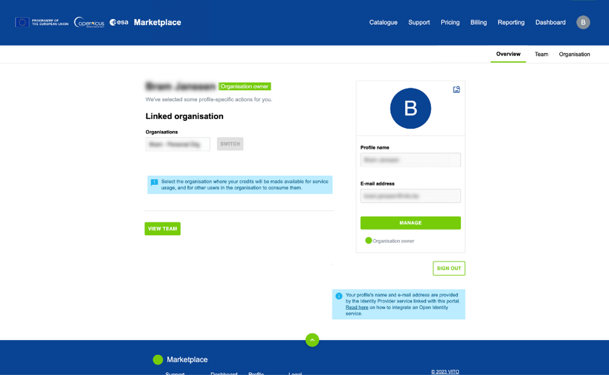
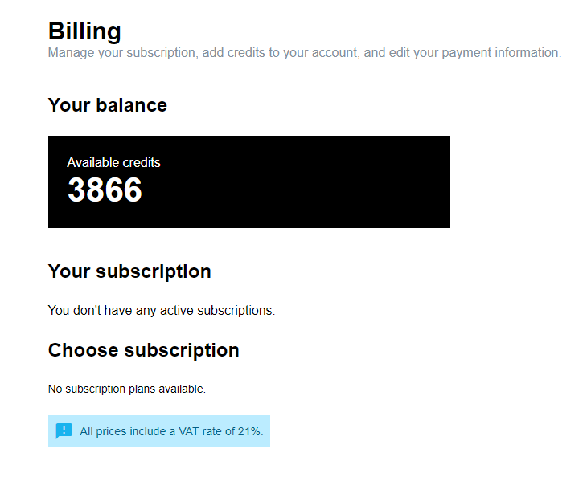
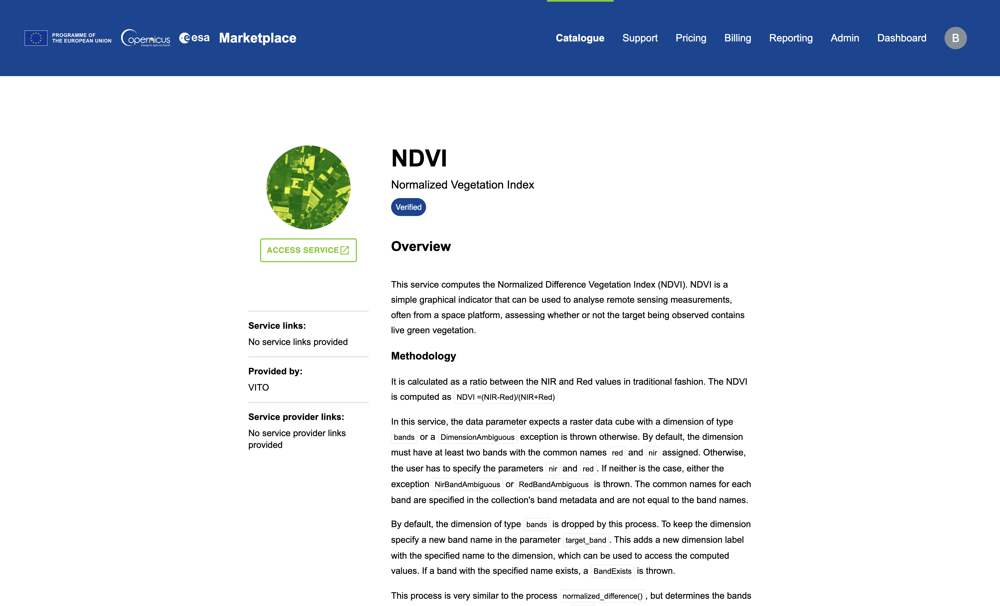

# openEO Algorithm Plaza

The Copernicus Data Space Ecosystem offers an openEO algorithm plaza to share openEO workflows for Earth Observation (EO) data processing. The [openEO Algorithm Plaza](https://marketplace-portal.dataspace.copernicus.eu/) is a marketplace where various EO algorithms are shared with openEO process graphs.

Therefore, the plaza enhances algorithm reusability, which is a cornerstone of the FAIR principles. Assuming familiarity with EO data and [openEO](../APIs/openEO/openEO.llms.md) concepts, this documentation section is a beginners guide for sharing algorithms.

The hosted algorithms can be used within the platform through user interfaces or APIs. Users can seamlessly onboard their algorithms on the openEO Algorithm Plaza for further exposure to a large audience.

## Overview

The marketplace showcases a diverse catalogue of EO services from various organisations. These services are classified based on their maturity levels, which indicates the quality and reliability of the service.

Each service has its dedicated page providing detailed information, including the methodology, expected results, and service execution instructions.

## What is a service?

The openEO Algorithm Plaza offers a wide range of EO workflows as services. These services can range from simple computations such as the Normalized Difference Vegetation Index (NDVI) to more complex algorithms.

In addition to providing access to the available services, the marketplace also supports users in showcasing their algorithms. To register an algorithm on the marketplace, it must be developed as an openEO UDP. For more information on openEO user-defined processes, visit the openEO [UDP](https://open-eo.github.io/openeo-python-client/udp.html).

Once an algorithm is exposed as a service, other users can readily access and use it for their workflows.

## Service maturity levels

The platform assigns maturity levels to maintain quality control across the services available in the openEO algorithm plaza. These levels indicate the expected performance and reliability of the services for end users:

- Validation of the result ensures the accuracy and reliability of the outcomes.
- Stability shows how well the service performs under different conditions.
- Scalability informs users on how increasing amounts of data or users affect the algorithm’s performance.
- Documentation provides detailed information about the service, including its purpose, inputs, outputs, and how to use it.

These criteria classify services into five maturity levels: Prototype, Incubating, Verified, Validated, and Operational.

| Level | Description |
|----|----|
| ***Prototype*** | Service is provided ‘as-is’, with a short description and possibly a reference to what is implemented. |
| ***Incubating*** | The service is documented with example requests (sets of parameters), the corresponding output, and the resources required to generate that output. |
| ***Verified*** | The service is labelled verified based on its software readiness and verification that validation reports are not required. |
| ***Validated*** | The service is labelled validated when the validation reports and software readiness are verified by the openEO Algorithm Plaza team. |
| ***Operational*** | The service is fit for larger-scale production and integration in operational systems. Rules for estimating resource usage are available, or a unit cost is provided. (€ per hectare, € per request, etc.) |

> Detailed descriptions of the criteria for each maturity level are explained [here](../Applications/PlazaDetails/ServiceMaturity.llms.md).

For more information on managing services, please refer to the [Manage your services guide](../Applications/PlazaDetails/ManageService.llms.md).

Once familiar with the concepts used in the openEO Algorithm Plaza, individuals can start to explore the platform.

## Interested in using or publishing services?

Users can either use an existing service or publish their algorithms. Below is a non-extensive list of considerations to take when sharing a service.

### Managing your account

Executing the available services and features within the openEO Algorithm Plaza, requires logging in.  
New users can [register](../Registration.llms.md) for one.

###### Step 1: Manage your Profile

For further details on updating profile settings, users can click on the avatar in the top right corner of the openEO Algorithm Plaza portal. This action redirects users to a page with options such as **Overview**, **Team**, and **Organization** in a sub-navigation menu.

The **Overview** section presents profile details such as name, email, and affiliated organization. These details can be updated by clicking the `MANAGE` button. Meanwhile, in the **Team** sub-menu, a list of all organization members is displayed. This list can also be accessed by clicking the `VIEW TEAM` button at the bottom left of the **Overview** sub-menu. Further information on team management can be found [here](../Applications/PlazaDetails/ManageOrg.llms.md). Lastly, within **Organisation** sub-menu, organization information such as name, email address, website, VAT number, and more can be viewed and modified.

###### Step 2: Manage your Organisation

Each registered user acts as an individual organisation; profile details can be modified, as discussed earlier in Step 1. However, step 2 could be helpful when working with multiple individuals or being part of multiple organisations. Organisations allow collaboration with other users, facilitating the sharing of billing and service accounts. For more information on managing the organisation, please refer to the [Manage your organization documentation](../Applications/PlazaDetails/ManageOrg.llms.md) of the openEO Algorithm Plaza.

###### Step 3: Check your Credits

Using any openEO processes, including those offered as services in this marketplace, consumes a certain amount of credits. Notably, these credits are shared among the organisation’s members. Credits are consumed whenever a service or a supported openEO process is used.

This marketplace simplifies credit management, allowing users to monitor their accounts. The credits can be monitored under the [`Billing`](https://marketplace-portal.dataspace.copernicus.eu/billing) section.

> **NOTE:**
>
> Every user receives 10000(¹) free openEO credits automatically on the first of every month to explore and start using the openEO API.  
> Users can check their current credit balance in the [openEO Algorithm Plaza](https://marketplace-portal.dataspace.copernicus.eu/billing) under the ‘Billing’ tab.  
> *(¹)Temporary Boost of monthly openEO Credits to 10 000. [Read our news item](https://dataspace.copernicus.eu/news/2024-9-3-temporary-boost-monthly-openeo-credits-10000-granted-user) published on September 3, 2024.*

> **NOTE:**
>
> When the provided credits are insufficient, you can purchase extra openEO Cloud Credits through CREODIAS. Discover openEO Credit Packages here: [Visit CREODIAS](https://ecommerce.creodias.eu/vito).

For more information on credit usage, please refer to the [Credit Usage](../APIs/openEO/credit_usage.llms.md) page.  

### Executing a service

Once sufficient credits are available, users can start using the services. Clicking on any of these services redirects users to the service details page. Here, information about the service, including a general description and execution instructions, can be found. For more information on executing a service, please refer to the [Execute a service](../Applications/PlazaDetails/ExecuteService.llms.md) page.

### Publishing a service

Every user has the choice to onboard their services as an individual or as part of a group organisation.

##### Publish an algorithm

To publish a service on the marketplace, the algorithm must be developed using openEO. This ensures that users can fully use the plaza’s features, including reporting and the ability to execute services directly through the Web Editor.

For more information on how to publish a service, please refer to the [Publish a service](../Applications/PlazaDetails/PublishService.llms.md) page.

##### Manage a service

Managing services in this marketplace is a simple process. Users can edit or delete services, and hide or display them in the plaza catalogue. Please refer to the [Manage your services](../Applications/PlazaDetails/ManageService.llms.md) page for detailed instructions on managing a service.

## Support

Please contact the support team for further assistance via [Submit a request](https://helpcenter.dataspace.copernicus.eu/hc/en-gb/requests/new).
