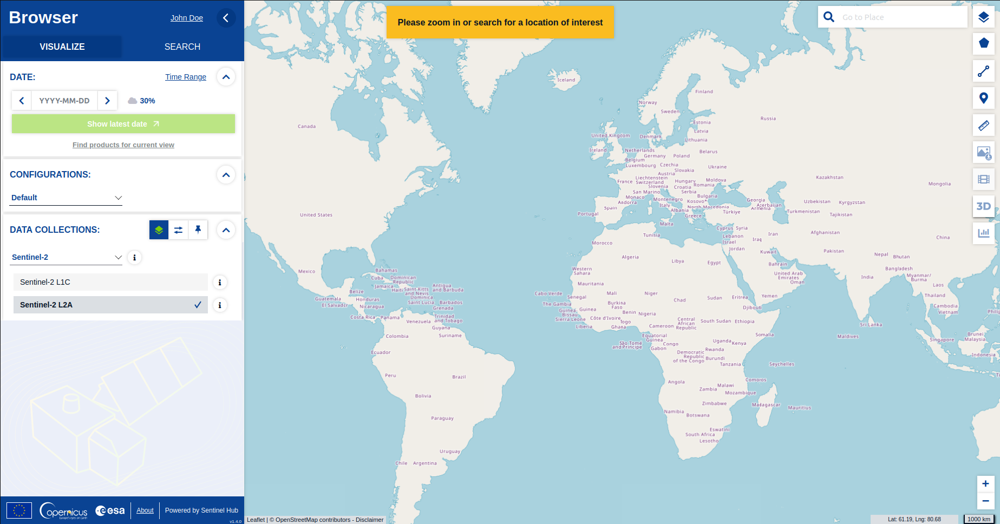
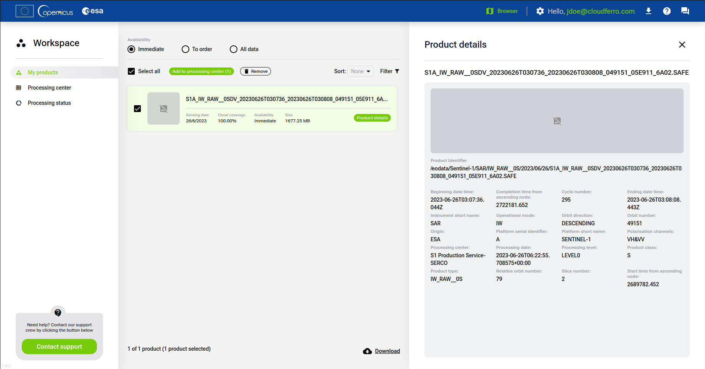
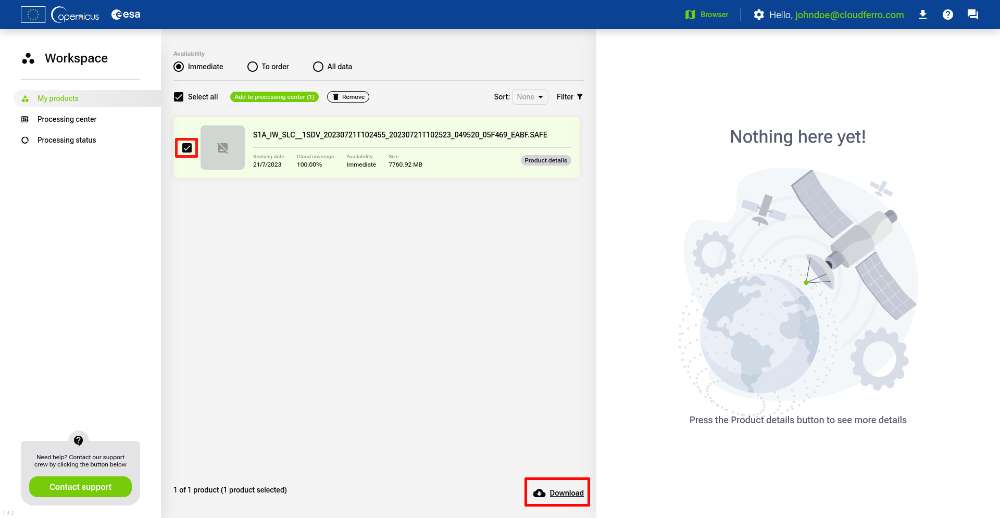
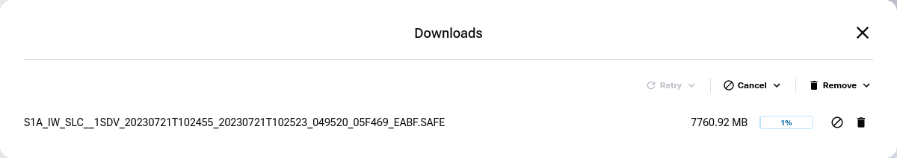
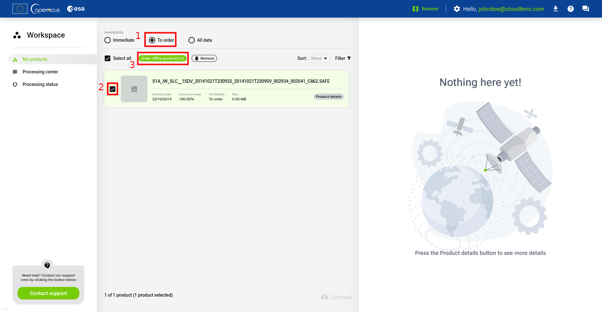
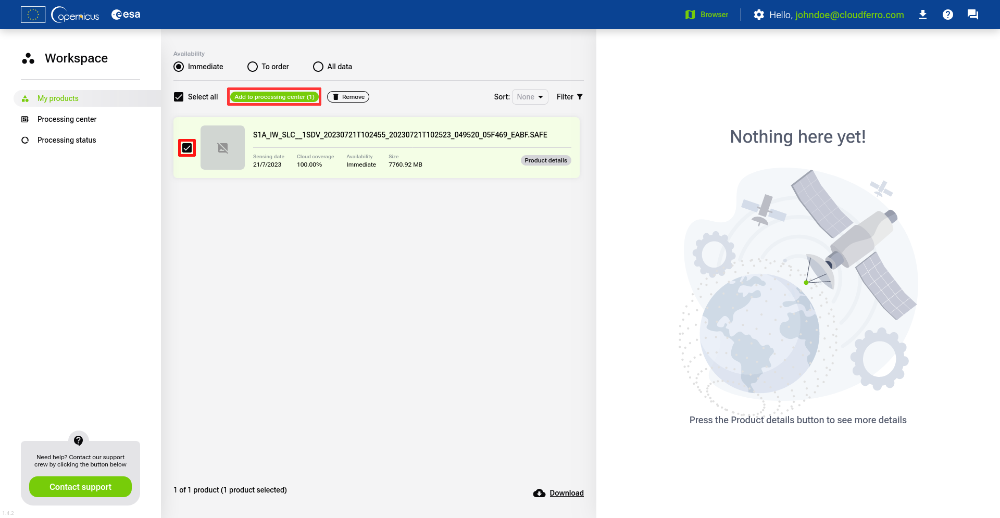
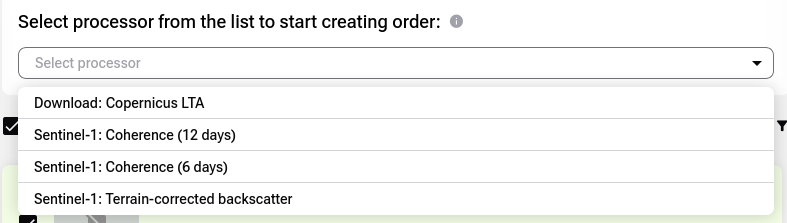
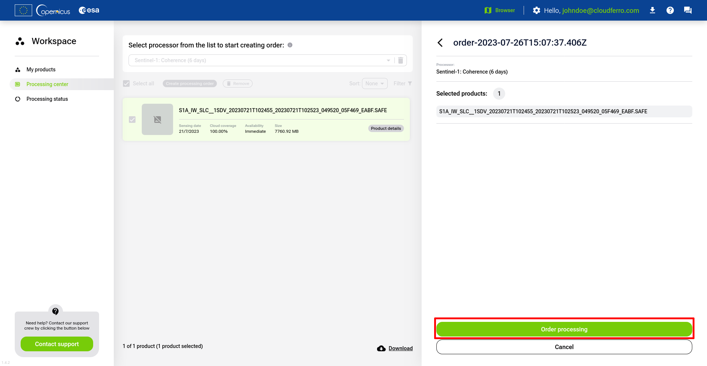
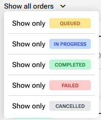

# About Data Workspace

The Data Workspace is a valuable tool for managing and reviewing Earth observation-related products. This platform enables you to aggregate and review products, which can then be further processed or downloaded for various purposes.

The Data Workspace enables management and ordering of satellite products. Offline products can be ordered and their retrieval progress can be monitored in the ‘Processing Status’ section. Online products can be selected for processing with higher-level processors or downloaded.

When the products are selected for processing, you are provided with a list of processors that are capable of processing relevant data types. The processors can be further parameterized to fine-tune the results.

Once the order for processing is submitted, the progress can be monitored similarly to orders for product retrieval. The status dashboards also include all orders submitted through the ordering API. The status of the orders can be monitored on the status page, and the orders can be updated while being executed, providing the flexibility to cancel unnecessary tasks.

You can familiarise yourself with workspace and access it at <https://dataspace.copernicus.eu/workspace/>.

# How to use Data Workspace

To use Data Workspace, you need to be a registered Copernicus Data Space Ecosystem user.

After registration, you can switch to the Data Workspace service.

Dashboard

## Adding products to Workspace

You can add products by using the [Copernicus Browser](https://dataspace.copernicus.eu/browser/).

Browser

The Copernicus Browser allows you to search for products using various properties, such as time, location and source.

After you find the product you are interested in, you can add it to workspace by using icon visible under its size.

Adding to workspace

Then it will be visible under **My Products** tab in the Workspace:

Product on workspace

When you have products listed, you can either download them from here or process them in the **Processing Center**.

## Downloading products from Workspace

In order to download products from Workspace panel, first select them from the list in **My products** tab. Then at the bottom right of the page, click on the **Download** button.

Workspace panel

A window displaying downloading process will appear. When status bar will reach 100%, it will switch its state to **completed** and your product will be saved on your device.

Download panel

## Ordering products

Some products are not available immediately and appear as offline products. To be able to download such products, you need to order them first.

To order a product simply find the product with **To order** availability and then click on the **Order offline products** button.

Order panel

Name your order and click on the **Order** button.

Order window

You will get a confirmation of your order. You can check its status under the **Processing status** tab.

Order confirmation

After the processing status is Finished/Completed, the ordered product is available in the catalogue and you can look it up via the API using various searches, for example by name:

[https://catalogue.dataspace.copernicus.eu/odata/v1/Products?\$filter=contains(Name,‘S1A_IW_GRDH_1SDV_20230729T092359_20230729T092424_049636_05F7FC_0A61’)](https://catalogue.dataspace.copernicus.eu/odata/v1/Products?$filter=contains(Name,'S1A_IW_GRDH_1SDV_20230729T092359_20230729T092424_049636_05F7FC_0A61'))

Downloading from the catalogue is done in the same way as described in the [OData Product Download](https://documentation.dataspace.copernicus.eu/APIs/OData.html#product-download) documentation.

## Processing products

Processing products in the Processing center allows user to transform products in a way that they could become useful for certain cases. The method of processing and its outcome is defined for each available processor used for the process.

To process the product its availability needs to be in **Immediate** status. Now you can add your product to the **Processing center** tab.

Check the boxes next to the product of your interest and click on the **Add to processing center** button. You can select multiple products.

Workspace panel

Notification message appears

Click **Go to Processing center**.

In the processing center, select either a processor or the products you wish to process. The list of compatible products or processors, respectively, will be automatically filtered based on your selection.

Select product for processing

Select processor for processing

Click on the **Create processing order**. The right-side panel with options to set various workflow options will open. Set them as desired and click the **Continue** button.

Placing order

Click on the **Order processing** button.

Your order is now placed. You can check its status in the Processing status tab.

From here you can check ongoing processing orders. You can filter the list with orders based on their status by selecting the value in the dropdown list:

After the processing status is Finished/Completed, the processed product is available in the catalogue or in private or temporary storage depending on selected output storage option. If output product is in the Catalogue you can look it up via the API using various searches, for example by name:

[https://catalogue.dataspace.copernicus.eu/odata/v1/Products?\$filter=contains(Name,‘S1A_IW_GRDH_1SDV_20230729T092359_20230729T092424_049636_05F7FC_0A61’)](https://catalogue.dataspace.copernicus.eu/odata/v1/Products?$filter=contains(Name,'S1A_IW_GRDH_1SDV_20230729T092359_20230729T092424_049636_05F7FC_0A61'))

You will find both the product on which the product has been processed and the product after processing. Downloading from the catalogue is done in the same way as described in the [OData Product Download](https://documentation.dataspace.copernicus.eu/APIs/OData.html#product-download) documentation.

If output product is available in temporary storage, you will be get the link and will be able to download it. The product will be removed after 14 days.
