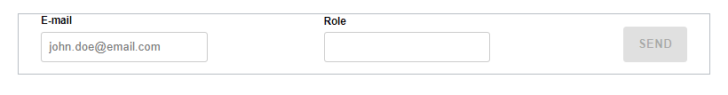
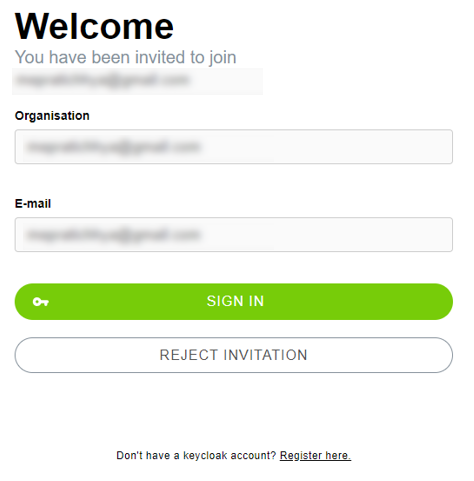
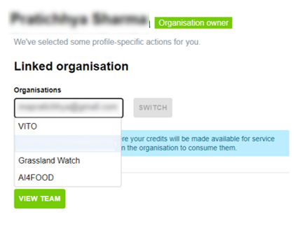

# Manage your organization

Assuming that the user has registered in the Copernicus Data Space Ecosystem and has access to the openEO Algorithm Plaza, a personal organization will be created under the [profile](https://marketplace-portal.dataspace.copernicus.eu/profile).

The Organizations are core elements of the openEO Algorithm Plaza, as they are the entities that relate users, services, openEO credits, and more. While organisations can encompass multiple users, an individual can be viewed as an organisation. This organisational concept allows users to manage shared services and distribute credits accordingly. Furthermore, the organisations can be tailored to suit specific requirements, whether for project collaborators, a particular team, or at the organisational level.

## Provide your organisation details

The organisation name is displayed on the profile page within the openEO Algorithm Plaza under the linked organisation section. Additionally, the “Organization” option in the sub-navigation provides access to the Organization page. Here, users can view and edit the details of an organisation details, which includes:

- Organisation name (mandatory)
- Organisation Identity registration (optional)
- Organisation Avatar/logo URL (optional)
- Organisation description (optional)
- Organisation website (optional)
- Terms of use URL (optional) and other “useful links”, e.g., Terms of Service, Privacy, YouTube, and Support URLs
- Update button, disabled by default

## Invite Team members

A key feature of this platform is its ability to invite contributors, friends, or co-workers to join a shared organization. New members can be invited by clicking on the `INVITE MEMBER` button in the `Team` sub-menu of the profile. This action will open a form requesting additional information to add a new user to the organization. This block contains the following fields:

- Email address (Mandatory)
- Role dropdown (Organisation owner or Developer).
- SEND button

The form should also disappear after successful submission.

Invite member

When clicking on the `SEND` button, a message confirming that the invitation has been sent will pop up at the top of the page. The invitee will receive an email with a link to accept the invitation.

Once the invitation is accepted, the user is part of the organisation. Thus, they can access the organisation resources.

## Accept the invitation

An invitation from the organisation owner or admin is required to join an existing organisation. As mentioned earlier, an invitation can be sent to any user within the platform. Upon receiving an email with the invitation link, it is recommended that the user sign in first and then accept the invitation by confirming the link. Clicking on the confirmation link leads to the following screen:

Upon clicking the `ACCEPT INVITATION` button, a message confirming successful acceptance of the invitation appears at the top of the screen.

## Switch between organisation

Once the invitation to join the organisation has been accepted, users can find the organisation listed under the `Linked Organisation` dropdown menu on the profile page. Select the new organisation from the dropdown menu and click the `SWITCH` button to switch to the new organisation.

On successful switching, the user can find a list of all team members and their roles. However, please note that users with a *Developer* permissions cannot invite new members to the organisation. Only the *Organisation Owner* has permission to invite new members.
