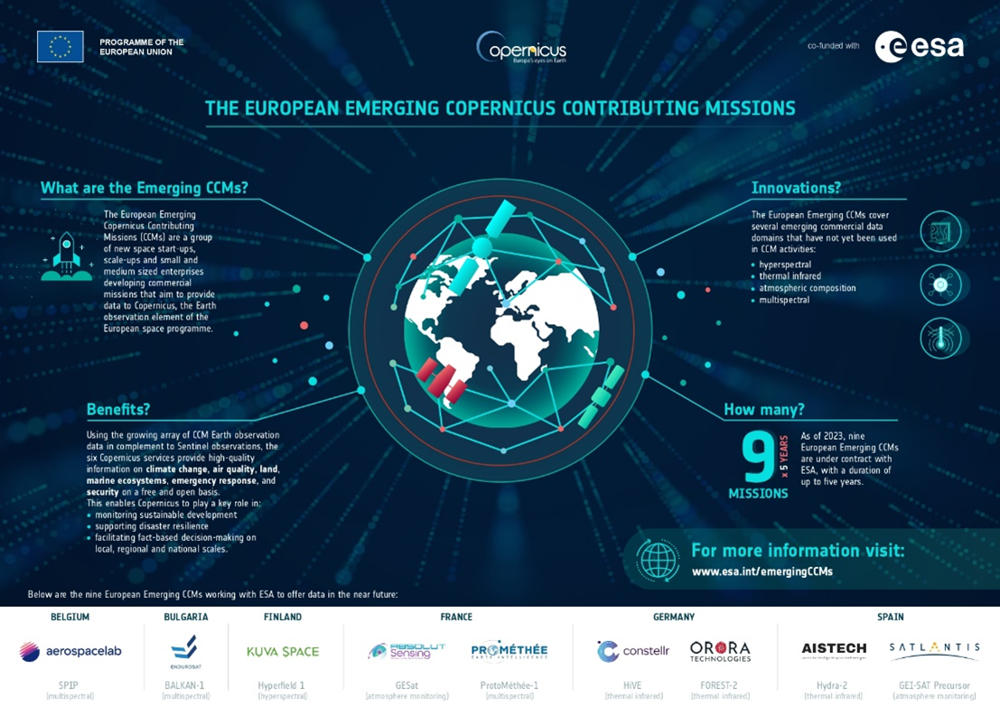
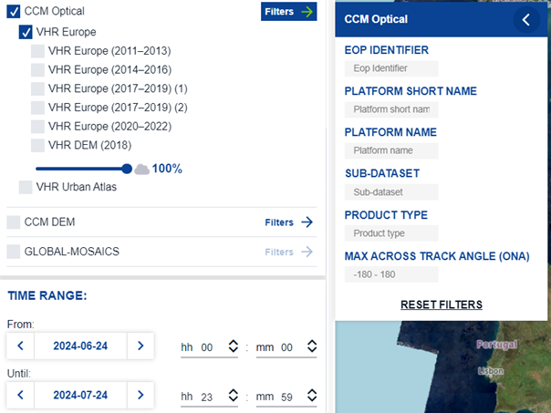
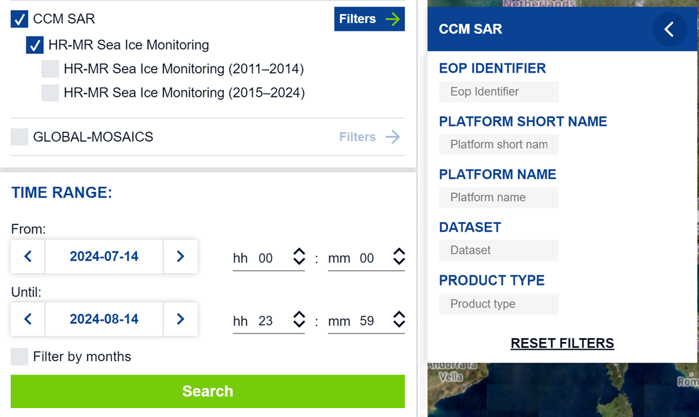
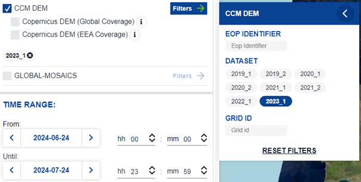
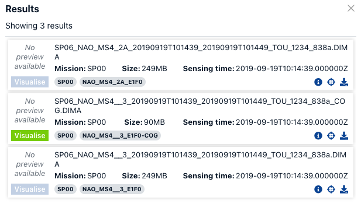
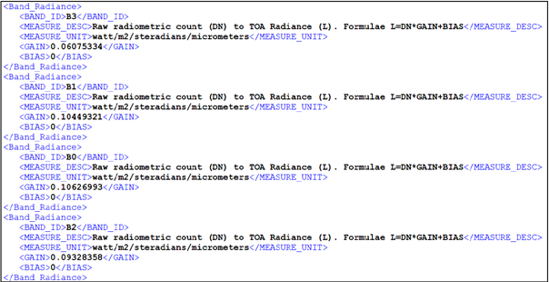
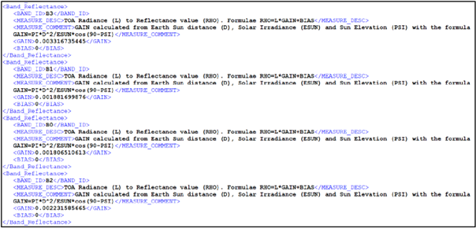

# Copernicus Contributing Missions

This section provides a high-level overview of the Copernicus Contributing Missions (CCMs), which supplement the Sentinel missions by delivering diverse Earth observation data. For detailed information on specific instruments and missions, please refer to the documentation provided by the respective data providers.

The information on dataset specifications are available at the page [Copernicus Contributing Missions Collections Description](https://dataspace.copernicus.eu/explore-data/data-collections/copernicus-contributing-missions/ccm-collections-description).

The tables provided in each mission section outline the product types delivered by that mission for systematic collections, and the relevant catalogue path.

> **TIP:**
>
> The CCM data collections can also be accessed using CCM-specific metadata parameters.
>
> The [Catalogue and search attributes](#catalogue-and-search-attributes) section explains the specific attributes and the relevant allowable values that can be utilized in data searches via the OData API and the Copernicus Browser.
>
> For further guidance on how to use OData and the Browser, kindly refer to the [OData](../../APIs/OData.llms.md) and [About the Browser](../../Applications/Browser.llms.md) pages.

# Copernicus DEM

The Copernicus DEM is a Digital Surface Model (DSM) that represents the surface of the Earth including buildings, infrastructure and vegetation. The Copernicus DEM is provided in 3 different instances: EEA-10, GLO-30 and GLO-90.

## Copernicus DEM EEA-10

The Copernicus DEM EEA-10 offers coverage on Europe at a resolution of 10 metres. Access is limited to eligible CCM User Categories and requires an application. For application process please visit [How to access COP-DEM 10m?](https://documentation.dataspace.copernicus.eu/FAQ.html#how-to-access-COP-DEM-10m) and proceed accordingly.

| Dataset             | CCM native product type | productType     |
|---------------------|-------------------------|-----------------|
| COP-DEM_EEA-10-DGED | SAR_DGE_10              | SAR_DGE_10_9319 |
| COP-DEM_EEA-10-INSP | SAR_INS_10              | SAR_INS_10_52C5 |

Once access is granted, the Copernicus DEM EEA-10 can be downloaded from [OData](https://documentation.dataspace.copernicus.eu/APIs/OData.html) or from the [Copernicus Browser](https://browser.dataspace.copernicus.eu/). For details please see the [Copernicus DEM subtitle](https://documentation.dataspace.copernicus.eu/Data/Others/CCM.html#copernicus-dem-1) at the bottom of this page.

For more information on Copernicus DEM, please visit the [Copernicus DEM - Global and European Digital Elevation Model](https://dataspace.copernicus.eu/explore-data/data-collections/copernicus-contributing-missions/collections-description/COP-DEM) page.

## Copernicus DEM GLO-30 and Copernicus DEM GLO-90

The Copernicus DEM GLO-30 offers global coverage at a resolution of 30 metres.

| Dataset             | CCM native product type | productType     |
|---------------------|-------------------------|-----------------|
| COP-DEM_GLO-30-DGED | SAR_DGE_30              | SAR_DGE_30_A4AD |
| COP-DEM_GLO-30-DTED | SAR_DTE_30              | SAR_DTE_30_615C |

  
The Copernicus DEM GLO-90 offers global coverage at a resolution of 90 metres.

| Dataset             | CCM native product type | productType     |
|---------------------|-------------------------|-----------------|
| COP-DEM_GLO-90-DGED | SAR_DGE_90              | SAR_DGE_90_A407 |
| COP-DEM_GLO-90-DTED | SAR_DTE_90              | SAR_DTE_90_61F6 |

All CDSE users that are registered for CCM data (i.e. [How to register to access Copernicus Contributing Missions data](https://dataspace.copernicus.eu/explore-data/data-collections/copernicus-contributing-missions/ccm-how-to-register)) can freely access the 30m and 90m resolution instances of the Copernicus DEM.

The Copernicus DEM GLO-30 or Copernicus DEM GLO-90 can be downloaded from [OData](https://documentation.dataspace.copernicus.eu/APIs/OData.html) or from the [Copernicus Browser](https://browser.dataspace.copernicus.eu/). For details please see the [Copernicus DEM subtitle](https://documentation.dataspace.copernicus.eu/Data/Others/CCM.html#copernicus-dem-1) at the bottom of this page.

For more information on Copernicus DEM, please visit the [Copernicus DEM - Global and European Digital Elevation Model](https://dataspace.copernicus.eu/explore-data/data-collections/copernicus-contributing-missions/collections-description/COP-DEM) page.

# Optical missions

## GeoEye-1

#### Overview

GeoEye-1, launched in 2008, is a high-resolution Earth observation satellite operated by Maxar Technologies, distributor for Europe is EUSI. This satellite is equipped with a multispectral imaging system capable of capturing images in both panchromatic and multispectral modes. The panchromatic sensor delivers a ground resolution of 0.41 meters, while the multispectral sensor provides 1.65-meter resolution across four spectral bands: blue, green, red, and near-infrared. GeoEye-1 can collect imagery over 350,000 square kilometers of Earth surface’s each day, making it ideal for large-scale mapping and surveillance applications. It operates in a sun-synchronous orbit at an altitude of 681 kilometers, ensuring consistent lighting conditions for imaging. GeoEye-1’s high spatial resolution and large area coverage capabilities have made it a valuable asset for applications ranging from agriculture and forestry to urban planning and disaster response. For detailed specifications, visit the [Maxar website](https://www.maxar.com) and download the [GeoEye-1 datasheet](https://resources.maxar.com/data-sheets/geoeye-1).

##### Offered Data

| Product Type | File Description | Data Access Type | Catalogue |
|----|----|----|----|
| GIS_MS4_OR | Unpacked | IAD (Immediately available data) | /eodata/CCM/VHR_IMAGE_2015/GIS_MS4_OR\*/ |
|  |  |  | /eodata/CCM/VHR_IMAGE_2021/GIS_MS4_OR\*/ |
| GIS_MS4_SO | Unpacked | IAD | /eodata/CCM/VHR_IMAGE_2015/GIS_MS4_SO\*/ |
|  |  |  | /eodata/CCM/VHR_IMAGE_2021/GIS_MS4_SO\*/ |
| GIS_PM4_OR | Unpacked | IAD | /eodata/CCM/VHR_IMAGE_2015/GIS_PM4_OR\*/ |
|  |  |  | /eodata/CCM/VHR_IMAGE_2021/GIS_PM4_OR\*/ |
| GIS_PM4_SO | Unpacked | IAD | /eodata/CCM/VHR_IMAGE_2015/GIS_PM4_SO\*/ |
|  |  |  | /eodata/CCM/VHR_IMAGE_2021/GIS\_ PM4_SO\*/ |

## GeoSat-1

#### Overview

Originally launched as Deimos-1 in 2009, Geosat-1 is a medium-resolution Earth observation satellite designed for wide-area monitoring. It carries a multispectral imager with a spatial resolution of 22 meters and a swath width of 600 kilometers, allowing for extensive area coverage in a single pass. The satellite captures imagery in three spectral bands: green, red, and near-infrared, which are particularly useful for applications such as vegetation monitoring, land use classification, and environmental management. Operating in a sun-synchronous orbit at an altitude of 686 kilometers, Geosat-1 revisits the same location every two to three days, providing regular updates that are crucial for time-sensitive monitoring tasks. The satellite’s ability to cover vast areas quickly makes it an important tool for large-scale agricultural assessments and natural resource management. Further details about the mission can be found on the [GEOSAT website](https://www.geosat.space/).

##### Offered Data

| Product Type | File Description | Data Access Type | Catalogue |
|----|----|----|----|
| SL6_22P_1R | Unpacked | IAD (Immediately available data) | /eodata/CCM/DWH_MG2_CORE_09/SL6_22P_1R\* |
|  |  |  | /eodata/CCM/EUR_HR2_MULTITEMP/SL6_22P_1R\* |
| SL6_22P_1T | Unpacked | IAD | /eodata/CCM/DWH_MG2_CORE_09/SL6_22P_1T\* |
|  |  |  | /eodata/CCM/EUR_HR2_MULTITEMP/SL6_22P_1T\* |
| SL6_22S_1R | Unpacked | IAD | /eodata/CCM/DWH_MG2_CORE_09/SL6_22S_1R\* |
|  |  |  | /eodata/CCM/EUR_HR2_MULTITEMP/SL6_22S_1R\* |
| SL6_22S_1T | Unpacked | IAD | /eodata/CCM/DWH_MG2_CORE_09/SL6_22S_1T\* |
|  |  |  | /eodata/CCM/EUR_HR2_MULTITEMP/SL6_22S_1T\* |

## GeoSat-2

#### Overview

Launched in 2014, Geosat-2 (formerly known as Deimos-2) is a high-resolution satellite designed for detailed Earth observation tasks. It carries an advanced multispectral imager capable of capturing sub-meter resolution images, with a panchromatic resolution of 0.75 meters and a multispectral resolution of 3 meters. Geosat-2 operates in four spectral bands: blue, green, red, and near-infrared, enabling detailed analysis of land cover and vegetation health. The satellite has a swath width of 12 kilometers, which, combined with its high resolution, allows it to cover up to 150,000 square kilometers per day with a revisit time of two days globally. Geosat-2’s agile platform enables it to perform precise targeting and rapid response imaging, making it suitable for applications such as urban planning, disaster management, and environmental monitoring. For comprehensive technical details, download the [GEOSAT-2 Imagery User Guide](https://earth.esa.int/eogateway/documents/20142/37627/GEOSAT-2-Imagery-User-Guide.pdf) and visit the [GEOSAT website](https://www.geosat.space/).

##### Offered Data

| Product Type | File Description | Data Access Type | Catalogue |
|----|----|----|----|
| HRS_MS4_1B | Unpacked | IAD (Immediately available data) | /eodata/CCM/VHR_IMAGE_20nn/HRS_MS4_1B\* |
| HRS_MS4_1C | Unpacked | IAD | /eodata/CCM/VHR_IMAGE_20nn/HRS_MS4_1C\* |
| HRS_PM4_1B | Unpacked | IAD | /eodata/CCM/VHR_IMAGE_20nn/HRS_PM4_1B\* |
| HRS_PM4_1C | Unpacked | IAD | /eodata/CCM/VHR_IMAGE_20nn/HRS_PM4_1C\* |

## Kompsat 3-3A

#### Overview

KOMPSAT-3 and KOMPSAT-3A (Korean Multi-purpose Satellites) are Earth observation satellites operated by the Korea Aerospace Research Institute (KARI). KOMPSAT-3, launched in 2012, is equipped with a panchromatic camera with a ground resolution of 0.7 meters and a multispectral imager with a resolution of 2.8 meters, capturing images in red, green, blue, and near-infrared bands. It supports various applications, including urban planning, agricultural monitoring, and environmental management. KOMPSAT-3A, launched in 2015, enhances the capabilities of KOMPSAT-3, offering a higher panchromatic resolution of 0.55 meters and a multispectral resolution of 2.2 meters. It also carries an infrared sensor for nighttime observation, enabling thermal imaging. The addition of the infrared sensor expands its use to areas such as disaster monitoring, land surface temperature mapping, and resource exploration. Both satellites operate in sun-synchronous orbits, ensuring consistent revisit times for regular monitoring of specific areas. The data provided by these missions play a critical role in detailed analysis and mapping tasks, supporting a wide range of civilian and governmental applications.  
KOMPSAT is owned by the Korean government. For more details of the mission, visit the website of [SI Imaging Services (SIIS)](https://www.si-imaging.com/page/21_01_2).

##### Offered Data

| Product Type | File Description | Data Access Type | Catalogue |
|----|----|----|----|
| AIS_MSP_1R | Unpacked | IAD (Immediately available data) | /eodata/CCM/VHR_IMAGE_20nn/AIS_MSP_1G\* |
| AIS_MSP_1G | Unpacked | IAD | /eodata/CCM/VHR_IMAGE_20nn/AIS_MSP_1G\* |

## PlanetScope

#### Overview

PlanetScope is a satellite constellation operated by Planet, consisting of hundreds of small satellites known as Doves. Launched in multiple batches from 2014 onwards, these satellites are designed to provide high-resolution, near-daily imagery of the Earth’s entire landmass. Each Dove satellite carries an optical imaging system that captures imagery at a resolution of 3 to 5 meters across four spectral bands: red, green, blue, and near-infrared. The PlanetScope constellation operates in sun-synchronous orbits, ensuring consistent imaging conditions and enabling regular revisits to the same location. The high frequency of revisits makes PlanetScope ideal for monitoring dynamic environments, such as agricultural fields, forests, and urban areas. The constellation’s “always-on” capability eliminates the need for tasking requests, providing users with continuous and up-to-date imagery. This unique capability supports a wide range of applications, including crop health monitoring, disaster response, and land use planning. For detailed specifications, refer to the [Combined Imagery Product Specification](https://assets.planet.com/docs/Planet_Combined_Imagery_Product_Specs_letter_screen.pdf) available on the [Planet](https://www.planet.com/) website.

##### Offered Data

| Product Type | File Description | Data Access Type | Catalogue |
|----|----|----|----|
| DOV_MS_L1A | Unpacked | IAD (Immediately available data) | /eodata/CCM/VHR_IMAGE_2018/DOV_MS_L1A\* |
| DOV_MS_L3A | Unpacked | IAD | /eodata/CCM/VHR_IMAGE_2018/DOV_MS_L3A\* |

## Pleiades

#### Overview

The Pléiades constellation, consisting of Pléiades 1A and 1B, was launched in 2011 and 2012, respectively, and is operated by Airbus Defence and Space. These high-resolution satellites capture images with a panchromatic resolution of 0.5 meters and a multispectral resolution of 2 meters, covering blue, green, red, and near-infrared bands. Operating in the same orbit as the SPOT 6 and SPOT 7 satellites, Pléiades 1A and 1B provide a daily revisit capability, making them well-suited for applications such as detailed cartography, precision agriculture, forestry management, and disaster response. The satellites’ agility allows for rapid tasking and collection of images with high geometric accuracy. Pléiades imagery supports a wide range of uses, from mapping and land management to monitoring environmental changes and urban development. For more detailed information, download the [Pléiades imagery user guide](https://www.intelligence-airbusds.com/automne/api/docs/v1.0/document/download/ZG9jdXRoZXF1ZS1kb2N1bWVudC01NTY0Mw==/ZG9jdXRoZXF1ZS1maWxlLTU1NjQy/airbus-pleiades-imagery-user-guide-15042021.pdf) and visit the relevant section at [Airbus website](https://www.intelligence-airbusds.com/imagery/constellation/pleiades/).

##### Offered Data

| Product Type | File Description | Data Access Type | Catalogue |
|----|----|----|----|
| PHR_BUN_1A | Unpacked | IAD (Immediately available data) | /eodata/CCM/VHR_IMAGE_20nn/PHR_BUN_1A\* |
|  |  |  | /eodata/CCM/DWH_MG2b_CORE_03/PHR_BUN_1A\* |
| PHR_BUN\_\_3 | Unpacked | IAD | /eodata/CCM/VHR_IMAGE_20nn/PHR_BUN\_\_3\* |
|  |  |  | /eodata/CCM/DWH_MG2b_CORE_03/PHR_BUN\_\_3\* |
| PHR_MS\_\_2A | Unpacked | IAD | /eodata/CCM/VHR_IMAGE_20nn/PHR_MS\_\_2A\* |
|  |  |  | /eodata/CCM/DWH_MG2b_CORE_03/PHR_MS\_\_2A\* |
| PHR_MS\_\_\_3 | Unpacked | IAD | /eodata/CCM/VHR_IMAGE_20nn/PHR_MS\_\_\_3\* |
|  |  |  | /eodata/CCM/DWH_MG2b_CORE_03/PHR_MS\_\_\_3\* |

## Pleiades Neo

#### Overview

Pléiades Neo is Airbus next-generation constellation, launched in 2021, providing ultra-high-resolution Earth imagery with a resolution of 0.3 meters. The constellation consists of two identical satellites phased 180° apart in the same orbit, ensuring high frequency revisit capabilities over any point on Earth. Pléiades Neo’s advanced optics and on-board processing systems enable the capture of highly detailed imagery with a swath width of 14 kilometers. The satellites are equipped with smart tasking capabilities, allowing them to quickly respond to urgent imaging requests and cover large areas efficiently. This makes Pléiades Neo particularly valuable for monitoring sensitive sites, managing natural disasters, and conducting large-scale mapping projects. The constellation is designed to guarantee continuity with the original Pléiades mission while providing enhanced performance to meet the evolving needs of Earth observation users. For comprehensive technical details, visit the [Airbus](https://www.intelligence-airbusds.com/imagery/constellation/pleiades-neo/) website or the specific [Pléiades Neo pages](https://www.airbus.com/en/space/earth-observation/earth-observation-portfolio/pleiades-neo)

##### Offered Data

| Product Type | File Description | Data Access Type | Catalogue |
|----|----|----|----|
| PNE_MS2\_\_3 | Unpacked | IAD (Immediately available data) | /eodata/CCM/VHR_IMAGE_2024/PNE_MS2\_\_3\* |

## Resourcesat 1-2

#### Overview

The Resourcesat series, developed by the Indian Space Research Organisation (ISRO), consists of two satellites: Resourcesat-1 (launched in 2003) and Resourcesat-2 (launched in 2011). These satellites are equipped with three main sensors: the Linear Imaging Self-Scanning Sensor (LISS-IV), which provides 5.8-meter resolution multispectral imagery; LISS-III, which captures imagery at 23.5-meter resolution; and the Advanced Wide Field Sensor (AWiFS), offering 56-meter resolution with a wide swath of 740 kilometers. These sensors operate in multiple spectral bands, including green, red, near-infrared, and shortwave infrared, enabling comprehensive monitoring of land and water resources. The satellites operate in sun-synchronous orbits, allowing for regular and consistent observations that are crucial for long-term environmental monitoring and agricultural assessments. For more detailed technical information, consult the key parameters of the [IRS-R2 sensors](https://www.euromap.de/docs/doc_007.html). Visit the [ISRO website](https://www.isro.gov.in/RESOURCESAT_2.html) for an overview of the mission.

##### Offered Data

| Product Type | File Description | Data Access Type | Catalogue |
|----|----|----|----|
| AWF_XA\_\_1O | Unpacked | IAD (Immediately available data) | /eodata/CCM/DWH_MG2b_CORE_30/AWF_XA\_\_1O\* |
|  |  |  | /eodata/CCM/MR_IMAGE_2015/AWF_XA\_\_1O\* |
|  |  |  | /eodata/CCM/HR_IMAGE_2015/AWF_XA\_\_1O\* |
|  |  |  | /eodata/CCM/DWH_MG2_CORE_01/AWF_XA\_\_1O\* |
|  |  |  | /eodata/CCM/DWH_MG2-3_CORE_08/AWF_XA\_\_1O\* |
| AWF_XA\_\_3O | Unpacked | IAD | /eodata/CCM/DWH_MG2b_CORE_30/AWF_XA\_\_3O\* |
|  |  |  | /eodata/CCM/MR_IMAGE_2015/AWF_XA\_\_3O\* |
|  |  |  | /eodata/CCM/HR_IMAGE_2015/AWF_XA\_\_3O\* |
|  |  |  | /eodata/CCM/DWH_MG2_CORE_01/AWF_XA\_\_3O\* |
|  |  |  | /eodata/CCM/DWH_MG2-3_CORE_08/AWF_XA\_\_3O\* |
| AWF_XB\_\_1O | Unpacked | IAD | /eodata/CCM/DWH_MG2b_CORE_30/AWF_XB\_\_1O\* |
|  |  |  | /eodata/CCM/MR_IMAGE_2015/AWF_XB\_\_1O\* |
|  |  |  | /eodata/CCM/HR_IMAGE_2015/AWF_XB\_\_1O\* |
|  |  |  | /eodata/CCM/DWH_MG2_CORE_01/AWF_XB\_\_1O\* |
|  |  |  | /eodata/CCM/DWH_MG2-3_CORE_08/AWF_XB\_\_1O\* |
| AWF_XB\_\_3O | Unpacked | IAD | /eodata/CCM/DWH_MG2b_CORE_30/AWF_XB\_\_3O\* |
|  |  |  | /eodata/CCM/MR_IMAGE_2015/AWF_XB\_\_3O\* |
|  |  |  | /eodata/CCM/HR_IMAGE_2015/AWF_XB\_\_3O\* |
|  |  |  | /eodata/CCM/DWH_MG2_CORE_01/AWF_XB\_\_3O\* |
|  |  |  | /eodata/CCM/DWH_MG2-3_CORE_08/AWF_XB\_\_3O\* |
| LI3_X\_\_\_1O | Unpacked | IAD | /eodata/CCM/DWH_MG2b_CORE_30/LI3_X\_\_\_1O\* |
|  |  |  | /eodata/CCM/MR_IMAGE_2015/LI3_X\_\_\_1O\* |
|  |  |  | /eodata/CCM/HR_IMAGE_2015/LI3_X\_\_\_1O\* |
|  |  |  | /eodata/CCM/DWH_MG2_CORE_01/LI3_X\_\_\_1O\* |
|  |  |  | /eodata/CCM/DWH_MG2-3_CORE_08/LI3_X\_\_\_1O\* |
| LI3_X\_\_\_3O | Unpacked | IAD | /eodata/CCM/DWH_MG2b_CORE_30/LI3_X\_\_\_3O\* |
|  |  |  | /eodata/CCM/MR_IMAGE_2015/LI3_X\_\_\_3O\* |
|  |  |  | /eodata/CCM/HR_IMAGE_2015/LI3_X\_\_\_3O\* |
|  |  |  | /eodata/CCM/DWH_MG2_CORE_01/LI3_X\_\_\_3O\* |
|  |  |  | /eodata/CCM/DWH_MG2_CORE_02/LI3_X\_\_\_3O\* |
| AWF_XA\_\_3T | Unpacked | IAD | /eodata/CCM/DWH_MG2b_CORE_30/AWF_XA\_\_3T\* |
|  |  |  | /eodata/CCM/MR_IMAGE_2015/AWF_XA\_\_3T\* |
|  |  |  | /eodata/CCM/HR_IMAGE_2015/AWF_XA\_\_3T\* |
|  |  |  | /eodata/CCM/DWH_MG2_CORE_01/AWF_XA\_\_3T\* |
|  |  |  | /eodata/CCM/DWH_MG2-3_CORE_08/AWF_XA\_\_3T\* |
| AWF_XB\_\_3T | Unpacked | IAD | /eodata/CCM/DWH_MG2b_CORE_30/AWF_XB\_\_3T\* |
|  |  |  | /eodata/CCM/MR_IMAGE_2015/AWF_XB\_\_3T\* |
|  |  |  | /eodata/CCM/HR_IMAGE_2015/AWF_XB\_\_3T\* |
|  |  |  | /eodata/CCM/DWH_MG2_CORE_01/AWF_XB\_\_3T\* |
|  |  |  | /eodata/CCM/DWH_MG2-3_CORE_08/AWF_XB\_\_3T\* |
| LI3_X\_\_\_3T | Unpacked | IAD | /eodata/CCM/DWH_MG2b_CORE_30/LI3_X\_\_\_3T\* |
|  |  |  | /eodata/CCM/MR_IMAGE_2015/LI3_X\_\_\_3T\* |
|  |  |  | /eodata/CCM/HR_IMAGE_2015/LI3_X\_\_\_3T\* |
|  |  |  | //eodata/CCM/DWH_MG2_CORE_01/LI3_X\_\_\_3T\* |
|  |  |  | /eodata/CCM/DWH_MG2-3_CORE_08/LI3_X\_\_\_3T\* |

## Spot 6-7

#### Overview

SPOT 6 and SPOT 7, launched in 2012 and 2014 respectively, are high-resolution Earth observation satellites operated by Airbus Defence and Space. These twin satellites provide 1.5-meter resolution imagery in panchromatic mode and 6-meter resolution in multispectral mode, with a swath width of 60 kilometers. The satellites are designed for wide-area monitoring and are particularly effective for applications such as agriculture, forestry, land management, and mapping. SPOT 6/7 operate in the same orbit as the Pléiades constellation, enabling complementary use of high-resolution and very-high-resolution data. This orbital synergy allows for daily revisit capabilities, making SPOT imagery highly valuable for time-sensitive monitoring tasks. The satellites’ high geometric accuracy and large-area coverage make them ideal for creating detailed land cover maps and large-scale mosaics. For more information, download the [SPOT User Guide](https://storage.googleapis.com/p-oaf-ibe-back-00e-strapi-uploads/SPOT_User_Guide_2021_09_low2_d145a2a31b/SPOT_User_Guide_2021_09_low2_d145a2a31b.pdf) and visit the [Airbus website](https://www.intelligence-airbusds.com/imagery/constellation/spot/).

##### Offered Data

| Product Type | File Description | Data Access Type | Catalogue |
|----|----|----|----|
| NAO_BUN\_\_3 | Unpacked | IAD (Immediately available data) | /eodata/CCM/VHR_IMAGE_20nn/NAO_BUN\_\_3\* |
|  |  |  | /eodata/CCM/DWH_MG2b_CORE_03/NAO_BUN\_\_3\* |
| NAO_BUN_1A | Unpacked | IAD | /eodata/CCM/VHR_IMAGE_20nn/NAO_BUN_1A\* |
|  |  |  | /eodata/CCM/DWH_MG2b_CORE_03/NAO_BUN_1A\* |
| NAO_MS\_\_\_3 | Unpacked | IAD | /eodata/CCM/VHR_IMAGE_20nn/NAO_MS\_\_\_3\* |
|  |  |  | /eodata/CCM/DWH_MG2b_CORE_03/NAO_MS\_\_\_3\* |
| NAO_MS\_\_1A | Unpacked | IAD | /eodata/CCM/VHR_IMAGE_20nn/NAO_MS\_\_1A\* |
|  |  |  | /eodata/CCM/DWH_MG2b_CORE_03/NAO_MS\_\_1A\* |
| NAO_MS4\_\_3 | Unpacked | IAD | /eodata/CCM/VHR_IMAGE_20nn/NAO_MS4\_\_3\* |
|  |  |  | /eodata/CCM/DWH_MG2b_CORE_03/NAO_MS4\_\_3\* |
| NAO_MS4_2A | Unpacked | IAD | /eodata/CCM/VHR_IMAGE_20nn/NAO_MS4_2A\* |
|  |  |  | /eodata/CCM/DWH_MG2b_CORE_03/NAO_MS4_2A\* |
| NAO_PMS\_\_3 | Unpacked | IAD | /eodata/CCM/VHR_IMAGE_20nn/NAO_PMS\_\_3\* |
|  |  |  | /eodata/CCM/DWH_MG2b_CORE_03/NAO_PMS\_\_3\* |

## Vision-1

#### Overview

Vision-1, launched by Airbus in 2019, is a sub-meter resolution Earth observation satellite that delivers imagery across five optical bands: panchromatic, blue, green, red, and near-infrared. With a ground resolution of 0.87 meters in panchromatic mode and 3.48 meters in multispectral mode, Vision-1 is well-suited for high-precision monitoring applications. The satellite operates in a sun-synchronous orbit, ensuring consistent imaging conditions with daily revisit capabilities. Vision-1’s agility and high-resolution imaging capabilities make it an ideal complement to the SPOT and Pléiades satellites, supporting various applications such as urban monitoring, infrastructure management, and environmental monitoring. The satellite’s advanced imaging system allows for rapid response to tasking requests, providing timely data that is crucial for decision-making in dynamic situations. For more technical details, visit the Airbus dedicated page [Vision-1](https://intelligence.airbus.com/imagery/our-optical-and-radar-satellite-imagery/vision-1/).

##### Offered Data

| Product Type | File Description | Data Access Type | Catalogue |
|----|----|----|----|
| S14_MS4_2A | Unpacked | IAD (Immediately available data) | /eodata/CCM/VHR_IMAGE_2021/S14_MS4_2A\* |
| S14_MS4\_\_3 | Unpacked | IAD | /eodata/CCM/VHR_IMAGE_2021/S14_MS4\_\_3\* |

## WorldView 2-3

#### Overview

WorldView-2 and WorldView-3, launched in 2009 and 2014 respectively, are high-capacity Earth observation satellites operated by Maxar Technologies with data distributed in Europe by EUSI. WorldView-2 captures imagery with a panchromatic resolution of 0.46 meters and an 8-band multispectral resolution of 1.85 meters, covering coastal, yellow, red, red edge, and near-infrared bands in addition to the traditional RGB bands. WorldView-3 improves upon this with a panchromatic resolution of 0.31 meters and a 16-band multispectral resolution of 1.24 meters, including additional shortwave infrared (SWIR) and CAVIS (Cloud, Aerosol, Water Vapor, Ice, and Snow) bands. These capabilities allow for detailed analysis of a wide range of environmental and man-made features, supporting applications such as urban planning, agriculture, and disaster response. WorldView-3’s ability to capture data in SWIR bands makes it particularly useful for material identification and geological surveys. Both satellites operate in sun-synchronous orbits, providing daily revisit capabilities. For more information visit the [Maxar website](https://www.maxar.com/constellation) for an overview of the WorldView Series or access the specific missions datasheets at [WorldView-2](https://resources.maxar.com/data-sheets/worldview-2) and [WorldView-3](https://resources.maxar.com/data-sheets/worldview-3).

##### Offered Data

| Product Type | File Description | Data Access Type | Catalogue |
|----|----|----|----|
| WV1_MS4_OR | Unpacked | IAD (Immediately available data) | /eodata/CCM/VHR_IMAGE_20nn/WV1_MS4_OR\* |
|  |  |  | /eodata/CCM/VHR1-2_Urban_Atlas_2012/WV1_MS4_OR\* |
| WV1_MS4_SO | Unpacked | IAD | /eodata/CCM/VHR_IMAGE_20nn/WV1_MS4_SO\* |
|  |  |  | /eodata/CCM/VHR1-2_Urban_Atlas_2012/WV1_MS4_SO\* |
| WV1_PM4_OR | Unpacked | IAD | /eodata/CCM/VHR_IMAGE_20nn/WV1_PM4_OR\* |
|  |  |  | /eodata/CCM/VHR1-2_Urban_Atlas_2012/WV1_PM4_OR\* |
| WV1_PM4_SO | Unpacked | IAD | /eodata/CCM/VHR_IMAGE_20nn/WV1_PM4_SO\* |
|  |  |  | /eodata/CCM/VHR1-2_Urban_Atlas_2012/WV1_PM4_SO\* |
| WV1_PM8_SO | Unpacked | IAD | /eodata/CCM/VHR_IMAGE_20nn/WV1_PM8_SO\* |
|  |  |  | /eodata/CCM/VHR1-2_Urban_Atlas_2012/WV1_PM8_SO\* |
| WV3_MS4_OR | Unpacked | IAD | /eodata/CCM/VHR_IMAGE_20nn/WV3_MS4_OR\* |
|  |  |  | /eodata/CCM/VHR1-2_Urban_Atlas_2012/WV3_MS4_OR\* |
| WV3_MS4_SO | Unpacked | IAD | /eodata/CCM/VHR_IMAGE_20nn/WV3_MS4_SO\* |
|  |  |  | /eodata/CCM/VHR1-2_Urban_Atlas_2012/WV3_MS4_SO\* |
| WV3_PM4_OR | Unpacked | IAD | /eodata/CCM/VHR_IMAGE_20nn/WV3_PM4_OR\* |
|  |  |  | /eodata/CCM/VHR1-2_Urban_Atlas_2012/WV3_PM4_OR\* |
| WV3_PM4_SO | Unpacked | IAD | /eodata/CCM/VHR_IMAGE_20nn/WV3_PM4_SO\* |
|  |  |  | /eodata/CCM/VHR1-2_Urban_Atlas_2012/WV3_PM4_SO\* |

# Radar missions

## Cosmo Skymed

#### Overview

COSMO-SkyMed is a constellation of four X-band synthetic aperture radar (SAR) satellites, launched between 2007 and 2010, and operated by the Italian Space Agency (ASI) and the Italian Ministry of Defense. Designed to provide high-resolution radar imagery with a ground resolution of up to 1 meter, COSMO-SkyMed is capable of acquiring data regardless of weather conditions, day or night. The constellation’s short revisit times-ranging from a few hours to a couple of days-make it highly effective for applications such as emergency response, maritime surveillance, and environmental monitoring. COSMO-SkyMed’s SAR sensors operate in multiple modes, including spotlight, stripmap, and scanSAR, allowing for flexible imaging configurations that can be tailored to specific mission requirements. The constellation supports both civilian and defense applications, offering valuable data for managing ice monitoring, natural disasters and infrastructure monitoring. For more detailed information, visit the COSMO-SkyMed mission and products description at [e-GEOS](http://www.e-geos.it/) website and more specifically at [Cosmo-SkyMed](https://www.asi.it/en/earth-science/cosmo-skymed/) web page.

##### Offered Data

| Product Type | File Description | Data Access Type | Catalogue |
|----|----|----|----|
| SAR_HIM_1B | Unpacked | IAD (Immediately available data) | /eodata/CCM/DWH_MG1_CORE_11/SAR_HIM_1B\* |
|  |  |  | /eodata/CCM/SAR_SEA_ICE/SAR_HIM_1B\* |
| SAR_HIM_1C | Unpacked | IAD | /eodata/CCM/DWH_MG1_CORE_11/SAR_HIM_1C\* |
|  |  |  | /eodata/CCM/SAR_SEA_ICE/SAR_HIM_1C\* |
| SAR_HIM_AB | Unpacked | IAD | /eodata/CCM/DWH_MG1_CORE_11/SAR_HIM_AB\* |
|  |  |  | /eodata/CCM/SAR_SEA_ICE/SAR_HIM_AB\* |
| SAR_SCH_1B | Unpacked | IAD | /eodata/CCM/DWH_MG1_CORE_11/SAR_SCH_1B\* |
|  |  |  | /eodata/CCM/SAR_SEA_ICE/SAR_SCH_1B\* |
| SAR_SCH_1C | Unpacked | IAD | /eodata/CCM/DWH_MG1_CORE_11/SAR_SCH_1C\* |
|  |  |  | /eodata/CCM/SAR_SEA_ICE/SAR_SCH_1C\* |
| SAR_SCH_AB | Unpacked | IAD | /eodata/CCM/DWH_MG1_CORE_11/SAR_SCH_AB\* |
|  |  |  | /eodata/CCM/SAR_SEA_ICE/SAR_SCH_AB\* |
| SAR_SCW_1B | Unpacked | IAD | /eodata/CCM/DWH_MG1_CORE_11/SAR_SCW_1B\* |
|  |  |  | /eodata/CCM/SAR_SEA_ICE/SAR_SCW_1B\* |
| SAR_SCW_1C | Unpacked | IAD | /eodata/CCM/DWH_MG1_CORE_11/SAR_SCW_1C\* |
|  |  |  | /eodata/CCM/SAR_SEA_ICE/SAR_SCW_1C\* |
| SAR_SCW_1D | Unpacked | IAD | /eodata/CCM/DWH_MG1_CORE_11/SAR_SCW_1D\* |
|  |  |  | /eodata/CCM/SAR_SEA_ICE/SAR_SCW_1D\* |
| SAR_SCW_AB | Unpacked | IAD | /eodata/CCM/DWH_MG1_CORE_11/SAR_SCW_AB\* |
|  |  |  | /eodata/CCM/SAR_SEA_ICE/SAR_SCW_AB\* |
| SAR_SPP_1C | Unpacked | IAD | /eodata/CCM/DWH_MG1_CORE_11/SAR_SPP_1C\* |
|  |  |  | /eodata/CCM/SAR_SEA_ICE/SAR_SPP_1C\* |

## Iceye

#### Overview

ICEYE is a pioneering small satellite constellation operator, providing synthetic aperture radar (SAR) imagery with rapid revisit times and global coverage. The constellation, which began launching in 2018, consists of multiple small satellites equipped with high-frequency X-band SAR sensors capable of imaging at resolutions down to 0.5 meters. ICEYE’s Dwell Fine mode enhances image clarity by extending the radar illumination time over a target area, making it ideal for applications requiring detailed analysis, such as infrastructure monitoring and disaster assessment. The constellation’s agile design and multiple revisit capabilities-up to several times per day-enable near real-time monitoring of dynamic events, including ice monitoring, floods, forest fires, and urban development. ICEYE’s small satellites are designed for fast deployment and can be quickly added to the constellation, ensuring that users receive the most current and reliable data. For more information and detailed product specifications, visit the [ICEYE product documentation portal](https://iceye-ltd.github.io/product-documentation/5.0/).

##### Offered Data

| Product Type | File Description | Data Access Type | Catalogue |
|----|----|----|----|
| SAR_SC\_\_GR | Unpacked | IAD (Immediately available data) | /eodata/SAR_SEA_ICE/SAR_SC\_\_GR\* |

## PAZ

#### Overview

PAZ is an X-band synthetic aperture radar (SAR) satellite launched in 2018 as part of a public-private partnership between Hisdesat and Airbus Defence and Space. The satellite is capable of capturing up to 100 images daily, covering more than 300,000 square kilometers with a resolution of up to 25 centimeters in high-resolution modes. PAZ operates in multiple imaging modes, including spotlight, stripmap, and scanSAR, offering flexibility in data acquisition for different applications. The satellite’s SAR capabilities allow for all-weather, day-and-night imaging, making it particularly valuable for maritime surveillance, border control, emergency response and ice monitoring. PAZ also carries an Automatic Identification System (AIS) for tracking ship movements, enhancing its utility for monitoring maritime traffic and ensuring security in coastal areas. For detailed technical information, visit the [Hisdesat website](https://www.hisdesat.es/en/paz/).

##### Offered Data

| Product Type | File Description | Data Access Type | Catalogue |
|----|----|----|----|
| SAR_SC_GEC | Unpacked | IAD (Immediately available data) | /eodata/CCM/SAR_SEA_ICE/SAR_SC_GEC\* |
| SAR_SC_MGD | Unpacked | IAD | /eodata/CCM/SAR_SEA_ICE/SAR_SC_MGD\* |
| SAR_SM_EEC | Unpacked | IAD | /eodata/CCM/SAR_SEA_ICE/SAR_SM_EEC\* |
| SAR_SM_MGD | Unpacked | IAD | /eodata/CCM/SAR_SEA_ICE/SAR_SM_MGD\* |
| SAR_WS_GEC | Unpacked | IAD | /eodata/CCM/SAR_SEA_ICE/SAR_WS_GEC\* |

## Radarsat-2

#### Overview

RADARSAT-2 is a synthetic aperture radar (SAR) satellite launched in 2007, operated by MDA in collaboration with the Canadian Space Agency (CSA). The satellite provides all-weather, day-and-night imaging capabilities with resolutions as fine as 1 meter in spotlight mode. RADARSAT-2 operates in a variety of imaging modes, including standard, fine, wide, and ultrafine, allowing for customizable data collection depending on user needs. The satellite’s high-resolution imaging capabilities make it suitable for a wide range of applications, including environmental monitoring, resource management, disaster response, maritime surveillance and ice monitoring. RADARSAT-2’s polarimetric imaging capability, which allows for the differentiation of various surface types, is particularly useful for monitoring changes in the environment, such as deforestation, ice movement, and oil spills. For more information and detailed product specifications, visit the [Canadian Space Agency website.](https://www.asc-csa.gc.ca/eng/satellites/radarsat2/)

##### Offered Data

| Product Type | File Description | Data Access Type | Catalogue |
|----|----|----|----|
| SAR_SN_SCN | Unpacked | IAD (Immediately available data) | /eodata/CCM/DWH_MG1_CORE_11/SAR_SN_SCN\* |
|  |  |  | /eodata/CCM/SAR_SEA_ICE/SAR_SN_SCN\* |
| SAR_SN_SGF | Unpacked | IAD | /eodata/CCM/DWH_MG1_CORE_11/SAR_SN_SGF\* |
|  |  |  | /eodata/CCM/SAR_SEA_ICE/SAR_SN_SGF\* |
| SAR_SW_SCW | Unpacked | IAD | /eodata/CCM/DWH_MG1_CORE_11/SAR_SW_SCW\* |
|  |  |  | /eodata/CCM/SAR_SEA_ICE/SAR_SW_SCW\* |
| SAR_SW_SGF | Unpacked | IAD | /eodata/CCM/DWH_MG1_CORE_11/SAR_SW_SGF\* |
|  |  |  | /eodata/CCM/SAR_SEA_ICE/SAR_SW_SGF\* |
| SAR_Wx_SGF | Unpacked | IAD | /eodata/CCM/DWH_MG1_CORE_11/SAR_Wx_SGF\* |
|  |  |  | /eodata/CCM/SAR_SEA_ICE/SAR_Wx_SGF\* |

## TerraSar-X

#### Overview

TerraSAR-X, launched in 2007, is an X-band synthetic aperture radar (SAR) satellite operated by Airbus Defence and Space. The satellite is capable of delivering high-resolution radar imagery with a ground resolution of up to 1 meter in spotlight mode and 3 meters in stripmap mode. TerraSAR-X’s radar system operates at a frequency of 9.65 GHz, enabling it to capture detailed images of the Earth’s surface regardless of weather conditions or time of day. The satellite’s multiple imaging modes allow for versatile data acquisition, making it suitable for a wide range of applications, including maritime surveillance, urban mapping, and environmental monitoring. TerraSAR-X’s ability to detect subtle changes in the Earth’s surface over time is particularly valuable for ice monitoring, tracking natural disasters, and infrastructure monitoring. For more technical details and imagery samples, visit the [Airbus website](https://www.intelligence-airbusds.com/imagery/constellation/radar-constellation/).

##### Offered Data

| Product Type | File Description | Data Access Type | Catalogue |
|----|----|----|----|
| SAR_SC_GEC | Unpacked | IAD (Immediately available data) | /eodata/CCM/DWH_MG1_CORE_11/SAR_SC_GEC\* |
|  |  |  | /eodata/CCM/SAR_SEA_ICE/SAR_SC_GEC\* |
| SAR_SC_MGD | Unpacked | IAD | /eodata/CCM/DWH_MG1_CORE_11/SAR_SC_MGD\* |
|  |  |  | /eodata/CCM/SAR_SEA_ICE/SAR_SC_MGD\* |
| SAR_SC_SSC | Unpacked | IAD | /eodata/CCM/DWH_MG1_CORE_11/SAR_SC_SSC\* |
|  |  |  | /eodata/CCM/SAR_SEA_ICE/SAR_SC_SSC\* |
| SAR_WS_EEC | Unpacked | IAD | /eodata/CCM/DWH_MG1_CORE_11/SAR_WS_EEC\* |
|  |  |  | /eodata/CCM/SAR_SEA_ICE/SAR_WS_EEC\* |
| SAR_WS_GEC | Unpacked | IAD | /eodata/CCM/DWH_MG1_CORE_11/SAR_WS_GEC\* |
|  |  |  | /eodata/CCM/SAR_SEA_ICE/SAR_WS_GEC\* |
| SAR_WS_MGD | Unpacked | IAD | /eodata/CCM/DWH_MG1_CORE_11/SAR_WS_MGD\* |
|  |  |  | /eodata/CCM/SAR_SEA_ICE/SAR_WS_MGD |

# Other contributing missions

There are other few product types coming from different missions that contributed very marginally to some old datasets. Hereinafter a very short description with a single table summarizing the product types provided by these missions.

## ALOS-1

#### Overview

The ALOS-1 mission was a Japanese Earth-imaging satellite from the Japan Aerospace Exploration Agency (JAXA) that launched on 24 January 2006 and completed its operational phase on 12 May 2011 due to a power anomaly. It carried three instruments (2 optical and one SAR).

## QuickBird

#### Overview

QuickBird-2 was an Earth-imaging satellite of Maxar which launched in October 2001 and ceased operations in 2015. ESA has an agreement with European Space Imaging (EUSI) to distribute data products from the mission. The satellite collected panchromatic imagery at 61 centimeter resolution and multispectral imagery at 2.44 to 1.63-metre.

## Formosat-2

#### Overview

Formosat-2 was an earth image satellite of Taiwan Space Agency, operated until August 2016 when it was dismissed. Its data for Copernicus, 2 meters panchromatic and 8 meters multispectral, has been processed and distributed by Airbus.

##### Offered Data

| Product Type | File Description | Data Access Type | Catalogue |
|----|----|----|----|
| AV2_OBS_3A (ALOS) | Unpacked | IAD (Immediately available data) | /eodata/CCM/DAP_MG2b_01/AV2_OBS_3A\* |
|  |  |  | /eodata/CCM/DAP_MG2b_02/AV2_OBS_3A\* |
| PSM_OB1_3A (ALOS) | Unpacked | IAD | /eodata/CCM/ DAP_MG2b_01/PSM_OB1_3A\* |
|  |  |  | /eodata/CCM/ DAP_MG2b_02/PSM_OB1_3A\* |
| BGI_PM4_SO (QuickBird) | Unpacked | IAD | /eodata/CCM/ DAP_MG2b_01/BGI_PM4_SO\* |
| RSI_FUS\_\_3 (Formosat) | Unpacked | IAD | /eodata/CCM/ DAP_MG2b_01/RSI_FUS\_\_3\* |
| A3D_DEM_18 (Delivered by Airbus) | Unpacked | IAD | /eodata/CCM/ DEM_VHR_2018/A3D_DEM_18\* |

# Emerging CCMs

The European Emerging Contributing Missions are commercial satellite missions aiming to provide Earth Observation data to the Copernicus program complementing to Sentinel observations and established Data Providers contributions to fulfil the data needs of the Copernicus Services.

Although Copernicus is hugely successful, the aim of bringing emerging European New Space companies into Copernicus is to help keep the programme ahead of the game in the rapidly changing sector of observing Earth from space.

Once the companies have their missions in orbit, the data will complement that of the Sentinel missions by providing information about changing land, oceans and atmosphere.

As of now, 9 European emerging Copernicus Contributing Missions are under contract with ESA to supply multispectral and hyperspectral images, thermal infrared and atmospheric composition data.

# Catalogue and search attributes

The CCM data collections can also be accessed using CCM-specific metadata parameters.

This section explains the specific attributes and the relevant allowable values that can be utilized in data searches via the OData API and the Copernicus Browser.

For further guidance on how to use OData and the Browser, kindly refer to the [OData](../../APIs/OData.llms.md) and [About the Browser](../../Applications/Browser.llms.md) pages.

## Examples of OData queries

Below are some (not exhaustive) examples of OData queries that you can use and modify according to your needs.

List of acceptable expand attribute names for CCM:

## HTTPS Request

[`https://catalogue.dataspace.copernicus.eu/odata/v1/Attributes(CCM)`](https://catalogue.dataspace.copernicus.eu/odata/v1/Attributes(CCM))

To search the entire CCM collection:

## HTTPS Request

[`https://catalogue.dataspace.copernicus.eu/odata/v1/Products?$filter=Collection/Name%20eq%20%27CCM%27`](https://catalogue.dataspace.copernicus.eu/odata/v1/Products?$filter=Collection/Name%20eq%20%27CCM%27)

To search for CCM collection and products acquired between two dates:

## HTTPS Request

[`https://catalogue.dataspace.copernicus.eu/odata/v1/Products?$filter=Collection/Name%20eq%20%27CCM%27%20and%20ContentDate/Start%20gt%202005-05-03T00:00:00.000Z%20and%20ContentDate/Start%20lt%202022-05-03T00:11:00.000Z`](https://catalogue.dataspace.copernicus.eu/odata/v1/Products?$filter=Collection/Name%20eq%20%27CCM%27%20and%20ContentDate/Start%20gt%202005-05-03T00:00:00.000Z%20and%20ContentDate/Start%20lt%202022-05-03T00:11:00.000Z)

To search for CCM collection products with footprints intersecting specific coordinates:

## HTTPS Request

[`https://catalogue.dataspace.copernicus.eu/odata/v1/Products?$filter=Collection/Name%20eq%20%27CCM%27%20and%20OData.CSC.Intersects(area=geography%27SRID=4326;POLYGON((12.655118166047592%2047.44667197521409,21.39065656328509%2048.347694733853245,28.334291357162826%2041.877123516783655,17.47086198383573%2040.35854475076158,12.655118166047592%2047.44667197521409))%27)&$top=20`](https://catalogue.dataspace.copernicus.eu/odata/v1/Products?$filter=Collection/Name%20eq%20%27CCM%27%20and%20OData.CSC.Intersects(area=geography%27SRID=4326;POLYGON((12.655118166047592%2047.44667197521409,21.39065656328509%2048.347694733853245,28.334291357162826%2041.877123516783655,17.47086198383573%2040.35854475076158,12.655118166047592%2047.44667197521409))%27)&$top=20)

To search for CCM collection products acquired between two dates with footprints intersecting specific coordinates:

## HTTPS Request

[`https://catalogue.dataspace.copernicus.eu/odata/v1/Products?$filter=Collection/Name%20eq%20%27CCM%27%20and%20OData.CSC.Intersects(area=geography%27SRID=4326;POLYGON((12.655118166047592%2047.44667197521409,21.39065656328509%2048.347694733853245,28.334291357162826%2041.877123516783655,17.47086198383573%2040.35854475076158,12.655118166047592%2047.44667197521409))%27)%20and%20ContentDate/Start%20gt%202021-05-20T00:00:00.000Z%20and%20ContentDate/Start%20lt%202021-07-21T00:00:00.000Z`](https://catalogue.dataspace.copernicus.eu/odata/v1/Products?$filter=Collection/Name%20eq%20%27CCM%27%20and%20OData.CSC.Intersects(area=geography%27SRID=4326;POLYGON((12.655118166047592%2047.44667197521409,21.39065656328509%2048.347694733853245,28.334291357162826%2041.877123516783655,17.47086198383573%2040.35854475076158,12.655118166047592%2047.44667197521409))%27)%20and%20ContentDate/Start%20gt%202021-05-20T00:00:00.000Z%20and%20ContentDate/Start%20lt%202021-07-21T00:00:00.000Z)

To query a subset of CCM data for a specific area of interest and time period, selecting a specific mission (e.g., only Worldview-3):

## HTTPS Request

[`https://catalogue.dataspace.copernicus.eu/odata/v1/Products?$filter=Collection/Name%20eq%20%27CCM%27%20and%20OData.CSC.Intersects(area=geography%27SRID=4326;POLYGON%20((6.535492%2050.600673,%206.535492%2050.937662,%207.271576%2050.937662,%207.271576%2050.600673,%206.535492%2050.600673))%27)%20and%20Attributes/OData.CSC.StringAttribute/any(att:att/Name%20eq%20%27platformName%27%20and%20att/OData.CSC.StringAttribute/Value%20eq%20%27WorldView-3%27)%20and%20ContentDate/Start%20gt%202022-05-20T00:00:00.000Z%20and%20ContentDate/Start%20lt%202022-07-21T00:00:00.000Z`](https://catalogue.dataspace.copernicus.eu/odata/v1/Products?$filter=Collection/Name%20eq%20%27CCM%27%20and%20OData.CSC.Intersects(area=geography%27SRID=4326;POLYGON%20((6.535492%2050.600673,%206.535492%2050.937662,%207.271576%2050.937662,%207.271576%2050.600673,%206.535492%2050.600673))%27)%20and%20Attributes/OData.CSC.StringAttribute/any(att:att/Name%20eq%20%27platformName%27%20and%20att/OData.CSC.StringAttribute/Value%20eq%20%27WorldView-3%27)%20and%20ContentDate/Start%20gt%202022-05-20T00:00:00.000Z%20and%20ContentDate/Start%20lt%202022-07-21T00:00:00.000Z)

To search all products of a specific CCM dataset (e.g., products belonging to VHR_IMAGE_2018):

## HTTPS Request

[`https://catalogue.dataspace.copernicus.eu/odata/v1/Products?$filter=Attributes/OData.CSC.StringAttribute/any(att:att/Name%20eq%20%27datasetFull%27%20and%20att/OData.CSC.StringAttribute/Value%20eq%20%27VHR_IMAGE_2018%27)&$expand=Attributes`](https://catalogue.dataspace.copernicus.eu/odata/v1/Products?$filter=Attributes/OData.CSC.StringAttribute/any(att:att/Name%20eq%20%27datasetFull%27%20and%20att/OData.CSC.StringAttribute/Value%20eq%20%27VHR_IMAGE_2018%27)&$expand=Attributes)

To search all products of a specific CCM sub-dataset (e.g., products belonging to VHR_IMAGE_2018/IT_N/Level_3):

## HTTPS Request

[`https://catalogue.dataspace.copernicus.eu/odata/v1/Products?$filter=Attributes/OData.CSC.StringAttribute/any(att:att/Name%20eq%20%27dataset%27%20and%20att/OData.CSC.StringAttribute/Value%20eq%20%27VHR_IMAGE_2018/IT_N/Level_1%27)&$expand=Attributes`](https://catalogue.dataspace.copernicus.eu/odata/v1/Products?$filter=Attributes/OData.CSC.StringAttribute/any(att:att/Name%20eq%20%27dataset%27%20and%20att/OData.CSC.StringAttribute/Value%20eq%20%27VHR_IMAGE_2018/IT_N/Level_1%27)&$expand=Attributes)

To search for CCM specific product by name / CPP filename:

## HTTPS Request

[`https://catalogue.dataspace.copernicus.eu/odata/v1/Products?$filter=Name%20eq%20%27SP07_NAO_MS4_2A_20210729T064948_20210729T064958_TOU_1234_90f0.DIMA%27&$expand=Attributes`](https://catalogue.dataspace.copernicus.eu/odata/v1/Products?$filter=Name%20eq%20%27SP07_NAO_MS4_2A_20210729T064948_20210729T064958_TOU_1234_90f0.DIMA%27&$expand=Attributes)

More details on the structure of OData queries and available functionalities can be found in the [OData](../../APIs/OData.llms.md) documentation.

## Filters panel and values in the Copernicus Browser

This section reports the attributes that are available for searching specific CCM data (e.g., mission, product type) through the “Filters” panel in the Copernicus Browser for the three CCM collections (Optical, SAR, and DEM).

### Optical data

  

**EOP IDENTIFIER**

This is the unique identifier for a metadata item, including the ground segment namespace to ensure uniqueness within EOP. Example value:

    urn:eop:SPOT:MULTISPECTRAL_4m:DS_SPOT7_202107290649485_FR1_FR1_SV1_SV1_E045S13_01871_projected_90f0

**PLATFORM SHORT NAME and PLATFORM NAME**

These are the mission identifiers, with a four-character code for the CCM ID and its long name. The full list of available values for Optical collections is provided in the following table:

| CCM ID four chars code (platformShortName) | Full mission name (platformName) |
|----|----|
| AL01 | ALOS |
| AR3D | ALOS REF 3d DEM |
| BJ01 | Beijing-1 |
| DC00 | DMC Constellation |
| DE01 | GEOSAT-1 |
| DEM1 | Copernicus DEM |
| DM01 | GEOSAT-1 |
| DM02 | GEOSAT-2 |
| EW02 | WorldView-2 |
| EW03 | WorldView-3 |
| FO02 | FORMOSAT2 |
| GY01 | GeoEye-1 |
| IR06 | IRS-P6 Resourcesat-1 |
| IR07 | IRS-R2 Resourcesat-2 |
| KS03 | KOMPSAT3 |
| KS04 | KOMPSAT3A |
| NG01 | NigeriaSat 1 |
| PH00 | Pleiades Constellation |
| PH1A | Pleiades 1A |
| PH1B | Pleiades 1B |
| PL00 | Planetscope |
| PN00 | Pleiades Neo Constellation |
| PN03 | Pleiades Neo |
| PN04 | Pleiades Neo |
| QB02 | QuickBird-2 |
| RE00 | RapidEye |
| S20A | Sentinel 2A |
| SP00 | Spot 6/7 Constellation |
| SP04 | Spot-4 |
| SP05 | Spot-5 |
| SP06 | Spot-6 |
| SP07 | Spot-7 |
| SW00 | SUPERVIEW-1 Constellation |
| TR00 | TripleSat Constellation |
| UK01 | UK DMC1 |
| UK02 | UK DMC2 |
| VS01 | Vision -1 |

  

**Dataset and SUB-DATASET**

CCM data are organized in a dataset-subdataset hierarchy. The dataset can be used as a search parameter directly in the Copernicus Browser search panel, according to the dataset-collection mapping reported in the table below. The search for data belonging to a specific sub-dataset can be performed through the SUB-DATASET field in the Filters panel (e.g., HR_IMAGE_2015/AL/Coverage_2/L3_European …).

| CCM collection | Collection name                  | Dataset                 |
|----------------|----------------------------------|-------------------------|
| CCM Optical    | HR Europe (2006, 2009)           | DAP_MG2-3_01            |
|                |                                  | DWH_MG2_CORE_02         |
|                | VHR Urban Atlas (2006, 2009)     | DAP_MG2b_01             |
|                |                                  | DAP_MG2b_02             |
|                | HR Europe (2011–2013)            | DWH_MG2_CORE_01         |
|                | VHR 2018 DEM                     | DEM_VHR_2018            |
|                | HR Sub-Saharan (2011–2013)       | DWH_MG2_CORE_09         |
|                | MR Europe monthly (2011-2012)    | DWH_MG2-3_CORE_08       |
|                | VHR Europe (2011-2013)           | DWH_MG2b_CORE_03        |
|                | HR Europe monthly (Apr-Oct 2015) | EUR_HR2_MULTITEMP       |
|                | HR Europe (2014-2015)            | HR_IMAGE_2015           |
|                | MR Europe monthly (Mar-Oct 2014) | MR_IMAGE_2015           |
|                | VHR Europe (2014–2016)           | VHR_IMAGE_2015          |
|                | VHR Europe (2017–2019)           | VHR_IMAGE_2018          |
|                |                                  | VHR_IMAGE_2018_ENHANCED |
|                | VHR Europe (2020–2022)           | VHR_IMAGE_2021          |
|                | VHR Europe (2023–2025)           | VHR_IMAGE_2024          |
|                | VHR Urban Atlas (2011-2013)      | VHR1-2_Urban_Atlas_2012 |

  

**PRODUCT TYPE**

This describes the product type, specific to the mission, instrument, and processing level. Access rights at CDSE are granted at the product type level. For CCM data, the same product types can exist in different datasets with different access rights. To ensure uniqueness within a specific dataset and to implement the correct access rights, the product types have been updated according to the following algorithm:

    <productType> = <CCM_native_productType>_<CRC-16/ARC_of_dataset>

Hereinafter the full table according to the data currently present:

| Dataset                 | CCM native product type | productType         |
|-------------------------|-------------------------|---------------------|
| DAP_MG2b_01             | HRG_THX\_\_3            | HRG_THX\_\_3_56FB   |
| DAP_MG2b_01             | MSI_IMG_3A              | MSI_IMG_3A_56FB     |
| DAP_MG2b_01             | HRG_T\_\_\_\_3          | HRG_T\_\_\_\_3_56FB |
| DAP_MG2b_01             | HRG_J\_\_\_\_3          | HRG_J\_\_\_\_3_56FB |
| DAP_MG2b_01             | PSM_OB1_3A              | PSM_OB1_3A_56FB     |
| DAP_MG2b_01             | AV2_OBS_3A              | AV2_OBS_3A_56FB     |
| DAP_MG2b_01             | BGI_PM4_SO              | BGI_PM4_SO_56FB     |
| DAP_MG2b_01             | RSI_FUS\_\_3            | RSI_FUS\_\_3_56FB   |
| DAP_MG2b_02             | AV2_OBS_3A              | AV2_OBS_3A_57BB     |
| DAP_MG2b_02             | HRG_J\_\_\_\_3          | HRG_J\_\_\_\_3_57BB |
| DAP_MG2b_02             | HRG_T\_\_\_\_3          | HRG_T\_\_\_\_3_57BB |
| DAP_MG2b_02             | HRG_THX\_\_3            | HRG_THX\_\_3_57BB   |
| DAP_MG2b_02             | PSM_OB1_3A              | PSM_OB1_3A_57BB     |
| DAP_MG2-3_01            | HIR_I\_\_\_\_3          | HIR_I\_\_\_\_3_44AF |
| DAP_MG2-3_01            | HIR_M\_\_\_\_3          | HIR_M\_\_\_\_3_44AF |
| DAP_MG2-3_01            | HIR_MI\_\_\_3           | HIR_MI\_\_\_3_44AF  |
| DAP_MG2-3_01            | HRG_A\_\_\_\_3          | HRG_A\_\_\_\_3_44AF |
| DAP_MG2-3_01            | HRG_J\_\_\_\_3          | HRG_J\_\_\_\_3_44AF |
| DAP_MG2-3_01            | HRVI_I\_\_\_3O          | HRVI_I\_\_\_3O_44AF |
| DAP_MG2-3_01            | LI3_X\_\_\_3O           | LI3_X\_\_\_3O_44AF  |
| DAP_MG2_25              | SL6_22P_1T              | SL6_22P_1T_6485     |
| DAP_MG2_25              | SL6_22S_1T              | SL6_22S_1T_6485     |
| DAP_MG2_25              | SL6_32T_1T              | SL6_32T_1T_6485     |
| DAP_MG2_25              | MSI_IMG_3A              | MSI_IMG_3A_6485     |
| DAP_MG2_25              | SL6_32S_1T              | SL6_32S_1T_6485     |
| DAP_MG2_25              | SL6_32P_1T              | SL6_32P_1T_6485     |
| DAP_MG2_25              | SL6_22T_1T              | SL6_22T_1T_6485     |
| DEM_VHR_2018            | A3D_DEM_18              | A3D_DEM_18_7854     |
| DWH_MG2_CORE_01         | MSI_IMG_3A              | MSI_IMG_3A_7BC7     |
| DWH_MG2_CORE_01         | MSI_IMG_1B              | MSI_IMG_1B_7BC7     |
| DWH_MG2_CORE_01         | HRG_J\_\_\_1A           | HRG_J\_\_\_1A_7BC7  |
| DWH_MG2_CORE_01         | HIR_I\_\_\_\_3          | HIR_I\_\_\_\_3_7BC7 |
| DWH_MG2_CORE_01         | HIR_I\_\_\_1A           | HIR_I\_\_\_1A_7BC7  |
| DWH_MG2_CORE_01         | HRG_J\_\_\_\_3          | HRG_J\_\_\_\_3_7BC7 |
| DWH_MG2_CORE_01         | LI3_X\_\_\_3O           | LI3_X\_\_\_3O_7BC7  |
| DWH_MG2_CORE_01         | LI3_X\_\_\_1O           | LI3_X\_\_\_1O_7BC7  |
| DWH_MG2_CORE_02         | HRG_J\_\_\_\_3          | HRG_J\_\_\_\_3_7A87 |
| DWH_MG2_CORE_02         | HIR_I\_\_\_\_3          | HIR_I\_\_\_\_3_7A87 |
| DWH_MG2_CORE_02         | HRV_X\_\_\_\_3          | HRV_X\_\_\_\_3_7A87 |
| DWH_MG2_CORE_02         | LI3_X\_\_\_3O           | LI3_X\_\_\_3O_7A87  |
| DWH_MG2_CORE_09         | SL6_22P_1T              | SL6_22P_1T_BDC6     |
| DWH_MG2_CORE_09         | SL6_22S_1R              | SL6_22S_1R_BDC6     |
| DWH_MG2_CORE_09         | SL6_22S_1T              | SL6_22S_1T_BDC6     |
| DWH_MG2_CORE_09         | SL6_22P_1R              | SL6_22P_1R_BDC6     |
| DWH_MG2-3_CORE_08       | AWF_XB\_\_1O            | AWF_XB\_\_1O_5597   |
| DWH_MG2-3_CORE_08       | AWF_XA\_\_3O            | AWF_XA\_\_3O_5597   |
| DWH_MG2-3_CORE_08       | AWF_XA\_\_1O            | AWF_XA\_\_1O_5597   |
| DWH_MG2-3_CORE_08       | AWF_XB\_\_3O            | AWF_XB\_\_3O_5597   |
| DWH_MG2b_CORE_03        | HRG_THX\_\_3            | HRG_THX\_\_3_54FA   |
| DWH_MG2b_CORE_03        | NAO_PMS\_\_3            | NAO_PMS\_\_3_54FA   |
| DWH_MG2b_CORE_03        | PHR_MS\_\_\_3           | PHR_MS\_\_\_3_54FA  |
| EUR_HR2_MULTITEMP       | SL6_22P_1T              | SL6_22P_1T_C98A     |
| EUR_HR2_MULTITEMP       | SL6_22S_1T              | SL6_22S_1T_C98A     |
| HR_IMAGE_2015           | HRG_J\_\_\_\_3          | HRG_J\_\_\_\_3_62E1 |
| HR_IMAGE_2015           | LI3_X\_\_\_3T           | LI3_X\_\_\_3T_62E1  |
| HR_IMAGE_2015           | HRG_J\_\_\_1A           | HRG_J\_\_\_1A_62E1  |
| HR_IMAGE_2015           | NAO_MS\_\_\_3           | NAO_MS\_\_\_3_62E1  |
| HR_IMAGE_2015           | NAO_MS\_\_1A            | NAO_MS\_\_1A_62E1   |
| HR_IMAGE_2015           | MSI_IM\_\_1C            | MSI_IM\_\_1C_62E1   |
| HR_IMAGE_2015           | LI3_X\_\_\_1O           | LI3_X\_\_\_1O_62E1  |
| MR_IMAGE_2015           | AWF_XB\_\_1O            | AWF_XB\_\_1O_67ED   |
| MR_IMAGE_2015           | AWF_XA\_\_3T            | AWF_XA\_\_3T_67ED   |
| MR_IMAGE_2015           | AWF_XB\_\_3T            | AWF_XB\_\_3T_67ED   |
| MR_IMAGE_2015           | AWF_XA\_\_1O            | AWF_XA\_\_1O_67ED   |
| VHR_IMAGE_2015          | PHR_BUN_1A              | PHR_BUN_1A_71F4     |
| VHR_IMAGE_2015          | PHR_BUN\_\_3            | PHR_BUN\_\_3_71F4   |
| VHR_IMAGE_2015          | NAO_BUN\_\_3            | NAO_BUN\_\_3_71F4   |
| VHR_IMAGE_2015          | WV1_PM4_OR              | WV1_PM4_OR_71F4     |
| VHR_IMAGE_2015          | NAO_BUN_1A              | NAO_BUN_1A_71F4     |
| VHR_IMAGE_2015          | GIS_PM4_SO              | GIS_PM4_SO_71F4     |
| VHR_IMAGE_2015          | WV1_PM4_SO              | WV1_PM4_SO_71F4     |
| VHR_IMAGE_2015          | WV3_PM4_OR              | WV3_PM4_OR_71F4     |
| VHR_IMAGE_2015          | HRS_PM4_1C              | HRS_PM4_1C_71F4     |
| VHR_IMAGE_2015          | GIS_PM4_OR              | GIS_PM4_OR_71F4     |
| VHR_IMAGE_2015          | WV3_PM4_SO              | WV3_PM4_SO_71F4     |
| VHR_IMAGE_2015          | SAR_SC_MGD              | SAR_SC_MGD_71F4     |
| VHR_IMAGE_2015          | HRS_PM4_1B              | HRS_PM4_1B_71F4     |
| VHR_IMAGE_2018          | AIS_MSP_1G              | AIS_MSP_1G_E1F0     |
| VHR_IMAGE_2018          | AIS_MSP_1R              | AIS_MSP_1R_E1F0     |
| VHR_IMAGE_2018          | NAO_MS4\_\_3            | NAO_MS4\_\_3_E1F0   |
| VHR_IMAGE_2018          | NAO_MS4_2A              | NAO_MS4_2A_E1F0     |
| VHR_IMAGE_2018          | DOV_MS_L1A              | DOV_MS_L1A_E1F0     |
| VHR_IMAGE_2018          | DOV_MS_L3A              | DOV_MS_L3A_E1F0     |
| VHR_IMAGE_2018          | PHR_MS\_\_2A            | PHR_MS\_\_2A_E1F0   |
| VHR_IMAGE_2018          | OPT_MS4_1B              | OPT_MS4_1B_E1F0     |
| VHR_IMAGE_2018          | PHR_MS\_\_\_3           | PHR_MS\_\_\_3_E1F0  |
| VHR_IMAGE_2018          | OPT_MS4_1C              | OPT_MS4_1C_E1F0     |
| VHR_IMAGE_2018          | VHI_MS4_1C              | VHI_MS4_1C_E1F0     |
| VHR_IMAGE_2018          | VHI_MS4_1B              | VHI_MS4_1B_E1F0     |
| VHR_IMAGE_2018          | HRS_MS4_1C              | HRS_MS4_1C_E1F0     |
| VHR_IMAGE_2018          | HRS_MS4_1B              | HRS_MS4_1B_E1F0     |
| VHR_IMAGE_2018_ENHANCED | PHR_MS\_\_2A            | PHR_MS\_\_2A_B34B   |
| VHR_IMAGE_2018_ENHANCED | PHR_MS\_\_\_3           | PHR_MS\_\_\_3_B34B  |
| VHR_IMAGE_2018_ENHANCED | AIS_MSP_1G              | AIS_MSP_1G_B34B     |
| VHR_IMAGE_2018_ENHANCED | AIS_MSP_1R              | AIS_MSP_1R_B34B     |
| VHR_IMAGE_2018_ENHANCED | OPT_MS4_1B              | OPT_MS4_1B_B34B     |
| VHR_IMAGE_2018_ENHANCED | OPT_MS4_1C              | OPT_MS4_1C_B34B     |
| VHR_IMAGE_2018_ENHANCED | NAO_MS4\_\_3            | NAO_MS4\_\_3_B34B   |
| VHR_IMAGE_2018_ENHANCED | NAO_MS4_2A              | NAO_MS4_2A_B34B     |
| VHR_IMAGE_2021          | WV3_MS4_SO              | WV3_MS4_SO_07B6     |
| VHR_IMAGE_2021          | PHR_MS\_\_2A            | PHR_MS\_\_2A_07B6   |
| VHR_IMAGE_2021          | PHR_MS\_\_\_3           | PHR_MS\_\_\_3_07B6  |
| VHR_IMAGE_2021          | NAO_MS4\_\_3            | NAO_MS4\_\_3_07B6   |
| VHR_IMAGE_2021          | NAO_MS4_2A              | NAO_MS4_2A_07B6     |
| VHR_IMAGE_2021          | OPT_MS4_1B              | OPT_MS4_1B_07B6     |
| VHR_IMAGE_2021          | OPT_MS4_1C              | OPT_MS4_1C_07B6     |
| VHR_IMAGE_2021          | AIS_MSP_1G              | AIS_MSP_1G_07B6     |
| VHR_IMAGE_2021          | AIS_MSP_1R              | AIS_MSP_1R_07B6     |
| VHR_IMAGE_2021          | WV1_MS4_SO              | WV1_MS4_SO_07B6     |
| VHR_IMAGE_2021          | GIS_MS4_SO              | GIS_MS4_SO_07B6     |
| VHR_IMAGE_2021          | WV1_MS4_OR              | WV1_MS4_OR_07B6     |
| VHR_IMAGE_2021          | WV3_MS4_OR              | WV3_MS4_OR_07B6     |
| VHR_IMAGE_2021          | GIS_MS4_OR              | GIS_MS4_OR_07B6     |
| VHR_IMAGE_2021          | S14_MS4_2A              | S14_MS4_2A_07B6     |
| VHR_IMAGE_2021          | S14_MS4\_\_3            | S14_MS4\_\_3_07B6   |
| VHR_IMAGE_2021          | VHI_MS4_1B              | VHI_MS4_1B_07B6     |
| VHR_IMAGE_2021          | VHI_MS4_1C              | VHI_MS4_1C_07B6     |
| VHR_IMAGE_2021          | HRS_MS4_1B              | HRS_MS4_1B_07B6     |
| VHR_IMAGE_2021          | HRS_MS4_1C              | HRS_MS4_1C_07B6     |
| VHR_IMAGE_2024          | HRS_MS4_1C              | HRS_MS4_1C_0476     |
| VHR_IMAGE_2024          | HRS_MS2_1D              | HRS_MS2_1D_0476     |
| VHR_IMAGE_2024          | PHR_MS\_\_\_3           | PHR_MS\_\_\_3_0476  |
| VHR_IMAGE_2024          | NAO_MS4\_\_3            | NAO_MS4\_\_3_0476   |
| VHR_IMAGE_2024          | S14_MS4\_\_3            | S14_MS4\_\_3_0476   |
| VHR_IMAGE_2024          | S14_MS2\_\_3            | S14_MS2\_\_3_0476   |
| VHR_IMAGE_2024          | PNE_MS2\_\_3            | PNE_MS2\_\_3_0476   |
| VHR1-2_Urban_Atlas_2012 | WV1_PM8_SO              | WV1_PM8_SO_5558     |

  

**MAX ACROSS TRACK ANGLE (ONA)**

The maximum across track angle can be specified in this field. Note that the Max Across Track Angle/ONA is not populated for every product, so the query results might not include all available catalogue entries.  

### SAR data

  

**EOP IDENTIFIER**

This is the unique identifier for a metadata item, including the ground segment namespace to ensure uniqueness within EOP. Example value:

    urn:eop:RS02:SAR_SEA_ICE:RS2_20161224_155421_0077_SCWA_HHHV_SGF_527951_1381_14621589

**PLATFORM SHORT NAME and PLATFORM NAME**

These are the mission identifiers, with a four-character code for the CCM ID and its long name. The full list of available values for SAR collections is provided in the following table:

| CCM ID four chars code (platformShortName) | Full mission name (platformName) |
|----|----|
| CS00 | COSMO-SkyMed Constellation |
| CS01 | COSMO-SkyMed 1 |
| CS02 | COSMO-SkyMed 2 |
| CS03 | COSMO-SkyMed 3 |
| CS04 | COSMO-SkyMed 4 |
| IE00 | ICEYE |
| PAZ1 | PAZ (HISDESAT) |
| RS02 | RADARSAT-2 |
| TX01 | TerraSAR-X |

  

**Dataset and SUB-DATASET**

CCM data are organized in a dataset-subdataset hierarchy. The dataset can be used as a search parameter directly in the Copernicus Browser search panel, according to the dataset-collection mapping reported in the table below. The search for data belonging to a specific sub-dataset can be performed through the SUB-DATASET field in the Filters panel (e.g. SAR_SEA_ICE/RS02/Eurarctic …).

| CCM collection | Collection name                      | Dataset         |
|----------------|--------------------------------------|-----------------|
| CCM SAR        | HR-MR sea ice monitoring (2011-2014) | DWH_MG1_CORE_11 |
|                | HR-MR sea ice monitoring (2015–2024) | SAR_SEA_ICE     |

  

**PRODUCT TYPE**

This describes the product type, specific to the mission, instrument, and processing level. Access rights at CDSE are granted at the product type level. For CCM data, the same product types can exist in different datasets with different access rights. To ensure uniqueness within a specific dataset and to implement the correct access rights, the product types have been updated according to the following algorithm:

    <productType> = <CCM_native_productType>_<CRC-16/ARC_of_dataset>

  

| Dataset         | CCM native product type | productType       |
|-----------------|-------------------------|-------------------|
| DWH_MG1_CORE_11 | SAR_SW_SCW              | SAR_SW_SCW_1BD2   |
| DWH_MG1_CORE_11 | SAR_SW_SGF              | SAR_SW_SGF_1BD2   |
| DWH_MG1_CORE_11 | SAR_SN_SGF              | SAR_SN_SGF_1BD2   |
| DWH_MG1_CORE_11 | SAR_SN_SCN              | SAR_SN_SCN_1BD2   |
| DWH_MG1_CORE_11 | SAR_Wx_SGF              | SAR_Wx_SGF_1BD2   |
| DWH_MG1_CORE_11 | SAR_SCH_1B              | SAR_SCH_1B_1BD2   |
| DWH_MG1_CORE_11 | SAR_SCW_AB              | SAR_SCW_AB_1BD2   |
| DWH_MG1_CORE_11 | SAR_SCH_1C              | SAR_SCH_1C_1BD2   |
| DWH_MG1_CORE_11 | SAR_HIM_1C              | SAR_HIM_1C_1BD2   |
| DWH_MG1_CORE_11 | SAR_SCW_1C              | SAR_SCW_1C_1BD2   |
| DWH_MG1_CORE_11 | SAR_SCW_1B              | SAR_SCW_1B_1BD2   |
| DWH_MG1_CORE_11 | SAR_SC_GEC              | SAR_SC_GEC_1BD2   |
| DWH_MG1_CORE_11 | SAR_SC_MGD              | SAR_SC_MGD_1BD2   |
| DWH_MG1_CORE_11 | SAR_HIM_1B              | SAR_HIM_1B_1BD2   |
| DWH_MG1_CORE_11 | SAR_SCW_1D              | SAR_SCW_1D_1BD2   |
| DWH_MG1_CORE_11 | SAR_SPP_1C              | SAR_SPP_1C_1BD2   |
| SAR_SEA_ICE     | SAR_SCH_1C              | SAR_SCH_1C_6F15   |
| SAR_SEA_ICE     | SAR_SCH_1B              | SAR_SCH_1B_6F15   |
| SAR_SEA_ICE     | SAR_SW_SCW              | SAR_SW_SCW_6F15   |
| SAR_SEA_ICE     | SAR_WS_MGD              | SAR_WS_MGD_6F15   |
| SAR_SEA_ICE     | SAR_HIM_1C              | SAR_HIM_1C_6F15   |
| SAR_SEA_ICE     | SAR_SC_GEC              | SAR_SC_GEC_6F15   |
| SAR_SEA_ICE     | SAR_HIM_1B              | SAR_HIM_1B_6F15   |
| SAR_SEA_ICE     | SAR_SC_MGD              | SAR_SC_MGD_6F15   |
| SAR_SEA_ICE     | SAR_SC_SSC              | SAR_SC_SSC_6F15   |
| SAR_SEA_ICE     | SAR_SCW_1C              | SAR_SCW_1C_6F15   |
| SAR_SEA_ICE     | SAR_HIM_AB              | SAR_HIM_AB_6F15   |
| SAR_SEA_ICE     | SAR_SCH_AB              | SAR_SCH_AB_6F15   |
| SAR_SEA_ICE     | SAR_SPP_1C              | SAR_SPP_1C_6F15   |
| SAR_SEA_ICE     | SAR_WS_GEC              | SAR_WS_GEC_6F15   |
| SAR_SEA_ICE     | SAR_WS_EEC              | SAR_WS_EEC_6F15   |
| SAR_SEA_ICE     | SAR_SM_MGD              | SAR_SM_MGD_6F15   |
| SAR_SEA_ICE     | SAR_SM_EEC              | SAR_SM_EEC_6F15   |
| SAR_SEA_ICE     | SAR_SC\_\_GR            | SAR_SC\_\_GR_6F15 |

  

### Copernicus DEM

  

**EOP IDENTIFIER**

This is the unique identifier for a metadata item, including the ground segment namespace to ensure uniqueness within EOP. Example value:

    urn:eop:DLR:CDEM90:Copernicus_DSM_30_N37_00_E051_00:V3388

**DELIVERY**

The delivery ID allows searching for a specific COP DEM delivery. The most recent delivery contains all the latest corrections and improvements to the baseline, but previous full deliveries can also be searched, selected and downloaded if needed. This attribute is specific to COP DEM data.

**GRID ID**

This attribute allows selection of available data for a specific grid ID. The syntax is as follows:

    <N/S><cell_id_latitude>_<E/W><cell_id_longitude>

Example: N28_W115

The equivalent OData query to retrieve all COP DEM products for that grid cell is:

## HTTPS Request

[`https://catalogue.dataspace.copernicus.eu/odata/v1/Products?$filter=Attributes/OData.CSC.StringAttribute/any(att:att/Name%20eq%20%27gridId%27%20and%20att/OData.CSC.StringAttribute/Value%20eq%20%27N28_W115%27)&$expand=Attributes`](https://catalogue.dataspace.copernicus.eu/odata/v1/Products?$filter=Attributes/OData.CSC.StringAttribute/any(att:att/Name%20eq%20%27gridId%27%20and%20att/OData.CSC.StringAttribute/Value%20eq%20%27N28_W115%27)&$expand=Attributes)

It is specific and available only for COP DEM data.

**Other attributes for COP DEM data**

Even though Dataset, Sub-dataset, and Product Type are not available in the “Filters” panel, they can still be used to query the CDSE catalog for COP DEM data, through OData interface.

The search of data belonging to specific sub-dataset can be done through the “dataset” OData attribute, as well as for the other CCM collections:

## HTTPS Request

[`https://catalogue.dataspace.copernicus.eu/odata/v1/Products?$filter=Attributes/OData.CSC.StringAttribute/any(att:att/Name%20eq%20%27dataset%27%20and%20att/OData.CSC.StringAttribute/Value%20eq%20%27COP-DEM_GLO-30-DGED/2024_1%27)&$expand=Attributes`](https://catalogue.dataspace.copernicus.eu/odata/v1/Products?$filter=Attributes/OData.CSC.StringAttribute/any(att:att/Name%20eq%20%27dataset%27%20and%20att/OData.CSC.StringAttribute/Value%20eq%20%27COP-DEM_GLO-30-DGED/2024_1%27)&$expand=Attributes)

Regarding the Product Type, the same considerations as for Optical and SAR data apply to COP DEM. Below is a full table according to the data currently available:

| Dataset             | CCM native product type | productType     |
|---------------------|-------------------------|-----------------|
| COP-DEM_EEA-10-DGED | SAR_DGE_10              | SAR_DGE_10_9319 |
| COP-DEM_EEA-10-INSP | SAR_INS_10              | SAR_INS_10_52C5 |
| COP-DEM_GLO-30-DGED | SAR_DGE_30              | SAR_DGE_30_A4AD |
| COP-DEM_GLO-30-DTED | SAR_DTE_30              | SAR_DTE_30_615C |
| COP-DEM_GLO-90-DGED | SAR_DGE_90              | SAR_DGE_90_A407 |
| COP-DEM_GLO-90-DTED | SAR_DTE_90              | SAR_DTE_90_61F6 |

  

And hereinafter a sample OData query on productType attribute:

## HTTPS Request

[`https://catalogue.dataspace.copernicus.eu/odata/v1/Products?$filter=Attributes/OData.CSC.StringAttribute/any(att:att/Name%20eq%20%27productType%27%20and%20att/OData.CSC.StringAttribute/Value%20eq%20%27SAR_DGE_30_A4AD%27)&$expand=Attributes`](https://catalogue.dataspace.copernicus.eu/odata/v1/Products?$filter=Attributes/OData.CSC.StringAttribute/any(att:att/Name%20eq%20%27productType%27%20and%20att/OData.CSC.StringAttribute/Value%20eq%20%27SAR_DGE_30_A4AD%27)&$expand=Attributes)

# COG products of VHR datasets

The primary optical CCM data collections are being processed into Cloud-Optimized GeoTIFF (COG) format to enable the View service for all eligible users. The native data will remain available as is, with COG products added as an extension to the catalog.

The COG products can also be accessed via data searches using [S3 Access](https://documentation.dataspace.copernicus.eu/APIs/S3.html), [OData](https://documentation.dataspace.copernicus.eu/APIs/OData.html) and the [Copernicus Browser](https://browser.dataspace.copernicus.eu/). The same access rights valid for native products described at [Copernicus Contributing Missions User Categories](https://dataspace.copernicus.eu/explore-data/data-collections/copernicus-contributing-missions/ccm-user-categories) remain applicable.

## Metadata updates

Certain CCM-specific metadata parameters have been customized for the COG products (e.g., product type) to define specific attributes and relevant allowable values for data searches.

All previously documented OData queries remain valid. However, to easily distinguish COG products from their native counterparts, the following catalog metadata changes have been implemented:

1.  **Product Names in CDSE catalogue**: a -COG suffix has been added to product names. Example: SP07_NAO_MS4_2A_20210729T064948_20210729T064958_TOU_1234_90f0.DIMA -\> SP07_NAO_MS4_2A_20210729T064948_20210729T064958_TOU_1234_90f0.DIMA-COG
2.  **Product Names in S3 interface**: for technical constraints and avoid data overwriting, a \_COG suffix has been added to product names before the final dot when present. Example: KS04_AIS_MSP_1G_20170517T121901_20170517T121903_TOU_1234_4169.DIMA_3b0deec3 -\> KS04_AIS_MSP_1G_20170517T121901_20170517T121903_TOU_1234_4169_COG.DIMA_3b0deec3
3.  **Product Types**: A -COG suffix has been appended to product types. Example: PHR_BUN\_\_3_71F4 -\> PHR_BUN\_\_3_71F4-COG

## Data access

COG products are available not only for visualization but also for direct access via S3, OData, and Copernicus Browser, following the same procedures and access rights as native products, except for the metadata updates described above (i.e., the -COG suffix in product names and types).

**Note:**Only the L3 products, processed in the European projection, have also been converted to COG format and made available for download.

As a result, on the Copernicus Browser search results page, the **Visualise** button will be enabled only for these products, as in the example below:

## Reflectance calculation from native data

To ensure optimal visualization in the Copernicus Browser, native products have been processed to convert radiance values into reflectance values for the COGified products. This procedure, described below, is being applied to VHR 2021 and VHR 2018 coverages, and will be implemented for VHR 2024 once the dataset is delivered and processed.

The radiometric values of VHR campaign data are provided either as Digital Numbers (DNs) or scaled radiance with 16-bit depth. Scaled radiance values can be treated as DNs. The metadata for each delivered dataset includes the necessary information to convert DNs to Top of Atmosphere (TOA) Reflectance. This information is structured within a common metadata format, specifically in the MTD_TL file included in the product package.

This metadata structure allows end-users to automate the reflectance conversion process by extracting key parameters from the relevant metadata tags. The essential reflectance conversion parameters provided in the metadata include:

- Formula to convert DN into radiance (L=DN\*GAIN+BIAS)
- Gain
- Bias
- Solar irradiance value for each spectral band
- Solar zenith/elevation angle at the time of acquisition
- Earth-Sun distance formula
- Earth-Sun distance value in astronomical units for Day of the Year - DOY
- Formula to convert radiance into reflectance
- Coefficient of the formula to convert radiance into reflectance

Within the MTD_TL file, a dedicated metadata block provides gain and bias values for each spectral band, allowing conversion from DN to radiance:

Additionally, the MTD_TL file includes the gain and bias values required for radiance-to-reflectance conversion, which are derived from Earth-Sun distance, solar irradiance values, and solar elevation:

## Reflectance Calculation Workflow

The reflectance conversion process follows two main steps:

1.  Radiance calculation from DN
2.  Reflectance calculation from radiance

Processing steps:

1.  **Extract metadata**: Read the MTD_TL.xml file to retrieve gain and bias values.
2.  **Read raster data**: Open the image files and generate associated VRT (Virtual Raster Table) files.
3.  **Apply scale transformations**: Modify the VRT file by adding scale_ratio and scale_offset fields, computed as follows: Radiance calculation: L = DN x G1 + B1 Reflectance calculation: R = L x G2 + B2 Final scale parameters: ScaleRatio = G1 x G2 ScaleOffset = B1 x G2 + B2
4.  **Generate COG output**: Create the COG file, applying scale_ratio and scale_offset to modify pixel values accordingly

Credits for the support in this procedure: Airbus DS.
