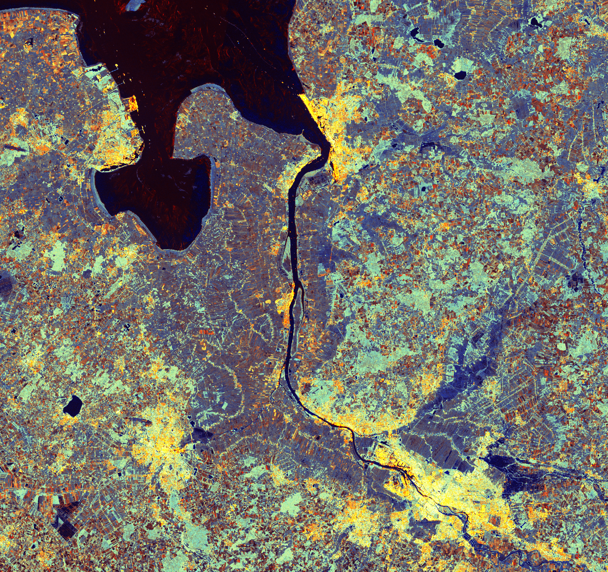

# Sentinel-1

The [Sentinel-1 radar imaging mission](https://sentiwiki.copernicus.eu/web/sentinel-1) is composed of a constellation of two polar-orbiting satellites providing continuous all-weather, day and night imagery for Land and Maritime Monitoring. C-band synthetic aperture radar imaging has the advantage of operating at wavelengths that are not obstructed by clouds or lack of illumination and therefore can acquire data during day or night under all weather conditions.

**The end of mission of the Sentinel-1B satellite has been declared in July 2022**  
On 23 December 2021, Copernicus Sentinel-1B experienced an anomaly related to the instrument electronics power supply provided by the satellite platform, leaving it unable to deliver radar data. Despite all investigations and recovery attempts, ESA and the European Commission had to announce that it is the end of the mission for Sentinel-1B. Copernicus Sentinel-1A remains fully operational. More information about the end of the mission for the Sentinel-1B satellite can be found on the webpage [Mission ends for Copernicus Sentinel-1B satellite](https://www.esa.int/Applications/Observing_the_Earth/Copernicus/Sentinel-1/Mission_ends_for_Copernicus_Sentinel-1B_satellite).  
In response to the loss of Sentinel-1B, **the mission observation scenario of Sentinel-1A was adjusted**, affecting the nominal global coverage frequency. An up-to-date overview of the observation scenario in place can be consulted on the webpage [Sentinel-1 Observation and Production Scenarios](https://sentiwiki.copernicus.eu/web/s1-mission#S1Mission-ObservationandProductionScenariosS1-Mission-Observation-and-Production-Scenarios). Some regions are currently not observed by Sentinel-1. Nevertheless, the regions that are still observed, now have a repeat cycle of 12 days under a one-satellite constellation scenario, which affects possible interferometric analyses.

**On 5 December 2024, Copernicus Sentinel-1C satellite was launched into orbit.** Following the maneuvers that brought the satellite into the orbital node, as well as commissioning activities, which are expected to end in May 2025, the 6-day repeat cycle will be restored under a two-satellite constellation scenario. An up-to-date overview of the observation scenario in place can be consulted on the webpage [Acquisition Plans](https://sentinels.copernicus.eu/copernicus/sentinel-1/acquisition-plans).

Sentinel data products are made available systematically and free of charge to all data users including the general public, scientific and commercial users. These [data products](https://sentiwiki.copernicus.eu/web/s1-products) are available in single polarisation for Wave mode and dual polarisation or single polarisation for SM, IW and EW modes.

Level-0

Level-1

Level-2

Level-3

## Sentinel-1 Level 1 Ground Range Detected (GRD)

[](https://sentiwiki.copernicus.eu/web/s1-processing#S1Processing-GroundRangeDetected(GRD)S1-Processing-Ground-Range-Detected)[](https://browser.stac.dataspace.copernicus.eu/collections/sentinel-1-grd?.language=en)[](https://catalogue.dataspace.copernicus.eu/odata/v1/Products?$filter=Collection/Name%20eq%20%27SENTINEL-1%27%20and%20Attributes/OData.CSC.StringAttribute/any(att:att/Name%20eq%20%27instrumentShortName%27%20and%20att/Value%20eq%20%27SAR%27)%20and%20(Attributes/OData.CSC.StringAttribute/any(att:att/Name%20eq%20%27productType%27%20and%20att/OData.CSC.StringAttribute/Value%20eq%20%27EW_GRDH_1S%27)%20or%20Attributes/OData.CSC.StringAttribute/any(att:att/Name%20eq%20%27productType%27%20and%20att/OData.CSC.StringAttribute/Value%20eq%20%27EW_GRDM_1S%27)%20or%20Attributes/OData.CSC.StringAttribute/any(att:att/Name%20eq%20%27productType%27%20and%20att/OData.CSC.StringAttribute/Value%20eq%20%27IW_GRDH_1S%27)%20or%20Attributes/OData.CSC.StringAttribute/any(att:att/Name%20eq%20%27productType%27%20and%20att/OData.CSC.StringAttribute/Value%20eq%20%27S1_GRDH_1S%27)%20or%20Attributes/OData.CSC.StringAttribute/any(att:att/Name%20eq%20%27productType%27%20and%20att/OData.CSC.StringAttribute/Value%20eq%20%27S2_GRDH_1S%27)%20or%20Attributes/OData.CSC.StringAttribute/any(att:att/Name%20eq%20%27productType%27%20and%20att/OData.CSC.StringAttribute/Value%20eq%20%27S3_GRDH_1S%27)%20or%20Attributes/OData.CSC.StringAttribute/any(att:att/Name%20eq%20%27productType%27%20and%20att/OData.CSC.StringAttribute/Value%20eq%20%27S4_GRDH_1S%27)%20or%20Attributes/OData.CSC.StringAttribute/any(att:att/Name%20eq%20%27productType%27%20and%20att/OData.CSC.StringAttribute/Value%20eq%20%27S5_GRDH_1S%27)%20or%20Attributes/OData.CSC.StringAttribute/any(att:att/Name%20eq%20%27productType%27%20and%20att/OData.CSC.StringAttribute/Value%20eq%20%27S6_GRDH_1S%27))%20and%20Online%20eq%20true&$top=10)


#### Overview

The [Sentinel 1 Level 1 GRD](https://sentiwiki.copernicus.eu/web/s1-products) products in this Collection consist of focused SAR data that has been detected, multi-looked and projected to ground range using the Earth ellipsoid model WGS84. The ellipsoid projection of the GRD products is corrected using the terrain height specified in the product general annotation. The terrain height used varies in azimuth but is constant in range (but can be different for each IW/EW sub-swath). Ground range coordinates are the slant range coordinates projected onto the ellipsoid of the Earth. Pixel values represent detected amplitude. Phase information is lost. The resulting product has approximately square resolution pixels and square pixel spacing with reduced speckle at a cost of reduced spatial resolution.

##### Offered Data

| Archive Status | Spatial Extent | Temporal Extent |
|----|----|----|
| (\*) Packed or Unpacked | World | Oct 2014 - Present |
| (\*\*) Packed or Unpacked, SAFE with Cloud optimized GeoTIFF | World | Oct 2014 - Present |
| (\*\*\*) Packed, original SAFE | World | Last one year |

(\*) Packed means data are available in the original bundling (e.g. compressed zipping)  
(\*\*) Conversion of Sentinel-1 GRD products to the SAFE with Cloud Optimized GeoTIFF (COG_SAFE) format was performed in June 2023. The newest products are converted and available first, and older products will be added gradually until the entire archive is converted. Please refer to [Handling Sentinel-1 COG_SAFE products](https://documentation.dataspace.copernicus.eu/Data/Others/Sentinel1_COG.html) for more information regarding how COG_SAFE is created and how to search for such products.  
(\*\*\*) COG_SAFE products will be available immediately (IAD). In case original Sentinel-1 GRD products would be needed with immediate access, users can convert COG_SAFE products to the original SAFE products [using COG2GRD tool](https://github.com/eu-cdse/utilities).

Further details about the data collection

Copernicus Sentinel data 2023  

##### Spatial Extent

\[-180, -90, 180, 90\]

##### Temporal Interval

\[‘2014-10-03T00:00:00Z’, None\]

##### Spectral Bands

| Band Name |
|:---------:|
|    VH     |
|    VV     |
|    HH     |
|    HV     |

##### Useful Links

- STAC: [https://stac-extensions.github.io/datacube/v1.0.0/schema.json](https://stac-extensions.github.io/datacube/v1.0.0/schema.json)

## Sentinel-1 Level 1 Single Look Complex (SLC)

[](https://sentiwiki.copernicus.eu/web/s1-processing#S1Processing-SingleLookComplex(SLC)S1-Processing-Single-Look-Complex)[](https://browser.stac.dataspace.copernicus.eu/?.language=en)[](https://catalogue.dataspace.copernicus.eu/odata/v1/Products?$filter=Collection/Name%20eq%20%27SENTINEL-1%27%20and%20Attributes/OData.CSC.StringAttribute/any(att:att/Name%20eq%20%27instrumentShortName%27%20and%20att/Value%20eq%20%27SAR%27)%20and%20(Attributes/OData.CSC.StringAttribute/any(att:att/Name%20eq%20%27productType%27%20and%20att/OData.CSC.StringAttribute/Value%20eq%20%27S1_SLC__1S%27)%20or%20Attributes/OData.CSC.StringAttribute/any(att:att/Name%20eq%20%27productType%27%20and%20att/OData.CSC.StringAttribute/Value%20eq%20%27S2_SLC__1S%27)%20or%20Attributes/OData.CSC.StringAttribute/any(att:att/Name%20eq%20%27productType%27%20and%20att/OData.CSC.StringAttribute/Value%20eq%20%27S3_SLC__1S%27)%20or%20Attributes/OData.CSC.StringAttribute/any(att:att/Name%20eq%20%27productType%27%20and%20att/OData.CSC.StringAttribute/Value%20eq%20%27S4_SLC__1S%27)%20or%20Attributes/OData.CSC.StringAttribute/any(att:att/Name%20eq%20%27productType%27%20and%20att/OData.CSC.StringAttribute/Value%20eq%20%27S5_SLC__1S%27)%20or%20Attributes/OData.CSC.StringAttribute/any(att:att/Name%20eq%20%27productType%27%20and%20att/OData.CSC.StringAttribute/Value%20eq%20%27S6_SLC__1S%27)%20or%20Attributes/OData.CSC.StringAttribute/any(att:att/Name%20eq%20%27productType%27%20and%20att/OData.CSC.StringAttribute/Value%20eq%20%27IW_SLC__1S%27)%20or%20Attributes/OData.CSC.StringAttribute/any(att:att/Name%20eq%20%27productType%27%20and%20att/OData.CSC.StringAttribute/Value%20eq%20%27EW_SLC__1S%27)%20or%20Attributes/OData.CSC.StringAttribute/any(att:att/Name%20eq%20%27productType%27%20and%20att/OData.CSC.StringAttribute/Value%20eq%20%27WV_SLC__1S%27))%20and%20Online%20eq%20true&$top=10)


#### Overview

The [Sentinel 1 Level 1 SLC](https://sentiwiki.copernicus.eu/web/s1-products) products are images in the slant range by azimuth imaging plane, in the image plane of satellite data acquisition. Each image pixel is represented by a complex (I and Q) magnitude value and therefore contains both amplitude and phase information. Each I and Q value is 16 bits per pixel. The processing for all SLC products results in a single look in each dimension using the full available signal bandwidth. The imagery is geo-referenced using orbit and attitude data from the satellite.

Sentinel-1 SLC data is also available as Sentinel-1 SLC Bursts. The SLC (Single Look Complex) Burst products capture data in bursts, which are segments of radar echoes acquired by cyclically switching the antenna beam across multiple sub-swaths. For more information please refer to [Sentinel-1 SLC Bursts](https://documentation.dataspace.copernicus.eu/APIs/Sentinel-1%20SLC%20Burst.html) documentation page and see the OData endpoint in [SLC Burst Catalog API](https://catalogue.dataspace.copernicus.eu/odata/v1/Bursts).

##### Offered Data

| Archive Status     | Spatial Extent      | Temporal Extent    |
|--------------------|---------------------|--------------------|
| Packed or Unpacked | Europe              | Oct 2014 - Present |
| Packed or Unpacked | Except Europe (RoW) | Feb 2021 - Present |
| Packed or Unpacked | World               | Oct 2014 - Present |

Further details about the data collection

[Copernicus Sentinel data 2023](https://sentinels.copernicus.eu/documents/247904/690755/Sentinel_Data_Legal_Notice)  

##### Spatial Extent

\[-180, -90, 180, 90\]

##### Temporal Interval

\[‘2014-10-03T00:00:00Z’, None\]

##### Useful Links

- STAC: [https://stac-extensions.github.io/datacube/v2.2.0/schema.json](https://stac-extensions.github.io/datacube/v2.2.0/schema.json)

## Sentinel-1 Level 2 Ocean (OCN)

[](https://sentiwiki.copernicus.eu/web/s1-processing#S1Processing-L2AlgorithmsS1-Processing-L2-Algorithms)[](https://browser.stac.dataspace.copernicus.eu/?.language=en)[](https://catalogue.dataspace.copernicus.eu/odata/v1/Products?$filter=Collection/Name%20eq%20%27SENTINEL-1%27%20and%20Attributes/OData.CSC.StringAttribute/any(att:att/Name%20eq%20%27instrumentShortName%27%20and%20att/Value%20eq%20%27SAR%27)%20and%20(Attributes/OData.CSC.StringAttribute/any(att:att/Name%20eq%20%27productType%27%20and%20att/OData.CSC.StringAttribute/Value%20eq%20%27S1__OCN__2S%27)%20or%20Attributes/OData.CSC.StringAttribute/any(att:att/Name%20eq%20%27productType%27%20and%20att/OData.CSC.StringAttribute/Value%20eq%20%27S2__OCN__2S%27)%20or%20Attributes/OData.CSC.StringAttribute/any(att:att/Name%20eq%20%27productType%27%20and%20att/OData.CSC.StringAttribute/Value%20eq%20%27S3__OCN__2S%27)%20or%20Attributes/OData.CSC.StringAttribute/any(att:att/Name%20eq%20%27productType%27%20and%20att/OData.CSC.StringAttribute/Value%20eq%20%27S4__OCN__2S%27)%20or%20Attributes/OData.CSC.StringAttribute/any(att:att/Name%20eq%20%27productType%27%20and%20att/OData.CSC.StringAttribute/Value%20eq%20%27S5__OCN__2S%27)%20or%20Attributes/OData.CSC.StringAttribute/any(att:att/Name%20eq%20%27productType%27%20and%20att/OData.CSC.StringAttribute/Value%20eq%20%27S6__OCN__2S%27)%20or%20Attributes/OData.CSC.StringAttribute/any(att:att/Name%20eq%20%27productType%27%20and%20att/OData.CSC.StringAttribute/Value%20eq%20%27IW_OCN__2S%27)%20or%20Attributes/OData.CSC.StringAttribute/any(att:att/Name%20eq%20%27productType%27%20and%20att/OData.CSC.StringAttribute/Value%20eq%20%27EW_OCN__2S%27)%20or%20Attributes/OData.CSC.StringAttribute/any(att:att/Name%20eq%20%27productType%27%20and%20att/OData.CSC.StringAttribute/Value%20eq%20%27WV_OCN__2S%27))%20and%20Online%20eq%20true&$top=10)


#### Overview

The [Sentinel-1 Level 2 OCN (Ocean)](https://sentiwiki.copernicus.eu/web/s1-processing#S1Processing-L2AlgorithmsS1-Processing-L2-Algorithms) products are specifically processed radar data products for oceanographic applications. These products are derived from Sentinel-1 SAR data. They are tailored to meet the needs of oceanographic studies, such as monitoring sea surface conditions, detecting oil spills, tracking marine vessels, and studying ocean currents. The OCN products typically involve specialized processing techniques to extract relevant oceanographic information from the radar data. This can include surface wave analysis, wind speed and direction estimation, ocean surface current mapping, and identifying features such as oil slicks or marine traffic.

##### Offered Data

| Archive Status     | Spatial Extent | Temporal Extent    |
|--------------------|----------------|--------------------|
| Packed or Unpacked | World          | Dec 2014 - Present |
| Packed or Unpacked | World          | Dec 2014 - Present |

## Sentinel-1 Level 0

[](https://sentinels.copernicus.eu/web/sentinel/user-guides/sentinel-1-sar/product-types-processing-levels/level-0)[](https://catalogue.dataspace.copernicus.eu/odata/v1/Products?$filter=Collection/Name%20eq%20%27SENTINEL-1%27%20and%20Attributes/OData.CSC.StringAttribute/any(att:att/Name%20eq%20%27instrumentShortName%27%20and%20att/Value%20eq%20%27SAR%27)%20and%20(Attributes/OData.CSC.StringAttribute/any(att:att/Name%20eq%20%27productType%27%20and%20att/OData.CSC.StringAttribute/Value%20eq%20%27S1_RAW__0S%27)%20or%20Attributes/OData.CSC.StringAttribute/any(att:att/Name%20eq%20%27productType%27%20and%20att/OData.CSC.StringAttribute/Value%20eq%20%27S2_RAW__0S%27)%20or%20Attributes/OData.CSC.StringAttribute/any(att:att/Name%20eq%20%27productType%27%20and%20att/OData.CSC.StringAttribute/Value%20eq%20%27S3_RAW__0S%27)%20or%20Attributes/OData.CSC.StringAttribute/any(att:att/Name%20eq%20%27productType%27%20and%20att/OData.CSC.StringAttribute/Value%20eq%20%27S4_RAW__0S%27)%20or%20Attributes/OData.CSC.StringAttribute/any(att:att/Name%20eq%20%27productType%27%20and%20att/OData.CSC.StringAttribute/Value%20eq%20%27S5_RAW__0S%27)%20or%20Attributes/OData.CSC.StringAttribute/any(att:att/Name%20eq%20%27productType%27%20and%20att/OData.CSC.StringAttribute/Value%20eq%20%27S6_RAW__0S%27)%20or%20Attributes/OData.CSC.StringAttribute/any(att:att/Name%20eq%20%27productType%27%20and%20att/OData.CSC.StringAttribute/Value%20eq%20%27IW_RAW__0S%27)%20or%20Attributes/OData.CSC.StringAttribute/any(att:att/Name%20eq%20%27productType%27%20and%20att/OData.CSC.StringAttribute/Value%20eq%20%27EW_RAW__0S%27)%20or%20Attributes/OData.CSC.StringAttribute/any(att:att/Name%20eq%20%27productType%27%20and%20att/OData.CSC.StringAttribute/Value%20eq%20%27WV_RAW__0S%27))%20and%20Online%20eq%20true&$top=10)


#### Overview

The [Sentinel-1 Level 0](https://sentinels.copernicus.eu/web/sentinel/user-guides/sentinel-1-sar/product-types-processing-levels/level-0) products are unprocessed radar measurements obtained by the satellite’s SAR system, containing amplitude and phase information. They serve as the initial input for generating higher-level radar products with calibrated and corrected data.

##### Offered Data

| Archive Status     | Spatial Extent      | Temporal Extent    |
|--------------------|---------------------|--------------------|
| Packed or Unpacked | World               | Jan 2021 - Present |
| Packed or Unpacked | Europe              | Oct 2014 - Present |
| Packed or Unpacked | Except Europe (RoW) | Last one year      |

## Sentinel-1 Precise Orbit Determination (POD) products

#### Overview

The Precise Orbital products and auxiliary data from Copernicus POD for Sentinel-1 fall into three categories based on timeliness. Near Real-Time (NRT) products are created immediately using GPS L0 data and EGP’s near real-time GPS orbits and clocks. Near Real-Time Predicted (PRE) products are computed in advance of astronomical events, like ascending node crossings. Non Time Critical (NTC) products are generated after several days, incorporating highly accurate inputs like GPS orbits and clocks from IGS.

##### Offered Data

| Product ID | Content | EOF | TGZ | Rolling Policy | Catalog API | S3 Path |
|----|----|----|----|----|----|----|
| AUX_RESORB | Orbit | X |  | 3 months | [OData](https://catalogue.dataspace.copernicus.eu/odata/v1/Products?$filter=((Online%20eq%20true)%20and%20(((((((Attributes/OData.CSC.StringAttribute/any(i0:i0/Name%20eq%20%27productType%27%20and%20i0/Value%20eq%20%27AUX_RESORB%27))))%20and%20(Collection/Name%20eq%20%27SENTINEL-1%27))))))) | /eodata/Sentinel-1/AUX/AUX_RESORB/ |
| AUX_POEORB | Orbit | X |  |  | [OData](https://catalogue.dataspace.copernicus.eu/odata/v1/Products?$filter=((Online%20eq%20true)%20and%20(((((((Attributes/OData.CSC.StringAttribute/any(i0:i0/Name%20eq%20%27productType%27%20and%20i0/Value%20eq%20%27AUX_POEORB%27))))%20and%20(Collection/Name%20eq%20%27SENTINEL-1%27))))))) | /eodata/Sentinel-1/AUX/AUX_POEORB/ |
| AUX_PREORB | Orbit | X |  | 3 months | [OData](https://catalogue.dataspace.copernicus.eu/odata/v1/Products?$filter=((Online%20eq%20true)%20and%20(((((((Attributes/OData.CSC.StringAttribute/any(i0:i0/Name%20eq%20%27productType%27%20and%20i0/Value%20eq%20%27AUX_PREORB%27))))%20and%20(Collection/Name%20eq%20%27SENTINEL-1%27))))))) | /eodata/Sentinel-1/AUX/AUX_PREORB/ |
| AUX_GNSSRD | RINEX |  | X |  | [OData](https://catalogue.dataspace.copernicus.eu/odata/v1/Products?$filter=((Online%20eq%20true)%20and%20(((((((Attributes/OData.CSC.StringAttribute/any(i0:i0/Name%20eq%20%27productType%27%20and%20i0/Value%20eq%20%27AUX_GNSSRD%27))))%20and%20(Collection/Name%20eq%20%27SENTINEL-1%27))))))) | /eodata/Sentinel-1/AUX/AUX_GNSSRD/ |
| AUX_PROQUA | Quaternions |  | X |  | [OData](https://catalogue.dataspace.copernicus.eu/odata/v1/Products?$filter=((Online%20eq%20true)%20and%20(((((((Attributes/OData.CSC.StringAttribute/any(i0:i0/Name%20eq%20%27productType%27%20and%20i0/Value%20eq%20%27AUX_PROQUA%27))))%20and%20(Collection/Name%20eq%20%27SENTINEL-1%27))))))) | /eodata/Sentinel-1/AUX/AUX_PROQUA/ |

## Sentinel-1 Level 3 Monthly Mosaics

[](https://browser.stac.dataspace.copernicus.eu/collections/sentinel-1-global-mosaics?.language=en)[](https://catalogue.dataspace.copernicus.eu/odata/v1/Products?$filter=Collection/Name%20eq%20%27GLOBAL-MOSAICS%27%20and%20(Attributes/OData.CSC.StringAttribute/any(att:att/Name%20eq%20%27productType%27%20and%20att/OData.CSC.StringAttribute/Value%20eq%20%27S1SAR_L3_DH_MCM%27)%20or%20Attributes/OData.CSC.StringAttribute/any(att:att/Name%20eq%20%27productType%27%20and%20att/OData.CSC.StringAttribute/Value%20eq%20%27S1SAR_L3_IW_MCM%27))%20and%20Online%20eq%20true&$top=10)




[View in browser](https://browser.dataspace.copernicus.eu/?zoom=5&lat=50.16282&lng=20.78613&themeId=DEFAULT-THEME&visualizationUrl=U2FsdGVkX1%2BXlMdUZLnVQoYUh01myIX6O1WXr1kbOUG31t0HstlLz0G0204oHh6UmVbK5kwkJkqpKeJZeMBuap6kPO41lj2f%2BJd5uZwMUW5GElYBig9e%2FBAeZ5%2B2voXK&datasetId=3c662330-108b-4378-8899-525fd5a225cb&fromTime=2023-12-01T00%3A00%3A00.000Z&toTime=2023-12-01T23%3A59%3A59.999Z&layerId=0-RGB-RATIO&demSource3D=%22MAPZEN%22&cloudCoverage=30&dateMode=SINGLE)

#### Overview

Sentinel-1 monthly mosaics are generated from monthly stacks of Sentinel-1 GRD data by calculating the weighted sum of the terrain corrected backscatter observations. Two different Sentinel-1 mosaics are being produced for each month: IW mosaic and DH mosaic (more details below).

##### Offered Data

| Mosaic | Spatial Extent | Temporal Extent | S3 Path |
|----|----|----|----|
| IW | Non-polar landmasses, depends on availability of IW products | Jan - Dec 2023 \* | e.g., /eodata/Global-Mosaics/Sentinel-1/S1SAR_L3_IW_MCM/2023/01/01 |
| DH | Polar regions, depends on availability of HH + HV polarised products | Jan - Dec 2023 \* | e.g., /eodata/Global-Mosaics/Sentinel-1/S1SAR_L3_DH_MCM/2023/01/01 |

More mosaics coming soon.

##### Algorithm

**Input data and preprocessing**

Sentinel-1 GRD data, as offered and pre-processed in Sentinel Hub, serves as input for the generation of mosaics. The preprocessing steps made in Sentinel Hub are explained in detail in the [Sentinel Hub documentation](https://documentation.dataspace.copernicus.eu/APIs/SentinelHub/Data/S1GRD.html#processing-chain). Here, we are only listing the main processing steps applied to the input data before mosaicking:

**(1)** Calibration to beta0 backscatter coefficient

**(2)** Thermal noise removal

**(3)** Radiometric terrain correction using area integration

**(4)** Terrain Correction using Range-Doppler terrain correction

For steps 3 and 4, the Copernicus DEM was used with a spatial resolution of 10m over Europe and 30m for the rest of the world.

**Generation of mosaics**

Two different mosaics are being produced for each month: **IW mosaic** and **DH mosaic**

|  | IW mosaic | DH mosaic |
|----|----|----|
| Polarization | VV + VH | HH + HV |
| Acquisition mode | IW acquisition mode | All acquisition modes |
| Orbit direction | both |  |
| Processing grid | UTM grid with 100,08 x 100,08 km tiles ([link](https://s3.eu-central-1.amazonaws.com/sh-batch-grids/tiling-grid-2.zip)) |  |
| Spatial resolution | 20 m | 40 m |
| Output format | 16-bit cloud optimized GeoTIFF |  |

The weighted sum of the flattened backscatter observations was used for mosaicking data in a monthly stack. Observations with the highest available local resolution receive the highest local weights. Therefore, the differences in backscatter between areas sloping towards the sensor and away from the sensor in individual orbits are largely corrected, and the resulting signal is mainly a product of the local surface properties.Observations in radar shadows are filtered out and are not used. The algorithm is described in detail in the paper by D. Small ‘SAR backscatter multitemporal compositing via local resolution weighting’ ([pdf](https://www.zora.uzh.ch/id/eprint/68085/1/2012_SmallD-AV_20120722-IGARSS12-LocalResolutionWeighting_Kopie_.pdf) is available). The resulting mosaics have less noise and better spatial homogeneity when compared to each single Sentinel-1 GRD observation.

[Access Sentinel-1 Level 3 Monthly Mosaics with Sentinel Hub](#AccessBYOC)

##### Access Sentinel-1 Level 3 Monthly Mosaics with Sentinel Hub

Sentinel-1 Level 3 Monthly Mosaics are onboarded to Sentinel Hub as a BYOC data collection. To access the data, you will need the specific pieces of information listed below, for general information about how to access BYOC collections visit our [Data BYOC page](https://documentation.dataspace.copernicus.eu/APIs/SentinelHub/Data/Byoc.html).

**IW Mosaics**

- Data collection id: byoc-3c662330-108b-4378-8899-525fd5a225cb
- Available Bands and Data:

| Name | Description | Resolution |
|----|----|----|
| VV | VV polarization | 20 m |
| VH | VH polarization | 20 m |
| dataMask | The mask of data/no data pixels ([more](https://documentation.dataspace.copernicus.eu/APIs/SentinelHub/UserGuides/Datamask.html)) | N/A\* |

\*dataMask has no source resolution as it is calculated for each output pixel.

###### Example of requesting mosaic over Sfântu Gheorghe with Processing API request

The request below is written in Python. To execute it, you need to create an OAuth client as is explained [here](https://documentation.dataspace.copernicus.eu/APIs/SentinelHub/Overview/Authentication.html#python). It is named `oauth` in this example.

``` python
evalscript = """
//VERSION=3
function setup() {
  return {
    input: ["VV", "VH", "dataMask"],
    output: { bands: 3 }
  };
}

var viz = new HighlightCompressVisualizer(0, 0.8);
var gain = 0.8;


function evaluatePixel(sample) {
  if (sample.dataMask == 0) {
    return [0, 0, 0];
  }
  
  let vals = [gain * sample.VV / 0.28,
              gain * sample.VH / 0.06,
              gain * sample.VH / sample.VV / 0.49];
  
  return viz.processList(vals);
}
"""

request = {
  "input": {
    "bounds": {
      "bbox": [
          25.713501,
          45.74836,
          26.196213,
          45.965231
      ]
    },
    "data": [
      {
        "dataFilter": {
          "timeRange": {
            "from": "2023-09-01T00:00:00Z",
            "to": "2023-09-02T23:59:59Z"
          }
        },
        "type": "byoc-3c662330-108b-4378-8899-525fd5a225cb"
      }
    ]
  },
  "output": {
    "width": 512,
    "height": 330,
    "responses": [
      {
        "identifier": "default",
        "format": {
          "type": "image/jpeg"
        }
      }
    ]
  },
  "evalscript": evalscript,
}

url = "https://sh.dataspace.copernicus.eu/process/v1"
response = oauth.post(url, json=request)
```

**DH Mosaics**

- Data collection id: byoc-cc676fec-cb8d-4bc1-adce-1d9658da950b
- Available Bands and Data:

| Name | Description | Resolution |
|----|----|----|
| HH | HH polarization | 40 m |
| HV | HV polarization | 40 m |
| dataMask | The mask of data/no data pixels ([more](https://documentation.dataspace.copernicus.eu/APIs/SentinelHub/UserGuides/Datamask.html)) | N/A\* |

\*dataMask has no source resolution as it is calculated for each output pixel.

###### Example of requesting mosaic over Reykjavík with Processing API request

The request below is written in Python. To execute it, you need to create an OAuth client as is explained [here](https://documentation.dataspace.copernicus.eu/APIs/SentinelHub/Overview/Authentication.html#python). It is named `oauth` in this example.

``` python
evalscript = """
//VERSION=3
function setup() {
  return {
    input: ["HH", "HV", "dataMask"],
    output: { bands: 4 }
  };
}

var viz = new HighlightCompressVisualizer(0, 0.8);
var gain = 0.8;


function evaluatePixel(sample) {
  let vals = [gain * sample.HH / 0.28,
              gain * sample.HV / 0.06,
              gain * sample.HV / sample.HH / 0.49];
  
  let out = viz.processList(vals);
  out.push(sample.dataMask);
  return out;
}
"""

request = {
  "input": {
    "bounds": {
      "bbox": [
          -22.486267,
          63.959085,
          -19.79187,
          64.722572
      ]
    },
    "data": [
      {
        "dataFilter": {
          "timeRange": {
            "from": "2023-01-01T00:00:00Z",
            "to": "2023-01-02T23:59:59Z"
          }
        },
        "type": "byoc-cc676fec-cb8d-4bc1-adce-1d9658da950b"
      }
    ]
  },
  "output": {
    "width": 858,
    "height": 553,
    "responses": [
      {
        "identifier": "default",
        "format": {
          "type": "image/jpeg"
        }
      }
    ]
  },
  "evalscript": evalscript,
}

url = "https://sh.dataspace.copernicus.eu/process/v1"
response = oauth.post(url, json=request)
```

# Derived products & Processing options

Sentinel-1 data can be accessed and processed in different ways within the Copernicus Data Space Ecosystem. Below we have compiled an overview of all the options to help you decide which one to use.

## [Sentinel-1 RTC](https://documentation.dataspace.copernicus.eu/Data/SentinelMissions/Sentinel1.html#sentinel-1-rtc)

[Sentinel-1 RTC](https://documentation.dataspace.copernicus.eu/Data/SentinelMissions/Sentinel1.html#sentinel-1-rtc) (Radiometric Terrain Correction) SAR Backscatter is a product processed from Sentinel-1 GRD data and compliant with [CEOS Analysis Ready Data for Land (CARD4L) specifications](https://ceos-dev.ceos.org/ard/) for Normalised Radar Backscatter (NRB) products. Orthorectification is based on Copernicus DEM and no speckle filtering is applied ([Additional product information](https://sentiwiki.copernicus.eu/web/s1-products#S1Products-Sentinel-1ARDNormalisedRadarBackscatter(NRB)ProductS1-Products-Sentinel-1-ARD-Normalised-Radar-Backscatter)).

## [Sentinel Hub processing options](https://documentation.dataspace.copernicus.eu/APIs/SentinelHub/Data/S1GRD.html#processing-options)

Sentinel Hub offers the following processing options in the [Sentinel-1 GRD processing chain](https://documentation.dataspace.copernicus.eu/APIs/SentinelHub/Data/S1GRD.html#processing-chain):

- [Backscatter coefficients](https://documentation.dataspace.copernicus.eu/APIs/SentinelHub/Data/S1GRD.html#processing-options):

  - **beta0 (ellipsoid)**
  - **sigma0 (ellipsoid)**
  - **gamma0 (ellipsoid)**
  - **gamma0 (terrain)** → this gamma0 RTC option can only be performed if *orthorectification* is enabled

- [Lee Speckle Filtering](https://documentation.dataspace.copernicus.eu/APIs/SentinelHub/Data/S1GRD.html#processing-options) applied on source data after calibration and noise removal

- [Radiometric Terrain Correction (RTC)](https://documentation.dataspace.copernicus.eu/APIs/SentinelHub/Data/S1GRD.html#processing-options) can be enabled by setting the backscatter coefficient to *gamma0 (terrain)* and enabling *orthorectification*

- [Orthorectification](https://documentation.dataspace.copernicus.eu/APIs/SentinelHub/Data/S1GRD.html#processing-options) with Range-Doppler terrain correction using one of the following DEMs:

  - **Copernicus 10m/30m DEM** (10m resolution inside [39 European states](https://spacedata.copernicus.eu/collections/copernicus-digital-elevation-model) including islands and 30m elsewhere.)
  - **Copernicus 30m DEM**
  - **Copernicus 90m DEM**

## openEO processing options

When working with the SENTINEL1_GRD data collection through openEO, SAR backscatter computation is automatically applied using the “sigma0-ellipsoid” coefficient (ground area computed with ellipsoid earth model).

While “sigma0-ellipsoid” is the only option at the moment and used as default, it is optional to make this explicit with a [`sar_backscatter()`](https://processes.openeo.org/draft/#sar_backscatter) process in your workflow for self-documenting purposes:

``` python

sentinel1 = connection.load_collection(
    "SENTINEL1_GRD",
    temporal_extent = ["2022-06-04", "2022-08-04"],
    spatial_extent = {"west": 4.0, "south": 48.0, "east": 4.1, "north": 48.1},
    bands = ["VV","VH"],
)
sentinel1 = sentinel1.sar_backscatter(
    coefficient="sigma0-ellipsoid",
)
```

The product is orthorectified using the Copernicus 30m DEM. No RTC or speckle filtering is applied to this product.

## [On-demand processing options](https://documentation.dataspace.copernicus.eu/APIs/On-Demand%20Production%20API.html)

Processing of CARD-BS and COH6/COH12 products can be requested [on demand](https://documentation.dataspace.copernicus.eu/APIs/On-Demand%20Production%20API.html):

- [Sentinel-1 (CARD-BS) BackScatter](https://documentation.dataspace.copernicus.eu/APIs/On-Demand%20Production%20API.html)

  - This processing option contains gamma0 geometric terrain correction (orthorectification) using Copernicus 30m DEM (identical to the *gamma0 (ellipsoid)* backscatter coefficient with enabled *orthorectification* option in Sentinel Hub processing options.) No RTC or speckle filtering is applied to this product.
  - [Additional information](https://creodias.eu/eodata/sentinel-1/sentinel-1-l2-backscatter-bs/)

- [Sentinel-1 (CARD-COH) Coherence](https://documentation.dataspace.copernicus.eu/APIs/On-Demand%20Production%20API.html)

  - The Sentinel-1 CARD COH (Copernicus Analysis Ready Data Coherence) processor generates a Sentinel-1 Level 2 product describing the coherence of a pair of images - 12 days apart. The product is orthorectified using Copernicus 30m DEM but no RTC or speckle filtering is applied.
  - [Additional information](https://creodias.eu/eodata/sentinel-1/sentinel-1-l3-bs-monthly-com/).
