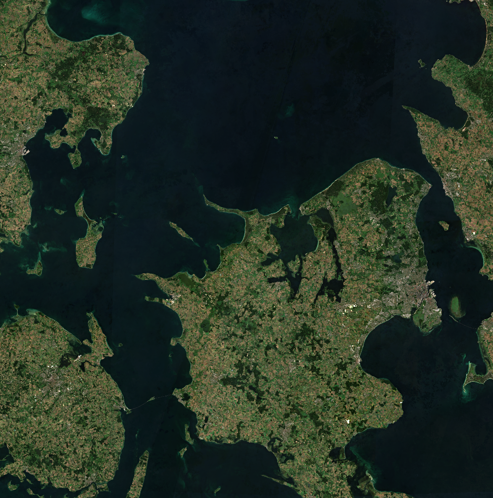

# Sentinel-2

The [Copernicus Sentinel-2 mission](https://sentiwiki.copernicus.eu/web/sentinel-2) comprises a land monitoring constellation of two polar-orbiting satellites placed in the same sun-synchronous orbit, phased at 180° to each other. It aims at monitoring variability in land surface conditions, and its wide swath width (290 km) and high revisit time (10 days at the equator with one satellite, and 5 days with 2 satellites which results in 2-3 days at mid-latitudes) will support monitoring of Earth’s surface changes.

Copernicus Sentinel-2C satellite was launched into orbit 5 September 2024. It has replaced Sentinel-2A in operation on 21 January 2025.

Following the announcement regarding the Sentinel-2A temporary extension campaign ([Sentinel-2A: Exceptional temporary extension campaign starting in March 2025](https://sentinels.copernicus.eu/-/sentinel-2a-exceptional-temporary-extension-campaign-starting-in-march-) and [Sentinel-2A: Extended Campaign Starting March 13, 2025](https://sentinels.copernicus.eu/web/sentinel/-/sentinel-2a-extended-campaign-starting-march-13-2025)) Sentinel-2A has maneuvered into a new orbit (located 36° away from Sentinel-2B) and resumed observations in 13 March 2025. With this campaign, the Sentinel-2 constellation consists of 3 satellites for 1 year (till 13 March 2026).

The satellites carry a single payload: the optical Multi-Spectral Instrument (MSI) that samples 13 spectral bands: four bands at 10 m, six bands at 20 m and three bands at 60 m spatial resolution.

Each [Sentinel-2 products](https://sentiwiki.copernicus.eu/web/s2-products) is composed of approximately 110x110 km tiles in cartographic geometry (UTM/WGS84 projection). Earth is subdivided on a predefined set of tiles, defined in UTM/WGS84 projection and using a 100 km step. However, each tile has a surface of 110x110 km² in order to provide large overlap with the neighbouring.

The processing baseline indicates the version of the processing algorithm applied to the raw data to generate the Sentinel-2 products. Re-processed products are referred as Sentinel-2 Collection-1. More details about the Sentinel-2 Processing Baselines, associated operational products and Collection-1 products, are available [here](https://sentiwiki.copernicus.eu/web/s2-processing). L1C and L2A Processing Baselines with the full list of processors’ releases is available on the [SentiBoard Processors page](https://operations.dashboard.copernicus.eu/processors-viewer.html?search=S2). With the Sentinel-2 Collection-1 download process near the end, soon all historical Sentinel-2 L1C and L2A data (up until 13 December 2023) will be available in 5.0 processing baseline or better.

More information about the Sentinel-2 Mission is available [here](https://sentiwiki.copernicus.eu/web/s2-mission)

Level-1

Level-2

Level-3

## Sentinel-2 Level 2A Surface Reflectance

[](https://sentiwiki.copernicus.eu/web/s2-processing#S2Processing-L2AAlgorithmsS2-Processing-L2A-Algorithmstrue)[](https://browser.stac.dataspace.copernicus.eu/collections/sentinel-2-l2a?.language=en)[](https://catalogue.dataspace.copernicus.eu/odata/v1/Products?$filter=Collection/Name%20eq%20%27SENTINEL-2%27%20and%20Attributes/OData.CSC.StringAttribute/any(att:att/Name%20eq%20%27productType%27%20and%20att/OData.CSC.StringAttribute/Value%20eq%20%27S2MSI2A%27)%20and%20Online%20eq%20true&$top=10)


[View in browser](https://dataspace.copernicus.eu/browser/?zoom=11&lat=45.36638&lng=12.49832&themeId=DEFAULT-THEME&visualizationUrl=https%3A%2F%2Fsh.dataspace.copernicus.eu%2Fogc%2Fwms%2F28b654e7-8912-4e59-9e58-85b58d768b3a&datasetId=S2_L2A_CDAS&fromTime=2023-02-07T00%3A00%3A00.000Z&toTime=2023-02-07T23%3A59%3A59.999Z&layerId=1_TRUE_COLOR&demSource3D=%22MAPZEN%22&cloudCoverage=10)

#### Overview

[Sentinel-2 Level 2A](https://sentiwiki.copernicus.eu/web/s2-products) Level 2A product provides atmospherically corrected Surface Reflectance (SR) images, derived from the associated Level-1C products. The atmospheric correction of Sentinel-2 images includes the correction of the scattering of air molecules (Rayleigh scattering), of the absorbing and scattering effects of atmospheric gases, in particular ozone, oxygen and water vapor and the correction of absorption and scattering due to aerosol particles. Additional Level-2A output image products are an Aerosol Optical Thickness (AOT) map, a Water Vapour (WV) map and a Scene Classification (SCL) map. These image products, as well as the Surface Reflectance for the different spectral bands, are resampled at different spatial resolutions (10 m, 20 m, or 60 m). Level 2A product are considered an ARD product.

## Sentinel-2 Level 1C Top of Atmosphere (TOA)

[](https://sentiwiki.copernicus.eu/web/s2-processing#S2Processing-L1CAlgorithmsS2-Processing-L1C-Algorithmstrue)[](https://browser.stac.dataspace.copernicus.eu/collections/sentinel-2-l1c?.language=en)[](https://catalogue.dataspace.copernicus.eu/odata/v1/Products?$filter=Collection/Name%20eq%20%27SENTINEL-2%27%20and%20Attributes/OData.CSC.StringAttribute/any(att:att/Name%20eq%20%27productType%27%20and%20att/OData.CSC.StringAttribute/Value%20eq%20%27S2MSI1C%27)%20and%20Online%20eq%20true&$top=10)


[View in browser](https://dataspace.copernicus.eu/browser/?zoom=11&lat=45.36638&lng=12.49832&themeId=DEFAULT-THEME&visualizationUrl=https%3A%2F%2Fsh.dataspace.copernicus.eu%2Fogc%2Fwms%2Fa1343b61-3f53-4c92-b65c-0b432b3e7af6&datasetId=S2_L1C_CDAS&fromTime=2023-05-05T00%3A00%3A00.000Z&toTime=2023-05-05T23%3A59%3A59.999Z&layerId=1_TRUE_COLOR&demSource3D=%22MAPZEN%22&cloudCoverage=10)

#### Overview

[Sentinel-2 Level 1C](https://sentiwiki.copernicus.eu/web/s2-products) products are available globally from 2015 onwards. These products are resampled with a constant Ground Sampling Distance (GSD) of 10, 20 and 60 m, depending on the native resolution of the different spectral bands. Pixel coordinates refer to the upper left corner of the pixel. The Level-1C product provides Top Of Atmosphere (TOA) reflectance images, derived for associated Level-1B products.

## Sentinel-2 Level 1B

[](https://sentiwiki.copernicus.eu/web/s2-processing#S2Processing-L1BAlgorithmsS2-Processing-L1B-Algorithmstrue)


#### Overview

The [Sentinel-2 Level 1B](https://sentiwiki.copernicus.eu/web/s2-products) product provides radiometrically corrected imagery in Top-Of-Atmosphere (TOA) radiance values and in sensor geometry. Additionally, this product includes the refined geometric model which is used to generate the Level 1C product. The Level-1B product is composed of an ensemble of granules that are 25 km across track (AC) by 23 km along track (AL). Each granule is approximately 27 MB in size. These products are released only to expert users on request.

## Sentinel-2 Level 3 Quarterly Mosaics

[](https://browser.stac.dataspace.copernicus.eu/collections/sentinel-2-global-mosaics?.language=en)[](https://catalogue.dataspace.copernicus.eu/odata/v1/Products?$filter=Collection/Name%20eq%20%27GLOBAL-MOSAICS%27%20and%20Attributes/OData.CSC.StringAttribute/any(att:att/Name%20eq%20%27productType%27%20and%20att/OData.CSC.StringAttribute/Value%20eq%20%27S2MSI_L3__MCQ%27)%20and%20Online%20eq%20true&$top=10)




[View in browser](https://dataspace.copernicus.eu/browser/?zoom=9&lat=55.87668&lng=11.89707&themeId=DEFAULT-THEME&visualizationUrl=https%3A%2F%2Fsh.dataspace.copernicus.eu%2Fogc%2Fwms%2F86789569-bd7b-498e-a521-0db055391cdf&datasetId=5460de54-082e-473a-b6ea-d5cbe3c17cca&fromTime=2023-07-01T00%3A00%3A00.000Z&toTime=2023-07-01T23%3A59%3A59.999Z&layerId=TRUE-COLOR-CLOUDLESS&demSource3D=%22MAPZEN%22&cloudCoverage=30)

#### Overview

Sentinel-2 Quarterly Mosaics are mosaics generated from three months of Sentinel-2 level 2A. The mosaics have four bands of data (Red (B04), Green (B03), Blue (B02) and wide band Near Infrared (B08)). First, cloud masking based on the scene classification layer of the Sentinel-2 level 2 algorithm was applied, then for each pixel and band, within three-month time periods, the first quartile of the distribution of the pixel values was taken as the output value to filter out any bright pixels misclassified as not clouds. If there are no valid pixels for the given timeframe, the pixel is left empty.

##### Offered Data

| Archive Status     | Spatial Extent | Temporal Extent         |
|--------------------|----------------|-------------------------|
| Packed or Unpacked | World          | (\*) Jan 2022 - Present |

(\*) More will be added

Further details about the data collection

Copernicus Sentinel data 2023  

##### Spatial Extent

\[-180, -90, 180, 90\]

##### Temporal Interval

\[‘2023-01-01T00:00:00Z’, None\]

##### Spectral Bands

|  Band Name   | Common Name  | GSD(m) | Center Wavelength(μm) |
|:------------:|:------------:|:------:|:---------------------:|
|     B02      |     Blue     |   10   |         0.49          |
|     B03      |    Green     |   10   |         0.56          |
|     B04      |     Red      |   10   |         0.665         |
|     B08      |     NIR      |   10   |         0.842         |
| observations | Valid pixels |   10   |          N/A          |

##### Algorithm

The following algorithm was run independently for each pixel:

**(1)** For each pixel: Take the three-month stack of Sentinel-2 L2A observations. Only bands `B02`, `B03`, `B04`, `B08` and `SCL` are used to create the mosaic. For bands `B02`-`B08` transform the values to reflectance.

**(2)** For each observation: Mark an observation as `invalid` if the value of the Sentinel-2 L2A scene classification band (`SCL`) has one of the following values:

- `1`-SATURATED_DEFECTIVE,
- `3`-CLOUD_SHADOW,
- `7`-CLOUD_LOW_PROBA / UNCLASSIFIED,
- `8`-CLOUD_MEDIUM_PROBA,
- `9`-CLOUD_HIGH_PROBA,
- `10`-THIN_CIRRUS

**(3)** For each pixel: Discard all invalid observations, what remains is called valid observations. The number of valid observations is generally different for each pixel and is output as a positive integer in the `observations` output band.

**(4)** For each pixel, for each band (`B02`, `B03`, `B04`, `B08`): Sort all valid observations for each band separately.

**(5)** For each pixel, for each band (`B02`, `B03`, `B04`, `B08`): Take the value of the first quartile and multiply it by `10000` (to get a ‘digital number’). This is an output value.

**(6)** For each pixel, for each band (`B02`, `B03`, `B04`, `B08`): If there are no valid observations, output the value `-32768`, which represents no data. For the `observations` band, output the value `0`, which also represents no data.

> **NOTE:**
>
> - If multiple Sentinel-2 observations from the same day are available, only the most recent observation on that day is used.
> - No pre-filtering (e.g. based on cloud coverage) was performed to preserve as many non-cloudy pixels as possible.

[Access Sentinel-2 Level 3 Quarterly Mosaics with Sentinel Hub](#AccessBYOC)

##### Access Sentinel-2 Level 3 Quarterly Mosaics with Sentinel Hub

Sentinel-2 Level 3 Quarterly Mosaics are onboarded to Sentinel Hub as a BYOC data collection. To access the data, you will need the specific pieces of information listed below, for general information about how to access BYOC collections visit our [Data BYOC page](https://documentation.dataspace.copernicus.eu/APIs/SentinelHub/Data/Byoc.html).

- Data collection id: `byoc-5460de54-082e-473a-b6ea-d5cbe3c17cca`
- Available Bands and Data:

| Name | Description | Resolution |
|----|----|----|
| B02 | Blue | 10 m |
| B03 | Green | 10 m |
| B04 | Red | 10 m |
| B08 | Near Infrared (NIR) | 10 m |
| observations | Number of valid observations | 10 m |
| dataMask | The mask of data/no data pixels ([more](https://documentation.dataspace.copernicus.eu/APIs/SentinelHub/UserGuides/Datamask.html)). | N/A\* |

\*dataMask has no source resolution as it is calculated for each output pixel.

###### Example of requesting mosaic over Rome with Processing API request

The request below is written in python. To execute it, you need to create an OAuth client as is explained [here](https://documentation.dataspace.copernicus.eu/APIs/SentinelHub/Overview/Authentication.html#python). It is named `oauth` in this example.

``` python
evalscript = """
//VERSION=3
function setup() {
  return {
    input: ["B02", "B03", "B04"],
    output: { bands: 3 }
  };
}

function evaluatePixel(sample) {
  return [2.5 * sample.B04/10000, 2.5 * sample.B03/10000, 2.5 * sample.B02/10000];
}
"""

request = {
  "input": {
    "bounds": {
      "bbox": [
        12.44693,
        41.870072,
        12.541001,
        41.917096
      ]
    },
    "data": [
      {
        "dataFilter": {
          "timeRange": {
            "from": "2023-01-01T00:00:00Z",
            "to": "2023-01-02T23:59:59Z"
          }
        },
        "type": "byoc-5460de54-082e-473a-b6ea-d5cbe3c17cca"
      }
    ]
  },
  "output": {
    "width": 780,
    "height": 523,
    "responses": [
      {
        "identifier": "default",
        "format": {
          "type": "image/jpeg"
        }
      }
    ]
  },
  "evalscript": evalscript,
}

url = "https://sh.dataspace.copernicus.eu/process/v1"
response = oauth.post(url, json=request)
```

## Sentinel-2 Precise Orbit Determination (POD) products

#### Overview

The Copernicus POD Service for SENTINEL-2 provides Precise Orbital products with NRT timeliness, including two product types. Near Real-Time (NRT) orbital products are created immediately using real-time GPS data from EGP, while Near Real Time Predicted (PRE) products are calculated in advance of specific astronomical events, such as ascending node crossings.

##### Offered Data

| Product ID | Content | EOF | TGZ | Catalog API | S3 Path |
|----|----|----|----|----|----|
| AUX_GNSSRD | RINEX |  | X | [OData](https://catalogue.dataspace.copernicus.eu/odata/v1/Products?$filter=((Online%20eq%20true)%20and%20(((((((Attributes/OData.CSC.StringAttribute/any(i0:i0/Name%20eq%20%27productType%27%20and%20i0/Value%20eq%20%27AUX_GNSSRD%27))))%20and%20(Collection/Name%20eq%20%27SENTINEL-2%27))))))) | /eodata/Sentinel-2/AUX/AUX_GNSSRD/ |
| AUX_PROQUA | Quaternions |  | X | [OData](https://catalogue.dataspace.copernicus.eu/odata/v1/Products?$filter=((Online%20eq%20true)%20and%20(((((((Attributes/OData.CSC.StringAttribute/any(i0:i0/Name%20eq%20%27productType%27%20and%20i0/Value%20eq%20%27AUX_PROQUA%27))))%20and%20(Collection/Name%20eq%20%27SENTINEL-2%27))))))) | /eodata/Sentinel-2/AUX/AUX_PROQUA/ |
| AUX_POEORB\* | Orbit | X |  | [OData](https://catalogue.dataspace.copernicus.eu/odata/v1/Products?$filter=((Online%20eq%20true)%20and%20(((((((Attributes/OData.CSC.StringAttribute/any(i0:i0/Name%20eq%20%27productType%27%20and%20i0/Value%20eq%20%27AUX_POEORB%27))))%20and%20(Collection/Name%20eq%20%27SENTINEL-2%27))))))) | /eodata/Sentinel-2/AUX/AUX_POEORB/ |

\*S-2 AUX_POEORB currently not available. The backlog will be generated by CPOD, and made available on CPODIP, but it will require coordination with ESA/Copernicus Data Space Ecosystem.

# Derived products

## Sentinel-2 Level 2A WorldCover Annual Cloudless Mosaic (RGBNIR)

The Sentinel-2 L2A WorldCover Annual composites are global cloud-free analysis ready mosaics at 10m resolution. They are obtained from the yearly Sentinel-2 archives, for the years 2020 and 2021. From the yearly time-series of each band, clouds are masked and the median value is computed.

The RGBNIR mosaics contain the 10m bands (B04, B03, B02, B08) and are delivered as Cloud Optimized Geotiffs (COGs).

See [Sentinel-2 Level 2A WorldCover Annual Cloudless Mosaics (RGBNIR) in the Coperncius Browser](https://link.dataspace.copernicus.eu/xvs).

For further information on Sentinel-2 Level 2A WorldCover Annual Cloudless Mosaic (RGBNIR) please also visit the [ESA WorldCover page](https://esa-worldcover.org/en).

## Sentinel-2 L2A 120m Mosaic

The Sentinel-2 L2A 120m mosaic is a derived product, which contains best pixel values for 10-daily periods, modeled by removing the cloudy pixels and then performing interpolation among remaining values. They are produced for the years 2019 and 2020.

## Sentinel-2 Global Land Cover (S2GLC)

The Sentinel-2 Global Land Cover (S2GLC) provides high resolution Poland (2019-2021) and Europe (2017) land cover map based on Sentinel-2 imagery.

For further information on Sentinel-2 Global Land Cover (S2GLC) please also visit the [ESA WorldCover page](https://s2glc.cbk.waw.pl/).
