# Frequently Asked Questions

## General

In comparison to the existing legacy Copernicus Data Hub, what will be the free services other than stac/cog?

Compared to the previously existed Copernicus Data Hub, there will be additional APIs - OGC interfaces (WMS, WMTS, WCS), OpenEO, Sentinel Hub API, S3, and others. Please refer to the [Roadmap](https://dataspace.copernicus.eu/#roadmap) for more information on the timing of these interfaces.

Is there an end user document that describes specific data products and specific services that are available?

The user level details for every service and dataset will be provided in this documentation. In accordance with each and every service and dataset embedded into the ecosystem, this documentation will be updated.

How long is the project timescale in total?

The time scale of the project is 6 years starting from late 2022 (i.e. to the end of 2028) with an optional extension up to 4 years (i.e. 2032).

Can anyone outside from Europe have free access to any data?

Yes, data and services will be available to users worldwide and according to the EU Policy. You can visit [Terms and Conditions](https://dataspace.copernicus.eu/terms-and-conditions) for more information.

What is the citation format for referencing Sentinel data downloaded from CDSE?

If the image in processed in the Copernicus Browser kindly use the phrase “Contains modified Copernicus Sentinel data \[YEAR\] for Sentinel data processed in Copernicus Browser”  
  
Where the user communicates to the public or distributes Copernicus Sentinel Data and Service Information, he/she shall inform the recipients of the source of that Data and Information by using the following notice:

- ‘Copernicus Sentinel data \[Year\]’ for Sentinel data; and/or
- ‘Copernicus Service information \[Year\]’ for Copernicus Service Information

Where the Copernicus Sentinel Data and Service Information have been adapted or modified, the user shall provide the following notice:

- ‘Contains modified Copernicus Sentinel data \[Year\]’ for Sentinel data; and/or
- ‘Contains modified Copernicus Service information \[Year\]’ for Copernicus Service Information

For further reading kindly have a look at the [Legal notice on the use of Copernicus Sentinel Data and Service Information](https://sentinels.copernicus.eu/documents/247904/690755/Sentinel_Data_Legal_Notice) or [Copyrights section of the Terms and conditions](https://dataspace.copernicus.eu/terms-and-conditions) .

Is there any difference between EU users and non-EU users?

There is no difference between EU users and non-EU users. That said, there will be a continuity of the accounts with higher throughput, managed by ESA (i.e. Copernicus Services, International Partners, etc.).

Which users are eligible for which account types (Quotas)?

There are four account types defined by the [Quotas and Limitations](https://documentation.dataspace.copernicus.eu/Quotas.html) policy: Copernicus General user Account, Copernicus Services user Account, Copernicus Collaborative Ground Segment user Account, and Copernicus International user Account. Users can find their user Account type under “Account info” in the [Dashboard](https://shapps.dataspace.copernicus.eu/dashboard/#/) page. These user account types determine the quotas and limitations applied to users — for example, Copernicus Services user Accounts receive larger quotas than Copernicus General user Accounts.

- Copernicus Services user Account- this account type is reserved for European Union institutions and bodies and organisations working on [Copernicus Services](https://www.copernicus.eu/en/copernicus-services).
- Copernicus Collaborative Ground Segment user Account - Ground segment organisations from Copernicus Participating States with an agreement with ESA and European Commission.
- Copernicus International user Account- international partners with an agreement with ESA and European Commission.

If your organisation matches one of the profiles above, please [fill out the Change your Copernicus user type form](https://dataspace.copernicus.eu/copernicus-services-user) to request a user account type upgrade. If you are uncertain about your eligibility, you may still submit the form for evaluation. Please note that Copernicus Data Space Ecosystem monitoring requirements include reporting aggregated consumption on account level, shared within project stakeholder group. We would also recommend reviewing following resources:

- [Information about quotas](https://documentation.dataspace.copernicus.eu/Quotas.html) for specific services
- The [Ecosystem developers](https://dataspace.copernicus.eu/ecosystem/services), where users can get access to extended quotas under commercial terms.

Which users are eligible for which CCM user categories (CCM dataset access)?

There are six CCM User categories. These are: Copernicus Services and Union Institutional Users, Union Research Project users, National Public Authority users, International Organisations user, Public user, and Copernicus Operator user.  
  
Users can find their CCM User cateogory under “Copernicus Contributing Missions Category” in the [Dashboard](https://shapps.dataspace.copernicus.eu/dashboard/#/) page. Access to CCM datasets is determined by the user’s CCM user category.  
  
For a complete description of each category and the detailed eligibility criteria, please refer to the official CCM User Categories page on the Copernicus Data Space Ecosystem: [Copernicus Contributing Missions User Categories](https://dataspace.copernicus.eu/explore-data/data-collections/copernicus-contributing-missions/ccm-user-categories).

Where can I find a forum for support and get more information about the available services and products?

You can find the Copernicus Data Space Ecosystem forum [here](https://forum.dataspace.copernicus.eu/). Select your category of interest and you might find your question already answered. If not, ask and our team or other users will help you find a solution.

Where can I find Terms of Use and Privacy Policy?

Here are the links to both:

- [Terms of Use](https://dataspace.copernicus.eu/terms-and-conditions)
- [Privacy Policy](https://dataspace.copernicus.eu/privacy-policy)

How can I stay updated and subscribe to your newsletter?

You can stay updated in various ways: [subscribe to our Copernicus Data Space Ecosystem monthly newsletter](https://dataspace.copernicus.eu/subscribe), use our RSS feeds, subscribe to our YouTube channel, and follow us on social media. See this [page](https://dataspace.copernicus.eu/stay-informed) for more information and links.

What license are the products released under?

See [Terms and Conditions](https://dataspace.copernicus.eu/terms-and-conditions) of the Copernicus Data Space Ecosystem, in particular chapter 3 for detailed information.

How to access the level of products that require expert knowledge (e.g. Sentinel-2 Level 1B, or the WV mode for Sentinel-1 Level 0)?

Taking into account working with such level of products require expert knowledge (e.g. Sentinel-2 Level-1B product requires expert knowledge of orthorectification techniques.), please [submit a request](https://helpcenter.dataspace.copernicus.eu/hc/en-gb/requests/new) by including the following information:

- a brief information / justification about the request
- the user role (Engineer, PhD…)

Then our teams will facilitate the processing of your request.

How should I cite Copernicus Data Space Ecosystem?

For the generic use of Sentinel data, the following legal notice applies: [Sentinel Data Legal Notice](https://sentinels.copernicus.eu/documents/247904/690755/Sentinel_Data_Legal_Notice).If you are using CDSE APIs or discussing CDSE as a source of data, please cite the following paper:  
Dávid D. Kovács, Jan Musial, Jędrzej Bojanowski, Dennis Clarijs, Jurry de la Mar, and András Zlinszky. “Copernicus Data Space Ecosystem establishes public cloud processing for earth observation data.” *Scientific Data* (2026). doi: [10.1038/s41597-026-06765-8](https://doi.org/10.1038/s41597-026-06765-8)

## Data

What data will be offered online and what is the timeline for the following months?

For the details on the data offer and timing, please refer to the [Roadmap](https://dataspace.copernicus.eu/#roadmap)

How can I download Copernicus data in bulk mode?

The Copernicus Data Space Ecosystem (CDSE) provides two official methods for bulk downloading data, including the Copernicus DEM datasets:

1.  **S3-compatible object storage access (recommended for full dataset download)**
    - Log in to the [CDSE](https://dataspace.copernicus.eu)
    - Follow [Generate secrets documentation](https://documentation.dataspace.copernicus.eu/APIs/S3.html#generate-secrets)
    - Use the AWS CLI or compatible tools to access the data.

    Further information is available at: [S3 Access](https://documentation.dataspace.copernicus.eu/APIs/S3.html).
2.  **OData API access (recommended for programmatic or filtered downloads)**
    - Use a valid OAuth2 token to authenticate
    - Filter by collection ID: e.g. COP-DEM_GLO-30-DGED
    - Retrieve all product IDs and submit automated download requests

You may also use the CDSE OData API to automate the search and download of products by querying metadata.Further information is available at [OData API documentation page](https://documentation.dataspace.copernicus.eu/APIs/OData.html).  
  
Both methods are available to all users, data download capability depends on their respective user category.

Is there a page that indicates anomalies with the datasets?

The [Copernicus Sentinel Operations Dashboard](https://operations.dashboard.copernicus.eu/index) provides details of events over the past three months that have impact on the completeness of the data production, such as planned calibration activities, manoeuvres, or anomalies. The information of which data is affected is included.

With regard to cloud native formats/interfaces, will the data also be available in the original data formats (e.g. for data downloading)?

Yes, data will also be available in original data formats (i.e. .SAFE).

Will data, such as Sentinel-2, be processed to a consistent version?

The Sentinel-2 data will be available at the latest processing baseline. And with the reprocessing of Sentinel-2 happening in parallel (out of scope of this project), these will become available on this service as well. For more information on Sentinel-2 reprocessing campaign, please follow [Copernicus SENTINEL-2 Collection-1 Availability Status](https://sentinels.copernicus.eu/web/sentinel/-/sentinel-2-collection-1-products-availability)

Is it possible to download a subset of data corresponding to an AOI, instead of the whole image?

Yes, it is possible to download a subset of data, by using the dedicated APIs, i.e. Sentinel Hub, OpenEO.

Are there data offered in the Cloud Optimized Geotiffs (COG) format?

Yes, Sentinel-1 GRD Level 1 data will be available in COG format.

When Online data is mentioned, does that mean the data are not on tape?

The Online data (or Immediate Access Data (IAD)) are not on the tapes. Online data is the type of data where in its metadata it reads “Online”: true. These data can be downloaded directly from the Copernicus Data Space Ecosystem. On the other hand, Offline data (“Online”: false or Deferred Available Data(DAD)) first needs to be ordered via the [Data Workspace](https://dataspace.copernicus.eu/analyse/data-workspace) and only after that step, it can be downloaded.

Can we download the data acquired by all Sentinel missions (1, 2, 3, 5P, 6) and the other satellites (e.g. Meteosat) via the CDSE? Considering some missions are not managed by ESA, but by EUMETSAT for example.

The [Roadmap](Rhttps://dataspace.copernicus.eu/#roadmap) shows how the Copernicus Data Space Ecosystem will be continously enhanced in terms of available data.

Will the CDSE offer EO ready-to-use products or just L0 and L1 data?

Up to L3 products will be available. Please see the [Roadmap](https://dataspace.copernicus.eu/#roadmap).

Can I access Landsat data in Copernicus Data Space Ecosystem?

Landsat 8&9 Collection 2 generated by the USGS is available in the CDSE from 2022 onwards via the [S3 Protocol](https://documentation.dataspace.copernicus.eu/APIs/S3.html) at global scale. CDSE users can access Landsat data within the cloud environment only via the [S3 protocol](https://documentation.dataspace.copernicus.eu/APIs/S3.html), but downloading of Landsat data is not possible.  
On the contrary, Landsat 5 & 7 & 8 data generated by the ESA is available over Europe in the CDSE from 1984 onwards via the [S3 protocol](https://documentation.dataspace.copernicus.eu/APIs/S3.html) and [OData](https://documentation.dataspace.copernicus.eu/APIs/OData.html). Additional development is in progress for further integration, however, there is no plan to support Level-2 data or for supporting full Landsat history prior to 2021.

What is the highest resolution SAR data available in Copernicus Data Space Ecosystem?

The Sentinel-1 SAR achieves a spatial resolution of approximately 5 by 20 m. More information can be found [here](https://sentiwiki.copernicus.eu/web/sentinel-1).

Is it possible to acquire compressed data?

Copernicus Data Space Ecosystem provides access to EO data in zip format without compression(i.e. zero compression applied).

Which EO data is available?

To learn more about the available EO data, visit our [page](https://dataspace.copernicus.eu/explore-data/data-collections).

Where can I browse various data collections?

To browse various data, go to [Copernicus Browser](https://browser.dataspace.copernicus.eu/). Read about how to use it [here](https://documentation.dataspace.copernicus.eu/Applications/Browser.html).

How soon after the acquisition is data available?

We put a lot of effort into making data available as soon as possible. The expected timeliness is:

- 24 hours after sensing for Sentinel-1 and Sentinel-2
- 3 hours after sensing for Sentinel-3 and Sentinel-5P

Check the timeliness metrics in the [Dashboard](https://dashboard.dataspace.copernicus.eu/#/mission-snapshot).

Where can I get a list of the available imagery dates for a specific area?

The best way to get information about all the available scenes in a specific area is to use our [Catalog service API](https://documentation.dataspace.copernicus.eu/APIs/SentinelHub/Catalog.html), which will give you detailed geospatial information for each tile, that you can control by specifying fields, limits, and other properties. For this specific use case, it is most useful to use the [`distinct parameter with date`](https://documentation.dataspace.copernicus.eu/APIs/SentinelHub/Catalog/Examples.html#search-with-distinct), which will return a list of available dates for your requested BBOX and time range. To make this Catalog API request, import the following CURL request to Postman. You will need to [authenticate the request with a token](https://documentation.dataspace.copernicus.eu/APIs/SentinelHub/Overview/Authentication.html).

``` bash
curl -X POST 'sh.dataspace.copernicus.eu/api/v1/catalog/search' \
-header 'Authorization: Bearer <your access token>' \
-header 'Content-Type: application/json' \
-data-raw '{
   "bbox": [13,45,14,46],
   "datetime": "2019-12-10T00:00:00Z/2020-12-15T00:00:00Z",
   "collections": ["sentinel-1-grd"],
   "limit": 50,
   "distinct": "date"
}'
```

In the curl request above, the first line is the URL for the request, which you only need to change if you’re using data collections on different deployments. The first header is where you add your access token; if you authenticate the collection or the request in Postman, the token will be automatically added. The second header is where you specify the desired output, which in this case, is a JSON file. In `data-raw`, you will specify the `bbox`, time range (`datetime`), data collection (`collections`), `limit` (the upper limit of the number of results), and with the line `“distinct”:“date”`, you will limit your results to only include information on the acquisition date. Consult the [Catalog API reference](https://documentation.dataspace.copernicus.eu/APIs/SentinelHub/ApiReference.html) to learn more about the available parameters.

The result for the CURL request above will look like this:

``` json

{
    "type": "FeatureCollection",
    "features": [
        "2019-12-10",
        "2019-12-11",
        "2019-12-12",
        "2019-12-15"
    ],
    "links": [
        {
            "href": "http://sh.dataspace.copernicus.eu/api/v1/catalog/search",
            "rel": "self",
            "type": "application/json"
        }
    ],
    "context": {
        "limit": 50,
        "returned": 4
    }
}
```

At the beginning of the result, you can see all the available dates listed for your request.

It’s also possible to search for available scenes using an OGC WFS request, which might be easier to use but offers less search control. To make a WFS request, you will need to add your `INSTANCE_ID`, specify the `bbox`, time range (`TIME`), data collection (`TYPENAMES`), coordinate system (`srsName`), and request type. An example WFS request would look like this:

``` bash

https://sh.dataspace.copernicus.eu/ogc/wfs/INSTANCE_ID?REQUEST=GetFeature&srsName=EPSG:3857&TYPENAMES=DSS2&BBOX=3238005,5039853,3244050,5045897&TIME=2019-02-11/2019-02-12
```

You can test WFS examples with different parameters and inspect the results instantly [here](https://documentation.dataspace.copernicus.eu/APIs/SentinelHub/OGC/Examples.html).

Note that you can also use the `MAXCC` parameter (maximum cloud coverage) in this call to filter cloudless data. Use the `FEATURE_OFFSET` parameter to control the starting point within the returned features and `MAXFEATURES` parameter - the maximum number of parameters of features to be returned by a single request.

As a result, you will get a list of all the available scenes for the chosen location in `JSON` format (or `XML` if set so). Some of the dates may be duplicated if there are two scenes available in the area. Simply ignore these duplications.

How are the values calculated within Sentinel Hub and how are they returned as an output?

In Sentinel Hub, the **calculated** and **output** values depend on what users specify in their [evalscripts](https://documentation.dataspace.copernicus.eu/APIs/SentinelHub/Evalscript/V3.html) (or custom scripts). By **calculated values** we are referring to the values that are returned from the `evaluatePixel()` function or from a simple script. **Output values** are values returned from Sentinel Hub, after the calculated values go through formatting defined by `sampleType`. In the evalscript, calculated and output values are controlled by:

- In the `setup()` function, the requested `bands` and `units` define what values are used as input for the calculation (in simple scripts, default units are used). For example, if Sentinel–2 band B04 is requested in `REFLECTANCE`, the input values will be in the range 0–1. If Sentinel-2 band B04 is requested in `DN` (digital numbers), the input values for the calculation will be in the range 0–10000. Typical value ranges can be found in our [data documentation](https://documentation.dataspace.copernicus.eu/APIs/SentinelHub/Data.html), chapter [Units](https://documentation.dataspace.copernicus.eu/APIs/SentinelHub/Data/S2L1C.html#units) for each data collection.
- The `evaluatePixel()` function defines the actual calculation (in simple scripts, the entire script is its equivalent). Sentinel Hub uses double precision for all calculations and rounds only the final calculated values before they are output.
- The value of the `sampleType` parameter in the `setup()` function defines the format of the output values. Possible values are `AUTO`, `UINT8`, `UINT16`, and `FLOAT32`. See our [sampleType documentation](https://documentation.dataspace.copernicus.eu/APIs/SentinelHub/Evalscript/V3.html#sampletype) for more details. When the `sampleType` is not specified (e.g., in simple scripts), the default value `AUTO` will be used. `sampleType.AUTO` takes calculated values from the interval 0–1 and stretches them to 0–255. If your calculated values are not in the range 0–1, make sure you either scale them to this range in the `evaluatePixel()` function or specify another `sampleType`.

**Example 1: NDVI**

In this example, we want to output values of the NDVI index, calculated based on Sentinel-2 data. Our `evaluatePixel()` function is:

``` javascript

    function evaluatePixel(sample) {
    let NDVI =  (sample.B08 - sample.B04) / (sample.B08 + sample.B04);
    return [NDVI];
}
```

The requested units in this example do not have any influence on the calculated values of the NDVI. The output values returned by Sentinel Hub for different `sampleType` values are:

| Calculated Value | sampleType.AUTO | sampleType.UINT8 | sampleType.UINT16 | sampleType.FLOAT32 |
|----|----|----|----|----|
| -1 | 0 | 0 | 0 | -1 |
| 0 | 0 | 0 | 0 | 0 |
| 0.25 | 64 | 0 | 0 | 0.25 |
| 1 | 255 | 1 | 1 | 1 |

Use `sampleType:“FLOAT32”` to return full floating -1 to 1 values. See the example [here](https://documentation.dataspace.copernicus.eu/APIs/SentinelHub/Process/Examples/S2L1C.html#exact-ndvi-values-using-a-floating-point-geotiff)

If you do not need values but a visualization, you can use `sampleType:“AUTO”`, but make sure to either:

- Map the NDVI values to the 0–1 interval in the `evaluatePixel()` function, e.g.:

``` javascript
           
function evaluatePixel(sample) {
    let NDVI =  (sample.B08 - sample.B04) / (sample.B08 + sample.B04);
    return [(NDVI + 1) / 2]
}
```

- Use a [visualizer](https://documentation.dataspace.copernicus.eu/APIs/SentinelHub/Evalscript/Utilities.html#visualizers) or a color visualization function, e.g. [valueInterpolate](https://documentation.dataspace.copernicus.eu/APIs/SentinelHub/Evalscript/Utilities.html#valueinterpolate).

  
**Example 2: Sentinel-2 band B04**

In this example, we want to output raw values of Sentinel-2 band 4. Our `evaluatePixel()` function looks like this:

``` javascript
    function evaluatePixel(sample) {
    return [sample.B04]
}
```

If we request `units: “REFLECTANCE”`, the output values returned by Sentinel Hub for different `sampleTypes` values are:

| Calculated Value | sampleType.AUTO | sampleType.UINT8 | sampleType.UINT16 | sampleType.FLOAT32 |
|----|----|----|----|----|
| 0 | 0 | 0 | 0 | 0 |
| 0.25 | 64 | 0 | 0 | 0.25 |
| 0.5 | 128 | 1 | 1 | 0.5 |
| 1 | 255 | 1 | 1 | 1 |
| 1.05 | 255 | 1 | 1 | 1.05 |

If we request `units: “DN”`, the output values returned by Sentinel Hub for different `sampleTypes` values are:

| Calculated Value | sampleType.AUTO | sampleType.UINT8 | sampleType.UINT16 | sampleType.FLOAT32 |
|----|----|----|----|----|
| 0 | 0 | 0 | 0 | 0 |
| 2500 | 255 | 255 | 2500 | 2500 |
| 5000 | 255 | 255 | 5000 | 5000 |
| 10000 | 255 | 255 | 10000 | 10000 |
| 10500 | 255 | 255 | 10500 | 10500 |

  
**Example 3: Brightness Temperature Bands**

Here we output a Sentinel-3 SLSTR band F1 with typical values between 250–320 representing brightness temperature in Kelvin. The `evaluatePixel()` function is:

``` javascript
function evaluatePixel(sample) {
    return [sample.F1]
}
```

The output values returned by Sentinel Hub for different `sampleTypes` values are:

| Calculated Value | sampleType.AUTO | sampleType.UINT8 | sampleType.UINT16 | sampleType.FLOAT32 |
|----|----|----|----|----|
| 250 | 255 | 250 | 250 | 250 |
| 255 | 255 | 255 | 255 | 255 |
| 275.3 | 255 | 255 | 275 | 275.3 |
| 320 | 255 | 255 | 320 | 320 |

Use `sampleType:“FLOAT32”` to return original values. If integer values are still acceptable for your application, use `sampleType:“UINT16”`.

If you do not need values but a visualization, you can use `sampleType:“AUTO”`, but make sure to either:

- Map the values to the 0–1 interval in the `evaluatePixel()` function, e.g.:

``` javascript

function evaluatePixel(sample) {
    return [sample.F1 / 320]
}
```

- Use a [visualizer](https://documentation.dataspace.copernicus.eu/APIs/SentinelHub/Evalscript/Utilities.html#visualizers) or a color visualization function, e.g. [valueInterpolate](https://documentation.dataspace.copernicus.eu/APIs/SentinelHub/Evalscript/Utilities.html#valueinterpolate).

How can I get images in higher resolution?

Open data are always served in their full resolution. Each of the collections has its own maximum resolution, which you can check in our documentation (see [here](https://documentation.dataspace.copernicus.eu/APIs/SentinelHub/Data/S2L1C.html#available-bands-and-data) for Sentinel-2). What you get for Sentinel-2 in Copernicus Browser is always a full resolution image. If you go to the effects in Copernicus Browser and enable NEAREST upscaling and downscaling, you will see individual pixels displayed, and you can even measure them to confirm that the pixel resolution indeed matches the maximum resolution of the sensor.

If you’re using the processing API, you can get full resolution by specifying the maximum resolution the collection offers using the `resx/resy` parameter. See the [full resolution example](https://documentation.dataspace.copernicus.eu/APIs/SentinelHub/Process/Examples/S2L1C.html#true-color-resolution-epsg-32633) for Sentinel-2.

Why are some Sentinel images missing?

There can be several reasons for missing data - for example, there could be an error in the processing chain of the Copernicus ground segment, or it could be debris avoidance. Sometimes there are also problems with the satellite itself (e.g., Sentinel-1B failed completely in December 2021 and the data has been unavailable ever since). If there is an interruption in satellite operation, this is logged in [ESA’s Events Viewer](https://operations.dashboard.copernicus.eu/events.html). If the data cannot be found there, we recommend that you address the question to ESA.

Why are some areas white?

Some areas never have cloud coverage below 20%. This is why in Copernicus Browser, where we have default settings for 30% of cloud coverage, for some areas it seems there is no satellite imagery available.

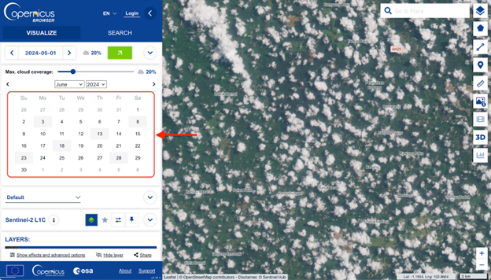

However, if we turn the slider for maximum cloud coverage to 100%, we can see [data available](https://link.dataspace.copernicus.eu/vujl).

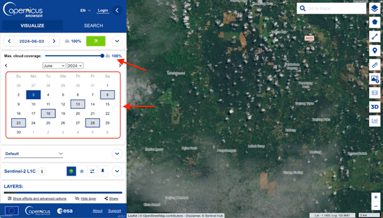

In the cloudless quarterly mosaic, we use as a background, areas without a cloud-free pixel during the time frame of interest are also displayed in white. For cold season composites, some areas may have had only one cloud-free satellite overpass but during a period of snow cover, therefore patterns of white swaths might reflect Sentinel-2 coverage patterns.

Why are the images without contrast?

We would like to serve data as it is, without uncontrolled changes, because it is almost impossible to set color balance to one fitting all places in the world and all groups of users. You can still tweak contrast in several ways.

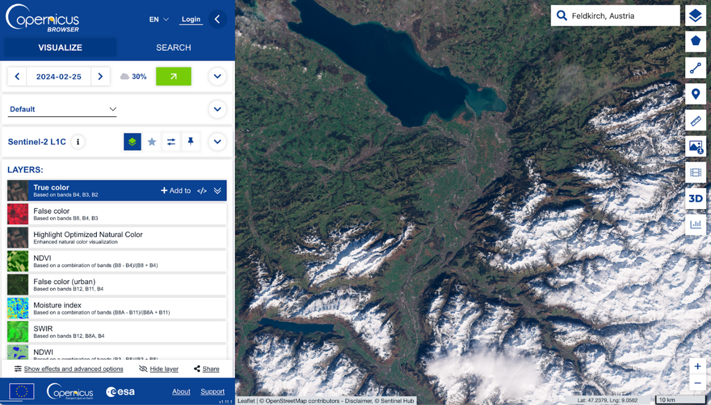

Raw picture

You can tweak “Gain” (brightness) to automatically equalize the image. Click on the “Show effects and advanced options” link at the bottom on the left.

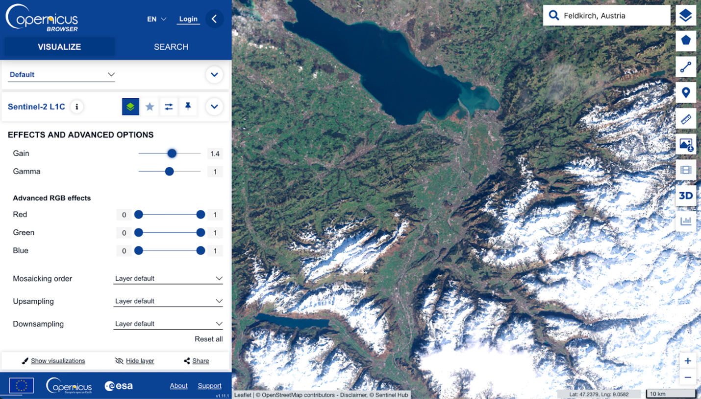

Gain adjusted to desired values.

You can tweak “Gamma” (contrast) as well.

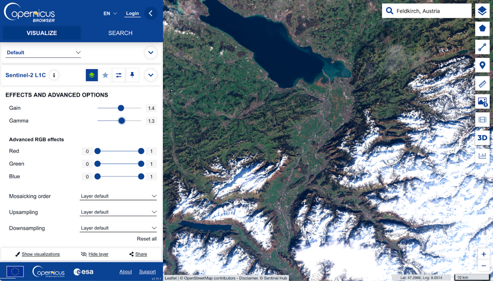

Gamma adjusted to desired values.

Use the atmospheric correction by using the S2L2A atmospherically corrected data instead of S2L1C. As you can see on the image below, atmospheric correction increases the contrast, as it corrects for the effects of the atmosphere.

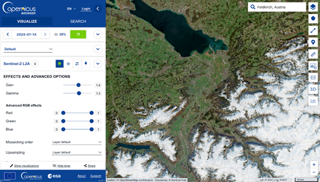

Atmospheric correction with S-2 L2A

How to get data in ‘native resolution’ in WGS84?

**Recommendation:** Whenever possible, you should work with the data in the same coordinate system as they are produced in, i.e., UTM (in the same zone!) for Sentinel-2. This will prevent the inaccuracy resulting from reprojections, rounding, etc.

However, if you really want to do it, we recommend the following approach:

- latitude resolution = real world ground distance resolution / 111226.26
- longitude resolution = real world ground distance resolution / 111226.26 / cos(lat)
  *lat = the latitude of the point at which the conversion needs to take place*

**Example:**

You are at (lat, lon) = (45, 10) and want to know how many degrees 10m is:

- latitude resolution = 10 / 111226.26 ~= 0.000090
- longitude resolution = 10 / 111226.26 / cos (45 degrees) ~= 0.000127

**Notes:**

- The coordinate systems are complicated, even more so if you go towards the poles.
- The above formulas hold for real world distances; projected distances (web mercator, UTM, etc.) are not the same thing and can be complicated to convert. That said, the UTM distance is usually quite close to the real-world distance, so the formula for converting between UTM and WGS84 should give reasonable results.
- **cos(lat)** should be performed with the latitude in radians, not degrees, so it’s actually **cos(latDegrees \* PI / 180)**.

How to access COP-DEM 10m?

**Availability:** COP-DEM 10m is available in the [Copernicus Contributing Missions (CCM) dataset](https://dataspace.copernicus.eu/explore-data/data-collections/copernicus-contributing-missions) within CDSE. **Restrictions:** Access is limited to eligible CCM User Categories and requires an application.

1.  **Check Eligibility:**
    - Kindly visit the [Copernicus Contributing Missions User Categories](https://dataspace.copernicus.eu/explore-data/data-collections/copernicus-contributing-missions/ccm-user-categories) page.
    - Kindly review the table at the bottom to see which categories are eligible for download (D).
    - Read the definitions for the categories: C-S-U-I, U-R-P, N-P-A, C-O.
2.  **Apply For Access:** If your organization’s email domain matches an eligible category: Follow the guide: [How to register to access Copernicus Contributing Missions data](https://dataspace.copernicus.eu/explore-data/data-collections/copernicus-contributing-missions/ccm-how-to-register) by selecting appropriate User Category.
3.  **Expect an email:** You’ll receive an email regarding your application within 1 business day.

For further information please consult [ESA-User license for the use of CCM data](https://dataspace.copernicus.eu/sites/default/files/media/files/2025-06/copernicus_contributing_mission_data_access_v2_cop_dem_licenses.pdf) and [CCM Data Access Restrictions](https://dataspace.copernicus.eu/sites/default/files/media/files/2025-06/ccm_data_access_restrictions_v2.pdf). For further assistance, you can reach out to the CDSE Support Team via [Submit a request](https://helpcenter.dataspace.copernicus.eu/hc/en-gb/requests/new). In your request please provide information such as whether you followed the procedure explained above, and a screenshot from your [Dashboard](https://shapps.dataspace.copernicus.eu/dashboard/#/).

## Services

Are the free offering and commercial offering integrated to facilitate the transfer of the users from free to commercial?

Yes, there will be a common user identity, which will allow registered users to seamlessly transfer between two mentioned systems.

When we develop an EO ready-to-use product, could we integrate it into the interface and ask the payment from clients?

Yes, commercial services can be built on top, similar to the Copernicus Open Licence.

Can users come with wish-list on services?

Yes, users can come up with suggestions to improve or expand the service portfolio. Users can post their improvement suggestions to [Community Forum](https://forum.dataspace.copernicus.eu/) for further evaluation.

Is there any limitation on the maximum number of downloads at a time?

Yes, there are quotas and limitations for different user types. For example, the number of concurrent connections limit for the Copernicus General user Account is 4, whereas for the Copernicus Services user Account, it is 20. Please refer to the [Quotas and Limitations](Quotas.llms.md) section of our documentation for more information regarding quotas and limitations apply to the Copernicus General user Account.

Is it possible to download Sentinel-2 data for a large area at a high resolution in the Copernicus Browser?

Depending on your use, we suggest to use the high-res print (via the high-res print tab) where you will get large areas in a high resolution (the data is though not georeferenced). If you need georeferenced data, split your area in several smaller images that you download or choose a bit lower resolution to stay within the limits of 2500px.

Where can I find more information regarding the quotas and limits for accessing data and using the services through your platform?

Please refer to the [Quotas and Limitations](Quotas.llms.md) section of our documentation for more information.

Which entities are qualified to get higher quotas in scope of “Copernicus Services” group and how can one ask for it?

The following users and initiatives are qualified for the increased quota:  

- Institutions and organisations developing or operating [Copernicus Services](https://www.copernicus.eu/en/copernicus-services)
- European institutions and Bodies set up under the EU Treaties.

Each institution or project can have several individuals’ user accounts, which belong to the same organisation and share the account’s quota (i.e. if one of the organisation users will consume full monthly project quota, the rest will not be able to use it further either). Project owners will be able to add further users to this organisation themselves. Organisations can choose the account type based on their preference, i.e. download-optimised or processing-optimized

- Download
- Processing - small
- Processing - medium
- Processing - large

In order to request for increased quota, [fill out this form](https://dataspace.copernicus.eu/copernicus-services-user) and provide the following information:

- account’s e-mail (you have to [register](https://identity.dataspace.copernicus.eu/auth/realms/CDSE/protocol/openid-connect/auth?client_id=cdse-public&response_type=code&scope=openid&redirect_uri=https%3A//dataspace.copernicus.eu/account/confirmed/1) before submitting this request, do use your organisation’s e-mail domain)
- organisation name (including department, if relevant)
- project name (i.e. Copernicus Services contract reference, project reference, etc.)
- project start date
- planned project end date
- institutional contact (i.e. contract officer at European Commission)
- preferred type of the account (“Download”, “Processing-small”, “Processing-medium”, “Processing-large”)
- notes

Please note that Copernicus Data Space Ecosystem monitoring requirements include reporting of aggregated consumption on account level, shared within project stakeholder group.

What does a “processing unit” mean?

A definition of a processing unit is available in our [documentation](https://documentation.dataspace.copernicus.eu/APIs/SentinelHub/Overview/ProcessingUnit.html). The rules with examples of how to calculate the number of processing units for a request are also provided.

What are the general rules of “processing units” and “requests” in the scope of Sentinel Hub?

The processing units and requests included in your Sentinel Hub plan are reset on the first day of each month. The unused processing units and requests are not carried over to the next month. If the usage exceeds the assigned quota, the user will be moved to a slower interface. Such a user will still be able to access and download products but at a reduced speed.

Visit our webpage for more details about the [processing units](https://documentation.dataspace.copernicus.eu/APIs/SentinelHub/Overview/ProcessingUnit.html) and [rate limiting](https://documentation.dataspace.copernicus.eu/APIs/SentinelHub/Overview/RateLimiting.html).

More about the quotas and limitations is also available [here](https://documentation.dataspace.copernicus.eu/Quotas.html).

What can I do if I run out of download quota, processing units, or requests?

Every user account is set with a limited quota to guarantee fair sharing of free tier resources within all users of the Copernicus Data Space Ecosystem (CDSE).  

The total volume of downloads from the CDSE for each user account is summed up for the last 30 days. The downloaded volume is checked on an hourly basis, and if it exceeds the assigned quota, the user will be moved to a slower interface. Such users will still be able to access and download products but at a reduced speed. More information about the quotas and limitations is also available in [Quotas and Limitations](https://documentation.dataspace.copernicus.eu/Quotas.html).  

If you run out of **download quota (e.g. S3 / OData)**, you can consider the following options:

- **Eligibility for higher quotas via Copernicus Services:** EU government agencies, public bodies, and entities developing or operating [Copernicus Services](https://www.copernicus.eu/en/copernicus-services) may be eligible for higher quotas. See [Which users are eligible for which account types (Quotas)](https://documentation.dataspace.copernicus.eu/FAQ.html#which-users-are-eligible-for-which-account-types) and [Which entities are qualified to get higher quotas in scope of “Copernicus Services”](https://documentation.dataspace.copernicus.eu/FAQ.html#which-entities-are-qualified-to-get-higher-quotas-in-scope-of-copernicus-services-group-and-how-can-one-ask-for-it). If eligible, submit the [Change your Copernicus user type](https://dataspace.copernicus.eu/copernicus-services-user) form.
- **Commercial access:** You can make use of the commercial provider integrated with CDSE. Please visit the page [CREODIAS](https://dataspace.copernicus.eu/ecosystem/services/creodias), and directly contact them.

If you run out of **openEO related quotas** (e.g. openEO credits) within CDSE:

- Note that these quotas (i.e. free) are monthly and will be replenished on the first day of every month. Accordingly, if possible, we suggest waiting until the first day of the coming month.
- Have a look at [Job Configuration](https://documentation.dataspace.copernicus.eu/APIs/openEO/job_config.html) to see if you can optimize your openEO jobs.
- Entities creating commercial services (including start-ups and service providers) may apply for [Credits for value creators](https://creodias.eu/pricing/credits-for-value-creators/). Navigate to [Credits for value creators](https://creodias.eu/pricing/credits-for-value-creators/), select openEO, and fill out the “Apply for credits” form.
- **Commercial access:** You can purchase extra openEO Cloud Credits through CREODIAS. Discover openEO Credit Packages here: [Visit CREODIAS](https://ecommerce.creodias.eu/vito).

If you run out of **Sentinel Hub related quotas** (e.g. Sentinel Hub Processing Units (PU)) within CDSE:

- Note that these quotas are monthly and will be replenished on the first day of every month. Accordingly, if possible, we suggest waiting until the first day of the coming month.
- You can consider decreasing the Processing Unit (PU) usage by interacting with Sentinel Hub affiliated applications or APIs (e.g. Copernicus Browser) when logged out whenever possible. For example, browsing and searching in the Copernicus Browser do not consume PU when carried out after logging out.
- Entities creating commercial services (including start-ups and service providers) may apply for [Credits for value creators](https://creodias.eu/pricing/credits-for-value-creators/). Navigate to [Credits for value creators](https://creodias.eu/pricing/credits-for-value-creators/), select Sentinel Hub, and fill out the “Apply for credits” form.
- **Commercial access:** You can make use of the commercial provider integrated with CDSE: Navigate to [CREODIAS](https://dataspace.copernicus.eu/ecosystem/services/creodias) offers EO processing services for Sentinel Hub and directly contact them.

How can I request a refund for openEO credits?

If jobs fail due to an error on the provider side, the user can be refunded for the credits used by these jobs. A user can fill in a [refund request form](https://dataspace.copernicus.eu/openeo-refund-request). The form requires the user to provide details about the job(s), such as the job ID and a timeframe of failed jobs. The request will be reviewed by the support team, and if approved, the credits used for that job and similar jobs in the same timeframe will be refunded to the user’s account. This is possible for all types of credits except for the free tier credits, which are not refundable.

What are typical conversions between processing units and square kilometers?

| Mission        | Product         | Resolution \[m\] | km² for one PU |
|----------------|-----------------|------------------|----------------|
| Sentinel-2     | True color      | 10               | 26.2           |
|                | NDVI            | 10               | 39.3           |
|                | All 13 bands    | 10               | 6.0            |
| Sentinel-1     | VV gamma0 ortho | 20               | 157.3          |
| Sentinel-3 OCI | True color      | 300              | 23,593.0       |
|                | OTCI            | 300              | 35,389.4       |

How can I know how many processing units I need and how to calculate the consumption of my requests?

Each request is worth a certain amount of processing units. If we only focus on [rate limiting](https://documentation.dataspace.copernicus.eu/APIs/SentinelHub/Overview/RateLimiting.html), the quota you need depends on how many processing units (PU) and requests per minute or month you intend to use. This in turn depends on how large your images are in pixels, how many of them you order, how many bands you order, the format used and whether some more complex processing options are enabled.

See documentation on how processing units are defined and calculated [here](https://documentation.dataspace.copernicus.eu/APIs/SentinelHub/Overview/ProcessingUnit.html). The following are detailed calculation examples for Sentinel-1, exploring three different scenarios, including a simple 1 image request, many small requests, long time ranges and large area processing.

**Example 1**

1 request that outputs an image 2000 x 2000 px large, with 2 bands ordered, 16-bit tiff format and orthorectification applied, would result in 20.34 PUs used. See the multiplication factors and the calculation below:

| Parameter | Your Parameters | Multiplication Factor |
|----|----|----|
| Output image size (width x height) | 2000 x 2000 = 4,000,000 | / (512 x 512) |
| Number of input bands | 2 | / 3 |
| Output format | 16-bit INT/UINT | x1 |
| Number of data samples per pixel | 1 | x1 |
| Orthorectification | Yes | x2 |

**The calculation**: (4,000,000 / 262,144) x (2 / 3) x 1 x 1 x 2 = 20.34 PU per request;

If you wanted to get 500 images (e.g. for time series), you would need to create 500 separate processing requests. If parameters for each image are equal as above, we can simply multiply our calculation with 500 and see that 500 similar requests would use about 10,172 PU in sum.

**The calculation**: 20.34 PU x 500 = ~10,172 PU per 500 requests

If your output image were smaller, e.g. 500 x 500 px large, the cost of a single request would be 1.27 PU. Multiplied by 500, that’s just 635.78 PU in total, so much less. On the other hand, if you wanted an image with quite a large output of 5000 x 5000 px, a request would cost you 127.15 PU, and 500 of these would cost ~63,578 PU. However, processing API is limited to output images with width and height up to 2500 px, so setting it to 5000 would result in an error. To output images this large, you would need a **Copernicus Service user Account** or a commercial Sentinel Hub account and bucket on [CREODIAS](https://creodias.eu/eobased-services/sentinel-hub/) to use batch processing API. You will notice that batch processing divides your PU cost by 3, as it’s only a third of the price of processing API. So your 500 requests would cost 63,578 / 3 = 21,192 PU.

**Example 2**

If you wanted to create a single request that uses 500 scenes in a multi-temporal script, where you e.g. calculate max NDVI over several years, using up 500 acquisitions, your request would also use 10,172 PU, just like our request for 2000 px x 2000 px output in Example 1 (given that all the other parameters are the same as in Example 1).

| Parameter | Your Parameters | Multiplication Factor |
|----|----|----|
| Output image size (width x height) | 2000 x 2000 = 4,000,000 | / (512 x 512) |
| Number of input bands | 2 | / 3 |
| Output format | 16-bit INT/UINT | x1 |
| Number of data samples per pixel | 500 | x500 |
| Orthorectification | Yes | x2 |

**The calculation**: (4,000,000 / 262,144) x (2 / 3) x 1 x 500 x 2 = 10,172 PU

The issue here is that you would use more than 2,000 PU in a single minute, as it’s just one request, and use this heavy isn’t supported by any package. Each package specifies how many PUs and requests you can use per month, as well as per minute. Your request would time out or fail. If you’re interested in very large time ranges, it’s best to use [batch processing API](https://documentation.dataspace.copernicus.eu/APIs/SentinelHub/BatchV2.html).

**Example 3**

Let’s suppose you want to order an orthorectified 16-bit Sentinel-1 image with 2 bands for the whole Australia in full resolution, which let’s say is covered with a 4000 x 4000 km bounding box, which equals to 4 million meters x 4 million meters. As Sentinel-1 resolution is 10 meters, we know that our output image will have to be 400,000 pixels x 400,000 pixels large.

| Parameter | Your Parameters | Multiplication Factor |
|----|----|----|
| Output image size (width x height) | 400,000 x 400,000 = 160,000,000,000 | / (512 x 512) |
| Number of input bands | 2 | / 3 |
| Output format | 16-bit INT/UINT | x1 |
| Number of data samples per pixel | 1 | x1 |
| Orthorectification | Yes | x2 |

**The calculation**: (160,000,000,000 / 262,144) x (2 / 3) x 1 x 1 x 2 = 813,802 PU.

Processing API is limited to 2500 pixels for output width and height, so you would have to run this request with batch processing API. To use batch processing API, you would need a **Copernicus Service user Account**. As batch processing is cheaper, your batch processing request would use 813,802 / 3 = 271,267 PU. And because batch processing is asynchronous and takes a while to ingest the tiles, you won’t be stopped by per minute rate limiting for a single request.

## Registration and authentication

I’m having troubles with registering, what can I do?

If you are having troubles with Recaptcha or receiving the initial confirmation email while registering, please send an e-mail to <help-login@dataspace.copernicus.eu> for direct support. Note that it may take about 1-2 business day(s) for the help-login team to answer your email.

How can I request deletion of my CDSE account?

Please send an email from the related email address to <help-login@dataspace.copernicus.eu> and mention that you wish to delete your account from CDSE. Note that it may take about 1-2 business day(s) for the help-login team to answer your email. For further reading please see Opt-out section of the [Privacy policy](https://dataspace.copernicus.eu/privacy-policy) page.

How can I change my email address in CDSE?

The email address is also the account identifier and cannot be changed. Accordingly the only option is [registering](https://documentation.dataspace.copernicus.eu/Registration.html) a new account.  
To deactivate your old one, send an email from the related email address to <help-login@dataspace.copernicus.eu> and mention that you wish to delete your account from CDSE. Note that it may take about 1-2 business day(s) for the help-login team to answer your email.

I’m having problems when I try to login or submit a request in the Help Center. How can I solve it?

This may be due to your browser settings. Please make sure Enhanced Tracking Protection is turned off and in the Privacy&Security section of your browser, make sure the option Standard (not Strict) is selected. If these doesn’t solve your issue. please contact our support team via [Submit a request](https://helpcenter.dataspace.copernicus.eu/hc/en-gb/requests/new).

## APIs

Where can I find detailed information regarding the duration of Access tokens and Refresh tokens?

The access token is valid for 10 minutes, after 10 minutes, it expires. When Access Token expires, it must  
-either be refreshed by using the Refresh Token,  
-or be re-generated.  
The refresh token is valid for 60 minutes and can be used multiple times within that 60 minutes. The returned access token is again valid for 10 mins.  
Please refer to the [Quotas and Limitations](Quotas.llms.md) section of our documentation for more information.  
Also please refer to the [OData](https://documentation.dataspace.copernicus.eu/APIs/OData.html) section of our documentation for more information on Access and Refresh Tokens.  

Will Long Term Archive (LTA) process be discontinued when all archived data become Online?

There will still be services available for so called “deferred data access” : data collections that are not commonly used. That said, all of the most relevant collections will be available Online. The [Roadmap](https://dataspace.copernicus.eu/#roadmap) shows how the Copernicus Data Space Ecosystem will be continously upgraded and how more data become available.

Will the platform use STAC standards?

Yes, the platform is already using STAC standards, with a full STAC product catalog available at [STAC Product Catalog](https://documentation.dataspace.copernicus.eu/APIs/STAC.html) and also a new STAC catalog with generic libraries. You can find the new STAC catalog browser here: [Copernicus Data Space Ecosystem (CDSE) - STAC API](https://browser.stac.dataspace.copernicus.eu/?.language=en).

Any plan to offer the Pangeo platform for a “pythonist”?

This is currently not in the offer or roadmap.

Which catalog API is updated first when new products are published?

OData and STAC catalog APIs all use the same backend database. Sentinel Hub catalog API contains a subset of the collections, hence it works only for the ones that have been imported to Sentinel Hub. Therefore there is no first updated one.

What is the limitation of the number of requests that I can do at the time?

For concurrent requests and other limitations please refer to the [Quotas and Limitations](Quotas.llms.md) section of our documentation for more information as the limits are different for each user type.

How to troubleshoot Message:“This request was rejected due to a violation”?

When implementing UDF in openEO that fetch files within it from a different source, an error is encountered.  
*Failed to parse API error response: \[403\] ‘{“status”:“error”,“data”:{“message”:“This request was rejected due to a violation. Please consult with your administrator, and provide this reference ID: 12308030347893165864”}}’*  
Please contact our support team via [Submit a request](https://helpcenter.dataspace.copernicus.eu/hc/en-gb/requests/new). Make sure to provide the reference ID from the error message.

### S3 API

Is a STAC catalog planned ? Will the data be accessible on cloud object storage (S3)?

STAC Catalog API is indeed planned. The data is already available over S3 as well.

How do I generate S3 access and secret keys?

Please refer to the [Access to EO Data via S3](https://documentation.dataspace.copernicus.eu/APIs/S3.html) page for the guidance on generating S3 access and secret keys.

Can I connect directly to the S3 bucket using AWS S3 commands with the S3 keys provided or do I have to use “s3cmd” to download images?

Yes, you can connect to S3 bucket using AWS S3 connection. However some functionality may not be supported. It is recommended to use the ‘s3cmd’ command to download products.

What is the benefit of fetching imagery from Copernicus Data Space S3 bucket?

Downloading products via S3 is faster as it delivers products as a .zip archive, skipping the need of zipping.

On which region resides the Copernicus Data Space S3 bucket?

The repo is located in Warsaw/Poland.

How can I search for the product in S3 bucket?

Searching via ID or product name in OData will give the S3 path to the product in response.

### Bring Your Own Data

How can I best prepare my data for Sentinel Hub processing?

To prepare data, check out our documentation [here](https://documentation.dataspace.copernicus.eu/APIs/SentinelHub/Byoc.html).

Is my data copied somewhere else?

Sentinel Hub does not keep any copies of your own data. During the process of ingestion, we will read each file once to establish the index. The index will be stored on our side until you decide to remove the data from Sentinel Hub. Whenever a request comes, we will read the relevant parts of the file to provide results, keeping it in memory. Results are streamed to the user, and memory contents are discarded.

In no step of this process is any data stored as a file, not even temporarily. Once you decide to remove the data, we will delete all information we have about it.

### WMS, OGC and API

Where can I get the INSTANCE ID?

Find your INSTANCE ID in the [CDSE Dashboard - Configuration Utility](https://shapps.dataspace.copernicus.eu/dashboard/#/configurations/). See example below:

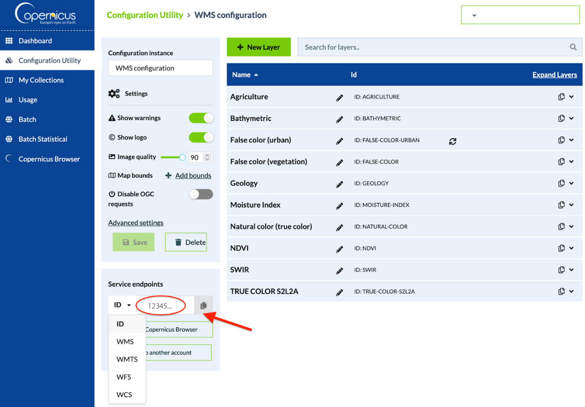

Which parameters are available in OGC requests?

The list of the available standard OGC URL parameters is available [here](https://documentation.dataspace.copernicus.eu/APIs/SentinelHub/OGC.html) and the advanced URL parameters are available [here](https://documentation.dataspace.copernicus.eu/APIs/SentinelHub/OGC/AdditionalRequestParameters.html).

How can I get point values from the services?

In case you would like to get **point values** at a specific location (e.g., reflectance, NDVI, etc.), you can use the `GetFeatureInfo` request. This is often labeled as **“Identify features”** or **“feature info”** in various GIS applications.

Here is an example of such a request:

[`https://sh.dataspace.copernicus.eu/ogc/wms/<INSTANCE_ID>?SERVICE=WMS&VERSION=1.3.0&REQUEST=GetFeatureInfo&I=0&J=0&QUERY_LAYERS=NDVI&INFO_FORMAT=application/json&BBOX=38.55105530425345,-7.883667078518689,38.55269383803389,-7.885252872445627&CRS=EPSG:4326&MAXCC=100&WIDTH=1&HEIGHT=1&TIME=2017-03-16`](https://sh.dataspace.copernicus.eu/ogc/wms/%3CINSTANCE_ID%3E?SERVICE=WMS&VERSION=1.3.0&REQUEST=GetFeatureInfo&I=0&J=0&QUERY_LAYERS=NDVI&INFO_FORMAT=application/json&BBOX=38.55105530425345,-7.883667078518689,38.55269383803389,-7.885252872445627&CRS=EPSG:4326&MAXCC=100&WIDTH=1&HEIGHT=1&TIME=2017-03-16)

Check also the [Statistical API](https://documentation.dataspace.copernicus.eu/APIs/SentinelHub/Statistical.html) for additional information.

How can I get all the images from an area of interest in a desired time period?

Use Sentinel Hub **WFS request** and retrieve all relevant geometries for a given bounding box and time frame. From the response, gather the unique dates. For each date, construct a **WCS request** to retrieve the image.

See the code example below:

``` javascript
// using Sentinel Hub OGC web services - https://documentation.dataspace.copernicus.eu/APIs/SentinelHub/OGC.html
// config
const CDSE_SH_INSTANCE_ID = '<INSTANCE-ID>';
const layerName = '1_NATURAL_COLOR';
const timeFrom = '2015-01-01';
const timeTo = '2017-04-20';
const bbox = '-410925.4640611076,4891969.810251283,-391357.58482010243,4911537.689492286';
const maxFeatures = 100; // 100 is max

// typenames parameter depends on the collection that is used in the layer
// https://documentation.dataspace.copernicus.eu/APIs/SentinelHub/OGC/WFS.html#typenames
let wfsUrl = `https://sh.dataspace.copernicus.eu/ogc/wfs/${CDSE_SH_INSTANCE_ID}?service=WFS&version=2.0.0&request=GetFeature&time=${timeFrom}/${timeTo}/P1D&typenames=DSS2&maxfeatures=${maxFeatures}&srsname=EPSG:3857&bbox=${bbox}&outputformat=application/json`;

async function getGeometries() {
  // retrieving
  // relevant geometries/images in bbox in timespan [timeFrom, timeTo]
  // Sentinel Hub - WFS request - https://documentation.dataspace.copernicus.eu/APIs/SentinelHub/OGC/WFS.html#wfs-request
  try {
let response = await fetch(wfsUrl);
let data = await response.json();
return data;
  } catch (e) {
throw new Error('There was an error fetching the list of geometries from WFS service.\nDid you substitute your SENTINEL_HUB_INSTANCE_ID ? ');
  }
}

function parseDatesFromGeometries(geometries) {
  // parsing
  // relevant geometries -> all relevant dates

  if (geometries.features === undefined) {
geometries.features = [];
  }
  const dates = geometries.features.map(value => value.properties.date);
  return Array.from(new Set(dates)); // return unique dates
}

function generateWcsUrlsFromDates(dates) {
  // mapping
  // dates -> image url
  // images available via WCS request - https://documentation.dataspace.copernicus.eu/APIs/SentinelHub/OGC/WCS.html#wcs-request

  const imageUrls = [];
  dates.forEach(date => {
const niceName = encodeURIComponent(`${layerName} from ${date}.tiff`);
const size = 512;
const imageUrl = `https://sh.dataspace.copernicus.eu/ogc/wcs/${CDSE_SH_INSTANCE_ID}?service=WCS&version=1.1.2&request=GetCoverage&time=${date}&coverage=${layerName}&nicename=${niceName}&bbox=${bbox}&width=${size}&height=${size}}`;
imageUrls.push(imageUrl);
  });
  return imageUrls;
}

function shout(value) {
  console.log('Images', value);
}

async function getImages() {
  const geometries = await getGeometries();
  const dates = parseDatesFromGeometries(geometries);
  const imageUrls = generateWcsUrlsFromDates(dates);
  shout(imageUrls);
}

getImages();
```

If we do not specify the time range in the endpoint URL, can we assume that the images returned by the WMS service are the latest acquired?

Images are ordered by **“Mosaic order”** priority (see [Configuration Utility](https://shapps.dataspace.copernicus.eu/dashboard/#/configurations/), can be set for each layer; you can also set this in a parameter). You can choose either to have the most recent on top or least cloud coverage. You should also consider the “maximum cloud coverage” parameter. In case you want to get the most recent images acquired, you should set maximum cloud coverage to **100%** and priority to **“most recent”**.

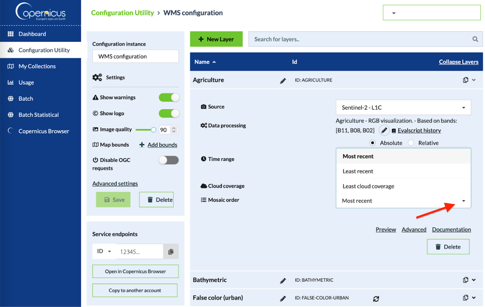

Why is the result different when I am using WMS or WCS, when the coordinate system is EPSG:4326?

OGC consortium specifications for **WMS, WFS, WCS, …** services define the coordinate axis order. Older OGC service specifications assumed **“X, Y”** order for all coordinate reference systems (CRSs), even for **WGS84** (EPSG:4326), while newer OGC service specifications obey the axis orders defined by the CRS’s, not assuming **“X, Y”** order anymore.

Our services conform to the standards definitions. The **WGS84** axis order is thus version dependent:

- **WMS**:
  - version 1.1.1: longitude, latitude
  - version 1.3.0: latitude, longitude
- **WFS**:
  - version 1.0.0: longitude, latitude
  - version 2.0.0: latitude, longitude
- **WCS**:
  - version 1.0.0: longitude, latitude

The user should always request a specific version of OGC services by providing an explicit **“VERSION”** parameter in the URL.

Can I access Sentinel Hub using HTTP or HTTPS?

All Sentinel Hub services are available using both HTTP and HTTPS protocols.

Why am I getting 429 errors?

To prevent overloading the system and to improve user experience, we have a rate limiting system in place. Find more info about it [here](https://support.sentinel-hub.com). In case you need a higher limit, [contact support](https://helpcenter.dataspace.copernicus.eu/hc/en-gb).

Is it possible to integrate the API in public-facing applications without revealing the security credentials?

This is not facilitated by us at the moment; you will have to implement your own authentication service.

## Documentation

Which distribution channels will be available for high-throughput data access? Does the public side have user tiers, or is high-throughput data transfer (such as [EODATA](https://creodias.eu/remote-transfer-for-eodata) ) only a paid service?

All distribution options (i.e. OData, S3, Sentinel Hub,..) will be constrained with user quotas, which includes both bandwidth limitation, as well as monthly data transfer limits. Please refer to the [Quotas and Limitations](Quotas.llms.md) section of our documentation for more information.

Where can I find more information regarding the cost of the “extra” services?

Pricing will be published soon.

It is indicated that “For those interested in processing, there will be scalable cloud resources available, optimized for EO tasks”. Does this refer to the current CreoDIAS resources, or something completely new that hasn’t been addressed yet?

[This December advertisement of the Copernicus Data Space Ecosystem](https://medium.com/sentinel-hub/new-copernicus-data-access-service-to-support-the-ecosystem-for-earth-observation-412f829355a3%20) indicates that scalable cloud resources will be part of the commercial offering and can be obtained at [CREODIAS](https://creodias.eu/) in first instance. ICT-wise, there will be two options, including Open Telekom Cloud.

Are there tutorials (online & physical meetings) to use the CDSE?

We have a set of tutorials, including the [Copernicus Data Space Ecosystem YouTube channel](https://www.youtube.com/@copernicusdataspaceecosystem):

- with an introduction to the Copernicus Browser: [A short guide to Copernicus Browser](https://www.youtube.com/watch?v=F0lIn5r6ZWk),
- an introduction to Jupyter: [From Copernicus Browser to Jupyter Notebook](https://www.youtube.com/watch?v=QVla6BT4eeA),
- a playlist on [Introduction to Sentinel Hub APIs on Copernicus Data Space Ecosystem](https://www.youtube.com/playlist?list=PLj4KwRQTBlPL3CVwpaBXl3VrO0_V3VX_Q) and
- an introduction to openEO: [EU Space Webinar - CDSE: The openEO API](https://www.youtube.com/watch?v=jCg4u8gPxlA).

We regularly organize webinars which are announced in the [Events](https://dataspace.copernicus.eu/events) page and on our social media. Previous webinars can be found on [Copernicus Data Space Ecosystem YouTube channel - Webinars](https://www.youtube.com/playlist?list=PLj4KwRQTBlPJGkEPQvYIF--Jq9BKNPuYv).  
  
We also have tutorial notebooks in the [notebook-samples repository](https://github.com/eu-cdse/notebook-samples/). These are:

- [openEO](https://github.com/eu-cdse/notebook-samples/tree/main/openeo),
- [Sentinel Hub](https://github.com/eu-cdse/notebook-samples/tree/main/sentinelhub),
- [STAC](https://github.com/eu-cdse/notebook-samples/tree/main/stac).

## Copernicus Browser

Where can I learn more about the Copernicus Browser?

You can find an online tutorial in our documentation in the [About the Browser](https://documentation.dataspace.copernicus.eu/Applications/Browser.html) page and a short introductory video here: [A short guide to Copernicus Browser](https://www.youtube.com/watch?v=F0lIn5r6ZWk).

How can I find the exact location by knowing the lat/lon coordinates?

Simply write coordinates in the “Search places” tool in “lat,lon” form, e.g.:  
  
46.0246,14.5367  
  
And click enter.

How can I make long time-lapses?

As Copernicus Browser timelapse functionality has a limit of processing up to 300 images at once, we need to do some post-processing, to be able to create longer timelapses.  
  
First, use command prompt to convert .gif timelapses from Copernicus Browser into .mp4 files and then merge them together. For example, if we want to create a five-years long timelapse from daily Sentinel-3 data, six timelapses, each 300 days long, are required. You should first download your smaller timelapses from [Copernicus Browser](https://browser.dataspace.copernicus.eu/).  
  
After downloading the gifs from Copernicus Browser, we should transform them into .mp4 files. To do so, we first need to download and install the ffmpeg program for making videos. Follow [this tutorial to install ffmpeg](https://www.wikihow.com/Install-FFmpeg-on-Windows).  
  
*To test if ffmpeg is installed, go to CMD and type: `ffmpeg -version`.*  
  
To transform a gif into mp4, first navigate to the folder where your gif files are stored, then open your command prompt and write in the following code:

``` javascript
ffmpeg -i GIF1.gif -movflags faststart -pix_fmt yuv420p -vf "scale=trunc(iw/2)*2:trunc(ih/2)*2" GIF1vid.mp4
```

*The only part of the code you need to change is the name of your gif at the start and the name of the output .mp4 video at the end.*  
  
You need to transform all your .gif time-lapses into separate .mp4 files:

``` javascript
ffmpeg -i GIF1.gif -movflags faststart -pix_fmt yuv420p -vf "scale=trunc(iw/2)*2:trunc(ih/2)*2" GIF1vid.mp4<br>
ffmpeg -i GIF2.gif -movflags faststart -pix_fmt yuv420p -vf "scale=trunc(iw/2)*2:trunc(ih/2)*2" GIF2vid.mp4<br>
ffmpeg -i GIF3.gif -movflags faststart -pix_fmt yuv420p -vf "scale=trunc(iw/2)*2:trunc(ih/2)*2" GIF3vid.mp4
```

Finally, merge all the .mp4 files into a final .mp4 file with the following code:

``` javascript
ffmpeg -i GIF1vid.mp4 -i GIF2vid.mp4 -i GIF3vid.mp4 -filter_complex "[0:0] [1:0] [2:0] concat=n=3:v=1:a=0" FinalVideo.mp4
```

In this code, we specify the output name of the final .mp4 timelapse and list the .mp4 files we want to merge. We preface the .mp4 files with -i. Then we need to add as many arrays as there are input .mp4 videos; `[0:0]` for the first one, `[0:1]` for the second one, `[0:3]` for the third one and so on. The `n=3` indicates how many input .mp4 files there are.  
  
For 6 input .mp4 files, the code would look like this:

``` javascript
ffmpeg -i GIF1vid.mp4 -i GIF2vid.mp4 -i GIF3vid.mp4 -i GIF4vid.mp4 -i GIF5vid.mp4 -i GIF6vid.mp4 - filter_complex "[0:0][1:0][2:0][3:0][4:0][5:0] concat=n=6:v=1:a=0" FinalVideo.mp4
```

How can I configure my layers for statistical information in Copernicus Browser?

In Copernicus Browser, you can view two kinds of statistical information for your imagery: a line chart of values through time for either a point or a polygon, and a histogram of values (see the chapter Statistical Analysis on our [Copernicus Browser page](https://documentation.dataspace.copernicus.eu/Applications/Browser.html#statistical-analysis)). To enable statistical features, an evalscript supporting statistical API should be used in your layers.  
  
Because statistics operate on the indicator values themselves (and not on RGB), you must add an additional output to the evalscript, which returns the value without conversion to color. For example, statistics can be calculated for values of B04 or for an index like NDVI. Additionally, the evalscript should include dataMask to exclude no-data values from the calculation (no-data pixels often have value 0, which could skew the statistics), and it’s also recommended to check for presence of clouds, so we can exclude them as well (cloudy pixels usually have very high values, which could also skew the results). The user can exclude any pixels from the statistics, such as, for example, snow or water.  
  
  
The evalscript should contain the following outputs, with the exact same names:

- `default`: Mandatory. A visualization output that defines what will be displayed on the map. The visualization can return anything you like, a single value grayscale, an RGB visualization, etc.

- `index`: Optional. Returning the raw values of your index, enabling the histogram functionality. Use FLOAT32 format to include decimals and negative values.

- `browserStats`: Mandatory. An output containing both the index values and cloud information, used for line chart generation. Cloud information will allow us to filter the tiles by maximum cloud coverage. Use FLOAT32 format to include decimals and negative values.

- `dataMask`: Mandatory. A dataMask output to take no-data values into account.

  Here is an example evalscript for NDVI:

``` javascript
//VERSION=3
function setup() {
   return {
       input: ["B04", "B08", "SCL","dataMask"], 
       //The four outputs should be setup here in the setup function, and defined under the evaluatePixel function. 
       output: [
         { id: "default", bands: 4 }, 
         { id: "index", bands: 1, sampleType: 'FLOAT32' },
         { id: "browserStats", bands: 2, sampleType: 'FLOAT32' }, 
         { id: "dataMask", bands: 1 }
       ]
     };
}
// Optional filtering for clouds using the Sentinel-2A SCL band (values 1, 2, 7, 8, 9, 10, 11 are either clouds or snow)
function isCloud (scl) {
 if ([1, 2, 7, 8, 9, 10, 11].includes(scl))  {
   return false;
 } 
}
function evaluatePixel(samples) {
   let val = index(samples.B08, samples.B04); // NDVI calculation
   let imgVals = null; 
   const indexVal = samples.dataMask === 1 ? val : NaN; //NDVI index without no-data values
   const cloud = isCloud(samples.SCL) //calling in our cloud filtering functon as a cloud variable

   //Define the RGB NDVI visualization and write it into imgVals
   if (val<-0.5) imgVals = [0.05,0.05,0.05,samples.dataMask];
   else if (val<-0.2) imgVals = [0.75,0.75,0.75,samples.dataMask];
   else if (val<-0.1) imgVals = [0.86,0.86,0.86,samples.dataMask];
   else if (val<0) imgVals = [0.92,0.92,0.92,samples.dataMask];
   else if (val<0.025) imgVals = [1,0.98,0.8,samples.dataMask];
   else if (val<0.05) imgVals = [0.93,0.91,0.71,samples.dataMask];
   else if (val<0.075) imgVals = [0.87,0.85,0.61,samples.dataMask];
   else if (val<0.1) imgVals = [0.8,0.78,0.51,samples.dataMask];
   else if (val<0.125) imgVals = [0.74,0.72,0.42,samples.dataMask];
   else if (val<0.15) imgVals = [0.69,0.76,0.38,samples.dataMask];
   else if (val<0.175) imgVals = [0.64,0.8,0.35,samples.dataMask];
   else if (val<0.2) imgVals = [0.57,0.75,0.32,samples.dataMask];
   else if (val<0.25) imgVals = [0.5,0.7,0.28,samples.dataMask];
   else if (val<0.3) imgVals = [0.44,0.64,0.25,samples.dataMask];
   else if (val<0.35) imgVals = [0.38,0.59,0.21,samples.dataMask];
   else if (val<0.4) imgVals = [0.31,0.54,0.18,samples.dataMask];
   else if (val<0.45) imgVals = [0.25,0.49,0.14,samples.dataMask];
   else if (val<0.5) imgVals = [0.19,0.43,0.11,samples.dataMask];
   else if (val<0.55) imgVals = [0.13,0.38,0.07,samples.dataMask];
   else if (val<0.6) imgVals = [0.06,0.33,0.04,samples.dataMask];
   else imgVals = [0,0.27,0,samples.dataMask];

   // Return the 4 inputs and define content for each one
   return {
     default: imgVals,
     index: [indexVal],     
     browserStats: [indexVal,cloud?1:0],
     dataMask: [samples.dataMask]
   };
}
```

See the script in [Copernicus Browser](https://link.dataspace.copernicus.eu/nnvv).  
  
The evalscript can be used directly in Copernicus Browser using the custom script function, or setup for the layer within the [Configuration Utility](https://shapps.dataspace.copernicus.eu/dashboard/#/configurations).  
  
When you create a custom layer, it is possible to select the same layer in Copernicus Browser. Follow the steps below.

- Log into [Copernicus Browser](https://browser.dataspace.copernicus.eu/) and select your configuration from the dropdown menu in *Configurations* in the *Visualize* tab on the left.
- Select the desired data source (if all layers in your configuration have the same data source, only one will be available).
- Make sure to set the appropriate date and zoom in to the area where ta is available.
- If your configuration has more layers, they will be available for selection under the *Layers* in the *Visualize* tab on the left.
- When you have your layer displayed, draw a point or a polygon on the map and inspect the statistics features.

Why am I getting 429 error in the Copernicus Browser?

The error “Request failed with status code 429: Max session number 4 exceeded.” is shown when a Copernicus General user initiates more than 4 simultaneous download. See [Quotas and Limitations](https://documentation.dataspace.copernicus.eu/Quotas.html) where it states Number of concurrent connections limit (IAD¹):4. To avoid the error, please ensure no more than four concurrent downloads are in progress.

Why am I getting Network Error in the Copernicus Browser?

The “Network Error” is shown due to numerous reasons such as user-side network settings (e.g. using VPN, or restrictions in school/company networks), staying logged in for a long time. Most of the time the Network Error is solved by applying the following(s):

- Try again in several minutes
- Log out and log in again.
- If you are using VPN, please try downloading after disabling the VPN.

In some cases Network Error is related users’ network settings. For those cases you can check the following and consult your organisation’s IT / Network department:

- Try again by using another network (e.g. home, work, another).
- Try again by using mobile hotspot.

If the issue persists: the quickest workaround can be using the [Data Workspace](https://documentation.dataspace.copernicus.eu/Applications/DataWorkspace.html).  
Other download methods such as [S3 Access](https://documentation.dataspace.copernicus.eu/APIs/S3.html) or [OData](https://documentation.dataspace.copernicus.eu/APIs/OData.html) also can be used as a workaround.  
If none of the above options work, please [Submit a request](https://helpcenter.dataspace.copernicus.eu/hc/en-gb/requests/new) by providing the full name of the product(s) and which methods you tried/how they were resulted.

## Integrate Data into GIS and Web applications

Why can’t I see OGC layers displayed in ArcGIS Online?

There are two map viewers currently available: [ArcGIS Map Viewer Classic](https://www.arcgis.com/home/webmap/viewer.html) and [ArcGIS Map Viewer](https://www.arcgis.com/apps/mapviewer/index.html). You can try both; we noticed that layers are more likely to work in the new ArcGIS Map Viewer. You can also try to use WMTS instead of WMS, as it’s expected to work better.

ArcGIS also suggests configuring its CORS settings to allow specific domains to communicate with the server, as described in this [ArcGIS Online documentation](https://doc.arcgis.com/en/arcgis-online/administer/configure-security.htm#ESRI_SECTION1_70CC159B3540440AB325BE5D89DBE94A).

How can I integrate data with AcuGIS?

Follow these steps to integrate your data with AcuGIS:

1.  Go to [https://canvas.acugis.com/](https://canvas.acugis.com/)

    2.  Sign up and login to Canvas.

    3.  Click on **WMS Services** in the left menu.

    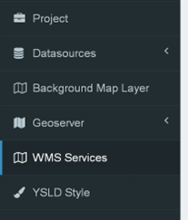

    4.  Click **Add WMS** Layer.

    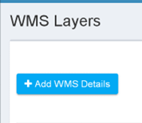

    5.  Enter the WMS Service information for Sentinel in the URL field.

    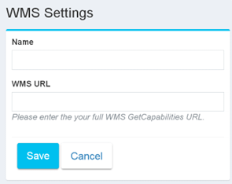

    6.  Go to **Projects** and click the **Add Project** button.

    7.  In the Project you created, click the **Maps** button.

    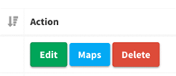

    8.  Click the **Add Map** button.

    9.  In the left menu of the new map, expand the WMS layer you created in step 4 and toggle the desired layer(s), such as the **NDVI layer**.

    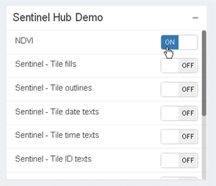

    10. Define the Geometry Area:

    There are two methods you can use to define a Geometry Area:

         - A data layer
         - Draw a Polygon or Rectangle area

    While there are some simple use-cases in which you might wish to draw an area, in most cases, you will be using a data layer. Below, we are using a data layer of the state of Rhode Island.

    11. Click the settings icon on the NDVI layer you created in step 9 above. Select **‘Geometry’** from the menu as shown below.

    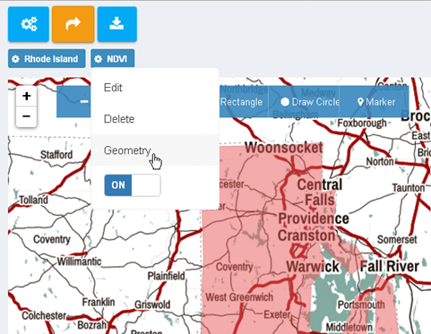

    12. Select the Geometry Area:

        - For a data layer (such as we are using), select Custom as the Geometry Area.
        - For a polygon you have created via the free-hand toolbar, select Polygon.

    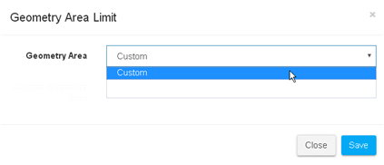

    13. Click **Save** and then click the **Save button** for your map.

    14. Congratulations! Your map is now ready.

    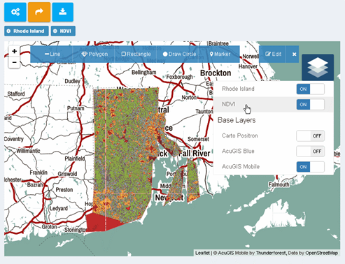

Why does an error pop up when I add WMS to ArcMap?

In some cases, ArcMap turns on all layers and calls WMS. Sentinel Hub WMS service does not support visualization of many layers at the same time. We suggest you turn off all layers and turn them on one by one.

If you get the following error:

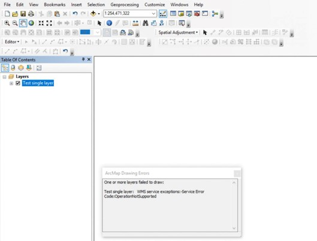

Turn off all layers and turn them on one by one:

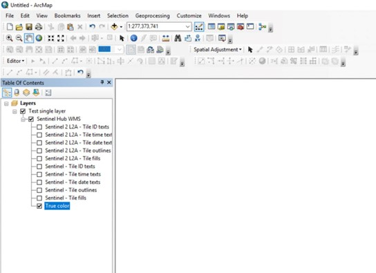

How can I stream Sentinel-2 cloudless mosaics to my GIS application?

There are a couple of options.

1.  If you want to use OGC APIs (i.e. WMTS), follow these steps:
    - Create a new configuration in the [Sentinel Hub Dashboard](https://shapps.dataspace.copernicus.eu/dashboard/), best following [these steps](https://dataspace.copernicus.eu/news/2023-9-26-customising-your-copernicus-browser-experience). When creating a new layer, select “Bring your own COG”, use collection id byoc-5460de54-082e-473a-b6ea-d5cbe3c17cca and custom script as shown [here](https://documentation.dataspace.copernicus.eu/notebook-samples/sentinelhub/cloudless_process_api.html#example-1-true-color-image).
    - You will then be able to access WMTS at the following URL, replacing INSTANCE_ID with ID of your configuration: [https://sh.dataspace.copernicus.eu/ogc/wmts/INSTANCE_ID](https://sh.dataspace.copernicus.eu/ogc/wmts/INSTANCE_ID)

      
      
2.  For even better experience, if you are able to, use Process API as shown [here](https://documentation.dataspace.copernicus.eu/APIs/SentinelHub/Process/Examples/BYOC.html#create-a-true-color-image-from-the-gathered-bands). You can then also use a combination of STAC API to get the available dates for the imagery, as shown in [this example](https://documentation.dataspace.copernicus.eu/APIs/SentinelHub/Catalog/Examples.html#search-with-distinct).

Can I load and view data from CDSE on my smartphone?

There are two options:

- **Use Copernicus Browser Display Wall**  
  If you want to view or show a couple of your favourite places, or browse Sentinel-1 and Sentinel-2 data with basic visualisations, Copernicus Browser Display Wall is a quick option.
  - Log in to Copernicus Browser and add your locations and images of interest to your pins.
  - Go to [display-wall.dataspace.copernicus.eu](https://display-wall.dataspace.copernicus.eu) and log in.
  - Your pin collection will load and start displaying.
  - Touch the right side of the screen, a search bar will appear and you can search for your target area.
  - You will see a list of recent Sentinel-2 and Sentinel-1 imagery, select your preferred date.
  - When the image loads, you can choose a visualisation layer on the right sidebar.
  - For more information, visit: [Copernicus Display Wall article](https://dataspace.copernicus.eu/news/2025-1-28-copernicus-display-wall-showing-satellite-images-easier-ever)
- **Use smartphone apps with WMS support (e.g., Locus Map Free)**  
  If you want to connect CDSE datasets to your GPS position (e.g., for planning a route or identifying features nearby), you can use smartphone outdoor applications compatible with a WMS service.
  - Select a configuration in [CDSE Sentinel Hub Dashboard](https://shapps.dataspace.copernicus.eu/dashboard/#/) , or create your own configuration from your preferred satellite or CLMS dataset: [Customising your Copernicus Browser experience](https://dataspace.copernicus.eu/news/2023-9-26-customising-your-copernicus-browser-experience)
  - Create a WMS/WMTS link for your configuration in the “Service Endpoint” dropdown menu.
  - Add a new WMS layer to your application.
  - You can find a detailed guide here: [How to load free satellite imagery in Locus Map](https://www.locusmap.app/how-to-load-free-satellite-imagery-in-locus-map/)

## Image Download and Custom Legends

How can I remove the Sentinel Hub logo from imagery?

You can turn off the logo in the [Configuration Utility](https://shapps.dataspace.copernicus.eu/dashboard/#/configurations/) - just open “Instance configuration” and uncheck “Show logo”.

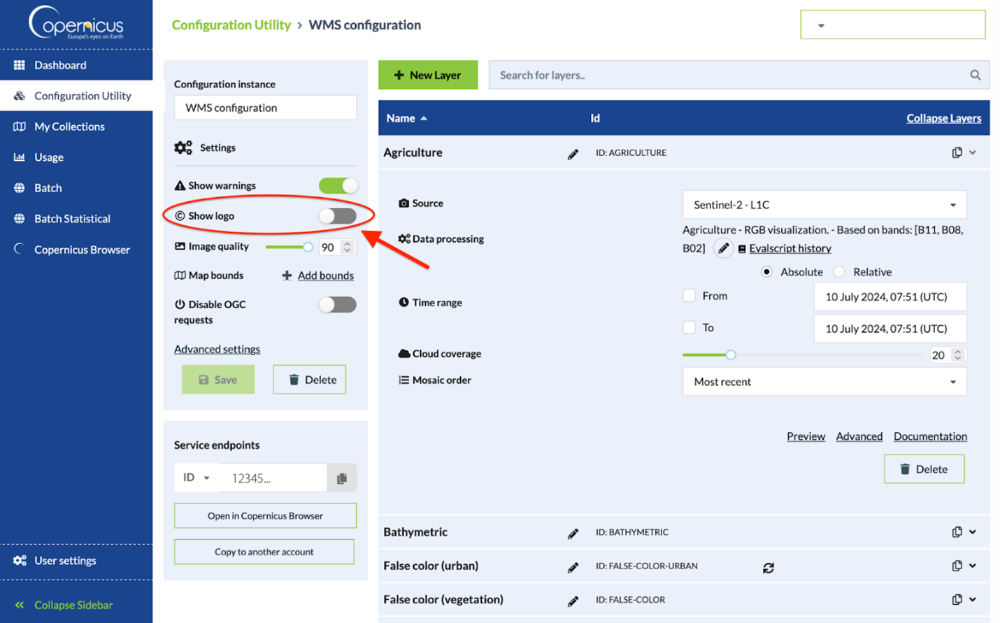

Can I add a legend to a downloaded image?

A legend can be added to the exported image by turning on the option “Show legend” when exporting an image.

How can I define a custom legend?

A legend may be defined in the advanced layer editor.

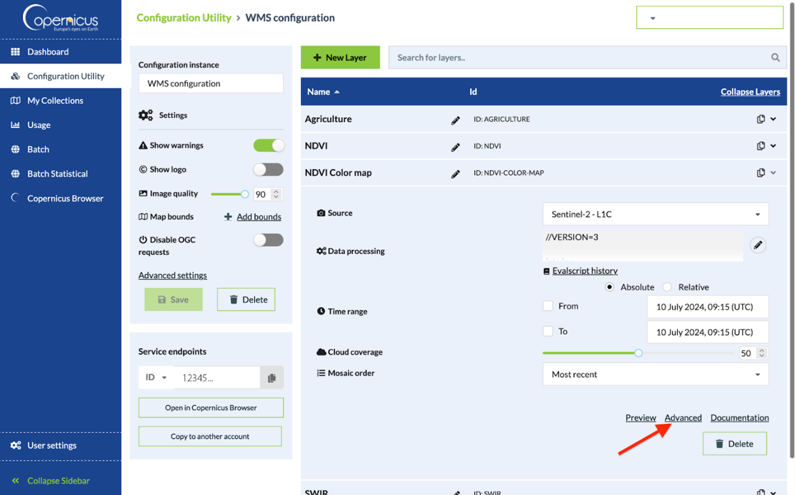

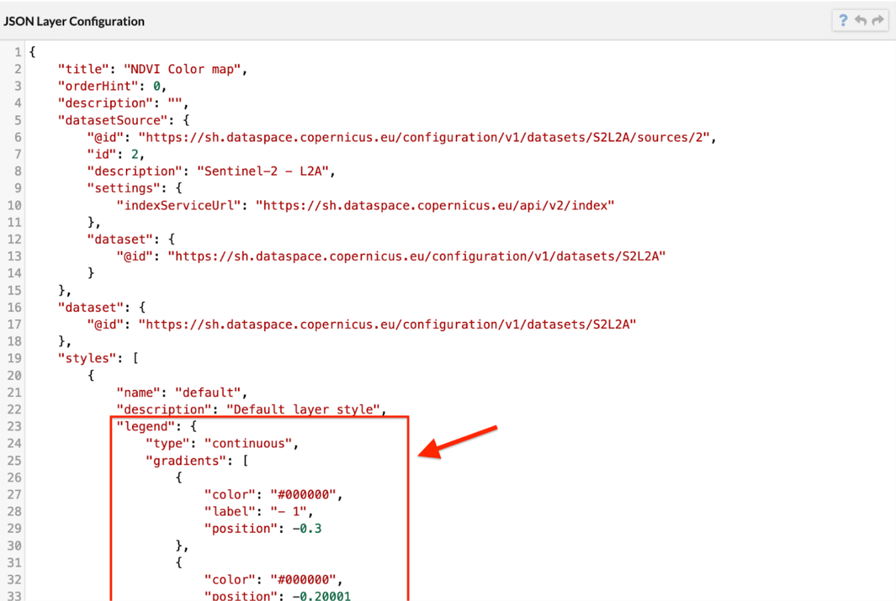

Add the “legend” object in the parent “styles”. A legend is specified as a JSON object that must have a property named “type” with value “continuous” or “discrete”, depending on a legend type. A continuous legend also needs properties “minPosition” and “maxPosition” of a floating-point type, and an array that contains stop points of a gradient. Each point must have a position of a floating-point type and a color in rgb hexadecimal format. A color can also be specified using the rgb function that accepts percentage values for rgb triplet, just like in CSS language. A point can optionally have a label. Here is a JSON object example of a continuous legend and the legend itself:

``` javascript
{
 "type": "continuous",
 "minPosition": 0.0,
 "maxPosition": 1.05,
 "gradients": [
  { "position": 0, "color": "rgb(0%,0%,0%)" },
  { "position": 0.05, "color": "rgb(0%,0%,0%)", "label": "- 1.0" },
  { "position": 0.050001, "color": "rgb(75%,75%,75%)" },
  { "position": 0.1, "color": "rgb(75%,75%,75%)" },
  { "position": 0.10001, "color": "rgb(86%,86%,86%)" },
  { "position": 0.15, "color": "rgb(86%,86%,86%)" },
  { "position": 0.150001, "color": "rgb(100%,100%,88%)" },
  { "position": 0.2, "color": "rgb(100%,100%,88%)", "label": "0.0" },
  { "position": 0.20001, "color": "rgb(100%,98%,80%)" },
  { "position": 0.25, "color": "rgb(100%,98%,80%)" },
  { "position": 0.250001, "color": "rgb(93%,91%,71%)" },
  { "position": 0.3, "color": "rgb(93%,91%,71%)" },
  { "position": 0.30001, "color": "rgb(87%,85%,61%)" },
  { "position": 0.35, "color": "rgb(87%,85%,61%)" },
  { "position": 0.350001, "color": "rgb(80%,78%,51%)" },
  { "position": 0.4, "color": "rgb(80%,78%,51%)" },
  { "position": 0.40001, "color": "rgb(74%,72%,42%)" },
  { "position": 0.45, "color": "rgb(74%,72%,42%)" },
  { "position": 0.450001, "color": "rgb(69%,76%,38%)" },
  { "position": 0.5, "color": "rgb(69%,76%,38%)" },
  { "position": 0.50001, "color": "rgb(64%,80%,35%)" },
  { "position": 0.55, "color": "rgb(64%,80%,35%)" },
  { "position": 0.550001, "color": "rgb(57%,75%,32%)" },
  { "position": 0.6, "color": "rgb(57%,75%,32%)", "label": "0.2" },
  { "position": 0.60001, "color": "rgb(50%,70%,28%)" },
  { "position": 0.65, "color": "rgb(50%,70%,28%)" },
  { "position": 0.650001, "color": "rgb(44%,64%,25%)" },
  { "position": 0.7, "color": "rgb(44%,64%,25%)" },
  { "position": 0.70001, "color": "rgb(38%,59%,21%)" },
  { "position": 0.75, "color": "rgb(38%,59%,21%)" },
  { "position": 0.750001, "color": "rgb(31%,54%,18%)" },
  { "position": 0.8, "color": "rgb(31%,54%,18%)" },
  { "position": 0.80001, "color": "rgb(25%,49%,14%)" },
  { "position": 0.85, "color": "rgb(25%,49%,14%)" },
  { "position": 0.850001, "color": "rgb(19%,43%,11%)" },
  { "position": 0.9, "color": "rgb(19%,43%,11%)" },
  { "position": 0.90001, "color": "rgb(13%,38%,7%)" },
  { "position": 0.95, "color": "rgb(13%,38%,7%)" },
  { "position": 0.950001, "color": "rgb(6%,33%,4%)" },
  { "position": 0.990001, "color": "rgb(6%,33%,4%)" },
  { "position": 1.0, "color": "rgb(0%,27%,0%)", "label": "0.6" },
  { "position": 1.05, "color": "rgb(0%,27%,0%)" }
 ]
}
```

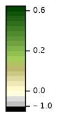

A discrete legend must have an array of objects that have a color and label. Here is a JSON object example of a discrete legend and the legend itself:

``` javascript
{
 "type":"discrete",
 "items":[
   {
    "color":"#000000",
    "label":"No Data (Missing data)"
   },
   {
    "color":"#ff0000",
    "label":"Saturated or defective pixel"
   },
   {
    "color":"#2f2f2f",
    "label":"Dark features / Shadows "
   },
   {
    "color":"#643200",
    "label":"Cloud shadows"
   },
   {
    "color":"#00a000",
    "label":"Vegetation"
   },
   {
    "color":"#ffe65a",
    "label":"Not-vegetated"
   },
   {
    "color":"#0000ff",
    "label":"Water"
   },
   {
    "color":"#808080",
    "label":"Unclassified"
   },
   {
    "color":"#c0c0c0",
    "label":"Cloud medium probability"
   },
   {
    "color":"#ffffff",
    "label":"Cloud high probability"
   },
   {
    "color":"#64c8ff",
    "label":"Thin cirrus"
   },
   {
    "color":"#ff96ff",
    "label":"Snow or ice"
   }
 ]
}
```

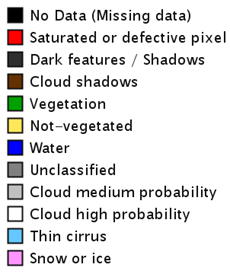

Legends are accessible at [https://sh.dataspace.copernicus.eu/ogc/wms/{instanceId}?service=WMS&request=GetLegendGraphic&layer={layer}&height={height}&width={width}](https://sh.dataspace.copernicus.eu/ogc/wms/%7BinstanceId%7D?service=WMS&request=GetLegendGraphic&layer=%7Blayer%7D&height=%7Bheight%7D&width=%7Bwidth%7D), where height and/or width can be omitted.

How can I clip the image to a specific polygon?

You can add a parameter `GEOMETRY` as in this example:

`https://sh.dataspace.copernicus.eu/ogc/wms/<INSTANCE_ID>?SERVICE=WMS&REQUEST=GetMap&VERSION=1.3.0&LAYERS=TRUE_COLOR&MAXCC=20&WIDTH=640&HEIGHT=640&CRS=EPSG:4326`  
`&BBOX=-7.885,38.540,-7.870,38.560&`  
`GEOMETRY=POLYGON((`  
`-7.877244 38.546511,`  
`-7.876377 38.547818,`  
`-7.871950 38.546125,`  
`-7.872611 38.545023,`  
`-7.871241 38.544475,`  
`-7.869831 38.544560,`  
`-7.866011 38.550445,`  
`-7.872323 38.552895,`  
`-7.874112 38.551451,`  
`-7.877110 38.552537,`  
`-7.878791 38.552976,`  
`-7.879413 38.553099,`  
`-7.880600 38.553320,`  
`-7.881314 38.553126,`  
`-7.882678 38.552762,`  
`-7.883951 38.552667,`  
`-7.885064 38.552160,`  
`-7.885370 38.549346,`  
`-7.877244 38.546511))`

It is recommended to simplify geometry before passing it as a parameter to avoid exceeding the maximum number of characters in the URL.

If one wants to have a transparent background outside of the clipped geometry, use the `FORMAT=image/png` parameter in the call and `dataMask` band in the evalscript as explained [here](https://documentation.dataspace.copernicus.eu/APIs/SentinelHub/UserGuides/Transparency.html). Do note however that png images are larger in size and will therefore take longer to load.

Which projection is best for exporting data?

Projections depend on the use case, however, since **Sentinel-2** data is originally provided in the UTM projection, this is also a good choice for export. For larger areas spanning multiple UTM zones, a more global projection is preferable, such as **Web Mercator (EPSG:3857)** or **WGS84 (EPSG:4326)**.

Which formats are available as image or vector outputs?

Read about the available output formats [here](https://documentation.dataspace.copernicus.eu/APIs/SentinelHub/OGC/OutputFormats.html).

## Custom Scripts

How to run a custom script in Copernicus Browser?

1.  Finding the appropriate satellite scene

    - Search for the location of your interest either by scrolling the map with your mouse or entering the location in the search field on the right side of your screen.
    - Choose from which satellites you want to receive the data (dropdown menu on the left side of your screen under **Data Collections**).
    - Select maximum **Cloud coverage percentage**.
    - Select the time range by either typing the date or selecting the date from the calendar.

    \<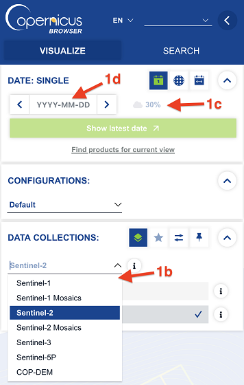

2.  In the **Visualize** tab, choose the **Custom** (Create custom visualization) button under the Layers.

    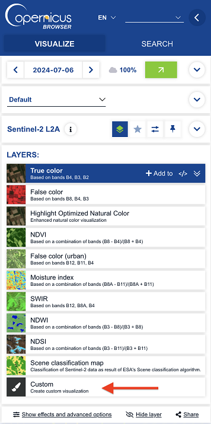

3.  Open the custom script dialog by clicking on the **Custom script** tab.

    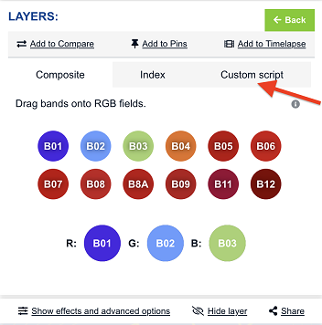

Which functions are supported in Custom Scripts?

Custom Script integrates [Chrome V8 JavaScript engine](https://developers.google.com/v8/), so the vast majority of the functions supported there can be used in Custom Script as well. Some of the functions that can be used with our custom scripts are described in our [Evalscript V3 documentation](https://documentation.dataspace.copernicus.eu/APIs/SentinelHub/Evalscript/Utilities.html).

How can I input a custom script into the WMS request URL?

Add the `EVALSCRIPT` parameter to your OGC request URL with the value of the base64 encoded script, as such: `evalscript=cmV0dXJuIFtCMDQqMi41LEIwMyoyLjUsQjAyKjIuNV0%3D`. More on custom scripts described [here](https://documentation.dataspace.copernicus.eu/APIs/SentinelHub/Evalscript.html).

A working WMS request from Copernicus Browser, using a simple custom evaluation script

[`https://browser.dataspace.copernicus.eu/?zoom=10&lat=41.6429&lng=12.8862&themeId=DEFAULT-THEME&visualizationUrl=U2FsdGVkX1%2FdjVgXKNxsgHpvLC0Lk9xYTBFSuIxQlOH6qZOOtL3utpao5rghCRt8AHfhSUB3LFuwAZoDeBviT1Q%2BUoyJky7D6ZDKrnKwOfz3TPX8xluv1RNfpifr0lOU&evalscript=cmV0dXJuIFtCMDgqMi41LEIwNCoyLjUsQjAzKjIuNV07&datasetId=S2_L1C_CDAS&fromTime=2020-05-15T00%3A00%3A00.000Z&toTime=2020-05-15T23%3A59%3A59.999Z&cloudCoverage=30&dateMode=SINGLE#custom-script`](https://browser.dataspace.copernicus.eu/?zoom=10&lat=41.6429&lng=12.8862&themeId=DEFAULT-THEME&visualizationUrl=U2FsdGVkX1%2FdjVgXKNxsgHpvLC0Lk9xYTBFSuIxQlOH6qZOOtL3utpao5rghCRt8AHfhSUB3LFuwAZoDeBviT1Q%2BUoyJky7D6ZDKrnKwOfz3TPX8xluv1RNfpifr0lOU&evalscript=cmV0dXJuIFtCMDgqMi41LEIwNCoyLjUsQjAzKjIuNV07&datasetId=S2_L1C_CDAS&fromTime=2020-05-15T00%3A00%3A00.000Z&toTime=2020-05-15T23%3A59%3A59.999Z&cloudCoverage=30&dateMode=SINGLE#custom-script)

Note that the `LAYERS` parameter should be set as one of the existing layers in the configuration when using a `PRESET=CUSTOM` with a custom evalscript.

How do I do raster calculation on bands?

Raster calculations are done in custom scripts. You can access custom scripts in [Configuration Utility](https://shapps.dataspace.copernicus.eu/dashboard/#/configurations), in each layer under each configuration.

To edit the script, click on the “pencil icon” beside the **Data processing** option under a selected layer and enter the **Custom Script Editor**.

See more details [here](#how-to-create-eo-products).

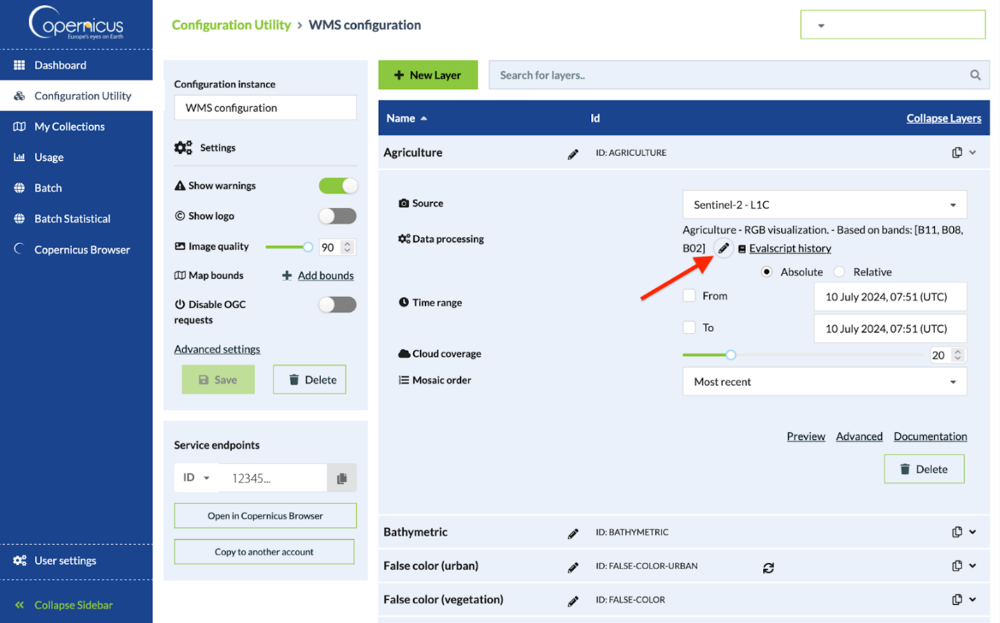

How to use the script is detailed [here](https://www.sentinel-hub.com/develop/custom-scripts).

An example of the NDVI script below and visualized in [Copernicus Browser](https://link.dataspace.copernicus.eu/gzdi).

``` javascript

// NDVI calculation
let ndvi = (B08 - B04) / (B08 + B04)  
return [ndvi]
```

How to handle long scripts in Copernicus Browser?

Scripts in Copernicus Browser are passed to Sentinel Hub service using a “GET request,” which is limited in the number of characters, depending on the browser used, between 1,000 and 4,000.

But there is an easy way to work around this:

1.  Upload your script to a publicly accessible website, for example GitHub, like we do in the Custom Script repository. E.g. [LAI script](https://raw.githubusercontent.com/sentinel-hub/custom-scripts/master/sentinel-2/lai/script.js).  

2.  Select “Use URL” and paste the URL to the script in the “Script URL” field.

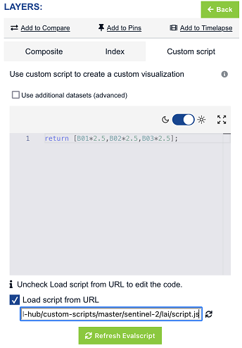

3.  Click the “Refresh Evalscript” button.

How can I observe live changes of custom scripts directly in the Configurator?

In [Configuration Utility](https://shapps.dataspace.copernicus.eu/dashboard/#/configurations), it is possible to edit Data Processing of a Layer and observe live changes in the Layer’s Preview before even saving the Layer. This feature can be useful for tweaking custom script parameters. The best way to do this is to:

1.  Duplicate a Layer by clicking on the “Copy” icon (name the new layer and save it).
2.  Open Preview by clicking the “Preview” link in the original and duplicated Layer for easier comparison.
3.  Edit one of them to see changes between scripts by opening the Layer’s “Data Processing” settings by clicking on the “Pencil” button.

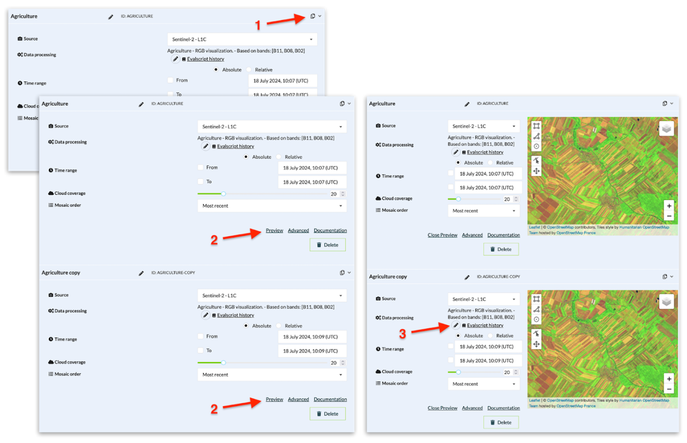

After the appropriate EO product is chosen, click the button “Copy script to editor” \[4\] to tweak the script \[5\]. After setting the custom script \[6\] you can immediately inspect the changes in the preview window without saving the Layer.

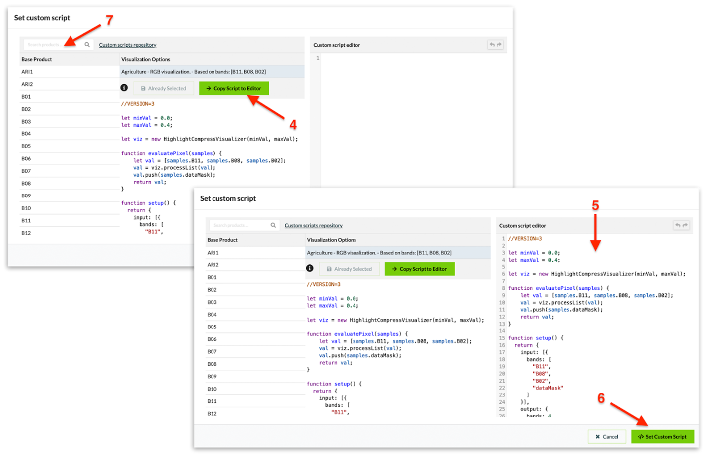

You can also choose different EO Products \[7\] under “Data processing settings”.

Clicking the “Undo” link will reset the latest custom script changes in the layer.

How to write complex custom script algorithms?

By employing the dynamically interpreted JavaScript language and providing some specialized functions, you can combine the bands of multispectral satellite data in unprecedented ways.  
  
Here is an example of how to tweak the image with a custom script in case of a volcano eruption:

``` bash

return [
  B04 * 2.5 + Math.max(0, B12 - 0.1),
  B03 * 2.5 + Math.max(0, B11 - 0.1),
  B02 * 2.5
];
```

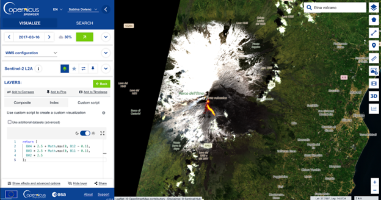

Etna volcano eruption dated 16 March 2017. Image combined from true colour image, overlaid with SWIR bands 11 and 12. ([view in Copernicus Browser](https://link.dataspace.copernicus.eu/s698))

You can find more examples and learn how to tweak the images for easier detection of Earth surface changes, clouds, snow, shadow, water, etc., in this [blog post](https://medium.com/sentinel-hub/ad-hoc-testing-of-algorithms-globally-8fb1f564f0f5).

How to interpolate/blend the index value between two (or more) colors using a custom script?

Use the `valueInterpolate` method:

    valueInterpolate(inputValue, indexArray, outputValueArray)

The returned value is interpolated between the two consecutive values in `outputValueArray` (which represent RGB colors normalized to \[0,1\], e.g., pure red is \[1,0,0\]) based on the `inputValue`’s location in the `indexArray`.

Note that `indexArray` and `outputValueArray` must be the same size. For example:

``` javascript

return valueInterpolate(NDVI,    // inputValue
    [0.0, 0.3, 1.0],        // indexArray
    [                       // outputValueArray
      [1, 0, 0],
      [1, 1, 0],
      [0.1, 0.3, 0],
    ])
```

If `NDVI` is 0.2, it will interpolate between `[1, 0, 0]` and `[1, 1, 0]` since they are the corresponding colors to the 0.0 and 0.3 indices in the `indexArray` nearest to `NDVI`.

``` javascript

return valueInterpolate(sample.B04,    // inputValue
    [0, 0.2, 0.4, 0.6, 0.8, 1],      // indexArray
    [                                // outputValueArray
      [0, 0, 0],
      [0.1, 0.2, 0.5],
      [0.25, 0.4, 0.5],
      [0.4, 0.6, 0.5],
      [0.75, 0.8, 0.5],
      [1, 1, 0.5]
    ])
```

If `B04` is 0.25, it will interpolate between `[0.1, 0.2, 0.5]` and `[0.25, 0.4, 0.5]` since they are the corresponding colors to the 0.2 and 0.4 indices in the `indexArray` nearest to `B04`.

How to manually configure stretch of the images?

You can use Custom scripts and type in the code along the following lines:

``` javascript

function stretch(val, min, max) {
    return (val - min) / (max - min);
}

return [
  stretch(B04, 0.05, 0.5),
  stretch(B03, 0.05, 0.5),
  stretch(B02, 0.05, 0.5)
]
```

What is downsampling and upsampling?

Upsampling and downsampling define the method used for interpolation of the data on non-natural scales. E.g. The resolution of **Sentinel-2** data (R, G, B and NIR bands) is 10 meters but on some occasions, you would want to look at the data with **higher scale** (e.g. at 1 m pixel resolution) or **lower scale** (e.g. 1000 m pixel resolution).

A default option is “nearest neighbour”, which is best for performance. **“Bicubic”** is often nicer on **higher scales**.

Note that the data are always exactly the same - it is just the interpolation method.

An example of the NDVI image of the field:

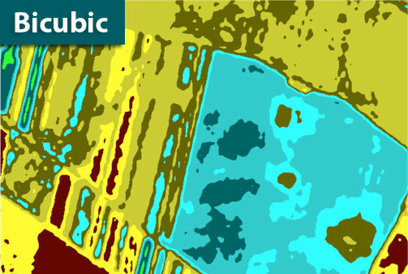

What is the best way to do cloud filtering at a specific AOI?

Often our users would like to get all available dates for specific areas of interest (e.g. agriculture field) together with cloud coverage. The basic cloud coverage meta-data that we provide through our services is based on scene meta-data and is valid for 100 km x 100 km area, which is often not really useful if you are looking at a one-hectare field.

What we recommend doing in this case is:

1.  [Create a new layer](#how-to-create-eo-products) configuring it to show cloud data. Make sure you output [actual](how-to-get-actual-ndvi-values) cloud values (e.g. 1=cloud, 0=not cloud) rather than cloud mask as an image (e.g. red=cloud, transparent=no cloud).
2.  You can use one of several cloud detection options, such as:
    - L2A scene classification data
    - s2cloudless Python package in combination with Sentinel Hub Python API
    - Braaten-Cohen-Yang cloud detector
    - Hollstein’s cloud detection

Or you define some of your own. For this exercise, we will use L2A scene classification. The custom script would look something along the lines:

``` javascript

switch (SCL) {
  // No Data (Missing data)    
  case 0: return [0];
  // Saturated or defective pixel   
  case 1: return [0];
  // Cloud shadows
  case 3: return [0];
  // Cloud medium probability
  case 8: return [1];    
  // Cloud high probability 
  case 9: return [1];
  // Thin cirrus 
  case 10: return [1];
  default : return [0];
}
```

3.  Use the [Statistical API](https://documentation.dataspace.copernicus.eu/APIs/SentinelHub/Statistical.html) to query the cloud layer values over the specified time range (e.g. 2017-01-01/2017-12-31) over your area of interest specified as the GEOMETRY parameter.
4.  The output of the service will give you an array of all dates along with the mean value of “cloud” for each of the dates. Mean value “0” means there are no clouds, “1” fully covered, “0.7” 70% covered.

How can I create a custom evaluation of Digital Elevation Model (DEM)?

To avoid problems of negative values in GeoTiff format, we have integrated **DEM** in a way that:

- Elevation above sea level is stored as it is (e.g., 0-8,848 meters)
- Elevation below sea level is stored from 65535 downward (e.g., “-10 meters” is stored as 65525)

To implement your own visualization, you can write a script along the following lines, e.g., “terrain if sea level rises by 2 meters”:

``` javascript

if (DEM >= 32768) {
  elevation = DEM - 65535.0;
} 
else {
  elevation = DEM;
}
if (elevation > 2.0) {
  return [0,0,1];
} 
else {
  return [elevation/1000, elevation/1000, elevation/1000];
}
```

## Image Manipulation

How can I get actual NDVI values?

If you want to get float values out of the service, you will have to use 32-bit float image type (as uint8 and uint16 types only support integers). A custom script which will return NDVI values for Sentinel-2 data could be:

``` javascript

//VERSION=3
function setup() {
  return {
    input: [{
      bands: ["B04", "B08"]
    }],
    output: {
      id: "default",
      bands: 1,
      sampleType: SampleType.FLOAT32
    }
  }
}

function evaluatePixel(sample) {
  let ndvi = (sample.B08 - sample.B04) / (sample.B08 + sample.B04);
  return [ndvi]
}
```

You can save this script in the Configuration Utility, or you can pass it as the `EVALSCRIPT` parameter. For the latter, an example of the call (which uses Sentinel-2 L2A data) is:

``` bash

https://sh.dataspace.copernicus.eu/ogc/wms/<INSTANCE_ID>?service=WMS&request=GetMap&layers=<MY_LAYER>&format=image/tiff&maxcc=20&time=2015-01-01%2F2017-12-05&height=512&width=512&srs=EPSG%3A3857&bbox=1817366.784508351,5882593.696827164,1819812.7694134766,5885039.681732289&EVALSCRIPT=dmFyIG5kdmkgPSAoQjA4LUIwNCkvKEIwOCtCMDQpOw0KcmV0dXJuIFtuZHZpXTs=
```

We suggest also checking the FAQ about [details of internal calculation](#how-are-the-values-calculated-within-sentinel-hub).

How can I make some pixels transparent?

If you want to have pixels transparent (or semi-transparent), the following can be done:

- format=image/png (note that PNGs are larger than JPGs, which might affect download speed)
- custom script output needs to have 4 channels, fourth one being alpha, e.g. “return\[1,0,0,0.5\]” for semi-transparent red pixel or “return\[0,0,0,0\]” for full transparency

E.g. if one wants to have a [Hollstein’s cloud overview layer](https://custom-scripts.sentinel-hub.com/sentinel-2/hollstein/) shown in a way, that everything except clouds is transparent, you need to change

``` javascript

let naturalColour = [B04, B03, B02].map(a => gain * a);
let CLEAR  = naturalColour;
let SHADOW = naturalColour;
let WATER  = [0.1, 0.1, 0.7];
let CIRRUS = [0.8, 0.1, 0.1];
let CLOUD  = [0.3, 0.3, 1.0];
let SNOW   = [1.0, 0.8, 0.4];

// Change to:

let naturalColour = [0, 0, 0, 0];
let CLEAR  = naturalColour;
let SHADOW = naturalColour;
let WATER  = [0.1, 0.1, 0.7, 1];
let CIRRUS = [0.8, 0.1, 0.1, 1];
let CLOUD  = [0.3, 0.3, 1.0, 1];
let SNOW   = [1.0, 0.8, 0.4, 1];
```

Note that all other outputs need to be 4-channel ones as well.

How can I get an image in a desired resolution instead of width/height?

Instead of WIDTH and HEIGHT parameters one can use RESX and RESY.

E.g. if one adds “RESX=10m&RESY=10m”, the image will be returned in 10m resolution.

How can I get original reflectance data from the satellite?

**REFLECTANCE** is the physical property of surfaces, equivalent to the ratio of reflected light to incident light ([source](https://usa.flos.com/glossary)), with typical values ranging from 0-1. It requires a 32-bit TIFF floating format. To get original reflectance data from the satellite, use the [advanced evalscript](https://documentation.dataspace.copernicus.eu/APIs/SentinelHub/Evalscript/V3.html#sampletype) and set sampleType to FLOAT32. See the evalscript example for a single grayscale band below:

``` javascript

//VERSION=3
function setup() {
  return {
    input: [{
      bands: ["B04"]
    }],
    output: { 
      bands: 1, 
      sampleType: "FLOAT32" 
    }
  };
}
function evaluatePixel(samples){
    return [samples.B04]
}
```

To get the exact original reflectance values, the user must also ensure that the pixels output by Sentinel Hub are at the same position and the same size as in the original data. To do so, the user must ensure to:

- Request a bounding box, which is aligned with the grid in which satellite data is distributed.
- Request the same resolution as in the original data (note that different bands of the same satellite can have different resolutions. To check the resolutions for each band, see our [data documentation](https://documentation.dataspace.copernicus.eu/Data.html)).

We suggest also checking the FAQ about [how the values are calculated and returned in Sentinel Hub](#how-are-the-values-calculated-within-sentinel-hub).

How can I find the image acquisition date?

There are several options, depending on what you would like to do.

**OGC services**

1.  You can use the **WFS service** with the same parameters as used in your **WMS request** (e.g. date, cloud coverage). You will get a list of features representing scenes fitting the criteria.
2.  You can configure the layer to show acquisition dates on images returned from WMS service. Go to the layer of your choice and follow the steps:
    - Click the “Advanced” option in the Layer tab to enter advanced parameters dialogue.
    - (optional) You can turn on Help by clicking on “?” top right.
    - Add “additionalData” node with type “Date”.
    - Click **Save** in Advanced parameters dialogue.
    - Click **Save Layer** and layer’s tab.

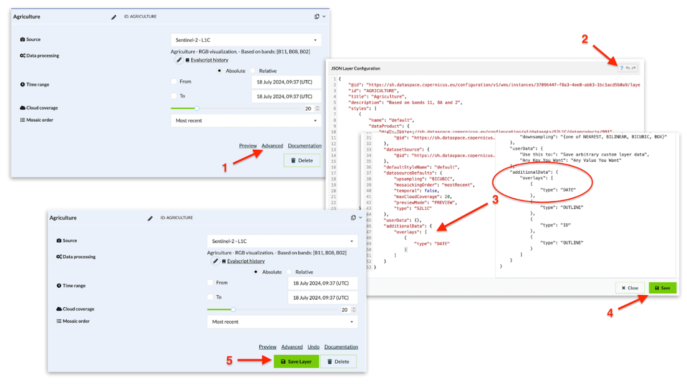

**Catalog API**

1.  Make a request to Catalog API where you set a `distinct` parameter to date along with setting bounding box, timespan and collection for which you want to get the acquisition dates (see [example](https://documentation.dataspace.copernicus.eu/APIs/SentinelHub/Catalog/Examples.html#search-with-distinct)).

How can I access angle data information for Sentinel-2 L2A?

Grid of solar zenith angles and grid of solar azimuth angles are accessible by names `sunZenithAngles` and `sunAzimuthAngles`, respectively, and can be used in a similar way as band values, e.g.:

``` javascript
return [sunAzimuthAngles / 50];
return [sunZenithAngles / 60];
```

There are also two grids named `viewZenithMean` and `viewAzimuthMean` that contain average viewing incidence angles (zenith and azimuth) across all bands and detectors. They can be used as, e.g.:

``` javascript
return [viewAzimuthMean / 70];
return [viewZenithMean / 80];
```

## EO products

How can I create EO products?

You can easily create a new EO product in [Configuration Utility](https://shapps.dataspace.copernicus.eu/dashboard/#/configurations).  
  
1. Create a new configuration or open an existing one.  
2. Click on “Add new layer”.  
3. Enter the title of the layer.  
4. Click the “pencil icon” next to the **Data Processing** option to select a predefined product or enter your processing script.  
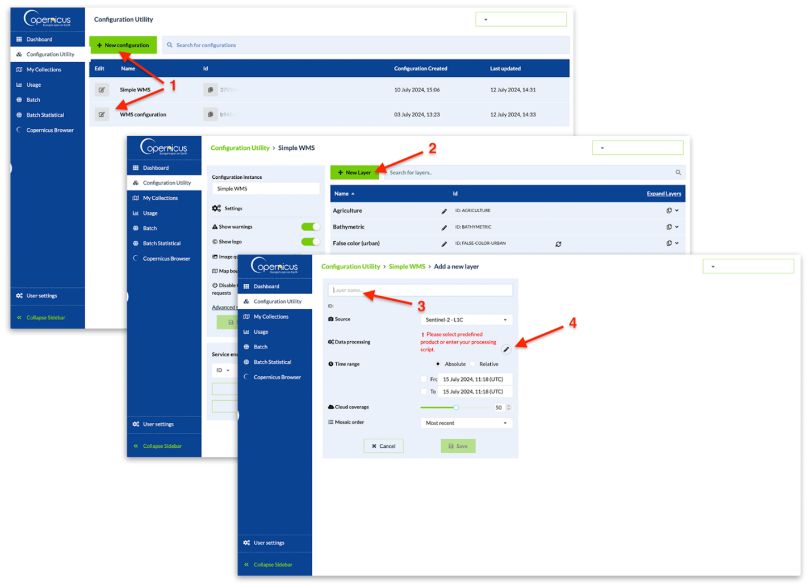 5. Choose from the available Base Products.  
6. Click on the selected product under **Visualization Options** and the “Copy Script to Editor” button.  
7. Edit the selected base script in the **Custom script editor** and click the “Set Custom Script” button when you are done.  
8. Click “Save” under the newly added layer to complete the creation of a new layer.  
9. The newly added layer will appear in the list of layers under your configuration.  
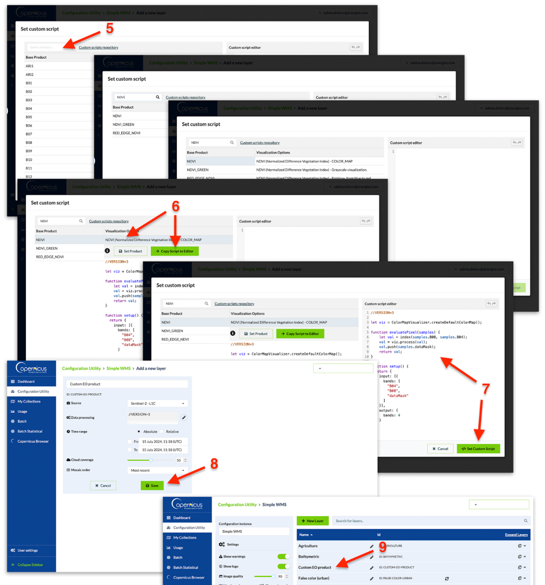

How do I view NDVI?

There are several ways you can view the Normalized Difference Vegetation Index (NDVI):

You can view it directly in [Copernicus Browser](https://link.dataspace.copernicus.eu/3fup), which provides the NDVI visualization as one of the default visualizations.

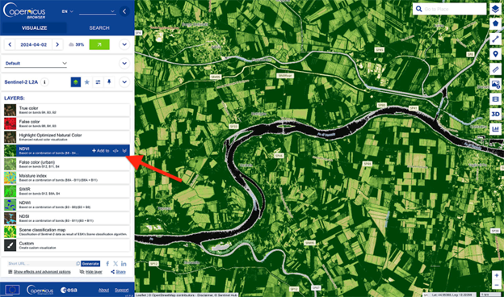

You can create a new NDVI layer yourself with custom modifications in [Configuration Utility](https://shapps.dataspace.copernicus.eu/dashboard/#/configurations), and view it in Copernicus Browser after logging in with your credentials. Read more about [creating a new layer](#how-to-create-eo-products).

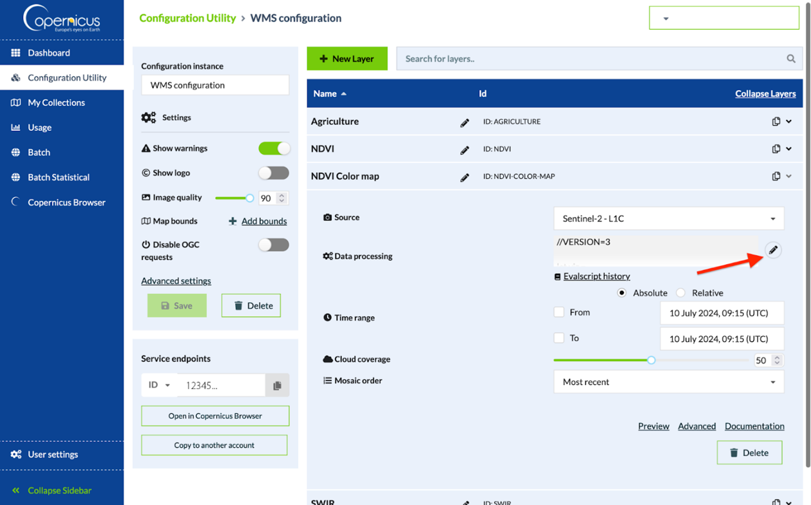

You can also integrate the NDVI layer with the WMS in your own application. Read more about the [WMS request](https://documentation.dataspace.copernicus.eu/APIs/SentinelHub/OGC/WMS.html), [OGC example requests](https://documentation.dataspace.copernicus.eu/APIs/SentinelHub/OGC/Examples.html).

Are EO products being changed through time or is the visualization fixed?

When the user selects “EO Product template”, she can see the Custom script behind each visualization/processing to make it as transparent as possible on what is happening with the data. We are changing these configurations over time, adding new ones and improving existing ones. For those who want to ensure that processing of their layers is not changed any more, they can simply edit the original Custom script and gain full control over it.

How can I get S2A scene classification for Sentinel-2?

You can get information from the scene classification layer produced by Sen2Cor, for data where S2A is available. Data can be retrieved by identifier “SCL” (e.g. instead of return \[B02\]; for blue color one can use return \[SCL/10\];).

Data can be then used for e.g. validation of the pixel value, e.g. along the lines:

``` javascript
var scl = SCL;
if (scl == 0) { // No Data
return [0, 0, 0]; // black
} else if (scl == 1) { // Saturated / Defective
return [1, 0, 0.016]; // red
} else if (scl == 2) { // Dark Area Pixels
return [0.525, 0.525, 0.525]; // gray
} else if (scl == 3) { // Cloud Shadows
return [0.467, 0.298, 0.043]; // brown
} else if (scl == 4) { // Vegetation
return [0.063, 0.827, 0.176]; // green
} else if (scl == 5) { // Bare Soils
return [1, 1, 0.325]; // yellow
} else if (scl == 6) { // Water
return [0, 0, 1]; // blue
} else if (scl == 7) { // Clouds low probability / Unclassified
return [0.506, 0.506, 0.506]; // medium gray
} else if (scl == 8) { // Clouds medium probability
return [0.753, 0.753, 0.753]; // light gray
} else if (scl == 9) { // Clouds high probability
return [0.949, 0.949, 0.949]; // very light gray
} else if (scl == 10) { // Cirrus
return [0.733, 0.773, 0.925]; // light blue/purple
} else if (scl == 11) { // Snow / Ice
return [0.325, 1, 0.980]; // cyan
} else { // should never happen
return [0,0,0];
}
```

Please note that it makes sense to use this layer only on full resolution as any interpolation based on classification code list will not produce reasonable results. You should also use the NEAREST upsampling/downsampling setting, which you can find in “Effects and advanced options”.

Also please note that this map does not constitute a land cover classification map in a strict sense, its main purpose is to be used internally in Sen2Cor in the atmospheric correction module to distinguish between cloudy pixels, clear pixels and water pixels.

An example of Blinnenhorn, Switzerland (14 October 2017):

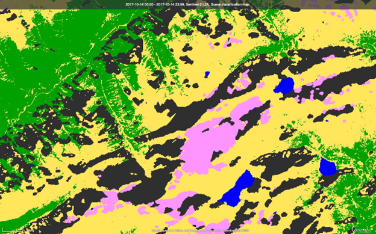

Sentinel-2 L2A, SCL, acquired with Copernicus Browser

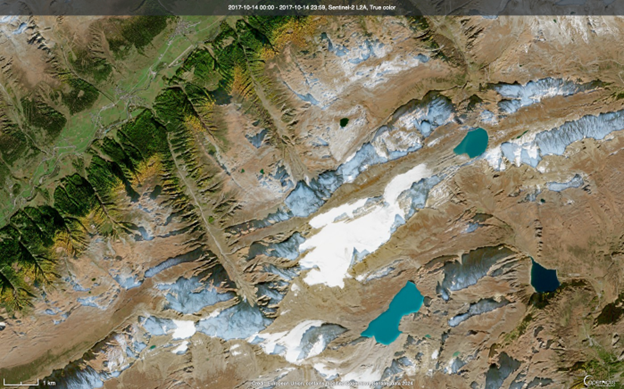

Sentinel-2 L2A, true color, acquired with Copernicus Browser

This is a prototype feature and can change in future releases.
