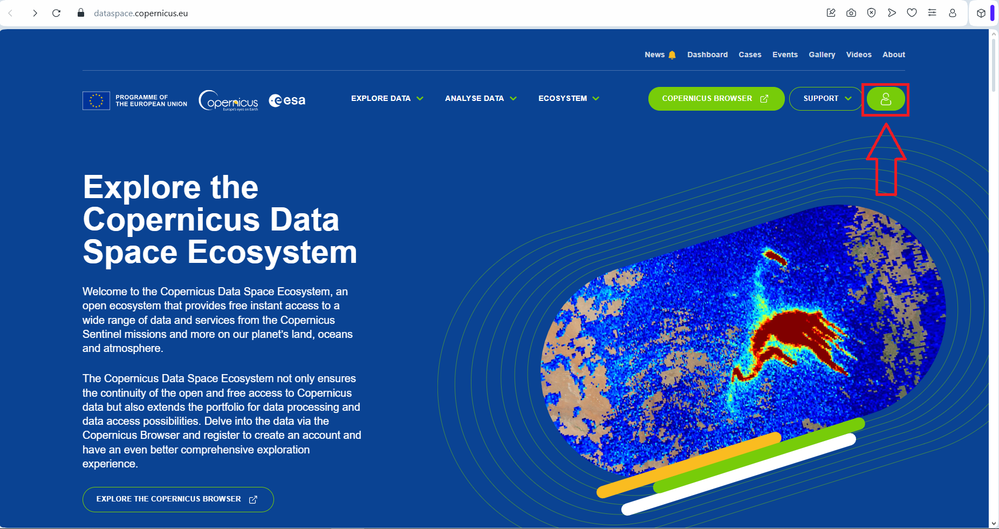
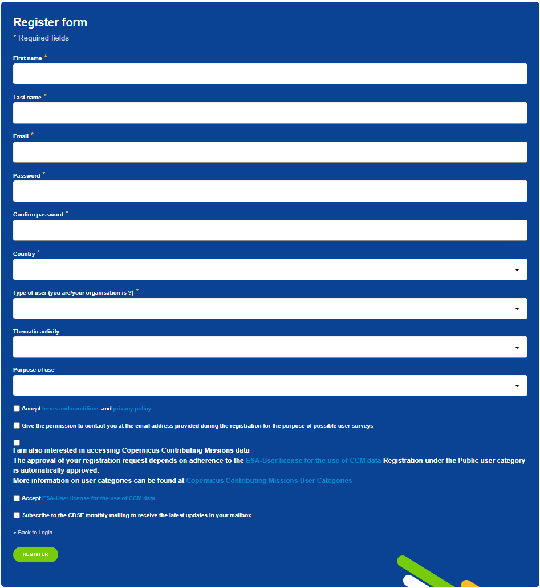
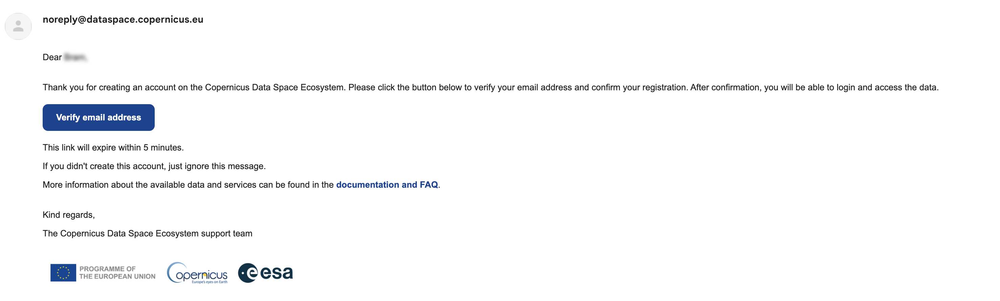

# User registration and authentication

This section provides information on how to register and authenticate on the Copernicus Data Space Ecosystem (CDSE).

## Step 1: Registration

Go to [CDSE website](https://dataspace.copernicus.eu/) where you can simply click on avatar logo located in the top right corner.

  

On the landing page, locate the “REGISTER” button on the screen’s right side. Clicking on it will lead you to the Register form. Please fill all the Required fields. You have the option to fill in any optional fields. Once you have provided the necessary information, accept Accept terms and conditions and privacy policy. Additionally, you can accept any other optional consents if applicable. Finally, click the REGISTER button to complete the process.

## Step 2: E-mail verification

Upon registration, you will be prompted to verify your email address by receiving a verification email. To complete the process, simply click on the “Verify email address” link when you open the email.

After successfully verifying your email, your registration process is complete. You can now log in using your credentials (providing Email and Password).

If you have an issue with registering or you want to deregister, please [contact us](mailto://help-login@dataspace.copernicus.eu?Subject=Subject%20Text&Body=Your%20comments).
