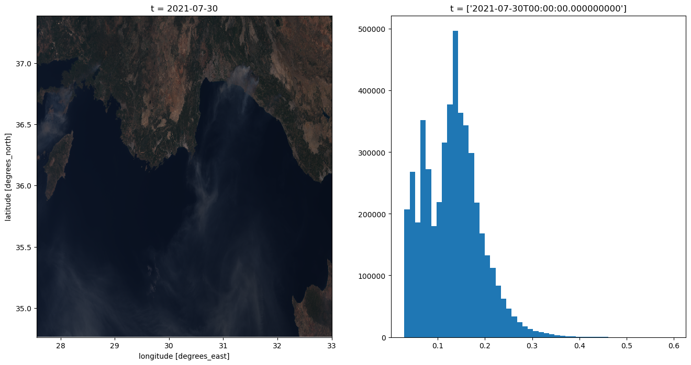

# Sentinel-3

This notebook explores working with Sentinel-3 data.

## Sentinel-3 OLCI

https://sentinels.copernicus.eu/web/sentinel/user-guides/sentinel-3-olci

The OLCI dataset provided by Sentinelhub is based on the level-1b products. These products are provided in “instrument” projection rather than being projected into a ground-based reference system. Hence, these products do not come with a ‘native’ reference system. The openEO collections are currently configured to use EPSG:4326 unprojected coordinates, with a resolution set to a fixed value that tries to approximate the native 300m ground resolution.

``` python
import openeo
import xarray
import matplotlib.pyplot as plt
import numpy as np
```

``` python
conn = openeo.connect("openeo.dataspace.copernicus.eu")
conn.authenticate_oidc()
```

Visit [https://identity.dataspace.copernicus.eu/auth/realms/CDSE/device?user_code=QPMD-IMEL](https://identity.dataspace.copernicus.eu/auth/realms/CDSE/device?user_code=QPMD-IMEL "Authenticate at https://identity.dataspace.copernicus.eu/auth/realms/CDSE/device?user_code=QPMD-IMEL") [📋](# "Copy authentication URL to clipboard") to authenticate.

`[####################################-]` Authorized successfully

    Authenticated using device code flow.

    <Connection to 'https://openeo.dataspace.copernicus.eu/openeo/1.1/' with OidcBearerAuth>

### Load the collection

``` python
conn.describe_collection("SENTINEL3_OLCI_L1B")
```

``` python
bbox = {"west": 27.564697, "south": 34.764179, "east": 33.002930, "north": 37.387617}
sentinel3 = conn.load_collection(
    "SENTINEL3_OLCI_L1B",
    spatial_extent=bbox,
    temporal_extent=["2021-07-30", "2021-07-30"],
    bands=["B08", "B06", "B04"],
)
```

Let’s download this slice of data in netCDF format to give it an initial inspection.

``` python
sentinel3.download("sentinel3.nc")
```

Quick visualisation of the output

``` python
ds = xarray.load_dataset("sentinel3.nc")

# Convert xarray DataSet to a (bands, t, x, y) DataArray
data = ds[["B08", "B06", "B04"]].to_array(dim="bands")
```

``` python
fig, (axrgb, axhist) = plt.subplots(nrows=1, ncols=2, figsize=(16, 8))

# plot the data
data[{"t": 0}].plot.imshow(ax=axrgb)

# Plot the data histogram
data.plot.hist(bins=50, ax=axhist, histtype="stepfilled")

plt.show()
```


