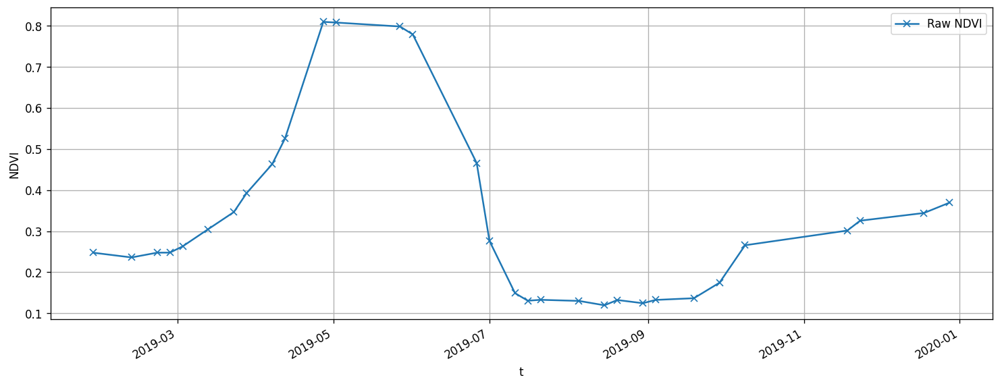
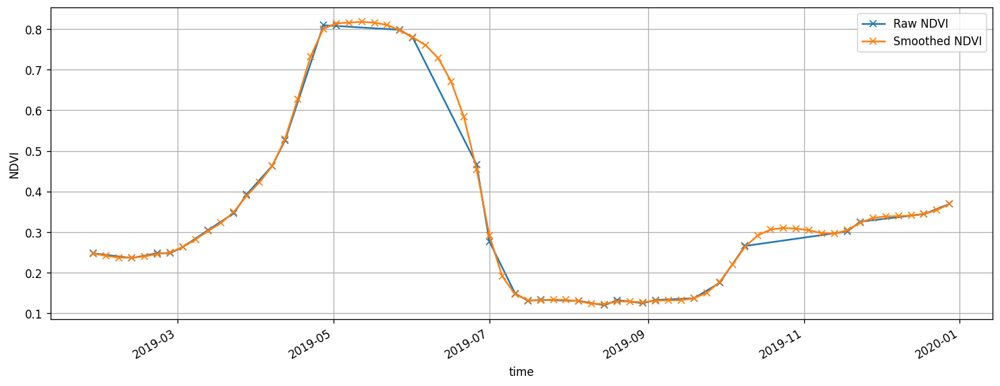

# Creating a smoothed dataset using Whittaker

In this notebook, we use Whittaker algorithm is available in the FuseTS toolbox as a user-defined-function (UDF) to create a smoothed time series. It employs a discrete penalized least squares algorithm that fits a smooth series, denoted as z, to the original data series, denoted as y.

Please note that FuseTS library used here is compatible with Python 3.8 - 3.10.

``` python
import itertools
import warnings
from datetime import datetime, timedelta

import matplotlib.pyplot as plt
import numpy as np
import openeo
import pandas as pd
import xarray
from ipyleaflet import GeoJSON, Map, basemaps
from openeo.processes import eq
from openeo.rest.conversions import timeseries_json_to_pandas

from fusets.whittaker import whittaker

warnings.filterwarnings("ignore")
```

The first step is to connect to an openEO backend and authenticate with the Copernicus Dataspace Ecosystem’s credentials.

``` python
connection = openeo.connect("openeo.dataspace.copernicus.eu").authenticate_oidc()
```

    Authenticated using refresh token.

Next we define the area of interest, in this case an extent, for which we would like to fetch time series data.

``` python
year = 2019
spat_ext = {
    "coordinates": [
        [
            [-4.875091217039325, 41.77290587433312],
            [-4.872773788450457, 41.77290587433312],
            [-4.872773788450457, 41.77450614847532],
            [-4.875091217039325, 41.77450614847532],
            [-4.875091217039325, 41.77290587433312],
        ]
    ],
    "type": "Polygon",
}
temp_ext = [f"{year}-01-01", f"{year}-12-30"]
```

``` python
center = np.mean(spat_ext["coordinates"][0], axis=0).tolist()[::-1]
zoom = 16

m = Map(basemap=basemaps.Esri.WorldImagery, center=center, zoom=zoom)
g = GeoJSON(
    data=spat_ext,
    style={
        "color": "red",
        "opacity": 1,
        "weight": 1.9,
        "dashArray": "9",
        "fillOpacity": 0.5,
    },
)
m.add(g)
m
```

We will be working with with the rapeseed from 2019, located in the Nothern Spain.

We will create an openEO process to calculate the NDVI time series for our area of interest. First we begin by using the `SENTINEL2_L2A` collection, and apply a `Sen2Cor` cloud masking algorithm to remove any interfering clouds before calculating the NDVI values.

``` python
s2 = connection.load_collection(
    "SENTINEL2_L2A",
    spatial_extent=spat_ext,
    temporal_extent=temp_ext,
    bands=["B04", "B08", "SCL"],
)
s2 = s2.process("mask_scl_dilation", data=s2, scl_band_name="SCL")
s2 = s2.mask_polygon(spat_ext)
ndvi_cube = s2.ndvi(red="B04", nir="B08", target_band="NDVI")
```

Now that we have calculated the NDVI time series for our area of interest, we can request openEO to download the result to our local storage. This will allow us to access the file and use it for further analysis in this notebook.

``` python
ndvi_output_file = "raw_s2_ndvi_field.nc"

# batch job

ndvi_job = ndvi_cube.execute_batch(ndvi_output_file, title=f"FUSETS-Raw NDVI")

# load the dataset and check it's structure
raw_ndvi_ds = xarray.load_dataset(ndvi_output_file)
raw_ndvi_ds
```

    0:00:00 Job 'j-2310308bb89149cf8106aabb55eba553': send 'start'
    0:00:12 Job 'j-2310308bb89149cf8106aabb55eba553': created (progress N/A)
    0:00:18 Job 'j-2310308bb89149cf8106aabb55eba553': created (progress N/A)
    0:00:24 Job 'j-2310308bb89149cf8106aabb55eba553': created (progress N/A)
    0:00:33 Job 'j-2310308bb89149cf8106aabb55eba553': created (progress N/A)
    0:00:43 Job 'j-2310308bb89149cf8106aabb55eba553': created (progress N/A)
    0:00:56 Job 'j-2310308bb89149cf8106aabb55eba553': created (progress N/A)
    0:01:12 Job 'j-2310308bb89149cf8106aabb55eba553': running (progress N/A)
    0:01:32 Job 'j-2310308bb89149cf8106aabb55eba553': running (progress N/A)
    0:01:56 Job 'j-2310308bb89149cf8106aabb55eba553': running (progress N/A)
    0:02:27 Job 'j-2310308bb89149cf8106aabb55eba553': finished (progress N/A)

![](data:image/svg+xml;base64,PHN2ZyBzdHlsZT0icG9zaXRpb246IGFic29sdXRlOyB3aWR0aDogMDsgaGVpZ2h0OiAwOyBvdmVyZmxvdzogaGlkZGVuIj4KPGRlZnM+CjxzeW1ib2wgaWQ9Imljb24tZGF0YWJhc2UiIHZpZXdib3g9IjAgMCAzMiAzMiI+CjxwYXRoIGQ9Ik0xNiAwYy04LjgzNyAwLTE2IDIuMjM5LTE2IDV2NGMwIDIuNzYxIDcuMTYzIDUgMTYgNXMxNi0yLjIzOSAxNi01di00YzAtMi43NjEtNy4xNjMtNS0xNi01eiIgLz4KPHBhdGggZD0iTTE2IDE3Yy04LjgzNyAwLTE2LTIuMjM5LTE2LTV2NmMwIDIuNzYxIDcuMTYzIDUgMTYgNXMxNi0yLjIzOSAxNi01di02YzAgMi43NjEtNy4xNjMgNS0xNiA1eiIgLz4KPHBhdGggZD0iTTE2IDI2Yy04LjgzNyAwLTE2LTIuMjM5LTE2LTV2NmMwIDIuNzYxIDcuMTYzIDUgMTYgNXMxNi0yLjIzOSAxNi01di02YzAgMi43NjEtNy4xNjMgNS0xNiA1eiIgLz4KPC9zeW1ib2w+CjxzeW1ib2wgaWQ9Imljb24tZmlsZS10ZXh0MiIgdmlld2JveD0iMCAwIDMyIDMyIj4KPHBhdGggZD0iTTI4LjY4MSA3LjE1OWMtMC42OTQtMC45NDctMS42NjItMi4wNTMtMi43MjQtMy4xMTZzLTIuMTY5LTIuMDMwLTMuMTE2LTIuNzI0Yy0xLjYxMi0xLjE4Mi0yLjM5My0xLjMxOS0yLjg0MS0xLjMxOWgtMTUuNWMtMS4zNzggMC0yLjUgMS4xMjEtMi41IDIuNXYyN2MwIDEuMzc4IDEuMTIyIDIuNSAyLjUgMi41aDIzYzEuMzc4IDAgMi41LTEuMTIyIDIuNS0yLjV2LTE5LjVjMC0wLjQ0OC0wLjEzNy0xLjIzLTEuMzE5LTIuODQxek0yNC41NDMgNS40NTdjMC45NTkgMC45NTkgMS43MTIgMS44MjUgMi4yNjggMi41NDNoLTQuODExdi00LjgxMWMwLjcxOCAwLjU1NiAxLjU4NCAxLjMwOSAyLjU0MyAyLjI2OHpNMjggMjkuNWMwIDAuMjcxLTAuMjI5IDAuNS0wLjUgMC41aC0yM2MtMC4yNzEgMC0wLjUtMC4yMjktMC41LTAuNXYtMjdjMC0wLjI3MSAwLjIyOS0wLjUgMC41LTAuNSAwIDAgMTUuNDk5LTAgMTUuNSAwdjdjMCAwLjU1MiAwLjQ0OCAxIDEgMWg3djE5LjV6IiAvPgo8cGF0aCBkPSJNMjMgMjZoLTE0Yy0wLjU1MiAwLTEtMC40NDgtMS0xczAuNDQ4LTEgMS0xaDE0YzAuNTUyIDAgMSAwLjQ0OCAxIDFzLTAuNDQ4IDEtMSAxeiIgLz4KPHBhdGggZD0iTTIzIDIyaC0xNGMtMC41NTIgMC0xLTAuNDQ4LTEtMXMwLjQ0OC0xIDEtMWgxNGMwLjU1MiAwIDEgMC40NDggMSAxcy0wLjQ0OCAxLTEgMXoiIC8+CjxwYXRoIGQ9Ik0yMyAxOGgtMTRjLTAuNTUyIDAtMS0wLjQ0OC0xLTFzMC40NDgtMSAxLTFoMTRjMC41NTIgMCAxIDAuNDQ4IDEgMXMtMC40NDggMS0xIDF6IiAvPgo8L3N5bWJvbD4KPC9kZWZzPgo8L3N2Zz4=)

``` xr-text-repr-fallback
<xarray.Dataset>
Dimensions:  (t: 31, x: 21, y: 19)
Coordinates:
  * t        (t) datetime64[ns] 2019-01-27 2019-02-11 ... 2019-12-18 2019-12-28
  * x        (x) float64 3.442e+05 3.442e+05 3.442e+05 ... 3.443e+05 3.444e+05
  * y        (y) float64 4.626e+06 4.626e+06 4.626e+06 ... 4.626e+06 4.626e+06
Data variables:
    crs      |S1 b''
    B04      (t, y, x) float32 nan 1.212e+03 1.226e+03 1.236e+03 ... nan nan nan
    B08      (t, y, x) float32 nan 1.934e+03 1.964e+03 1.982e+03 ... nan nan nan
    SCL      (t, y, x) float32 nan 5.0 5.0 5.0 5.0 5.0 ... nan nan nan nan nan
    NDVI     (t, y, x) float32 nan 0.2295 0.2313 0.2318 ... nan nan nan nan
Attributes:
    Conventions:  CF-1.9
    institution:  openEO platform - Geotrellis backend: 0.18.0a1
    description:  
    title:        
```

xarray.Dataset

Dimensions:

- t: 31
- x: 21
- y: 19

Coordinates: (3)

t

\(t\)

datetime64\[ns\]

2019-01-27 ... 2019-12-28


standard_name :  
t

long_name :  
t

axis :  
T

    array(['2019-01-27T00:00:00.000000000', '2019-02-11T00:00:00.000000000',
           '2019-02-21T00:00:00.000000000', '2019-02-26T00:00:00.000000000',
           '2019-03-03T00:00:00.000000000', '2019-03-13T00:00:00.000000000',
           '2019-03-23T00:00:00.000000000', '2019-03-28T00:00:00.000000000',
           '2019-04-07T00:00:00.000000000', '2019-04-12T00:00:00.000000000',
           '2019-04-27T00:00:00.000000000', '2019-05-02T00:00:00.000000000',
           '2019-05-27T00:00:00.000000000', '2019-06-01T00:00:00.000000000',
           '2019-06-26T00:00:00.000000000', '2019-07-01T00:00:00.000000000',
           '2019-07-11T00:00:00.000000000', '2019-07-16T00:00:00.000000000',
           '2019-07-21T00:00:00.000000000', '2019-08-05T00:00:00.000000000',
           '2019-08-15T00:00:00.000000000', '2019-08-20T00:00:00.000000000',
           '2019-08-30T00:00:00.000000000', '2019-09-04T00:00:00.000000000',
           '2019-09-19T00:00:00.000000000', '2019-09-29T00:00:00.000000000',
           '2019-10-09T00:00:00.000000000', '2019-11-18T00:00:00.000000000',
           '2019-11-23T00:00:00.000000000', '2019-12-18T00:00:00.000000000',
           '2019-12-28T00:00:00.000000000'], dtype='datetime64[ns]')

x

\(x\)

float64

3.442e+05 3.442e+05 ... 3.444e+05


standard_name :  
projection_x_coordinate

long_name :  
x coordinate of projection

units :  
m

    array([344155., 344165., 344175., 344185., 344195., 344205., 344215., 344225.,
           344235., 344245., 344255., 344265., 344275., 344285., 344295., 344305.,
           344315., 344325., 344335., 344345., 344355.])

y

\(y\)

float64

4.626e+06 4.626e+06 ... 4.626e+06


standard_name :  
projection_y_coordinate

long_name :  
y coordinate of projection

units :  
m

    array([4626435., 4626425., 4626415., 4626405., 4626395., 4626385., 4626375.,
           4626365., 4626355., 4626345., 4626335., 4626325., 4626315., 4626305.,
           4626295., 4626285., 4626275., 4626265., 4626255.])

Data variables: (5)

crs

()

\|S1

b''


crs_wkt :  
PROJCS\["WGS 84 / UTM zone 30N", GEOGCS\["WGS 84", DATUM\["World Geodetic System 1984", SPHEROID\["WGS 84", 6378137.0, 298.257223563, AUTHORITY\["EPSG","7030"\]\], AUTHORITY\["EPSG","6326"\]\], PRIMEM\["Greenwich", 0.0, AUTHORITY\["EPSG","8901"\]\], UNIT\["degree", 0.017453292519943295\], AXIS\["Geodetic longitude", EAST\], AXIS\["Geodetic latitude", NORTH\], AUTHORITY\["EPSG","4326"\]\], PROJECTION\["Transverse_Mercator", AUTHORITY\["EPSG","9807"\]\], PARAMETER\["central_meridian", -3.0\], PARAMETER\["latitude_of_origin", 0.0\], PARAMETER\["scale_factor", 0.9996\], PARAMETER\["false_easting", 500000.0\], PARAMETER\["false_northing", 0.0\], UNIT\["m", 1.0\], AXIS\["Easting", EAST\], AXIS\["Northing", NORTH\], AUTHORITY\["EPSG","32630"\]\]

spatial_ref :  
PROJCS\["WGS 84 / UTM zone 30N", GEOGCS\["WGS 84", DATUM\["World Geodetic System 1984", SPHEROID\["WGS 84", 6378137.0, 298.257223563, AUTHORITY\["EPSG","7030"\]\], AUTHORITY\["EPSG","6326"\]\], PRIMEM\["Greenwich", 0.0, AUTHORITY\["EPSG","8901"\]\], UNIT\["degree", 0.017453292519943295\], AXIS\["Geodetic longitude", EAST\], AXIS\["Geodetic latitude", NORTH\], AUTHORITY\["EPSG","4326"\]\], PROJECTION\["Transverse_Mercator", AUTHORITY\["EPSG","9807"\]\], PARAMETER\["central_meridian", -3.0\], PARAMETER\["latitude_of_origin", 0.0\], PARAMETER\["scale_factor", 0.9996\], PARAMETER\["false_easting", 500000.0\], PARAMETER\["false_northing", 0.0\], UNIT\["m", 1.0\], AXIS\["Easting", EAST\], AXIS\["Northing", NORTH\], AUTHORITY\["EPSG","32630"\]\]

    array(b'', dtype='|S1')

B04

(t, y, x)

float32

nan 1.212e+03 1.226e+03 ... nan nan


long_name :  
B04

units :  

grid_mapping :  
crs

    array([[[  nan, 1212., 1226., ..., 1064., 1040.,   nan],
            [  nan, 1214., 1224., ..., 1096., 1054.,   nan],
            [  nan, 1232., 1222., ..., 1082., 1052.,   nan],
            ...,
            [  nan, 1230., 1248., ..., 1186., 1142.,   nan],
            [  nan, 1262., 1262., ..., 1148., 1142.,   nan],
            [  nan,   nan,   nan, ...,   nan,   nan,   nan]],

           [[  nan, 1272., 1258., ..., 1102., 1060.,   nan],
            [  nan, 1238., 1216., ..., 1094., 1052.,   nan],
            [  nan, 1266., 1256., ..., 1112., 1096.,   nan],
            ...,
            [  nan, 1236., 1202., ..., 1188., 1164.,   nan],
            [  nan, 1240., 1202., ..., 1162., 1146.,   nan],
            [  nan,   nan,   nan, ...,   nan,   nan,   nan]],

           [[  nan, 1262., 1300., ..., 1130., 1124.,   nan],
            [  nan, 1288., 1300., ..., 1152., 1118.,   nan],
            [  nan, 1324., 1294., ..., 1146., 1132.,   nan],
            ...,
    ...
            ...,
            [  nan, 1108., 1108., ..., 1112., 1112.,   nan],
            [  nan, 1100., 1126., ..., 1094., 1104.,   nan],
            [  nan,   nan,   nan, ...,   nan,   nan,   nan]],

           [[  nan, 1352., 1462., ..., 1332., 1304.,   nan],
            [  nan, 1284., 1388., ..., 1298., 1250.,   nan],
            [  nan, 1308., 1294., ..., 1266., 1240.,   nan],
            ...,
            [  nan, 1324., 1310., ..., 1334., 1384.,   nan],
            [  nan, 1330., 1348., ..., 1312., 1412.,   nan],
            [  nan,   nan,   nan, ...,   nan,   nan,   nan]],

           [[  nan, 1118., 1102., ..., 1013., 1021.,   nan],
            [  nan, 1042.,  986., ..., 1030., 1002.,   nan],
            [  nan, 1066.,  979., ..., 1030., 1015.,   nan],
            ...,
            [  nan, 1062., 1106., ..., 1022., 1064.,   nan],
            [  nan, 1076., 1116., ..., 1030., 1024.,   nan],
            [  nan,   nan,   nan, ...,   nan,   nan,   nan]]], dtype=float32)

B08

(t, y, x)

float32

nan 1.934e+03 1.964e+03 ... nan nan


long_name :  
B08

units :  

grid_mapping :  
crs

    array([[[  nan, 1934., 1964., ..., 1916., 1852.,   nan],
            [  nan, 1990., 2010., ..., 1846., 1754.,   nan],
            [  nan, 2050., 2064., ..., 1784., 1680.,   nan],
            ...,
            [  nan, 2046., 2032., ..., 1784., 1760.,   nan],
            [  nan, 2078., 2042., ..., 1796., 1766.,   nan],
            [  nan,   nan,   nan, ...,   nan,   nan,   nan]],

           [[  nan, 1968., 1992., ..., 1838., 1796.,   nan],
            [  nan, 2028., 2054., ..., 1808., 1748.,   nan],
            [  nan, 2082., 2110., ..., 1758., 1782.,   nan],
            ...,
            [  nan, 1958., 1888., ..., 1786., 1830.,   nan],
            [  nan, 1926., 1882., ..., 1802., 1816.,   nan],
            [  nan,   nan,   nan, ...,   nan,   nan,   nan]],

           [[  nan, 2120., 2154., ..., 1946., 1898.,   nan],
            [  nan, 2208., 2214., ..., 1910., 1908.,   nan],
            [  nan, 2184., 2204., ..., 1908., 1932.,   nan],
            ...,
    ...
            ...,
            [  nan, 2008., 2084., ..., 1932., 2020.,   nan],
            [  nan, 2082., 2080., ..., 1914., 2002.,   nan],
            [  nan,   nan,   nan, ...,   nan,   nan,   nan]],

           [[  nan, 2862., 2850., ..., 2730., 2744.,   nan],
            [  nan, 2820., 2878., ..., 2714., 2668.,   nan],
            [  nan, 2890., 2972., ..., 2624., 2608.,   nan],
            ...,
            [  nan, 2686., 2742., ..., 2630., 2630.,   nan],
            [  nan, 2674., 2740., ..., 2618., 2658.,   nan],
            [  nan,   nan,   nan, ...,   nan,   nan,   nan]],

           [[  nan, 2382., 2340., ..., 2248., 2274.,   nan],
            [  nan, 2252., 2398., ..., 2206., 2222.,   nan],
            [  nan, 2314., 2424., ..., 2204., 2216.,   nan],
            ...,
            [  nan, 2306., 2354., ..., 2152., 2136.,   nan],
            [  nan, 2302., 2336., ..., 2188., 2132.,   nan],
            [  nan,   nan,   nan, ...,   nan,   nan,   nan]]], dtype=float32)

SCL

(t, y, x)

float32

nan 5.0 5.0 5.0 ... nan nan nan nan


long_name :  
SCL

units :  

grid_mapping :  
crs

    array([[[nan,  5.,  5., ...,  5.,  5., nan],
            [nan,  5.,  5., ...,  5.,  5., nan],
            [nan,  5.,  5., ...,  5.,  5., nan],
            ...,
            [nan,  5.,  5., ...,  5.,  5., nan],
            [nan,  5.,  5., ...,  5.,  5., nan],
            [nan, nan, nan, ..., nan, nan, nan]],

           [[nan,  5.,  5., ...,  5.,  5., nan],
            [nan,  5.,  5., ...,  5.,  5., nan],
            [nan,  5.,  5., ...,  5.,  5., nan],
            ...,
            [nan,  5.,  5., ...,  5.,  5., nan],
            [nan,  5.,  5., ...,  5.,  5., nan],
            [nan, nan, nan, ..., nan, nan, nan]],

           [[nan,  5.,  5., ...,  5.,  5., nan],
            [nan,  5.,  5., ...,  5.,  5., nan],
            [nan,  5.,  5., ...,  5.,  5., nan],
            ...,
    ...
            ...,
            [nan,  5.,  5., ...,  5.,  5., nan],
            [nan,  5.,  5., ...,  5.,  5., nan],
            [nan, nan, nan, ..., nan, nan, nan]],

           [[nan,  5.,  5., ...,  5.,  5., nan],
            [nan,  5.,  5., ...,  5.,  5., nan],
            [nan,  5.,  5., ...,  5.,  5., nan],
            ...,
            [nan,  5.,  5., ...,  5.,  5., nan],
            [nan,  5.,  5., ...,  5.,  5., nan],
            [nan, nan, nan, ..., nan, nan, nan]],

           [[nan,  5.,  5., ...,  5.,  5., nan],
            [nan,  5.,  5., ...,  5.,  5., nan],
            [nan,  5.,  5., ...,  5.,  5., nan],
            ...,
            [nan,  5.,  5., ...,  5.,  5., nan],
            [nan,  5.,  5., ...,  5.,  5., nan],
            [nan, nan, nan, ..., nan, nan, nan]]], dtype=float32)

NDVI

(t, y, x)

float32

nan 0.2295 0.2313 ... nan nan nan


long_name :  
NDVI

units :  

grid_mapping :  
crs

    array([[[       nan, 0.22949778, 0.23134796, ..., 0.28590605,
             0.28077456,        nan],
            [       nan, 0.24219726, 0.24304268, ..., 0.25492862,
             0.24928775,        nan],
            [       nan, 0.24923827, 0.25623858, ..., 0.24494068,
             0.22986823,        nan],
            ...,
            [       nan, 0.24908425, 0.23902439, ..., 0.2013468 ,
             0.21295658,        nan],
            [       nan, 0.24431138, 0.23607749, ..., 0.2201087 ,
             0.21458046,        nan],
            [       nan,        nan,        nan, ...,        nan,
                    nan,        nan]],

           [[       nan, 0.21481481, 0.22584616, ..., 0.25034013,
             0.2577031 ,        nan],
            [       nan, 0.2418861 , 0.25626913, ..., 0.24603721,
             0.24857143,        nan],
            [       nan, 0.2437276 , 0.2537136 , ..., 0.2250871 ,
             0.23835997,        nan],
    ...
            [       nan, 0.33965087, 0.3534057 , ..., 0.32694247,
             0.31041354,        nan],
            [       nan, 0.33566433, 0.34050882, ..., 0.33231553,
             0.3061425 ,        nan],
            [       nan,        nan,        nan, ...,        nan,
                    nan,        nan]],

           [[       nan, 0.36114284, 0.3596746 , ..., 0.3787182 ,
             0.38027313,        nan],
            [       nan, 0.36733454, 0.4172577 , ..., 0.3634116 ,
             0.37841192,        nan],
            [       nan, 0.36923078, 0.42462534, ..., 0.36301795,
             0.37171155,        nan],
            ...,
            [       nan, 0.36935866, 0.36069363, ..., 0.35601765,
             0.335     ,        nan],
            [       nan, 0.36293665, 0.35341832, ..., 0.35985085,
             0.35107732,        nan],
            [       nan,        nan,        nan, ...,        nan,
                    nan,        nan]]], dtype=float32)

Indexes: (3)

t

PandasIndex


    PandasIndex(DatetimeIndex(['2019-01-27', '2019-02-11', '2019-02-21', '2019-02-26',
                   '2019-03-03', '2019-03-13', '2019-03-23', '2019-03-28',
                   '2019-04-07', '2019-04-12', '2019-04-27', '2019-05-02',
                   '2019-05-27', '2019-06-01', '2019-06-26', '2019-07-01',
                   '2019-07-11', '2019-07-16', '2019-07-21', '2019-08-05',
                   '2019-08-15', '2019-08-20', '2019-08-30', '2019-09-04',
                   '2019-09-19', '2019-09-29', '2019-10-09', '2019-11-18',
                   '2019-11-23', '2019-12-18', '2019-12-28'],
                  dtype='datetime64[ns]', name='t', freq=None))

x

PandasIndex


    PandasIndex(Float64Index([344155.0, 344165.0, 344175.0, 344185.0, 344195.0, 344205.0,
                  344215.0, 344225.0, 344235.0, 344245.0, 344255.0, 344265.0,
                  344275.0, 344285.0, 344295.0, 344305.0, 344315.0, 344325.0,
                  344335.0, 344345.0, 344355.0],
                 dtype='float64', name='x'))

y

PandasIndex


    PandasIndex(Float64Index([4626435.0, 4626425.0, 4626415.0, 4626405.0, 4626395.0, 4626385.0,
                  4626375.0, 4626365.0, 4626355.0, 4626345.0, 4626335.0, 4626325.0,
                  4626315.0, 4626305.0, 4626295.0, 4626285.0, 4626275.0, 4626265.0,
                  4626255.0],
                 dtype='float64', name='y'))

Attributes: (4)

Conventions :  
CF-1.9

institution :  
openEO platform - Geotrellis backend: 0.18.0a1

description :  

title :  

Plot the raw NDVI time series, averaged across the parcel

``` python
raw_ndvi = raw_ndvi_ds.NDVI.rename({"t": "time"})

fig, ax = plt.subplots(figsize=(15, 5), dpi=120)

raw_ndvi.median(dim=["x", "y"]).plot(ax=ax, marker="x", label="Raw NDVI")
ax.legend()
ax.grid()
```



``` python
# Make a prediction every 5 days
# to use the same dates as in the raw time series, just set the `prediction_period` to `None`
smoothed = whittaker(raw_ndvi, prediction_period="P5D", smoothing_lambda=10)
```

``` python
fig, ax = plt.subplots(figsize=(15, 5), dpi=120)

raw_ndvi.median(dim=["x", "y"]).plot(ax=ax, marker="x", label="Raw NDVI", color="C0")
smoothed.median(dim=["x", "y"]).plot(
    ax=ax, marker="x", label="Smoothed NDVI", color="C1"
)
ax.legend()
ax.grid()
```


