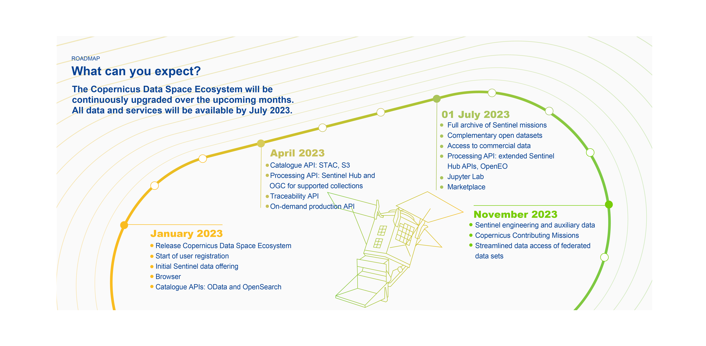

# Roadmap Overview

### Summary
<!-- |Timeline| Jan-23 | Apr-23 | Jul-23| Nov-23 
|---|---|---|---|----|
|1. | New Data Access portal  | Catalogue API: STAC, S3  | Full archive of Sentinel missions | Sentinel engineering and auxiliary data|
|2. |Start of user registration| Processing API: Sentinel Hub and OGC for supported collections  | Complementary open datasets | Copernicus Contributing Missions |
|3.| Initial Sentinel data offering| Traceability API | Access to commercial data| Streamlined data access of federated data sets  |
|4. |Browser| On-demand production API  | Processing API: extended Sentinel Hub APIs, OpenEO  |   |
| 5.|Catalogue APIs: OData and OpenSearch |   | Jupyter Lab    |      |
|6.|  |  | Marketplace | -->

### Detailed

A more details version updation of Copernicus Data Space Ecosystem can be found under following specific headings.

* [Data timeline overview](/section1/RoadmapTable/DataTable.html)

* [APIs timeline overview](/section1/RoadmapTable/APITable.html)

* [Applications timeline overview](/section1/RoadmapTable/AppTable.html)

* [test](/section1/RoadmapTable/testtablecolapse.html)
