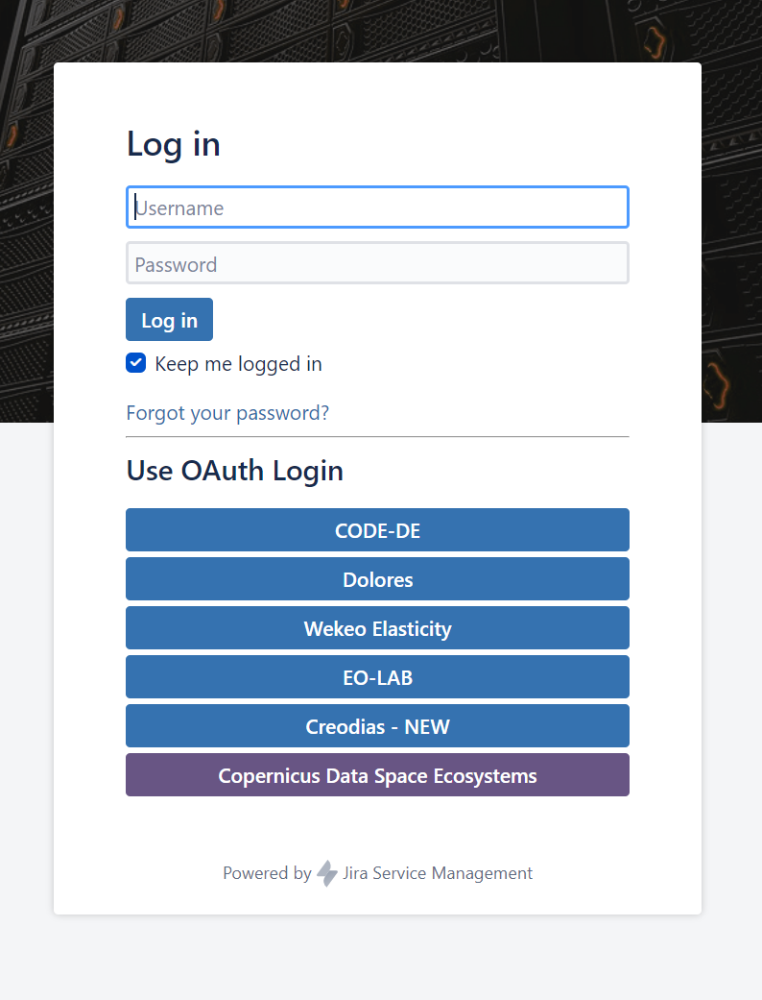
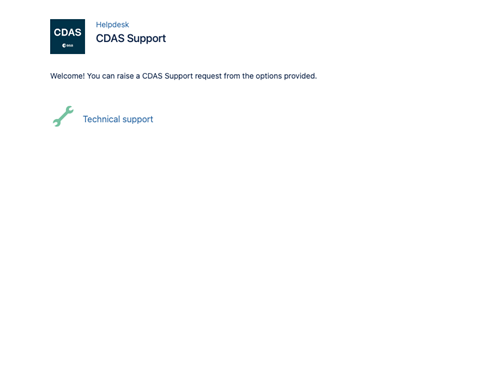
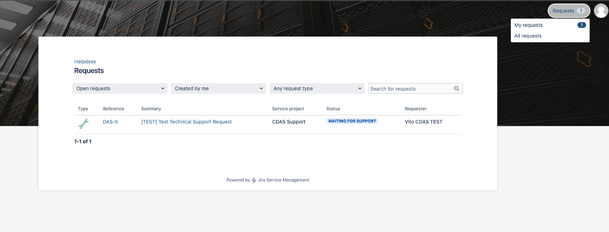

# Service Desk

In case of any questions that cannot be found in this documentation section, users can submit a support request related to questions on the use of the Copernicus Data Space Ecosystem.

Important to know is that only registered users can raise support questions. If you have an issue with registering or you want to deregister, please [contact us](mailto://help-cdse-login@cloudferro.com?Subject=Subject%20Text&Body=Your%20comments)  directly.

Please visit following [LINK](https://jira.cloudferro.com/servicedesk/customer/portal/55/user/login?destination=portal%2F55) to register your support questions.  
You will be required to login with your Copernicus Data Space Ecosystem credentials:

<!--  -->

Once logged in you can raise a Request - **Technical Support** 
<!--  -->

And create it with appropriate Summary, Description and optionally Attachment
<!--  -->

Created request you can follow in Request -> My Request menu. 

<!--  -->

This system is the initial setup of the support desk of the Copernicus Data Space Ecosystem. From April 2023 onwards, we will provide much more integrated support functionalities like answer suggestions and a user forum.

